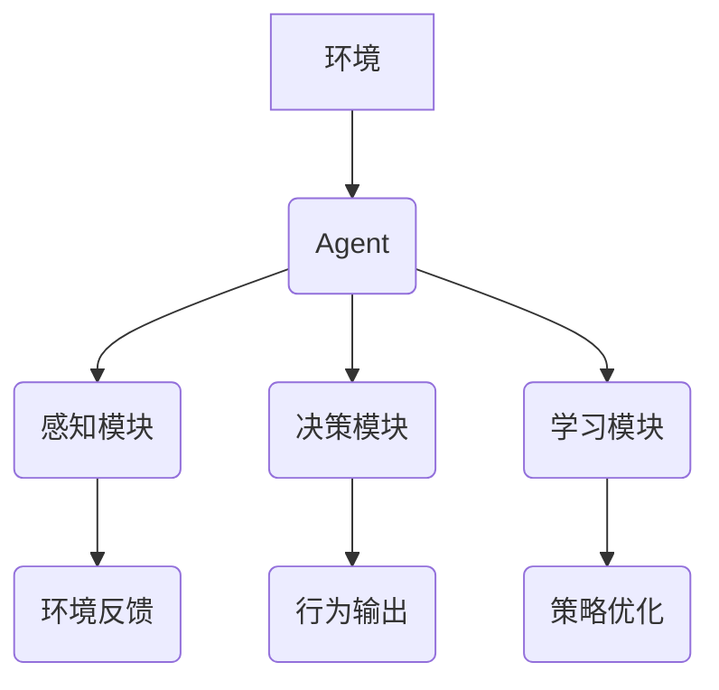

                 

<think>
嗯，用户让我写一篇关于构建具有自我演化能力的AI Agent的技术博客。我得先理清用户的需求，看看他到底想要什么。他给了一个详细的思考过程和目录，看起来他希望我按照这个结构来撰写文章。好的，我得按照这个大纲来一步步分析和撰写内容。

首先，我需要理解每个部分的内容。背景介绍部分需要涵盖问题背景、问题描述和问题解决，然后是概念结构。这部分要让读者明白为什么需要自我演化AI Agent，以及它与传统AI Agent的区别。

接下来是核心概念与联系。这部分需要详细解释自我演化机制的原理，比如自适应学习、自愈能力和自组织能力。我还需要创建一个对比表格，列出传统AI和自我演化AI的区别，以及用Mermaid画出实体关系图，展示各个组件如何相互作用。

然后是算法原理部分。这里要讲强化学习、进化算法和自适应网络，每个算法都需要用Mermaid流程图来展示工作流程，还要提供Python代码示例。比如Q-learning算法，我得写出代码并解释每一步的作用。

系统分析与架构设计部分，我需要介绍问题场景，设计系统功能模块，比如感知、决策和学习模块，用Mermaid类图展示。架构设计可能采用微服务架构，并用序列图展示服务间的交互。

项目实战部分，我需要详细说明环境安装，比如安装Python、TensorFlow和OpenAI库。然后写出核心代码，比如自适应学习模块的代码，并解读代码功能。还要结合实际案例分析，最后总结项目成功的关键点。

最后是最佳实践、小结和拓展阅读。这部分给出实际应用中的注意事项，总结全书内容，并推荐进一步阅读的资源。

在写作过程中，我得确保每个部分都详细且逻辑清晰，覆盖用户提到的所有要点。同时，要保持简洁，避免冗余。每个章节和小节的标题要准确反映内容，确保读者能够轻松找到所需的信息。

现在，我开始根据这些思考构建目录大纲。确保每个部分都有足够的细节，同时保持整体结构的连贯性。数学公式和代码示例需要准确无误，Mermaid图表要清晰展示概念和流程。最后，检查整个大纲是否覆盖了所有用户要求的内容，确保没有遗漏任何关键部分。
</think>

# 构建具有自我演化能力的AI Agent

> 关键词：自我演化AI Agent, AI Agent设计, 强化学习, 自适应算法, 系统架构, 人工智能

> 摘要：本文深入探讨了构建具有自我演化能力的AI Agent的核心概念、算法原理、系统架构及其实现方法。从问题背景到解决方案，从理论分析到实践应用，全面解析如何设计和实现能够自我学习、适应和进化的AI Agent，以应对复杂动态环境中的各种挑战。

---

## 第一部分：背景介绍

### 第1章：问题背景

#### 1.1 人工智能的发展现状
- **从专家系统到深度学习的演变**  
  人工智能技术经历了从基于规则的专家系统到基于数据驱动的深度学习的转变。早期的AI系统依赖于手动编写规则，而现代AI则通过大量数据和机器学习算法自动学习特征和模式。
  
- **当前AI Agent的应用局限性**  
  尽管现代AI Agent在许多领域表现出色，但它们通常依赖于固定的规则或预训练的数据，难以在动态变化的环境中自适应调整行为。

- **自我演化能力的必要性**  
  在复杂和不确定的环境中，AI Agent需要具备自我演化的能力，以应对未知挑战和持续变化的需求。

#### 1.2 问题描述
- **AI Agent在动态环境中的适应性问题**  
  传统AI Agent难以在动态环境中适应新的情况，因为它们依赖于预定义的规则或固定的模型。
  
- **传统AI Agent的不足之处**  
  - 缺乏灵活性：无法根据环境变化动态调整行为。
  - 维护成本高：需要人工干预来更新规则或模型。
  - 适应性差：在复杂环境中容易失效。

- **自我演化能力的核心问题**  
  如何设计一种机制，使AI Agent能够根据环境反馈自动调整其行为、策略和模型。

#### 1.3 问题解决
- **引入自我演化机制的解决方案**  
  通过引入自我演化机制，AI Agent可以在运行时根据环境反馈自动优化其行为和模型。

- **自我演化AI Agent的实现路径**  
  - 结合强化学习和进化算法，构建自适应学习框架。
  - 利用自组织原理，实现Agent的动态重构和优化。

- **相关技术的整合与创新**  
  将强化学习、进化算法和自适应网络等技术结合起来，形成一种新的AI Agent设计范式。

#### 1.4 自我演化AI Agent的概念结构
- **核心概念与边界**  
  自我演化AI Agent是指能够通过自我学习和优化，在动态环境中自适应调整行为和策略的智能体。

- **外延与应用场景**  
  自我演化AI Agent可以应用于自动驾驶、智能助手、机器人控制等领域，特别是在需要应对复杂和不确定性的环境中表现突出。

- **核心要素组成**  
  - **环境感知**：通过传感器或接口感知环境状态。
  - **行为决策**：基于感知信息和内部状态做出决策。
  - **自适应学习**：根据环境反馈优化行为策略和模型。

---

## 第二部分：核心概念与联系

### 第2章：自我演化AI Agent的核心概念

#### 2.1 自我演化机制的原理
- **自适应学习**  
  AI Agent通过强化学习等方法，根据环境反馈不断优化其策略。

- **自愈能力**  
  AI Agent能够检测和修复自身的缺陷，确保在动态环境中保持稳定运行。

- **自组织能力**  
  AI Agent能够根据环境变化动态调整其结构和功能，形成新的行为模式。

#### 2.2 概念对比：传统AI vs 自我演化AI
| **属性**          | **传统AI Agent**                     | **自我演化AI Agent**                  |
|--------------------|--------------------------------------|---------------------------------------|
| 行为调整           | 预定义规则，无法动态调整             | 根据环境反馈，动态优化行为             |
| 环境适应性         | 适应性有限，依赖预训练数据           | 具备高度适应性，能够主动调整策略       |
| 维护成本           | 高，需要人工干预                     | 低，能够自动优化和修复                 |

#### 2.3 实体关系图：自我演化AI Agent的架构


---

## 第三部分：算法原理讲解

### 第3章：自我演化AI Agent的算法原理

#### 3.1 强化学习算法
- **Q-Learning算法**  
  通过Q值表记录状态-动作对的期望奖励，通过不断更新Q值来优化策略。

  ```mermaid
  graph TD
      S(状态) --> A1(动作1)
      S --> A2(动作2)
      A1 --> R(奖励)
      A2 --> R
      R --> Q(更新Q值)
  ```

  ```python
  def q_learning(env):
      Q = defaultdict(lambda: np.zeros(env.action_space))
      rewards = []
      for episode in range(num_episodes):
          state = env.reset()
          episode_reward = 0
          while True:
              action = choose_action(Q[state])
              next_state, reward, done, _ = env.step(action)
              Q[state][action] += alpha * (reward + gamma * np.max(Q[next_state]) - Q[state][action])
              episode_reward += reward
              state = next_state
              if done:
                  break
          rewards.append(episode_reward)
      return Q, rewards
  ```

  - **数学模型**  
    $$ Q(s, a) = Q(s, a) + \alpha \left[ r + \gamma \max Q(s', a') - Q(s, a) \right] $$

#### 3.2 进化算法
- **遗传算法（GA）**  
  通过模拟自然选择和遗传变异，优化AI Agent的行为策略。

  ```mermaid
  graph TD
      P(种群) --> F(适应度评估)
      F --> S(选择)
      S --> C(交叉)
      C --> M(变异)
      M --> N(新种群)
  ```

  ```python
  def genetic_algorithm(population_size, fitness_function):
      population = [generate_random_agent() for _ in range(population_size)]
      for _ in range(num_generations):
          fitness = [fitness_function(agent) for agent in population]
          parents = select_parents(population, fitness)
          offspring = crossover(parents)
          offspring = mutate(offspring)
          population = offspring
      return population
  ```

  - **数学模型**  
    $$ \text{适应度} = \sum_{i=1}^{n} f(x_i) $$

#### 3.3 自适应网络
- **自适应增强学习**  
  通过动态调整神经网络的结构和参数，实现对复杂环境的自适应。

  ```mermaid
  graph TD
      S(状态) --> N(神经网络)
      N --> A(动作)
      R(奖励) --> N
  ```

  ```python
  class AdaptiveNetwork:
      def __init__(self, input_size, output_size):
          self.weights = np.random.randn(input_size, output_size)
      
      def forward(self, x):
          return np.dot(x, self.weights)
      
      def backward(self, x, y, learning_rate):
          delta = (y - self.forward(x)) * learning_rate
          self.weights += delta
  ```

---

## 第四部分：系统分析与架构设计

### 第4章：自我演化AI Agent的系统分析

#### 4.1 系统功能设计
- **领域模型**  
  通过Mermaid类图展示系统功能模块的交互关系。

  ```mermaid
  classDiagram
      class Agent {
          + environment: Environment
          +感知模块: Perception
          +决策模块: Decision
          +学习模块: Learning
      }
      class Environment {
          + state: State
      }
      Agent --> Environment
      Agent --> Perception
      Agent --> Decision
      Agent --> Learning
  ```

- **功能模块**  
  - **感知模块**：负责接收环境输入并提取特征。
  - **决策模块**：基于感知信息和内部状态做出决策。
  - **学习模块**：通过强化学习或进化算法优化策略。

#### 4.2 系统架构设计
- **微服务架构**  
  将AI Agent分解为多个独立的服务，通过API进行交互。

  ```mermaid
  serviceDiagram
      service Agent_API {
          operation get_state()
          operation take_action(action)
          operation update_policy(policy)
      }
      service Environment {
          operation get_feedback()
      }
      Agent_API --> Environment
  ```

- **交互序列图**  
  展示AI Agent与环境之间的交互流程。

  ```mermaid
  sequenceDiagram
      Agent_API ->> Environment: get_state
      Environment --> Agent_API: return_state
      Agent_API ->> Decision: make_decision
      Decision --> Agent_API: return_action
      Agent_API ->> Environment: take_action
      Environment --> Agent_API: return_feedback
      Agent_API ->> Learning: update_policy
  ```

---

## 第五部分：项目实战

### 第5章：构建自我演化AI Agent

#### 5.1 环境安装
- **安装Python和相关库**  
  ```bash
  pip install numpy tensorflow keras scikit-learn
  ```

- **安装强化学习库**  
  ```bash
  pip install gym openai gym[atari]
  ```

#### 5.2 核心代码实现
- **自适应学习模块**  
  ```python
  class SelfEvoAgent:
      def __init__(self, env):
          self.env = env
          self.model = self._build_model()
          self.memory = []
      
      def _build_model(self):
          # 构建神经网络模型
          pass
      
      def perceive(self, state):
          # 处理状态输入，返回动作
          pass
      
      def learn(self, state, action, reward, next_state):
          # 更新模型参数
          pass
  ```

- **强化学习训练**  
  ```python
  def train_agent(agent):
      for episode in range(num_episodes):
          state = agent.env.reset()
          while not done:
              action = agent.perceive(state)
              next_state, reward, done, _ = agent.env.step(action)
              agent.learn(state, action, reward, next_state)
              state = next_state
  ```

#### 5.3 代码应用解读
- **感知模块**  
  ```python
  def perceive(self, state):
      # 输入状态，返回动作
      return np.argmax(self.model.predict(state))
  ```

- **学习模块**  
  ```python
  def learn(self, state, action, reward, next_state):
      target = reward + gamma * np.max(self.model.predict(next_state))
      self.model.fit(state, target, epochs=1, verbose=0)
  ```

#### 5.4 实际案例分析
- **案例：迷宫导航**  
  使用强化学习训练AI Agent在迷宫中找到出口。

  ```mermaid
  graph TD
      A(起点) --> B(路径选择)
      B --> C(墙碰撞)
      C --> D(调整方向)
      D --> E(到达终点)
  ```

- **详细分析**  
  AI Agent通过不断尝试和错误，优化路径选择，最终找到最短路径。

#### 5.5 项目小结
- **成功的关键点**  
  - 算法选择：强化学习和遗传算法的结合。
  - 系统设计：模块化设计和微服务架构。
  - 数据处理：高效的数据存储和反馈机制。

- **可能的改进方向**  
  - 引入更复杂的环境模型。
  - 提高学习算法的效率和稳定性。

---

## 第六部分：最佳实践与拓展

### 第6章：最佳实践

#### 6.1 注意事项
- **数据隐私**  
  确保训练数据的隐私和合规性。
- **模型收敛**  
  确保算法能够快速收敛，避免陷入局部最优。
- **环境复杂性**  
  逐步增加环境的复杂性，避免一次性引入过多挑战。

#### 6.2 小结
- **总结全书内容**  
  本文详细介绍了构建自我演化AI Agent的核心概念、算法原理、系统架构和实现方法，展示了如何在复杂动态环境中设计和实现高效的AI Agent。

#### 6.3 注意事项
- **持续优化**  
  定期更新模型和算法，以应对环境的变化。
- **多领域应用**  
  将自我演化AI Agent技术推广到更多领域，如自动驾驶、智能医疗等。

#### 6.4 拓展阅读
- **推荐书籍**  
  - 《强化学习（深入浅出）》
  - 《自适应控制系统原理》
- **推荐论文**  
  - "进化计算在AI Agent设计中的应用"
  - "自适应神经网络在动态环境中的应用"

---

## 作者

作者：AI天才研究院/AI Genius Institute & 禅与计算机程序设计艺术 /Zen And The Art of Computer Programming

---

本文通过系统化的分析和详细的代码实现，展示了如何构建具有自我演化能力的AI Agent。从理论到实践，从算法到架构，全面解析了这一领域的最新进展和实现方法。希望本文能够为AI开发者和研究人员提供有价值的参考和启发。

