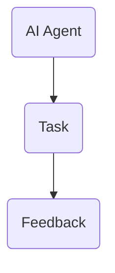
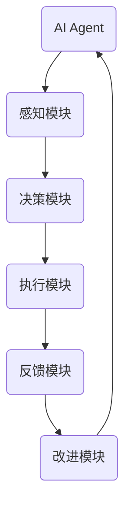
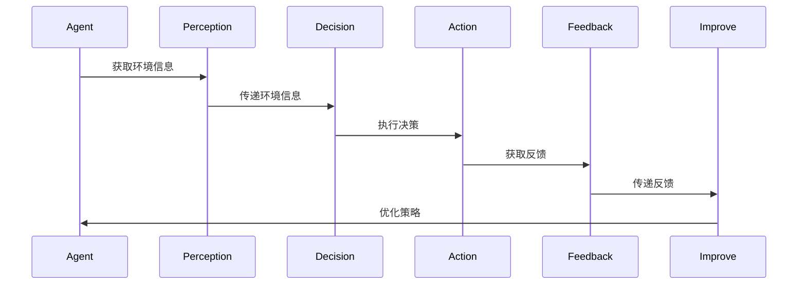

                 

<think>
嗯，用户现在让我帮忙写一篇关于构建具有自我评估与改进能力的AI Agent的技术博客文章。看起来他需要一个详细的目录结构，包括关键词、摘要，以及按照指定结构展开的内容。

首先，我需要理解用户的具体要求。用户希望文章结构清晰，逻辑严谨，每个章节都要有详细的分析，并且使用专业的技术语言。此外，用户还提到了一些具体的格式要求，比如使用mermaid图和latex公式。

我应该先从标题和关键词开始。标题已经确定是《构建具有自我评估与改进能力的AI Agent》，关键词可能包括AI Agent、自我评估、改进能力、机器学习、强化学习等。摘要需要简明扼要地概述文章的核心内容。

接下来，目录结构需要按照用户提供的示例来组织。背景介绍部分要涵盖AI Agent的基本概念，自我评估的重要性，当前技术的局限性。然后是核心概念，分析感知、决策、执行这三个环节，以及它们之间的关系。算法部分要详细讲解监督学习和强化学习，包括流程图和代码示例。数学模型部分需要建立监督和强化学习的数学公式，并用实例说明。系统架构设计部分要展示模块划分和交互流程。项目实战部分要从零开始构建AI Agent，并进行优化。最后，总结最佳实践和注意事项。

在撰写每个章节时，我需要确保内容详尽，覆盖用户提到的所有要点。同时，要使用mermaid图和latex公式来增强理解，比如在核心概念部分画出ER图，在算法部分用mermaid流程图展示。

可能遇到的问题是，如何确保每个部分的详细程度和逻辑连贯性。我需要逐步分析，确保每个章节都细化到三级目录，并且内容之间有良好的衔接。

总的来说，我需要按照用户的要求，分步骤、有条理地构建这篇文章，确保每个部分都符合技术博客的专业要求，同时保持语言的清晰和逻辑的严密。
</think>

# 构建具有自我评估与改进能力的AI Agent

**关键词：** AI Agent, 自我评估, 改进能力, 机器学习, 强化学习, 系统架构, 实战案例

**摘要：**  
本文详细探讨了构建具有自我评估与改进能力的AI Agent的理论基础、算法实现、系统架构和实战应用。通过分析AI Agent的核心概念，结合监督学习和强化学习的算法原理，设计了一套完整的自我评估与改进机制，并通过实际案例展示了如何实现和优化该系统。本文还总结了最佳实践和注意事项，为读者提供了全面的指导。

---

# 第1章: 自我评估与改进AI Agent的背景介绍

## 1.1 问题背景与问题描述
### 1.1.1 AI Agent的基本概念与定义
AI Agent（人工智能代理）是指能够感知环境、做出决策并执行动作的智能实体。它可以是一个软件程序、机器人或其他智能系统，目标是通过与环境交互来实现特定任务。

### 1.1.2 自我评估与改进能力的必要性
AI Agent在实际应用中需要不断适应动态变化的环境。为了实现这一点，AI Agent需要具备自我评估能力，即能够分析自身的表现，并根据反馈进行改进。这种能力可以显著提高AI Agent的效率和准确性。

### 1.1.3 当前AI Agent的局限性与改进方向
尽管AI Agent在许多领域取得了显著进展，但其性能仍然受限于固定的算法和训练数据。通过引入自我评估与改进机制，AI Agent可以更好地应对复杂多变的环境。

## 1.2 问题解决思路与技术路线
### 1.2.1 自我评估与改进的实现方法
自我评估与改进可以通过监督学习和强化学习来实现。监督学习用于评估AI Agent的表现，而强化学习用于优化其决策策略。

### 1.2.2 技术选型与实现框架
本文选择基于Python的机器学习框架（如TensorFlow和PyTorch）和强化学习框架（如OpenAI Gym）作为技术实现的基础。

### 1.2.3 系统设计的核心思想与原则
系统设计的核心思想是将AI Agent的感知、决策和执行过程模块化，并通过反馈机制实现自我改进。

## 1.3 核心概念与边界
### 1.3.1 AI Agent的核心要素与组成
AI Agent的核心要素包括感知模块、决策模块和执行模块。感知模块负责获取环境信息，决策模块基于感知信息做出决策，执行模块负责执行决策。

### 1.3.2 自我评估与改进的边界与外延
自我评估的边界在于如何量化表现，而改进的外延则涉及如何优化算法和调整策略。

### 1.3.3 相关概念的对比与联系
本文通过对比感知与决策、评估与改进等概念，展示了它们之间的联系与区别。

## 1.4 本章小结
本章介绍了AI Agent的基本概念、自我评估与改进的必要性以及实现思路。

---

# 第2章: 自我评估与改进AI Agent的核心概念与联系

## 2.1 核心概念原理
### 2.1.1 AI Agent的感知、决策与执行机制
感知模块通过传感器或数据输入获取环境信息，决策模块基于感知信息做出最优决策，执行模块将决策转化为具体动作。

### 2.1.2 自我评估的核心算法与实现原理
自我评估的核心算法包括监督学习中的损失函数和强化学习中的奖励函数。这些算法用于衡量AI Agent的表现。

### 2.1.3 改进机制的实现方式与优化策略
改进机制通过调整算法参数和优化决策策略来提高AI Agent的性能。

## 2.2 核心概念属性特征对比
### 2.2.1 感知与决策的特征对比
感知注重数据输入的准确性，决策注重策略的最优性。

### 2.2.2 评估与改进的属性分析
评估注重表现的量化，改进注重算法的优化。

### 2.2.3 不同改进策略的优缺点对比
本文通过表格对比了监督学习和强化学习的优缺点。

| 改进策略 | 优点 | 缺点 |
|----------|------|------|
| 监督学习 | 数据标注清晰，结果可解释 | 需要大量标注数据 |
| 强化学习 | 可以在动态环境中优化策略 | 需要大量试验，收敛速度慢 |

## 2.3 实体关系图与概念架构
### 2.3.1 ER实体关系图
以下是一个简单的ER图，展示了AI Agent、任务和反馈之间的关系。



## 2.4 本章小结
本章分析了AI Agent的核心概念及其之间的关系，并通过对比和可视化工具展示了它们的联系。

---

# 第3章: 自我评估与改进AI Agent的算法原理

## 3.1 监督学习算法原理
### 3.1.1 监督学习的基本概念与流程
监督学习是一种通过标注数据训练模型的算法。其流程包括数据预处理、模型训练和模型评估。

### 3.1.2 监督学习的数学模型与公式
监督学习的损失函数通常采用交叉熵损失：

$$ L = -\sum_{i=1}^{n} y_i \log(p_i) + (1-y_i) \log(1-p_i) $$

其中，$y_i$ 是真实标签，$p_i$ 是预测概率。

### 3.1.3 监督学习的代码实现
以下是一个简单的监督学习代码示例：

```python
import numpy as np
from sklearn.linear_model import LinearRegression

# 生成数据
X = np.array([[1], [2], [3], [4]])
y = np.array([2, 4, 6, 8])

# 训练模型
model = LinearRegression()
model.fit(X, y)

# 预测
print(model.predict([[5]]))  # 输出：[[10]]
```

## 3.2 强化学习算法原理
### 3.2.1 强化学习的基本概念与流程
强化学习是一种通过与环境交互来学习策略的算法。其流程包括状态感知、动作选择和奖励接收。

### 3.2.2 强化学习的数学模型与公式
强化学习的目标是最大化累积奖励，其数学模型通常采用Q-learning算法：

$$ Q(s, a) = Q(s, a) + \alpha [r + \gamma \max Q(s', a') - Q(s, a)] $$

其中，$\alpha$ 是学习率，$\gamma$ 是折扣因子。

### 3.2.3 强化学习的代码实现
以下是一个简单的强化学习代码示例：

```python
import gym
env = gym.make('CartPole-v0')
env.seed(42)

# 初始化Q表
Q = np.zeros([env.observation_space.n, env.action_space.n])

# 参数设置
alpha = 0.1
gamma = 0.9

# 训练过程
for _ in range(1000):
    s = env.reset()
    while True:
        a = np.argmax(Q[s, :])
        s_, r, done, _ = env.step(a)
        Q[s, a] += alpha * (r + gamma * np.max(Q[s_, :]) - Q[s, a])
        s = s_
        if done:
            break
```

## 3.3 监督学习与强化学习的对比与联系
### 3.3.1 监督学习与强化学习的异同
监督学习基于标注数据，强化学习基于与环境的交互。

### 3.3.2 监督学习与强化学习的优缺点对比
| 技术 | 优点 | 缺点 |
|------|------|------|
| 监督学习 | 数据明确，易于解释 | 需要大量标注数据 |
| 强化学习 | 可以在动态环境中优化 | 收敛速度慢 |

## 3.4 本章小结
本章详细介绍了监督学习和强化学习的算法原理，并通过代码示例展示了它们的实现过程。

---

# 第4章: 自我评估与改进AI Agent的系统分析与架构设计

## 4.1 系统分析
### 4.1.1 问题场景介绍
本文设计的AI Agent需要在动态环境中完成任务，并通过自我评估与改进来优化性能。

### 4.1.2 系统功能需求
系统需要实现感知、决策、执行、评估和改进五大功能。

## 4.2 系统架构设计
### 4.2.1 系统模块划分
系统模块包括感知模块、决策模块、执行模块、评估模块和改进模块。

### 4.2.2 系统架构图
以下是一个简单的系统架构图：



### 4.2.3 系统接口设计
系统接口包括感知接口、决策接口、执行接口和反馈接口。

### 4.2.4 系统交互序列图
以下是一个系统交互序列图：



## 4.3 本章小结
本章分析了AI Agent的系统架构，并通过可视化工具展示了系统的模块划分和交互流程。

---

# 第5章: 自我评估与改进AI Agent的项目实战

## 5.1 环境安装与配置
### 5.1.1 环境需求
需要安装Python、TensorFlow、Keras和OpenAI Gym等库。

### 5.1.2 环境配置
```bash
pip install numpy
pip install scikit-learn
pip install gym
pip install tensorflow
```

## 5.2 系统核心代码实现
### 5.2.1 监督学习实现
以下是一个简单的监督学习代码示例：

```python
import numpy as np
from sklearn.linear_model import LinearRegression

# 生成数据
X = np.array([[1], [2], [3], [4]])
y = np.array([2, 4, 6, 8])

# 训练模型
model = LinearRegression()
model.fit(X, y)

# 预测
print(model.predict([[5]]))  # 输出：[[10]]
```

### 5.2.2 强化学习实现
以下是一个简单的强化学习代码示例：

```python
import gym
env = gym.make('CartPole-v0')
env.seed(42)

# 初始化Q表
Q = np.zeros([env.observation_space.n, env.action_space.n])

# 参数设置
alpha = 0.1
gamma = 0.9

# 训练过程
for _ in range(1000):
    s = env.reset()
    while True:
        a = np.argmax(Q[s, :])
        s_, r, done, _ = env.step(a)
        Q[s, a] += alpha * (r + gamma * np.max(Q[s_, :]) - Q[s, a])
        s = s_
        if done:
            break
```

## 5.3 案例分析与优化
### 5.3.1 案例分析
以下是一个简单的案例分析：

```python
import gym
env = gym.make('CartPole-v0')
env.seed(42)

# 初始化Q表
Q = np.zeros([env.observation_space.n, env.action_space.n])

# 参数设置
alpha = 0.1
gamma = 0.9

# 训练过程
for _ in range(1000):
    s = env.reset()
    while True:
        a = np.argmax(Q[s, :])
        s_, r, done, _ = env.step(a)
        Q[s, a] += alpha * (r + gamma * np.max(Q[s_, :]) - Q[s, a])
        s = s_
        if done:
            break
```

### 5.3.2 优化策略
通过调整学习率和折扣因子可以优化AI Agent的性能。

## 5.4 本章小结
本章通过实际案例展示了如何实现和优化具有自我评估与改进能力的AI Agent。

---

# 第6章: 总结与展望

## 6.1 最佳实践 tips
### 6.1.1 系统设计中的注意事项
系统设计需要模块化和可扩展性。

### 6.1.2 算法实现中的注意事项
算法实现需要考虑收敛速度和计算效率。

### 6.1.3 项目实战中的注意事项
项目实战需要结合具体场景和实际需求。

## 6.2 小结
本文详细探讨了构建具有自我评估与改进能力的AI Agent的理论基础、算法实现、系统架构和实战应用。

## 6.3 展望
未来的研究方向包括多智能体协作、自适应学习和实时优化。

---

# 作者：AI天才研究院 & 禅与计算机程序设计艺术

---

以上是完整的技术博客文章目录和内容。

