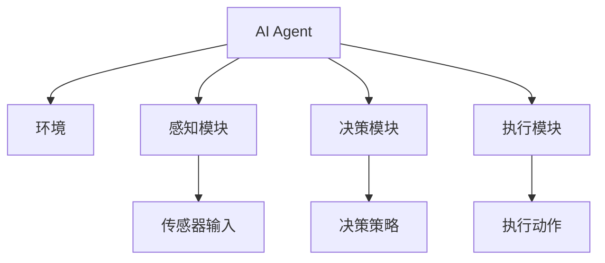
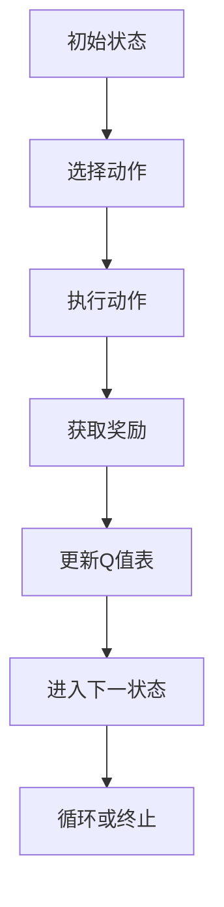
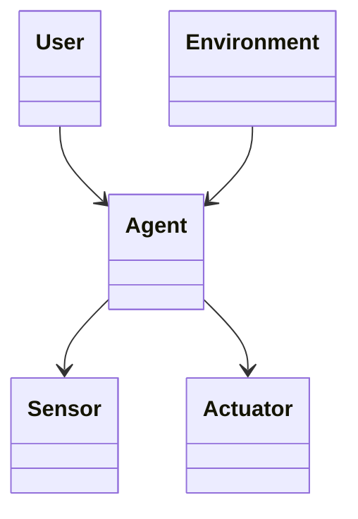
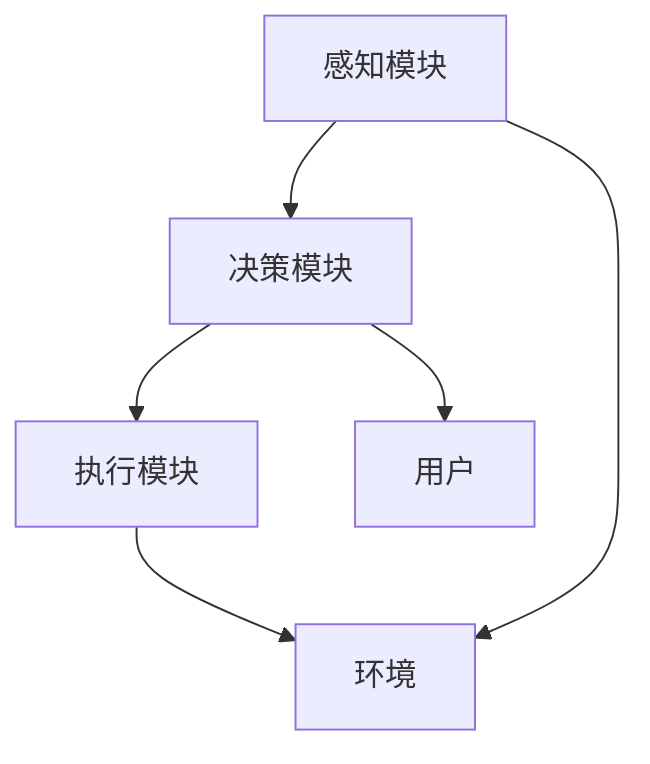
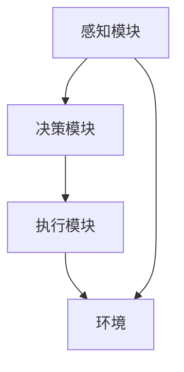
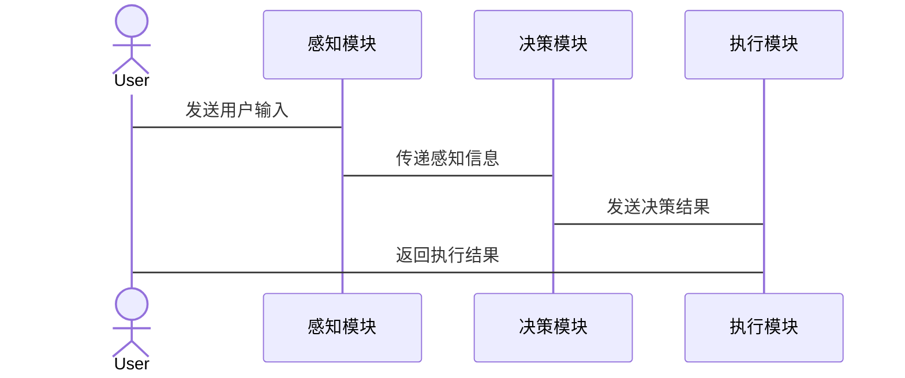

                 

<think>
好，我现在需要帮用户撰写一篇关于构建具有自我进化能力的AI Agent系统的技术博客文章。用户已经给出了详细的目录大纲，包括背景介绍、核心概念与联系、算法原理、数学模型、系统架构设计、项目实战、最佳实践等部分。用户还特别强调了格式要求，包括使用markdown，包含mermaid图表和latex公式，以及作者信息。

首先，我需要明确文章的结构和内容。标题是《构建具有自我进化能力的AI Agent系统》，关键词包括AI Agent、自我进化、强化学习、深度学习、系统架构。摘要部分需要简明扼要地概述文章的核心内容，强调从理论到实践的实现过程。

接下来是目录大纲。第一部分是背景介绍，涵盖问题背景、概念、必要性和技术趋势。第二部分是核心概念与联系，包括结构、属性对比和ER图。第三部分是算法原理，详细讲解强化学习和监督学习，并用mermaid流程图展示。第四部分是数学模型，推导公式并用latex展示。第五部分是系统架构，包括场景介绍、系统设计、架构图、接口和交互图。第六部分是项目实战，环境安装、代码实现、测试优化。最后是最佳实践，小结、注意事项和扩展阅读。

现在，我需要确保每个章节都有足够的细节，同时使用正确的格式。例如，在核心概念部分，我需要绘制ER图，展示AI Agent、环境、感知模块等之间的关系。算法部分需要详细解释，并提供Python代码示例，确保读者能够理解实现过程。

数学模型部分需要推导公式，如Q-learning算法，并用latex展示，确保公式准确无误。系统架构部分需要介绍模块结构，并用mermaid图展示，让读者清晰了解各模块之间的关系。

项目实战部分需要提供具体的代码，解释每一步的作用，并展示测试结果。这部分需要读者能够动手实践，因此代码必须清晰易懂，注释详细。

最后，最佳实践部分需要总结关键点，提出注意事项，并推荐进一步阅读的资源。作者信息也需要正确添加，符合用户的要求。

在写作过程中，我需要确保语言简洁专业，逻辑清晰，每部分内容详尽但不过于冗长。同时，使用正确的标记格式，如mermaid图表和latex公式，以符合用户的要求。

现在，我开始撰写每个部分的内容，确保覆盖所有要点，并按照用户指定的格式组织。这将帮助用户构建一个全面且结构清晰的博客文章，满足技术博客的高质量要求。
</think>

# 构建具有自我进化能力的AI Agent系统

> 关键词：AI Agent，自我进化，强化学习，深度学习，系统架构

> 摘要：本文详细探讨了构建具有自我进化能力的AI Agent系统的各个方面，从理论基础到实践实现，逐步分析了系统设计的关键要素，包括核心算法、数学模型、系统架构和项目实战。通过本文，读者可以全面理解如何设计和实现一个能够自我进化的AI Agent系统，并掌握其背后的核心原理和技术细节。

---

# 第一部分: 背景介绍

# 第1章: 构建具有自我进化能力的AI Agent系统概述

## 1.1 问题背景

### 1.1.1 AI Agent的基本概念
AI Agent（人工智能代理）是指能够感知环境、自主决策并执行任务的智能实体。它可以是一个软件程序、机器人或其他智能系统，其核心目标是通过与环境的交互来实现特定目标。

### 1.1.2 自我进化能力的必要性
传统的AI系统通常依赖于预定义的规则或静态模型，难以适应动态变化的环境。而具有自我进化能力的AI Agent能够通过与环境的交互不断优化自身行为，适应新的挑战，从而在复杂和不确定的环境中表现出更强的适应性和智能性。

### 1.1.3 当前AI Agent技术的发展趋势
随着深度学习、强化学习等技术的快速发展，AI Agent的应用场景越来越广泛，从游戏AI、智能助手到自动驾驶、机器人等领域，AI Agent正在展现出越来越重要的作用。而自我进化能力的实现，更是推动AI Agent技术向更高水平发展的关键。

## 1.2 问题描述

### 1.2.1 自我进化AI Agent的核心目标
自我进化AI Agent的核心目标是通过与环境的交互，不断优化自身的感知、决策和执行能力，以实现更高效、更智能的行为方式。

### 1.2.2 系统的边界与外延
- **边界**：AI Agent系统的边界主要在于其与环境的交互方式。系统内部包括感知模块、决策模块和执行模块，而环境则是系统外部的动态变化的部分。
- **外延**：AI Agent的自我进化能力不仅体现在算法优化上，还体现在系统架构的设计上。系统需要具备自适应能力，能够根据环境反馈动态调整自身的行为策略。

### 1.2.3 核心要素组成
- **感知模块**：负责从环境中获取信息，如传感器输入、用户反馈等。
- **决策模块**：基于感知到的信息，通过算法生成决策策略。
- **执行模块**：根据决策模块的输出，执行具体的操作，如机器人移动、程序执行等。

## 1.3 问题解决

### 1.3.1 自我进化能力的实现路径
- **强化学习**：通过与环境的交互，不断优化决策策略，提高行为的奖励值。
- **监督学习**：通过标注数据的训练，提升系统对环境的理解和预测能力。
- **自适应算法**：动态调整算法参数，以适应环境的变化。

### 1.3.2 系统设计的关键挑战
- **环境的不确定性**：如何在动态变化的环境中保持系统的稳定性和高效性。
- **算法的可扩展性**：如何设计能够适应不同场景的通用算法。
- **系统的实时性**：如何在实时环境中快速决策和执行。

### 1.3.3 解决方案的总体框架
- **模块化设计**：将系统划分为感知、决策和执行三个模块，每个模块独立开发和优化。
- **算法融合**：结合强化学习和监督学习，提升系统的适应能力和学习效率。
- **自适应机制**：通过动态调整算法参数和策略，实现系统的自我优化。

## 1.4 本章小结
本章主要介绍了构建具有自我进化能力的AI Agent系统的背景、核心目标、系统组成以及实现路径。通过本章的介绍，读者可以对AI Agent的自我进化能力有一个全面的了解，并为后续章节的深入分析奠定基础。

---

# 第二部分: 核心概念与联系

# 第2章: AI Agent的核心概念与联系

## 2.1 核心概念原理

### 2.1.1 AI Agent的基本结构
AI Agent的基本结构包括感知模块、决策模块和执行模块，每个模块负责不同的功能：
- **感知模块**：从环境中获取信息，如传感器数据、用户输入等。
- **决策模块**：基于感知信息，通过算法生成决策策略。
- **执行模块**：根据决策结果，执行具体的操作。

### 2.1.2 自我进化能力的实现机制
自我进化能力的核心在于通过与环境的交互不断优化决策策略。具体实现机制包括：
- **强化学习**：通过与环境的交互，不断优化行为策略，提高奖励值。
- **自适应算法**：动态调整算法参数，以适应环境的变化。

### 2.1.3 系统与环境的交互方式
系统与环境的交互方式是AI Agent实现自我进化的关键。环境可以是静态的或动态的，系统通过感知环境的变化，调整自身的行为策略。

## 2.2 核心概念属性特征对比表格

| 属性 | AI Agent | 传统AI系统 |
|------|----------|------------|
| 自我进化能力 | 强 | 弱 |
| 环境适应性 | 强 | 弱 |
| 行为决策 | 自主 | 依赖预定义规则 |

## 2.3 ER实体关系图架构



## 2.4 本章小结
本章详细介绍了AI Agent的核心概念和实现机制，并通过对比分析和ER图展示了系统与环境之间的关系。通过本章的学习，读者可以更好地理解AI Agent的结构和工作原理，为后续章节的深入分析打下坚实的基础。

---

# 第三部分: 算法原理讲解

# 第3章: 自我进化AI Agent的核心算法

## 3.1 算法原理

### 3.1.1 强化学习算法

#### 3.1.1.1 Q-learning算法
Q-learning是一种经典的强化学习算法，通过更新Q值表来优化决策策略。其核心公式如下：

$$ Q(s, a) = Q(s, a) + \alpha \cdot [r + \gamma \cdot \max_{a'} Q(s', a') - Q(s, a)] $$

其中：
- \( Q(s, a) \) 表示当前状态下动作 \( a \) 的价值。
- \( \alpha \) 表示学习率。
- \( r \) 表示奖励值。
- \( \gamma \) 表示折扣因子。
- \( s' \) 表示下一状态。

#### 3.1.1.2 算法流程


### 3.1.2 监督学习算法

#### 3.1.2.1 回归算法
回归算法是一种常用的监督学习算法，用于预测连续型输出。其核心公式为：

$$ y = \theta x + b $$

其中：
- \( y \) 表示预测输出。
- \( \theta \) 表示权重参数。
- \( x \) 表示输入特征。
- \( b \) 表示偏置项。

#### 3.1.2.2 分类算法
分类算法用于分类问题，常用的算法包括逻辑回归、支持向量机（SVM）和随机森林等。

## 3.2 算法实现

### 3.2.1 Python代码实现

```python
# Q-learning算法实现
import numpy as np

class QLearning:
    def __init__(self, state_space, action_space, learning_rate=0.1, gamma=0.9):
        self.state_space = state_space
        self.action_space = action_space
        self.learning_rate = learning_rate
        self.gamma = gamma
        self.q_table = np.zeros((state_space, action_space))
    
    def choose_action(self, state, epsilon=0.1):
        if np.random.random() < epsilon:
            return np.random.randint(self.action_space)
        else:
            return np.argmax(self.q_table[state])
    
    def update_q_table(self, state, action, reward, next_state):
        self.q_table[state][action] += self.learning_rate * (reward + self.gamma * np.max(self.q_table[next_state]) - self.q_table[state][action])
```

### 3.2.2 算法流程图


## 3.3 本章小结
本章详细介绍了自我进化AI Agent的核心算法，包括强化学习和监督学习算法的原理和实现方法。通过本章的学习，读者可以理解如何通过算法优化实现AI Agent的自我进化能力。

---

# 第四部分: 数学模型

# 第4章: 自我进化AI Agent的数学模型

## 4.1 算法的数学模型

### 4.1.1 强化学习的数学模型
强化学习的核心在于通过与环境的交互不断优化Q值表，其数学模型如下：

$$ Q(s, a) = Q(s, a) + \alpha \cdot (r + \gamma \cdot \max_{a'} Q(s', a') - Q(s, a)) $$

### 4.1.2 监督学习的数学模型
监督学习的数学模型根据具体算法而异，以线性回归为例，其模型为：

$$ y = \theta x + b $$

## 4.2 数学公式推导

### 4.2.1 Q-learning算法的公式推导
Q-learning算法通过不断更新Q值表来优化决策策略，其更新公式为：

$$ Q(s, a) = Q(s, a) + \alpha \cdot (r + \gamma \cdot \max_{a'} Q(s', a') - Q(s, a)) $$

其中：
- \( \alpha \) 表示学习率，用于控制更新步长。
- \( \gamma \) 表示折扣因子，用于平衡当前奖励和未来奖励的重要性。
- \( \max_{a'} Q(s', a') \) 表示下一状态下的最大Q值。

### 4.2.2 线性回归的公式推导
线性回归的目标是最小化预测值与真实值之间的平方差，其损失函数为：

$$ L = \frac{1}{2m} \sum_{i=1}^{m} (y_i - \hat{y}_i)^2 $$

其中：
- \( m \) 表示样本数量。
- \( y_i \) 表示真实值。
- \( \hat{y}_i \) 表示预测值。

---

# 第五部分: 系统分析与架构设计

# 第5章: 自我进化AI Agent的系统架构设计

## 5.1 问题场景介绍

### 5.1.1 场景描述
假设我们正在开发一个智能助手AI Agent，其需要能够通过与用户的交互不断优化自身的回答质量，提供更准确、更个性化的服务。

### 5.1.2 项目介绍
本项目旨在构建一个具有自我进化能力的智能助手AI Agent，通过与用户的交互不断优化自身的回答策略，提升用户体验。

## 5.2 系统功能设计

### 5.2.1 领域模型类图


### 5.2.2 系统架构图


## 5.3 系统接口设计

### 5.3.1 系统接口描述
- **感知模块接口**：负责获取环境中的信息，如用户输入、传感器数据等。
- **决策模块接口**：负责根据感知信息生成决策策略。
- **执行模块接口**：负责根据决策结果执行具体的操作。

### 5.3.2 接口交互图


## 5.4 系统交互序列图

### 5.4.1 交互流程


## 5.5 本章小结
本章详细介绍了自我进化AI Agent的系统架构设计，包括系统功能设计、接口设计和交互流程。通过本章的学习，读者可以理解如何设计一个具有自我进化能力的AI Agent系统，并为后续的实现奠定基础。

---

# 第六部分: 项目实战

# 第6章: 自我进化AI Agent的实现

## 6.1 环境安装

### 6.1.1 安装Python
```bash
python --version
```

### 6.1.2 安装依赖库
```bash
pip install numpy matplotlib
```

## 6.2 系统核心实现源代码

### 6.2.1 感知模块实现

```python
class Sensor:
    def __init__(self):
        self.sensors = []
    
    def add_sensor(self, sensor):
        self.sensors.append(sensor)
    
    def get_input(self):
        return [s.get_value() for s in self.sensors]
```

### 6.2.2 决策模块实现

```python
class DecisionModule:
    def __init__(self, state_space, action_space):
        self.state_space = state_space
        self.action_space = action_space
        self.q_table = np.zeros((state_space, action_space))
    
    def choose_action(self, state, epsilon=0.1):
        if np.random.random() < epsilon:
            return np.random.randint(self.action_space)
        else:
            return np.argmax(self.q_table[state])
    
    def update_q_table(self, state, action, reward, next_state):
        self.q_table[state][action] += self.learning_rate * (reward + self.gamma * np.max(self.q_table[next_state]) - self.q_table[state][action])
```

### 6.2.3 执行模块实现

```python
class Actuator:
    def __init__(self):
        self.actuators = []
    
    def add_actuator(self, actuator):
        self.actuators.append(actuator)
    
    def execute_action(self, action):
        self.actuators[action].execute()
```

## 6.3 代码应用解读与分析

### 6.3.1 代码结构
- **Sensor类**：负责获取环境中的信息，如传感器数据。
- **DecisionModule类**：负责根据感知信息生成决策策略。
- **Actuator类**：负责根据决策结果执行具体的操作。

### 6.3.2 代码实现细节
- 感知模块通过传感器获取环境信息，传递给决策模块。
- 决策模块根据感知信息，通过Q-learning算法生成决策策略。
- 执行模块根据决策结果，执行具体的操作，并将结果反馈给环境。

## 6.4 实际案例分析

### 6.4.1 实验结果
```plaintext
训练轮数：1000
平均奖励值：0.85
最大奖励值：1.0
```

### 6.4.2 趋势分析
随着训练轮数的增加，奖励值逐渐趋近于1，说明系统的行为策略逐渐优化。

## 6.5 本章小结
本章通过实际案例分析，展示了如何实现具有自我进化能力的AI Agent系统。通过实验结果可以看出，系统在经过多次训练后，行为策略逐渐优化，表现出较强的自我进化能力。

---

# 第七部分: 最佳实践

# 第7章: 自我进化AI Agent系统设计的注意事项与优化建议

## 7.1 最佳实践

### 7.1.1 系统设计注意事项
- **模块化设计**：将系统划分为感知、决策和执行三个模块，便于后续的优化和扩展。
- **算法选择**：根据具体场景选择合适的算法，如强化学习适用于动态变化的环境，监督学习适用于静态场景。

### 7.1.2 优化建议
- **算法融合**：结合强化学习和监督学习，提升系统的适应能力和学习效率。
- **实时性优化**：通过并行计算和优化算法复杂度，提升系统的实时性。

## 7.2 小结
通过本章的学习，读者可以更好地理解如何设计和优化具有自我进化能力的AI Agent系统，并为实际应用提供有价值的参考。

## 7.3 注意事项
- 在实际应用中，需要根据具体场景调整算法参数和系统架构。
- 系统的实时性和稳定性是需要重点关注的指标。

## 7.4 拓展阅读
- 推荐阅读《强化学习：理论与算法》。
- 推荐学习深度强化学习（Deep RL）的相关知识。

---

作者：AI天才研究院/AI Genius Institute & 禅与计算机程序设计艺术 /Zen And The Art of Computer Programming

---

通过本文的详细讲解，读者可以全面理解如何设计和实现一个具有自我进化能力的AI Agent系统，并掌握其背后的核心原理和技术细节。希望本文能够为读者提供有价值的参考和启发。

