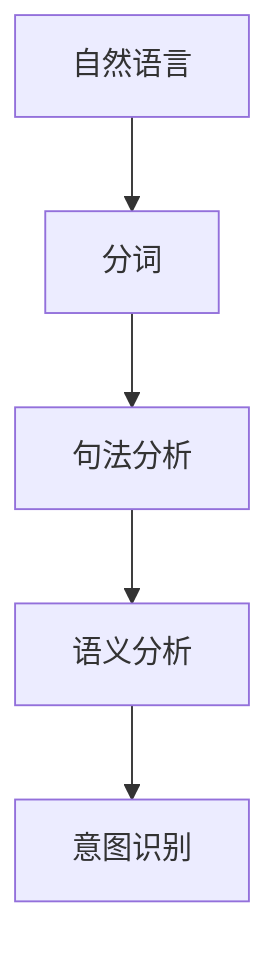
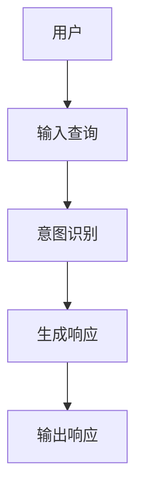
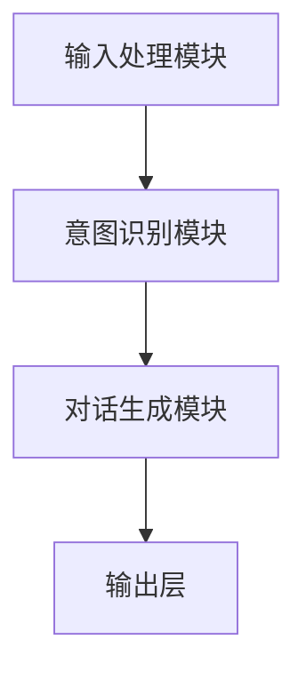
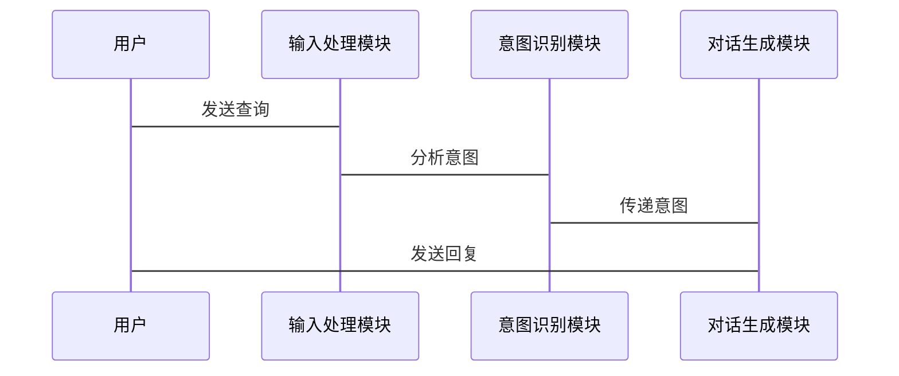

                 

<think>
好，我现在需要根据用户的要求来构建一本关于“构建具有自然语言理解能力的AI Agent”的技术书籍。用户已经提供了一个详细的目录大纲，我需要按照这个大纲逐步进行内容填充，并确保每部分内容符合逻辑、详细且技术性强。

首先，我会从第一章开始，概述AI Agent和自然语言理解的基本概念，确保读者能够理解这些术语的背景和重要性。接着，我会深入探讨自然语言理解的核心技术和算法，比如分词、句法分析和语义分析，以及当前主流的深度学习模型。

接下来，我会详细讲解AI Agent的系统架构，从模块设计到系统的优化与扩展，确保读者能够理解如何将自然语言理解技术集成到AI Agent中。同时，我还需要包括数学模型和算法的实现细节，使用Mermaid图和Latex公式来帮助读者更好地理解。

在项目实战部分，我会提供一个具体的项目案例，从环境配置到代码实现，详细解读每一部分的功能和实现方法，帮助读者能够实际操作。最后，我会总结最佳实践，给出一些小贴士和未来的研究方向，帮助读者更好地应用这些知识。

在整个过程中，我会注意内容的逻辑性和连贯性，确保每一章节都紧密相连，同时保持技术细节的深度和广度，以满足读者的需求。

现在，我会按照目录大纲逐步构建每一章的内容，确保每一部分都符合用户的要求，内容详实，结构清晰。
</think>

# 《构建具有自然语言理解能力的AI Agent》

## 关键词：自然语言理解、AI Agent、深度学习、系统架构、算法原理、项目实战

## 摘要：  
本文将深入探讨如何构建具有自然语言理解能力的AI Agent。通过分析自然语言理解的核心技术与算法，结合AI Agent的系统架构设计，我们将为您提供从理论到实践的全面指导。内容涵盖自然语言理解的关键技术、AI Agent的系统架构、基于深度学习的自然语言理解模型、系统分析与架构设计，以及项目实战等。通过本文，您将能够掌握构建具有自然语言理解能力的AI Agent所需的全部知识。

---

# 第1章: 自然语言理解与AI Agent概述

## 1.1 自然语言理解的定义与背景

### 1.1.1 自然语言理解的核心概念  
自然语言理解（NLU）是人工智能领域的重要分支，旨在使计算机能够理解和解释人类语言的含义。NLU的核心任务包括语言分析（如分词、句法分析、语义分析）和意图识别。  

**关键词对比表：**  
| 关键词 | 定义 | 示例 |  
|--------|------|------|  
| 分词 | 将连续的文本分割成词语或符号单位 | "Hello world" → ["Hello", "world"] |  
| 句法分析 | 研究句子的结构和语法关系 | "The cat sits on the mat" → 主语、谓语、宾语 |  
| 语义分析 | 理解文本的语义含义 | "Can you turn off the lights?" → 用户请求执行关灯操作 |  

**Mermaid图示：**  


### 1.1.2 AI Agent的基本概念  
AI Agent是一种智能体，能够感知环境、执行任务并与其他实体进行交互。AI Agent的核心能力包括感知、决策和执行。  

**AI Agent的类型：**  
1. **反应式AI Agent**：基于当前感知做出反应，无内部状态。  
2. **认知式AI Agent**：具备复杂推理能力，维护内部状态。  

### 1.1.3 自然语言理解在AI Agent中的作用  
NLU是AI Agent与人类交互的核心技术。通过NLU，AI Agent能够理解用户的输入，准确识别用户意图，并生成适当的响应。  

---

## 1.2 自然语言理解与AI Agent的结合

### 1.2.1 自然语言理解的实现方式  
1. **基于规则的方法**：通过预定义的规则和模板实现简单的NLU。  
2. **统计学习方法**：利用机器学习算法（如SVM、随机森林）训练分类器。  
3. **深度学习方法**：基于神经网络（如LSTM、Transformer）实现端到端的NLU。  

### 1.2.2 AI Agent的任务目标  
AI Agent的任务目标包括：  
1. **意图识别**：识别用户的意图（如查询天气、预订酒店）。  
2. **实体识别**：识别文本中的实体（如时间、地点、人物）。  
3. **对话生成**：根据意图生成自然的回复。  

### 1.2.3 自然语言理解在AI Agent中的应用  
1. **智能客服**：通过NLU技术实现自动问答。  
2. **智能家居**：通过语音助手实现设备控制。  
3. **虚拟助手**：如Siri、Alexa等。  

---

## 1.3 本书的核心目标与内容

### 1.3.1 本书的核心目标  
通过理论与实践结合的方式，全面讲解如何构建具有自然语言理解能力的AI Agent。  

### 1.3.2 本书的主要内容  
- 第1章：自然语言理解与AI Agent概述。  
- 第2章：自然语言理解的核心概念与原理。  
- 第3章：AI Agent的自然语言理解系统架构。  
- 第4章：自然语言理解算法的数学模型与实现。  
- 第5章：AI Agent的系统分析与架构设计。  
- 第6章：项目实战。  

### 1.3.3 本书的组织结构  
内容从基础到高级，逐步深入，结合理论与实践，帮助读者从零开始掌握构建具有自然语言理解能力的AI Agent的核心技术。  

---

# 第2章: 自然语言理解的核心概念与原理

## 2.1 自然语言理解的关键技术

### 2.1.1 词法分析  
词法分析是NLU的基石，包括分词和词性标注。  

**分词示例：**  
- 中文分词：将“自然语言处理”分割为“自然”、“语言”、“处理”。  
- 英文分词：将“natural language processing”分割为“natural”、“language”、“processing”。  

**词性标注示例：**  
- 中文：名词（N）、动词（V）、形容词（ADJ）。  
- 英文：名词（NN）、动词（VB）、形容词（JJ）。  

### 2.1.2 句法分析  
句法分析研究句子的结构和语法关系。  
- 依存句法分析：建立词语之间的依存关系（如主语、谓语）。  
- 语法树：通过树状结构展示句子的层次关系。  

### 2.1.3 语义分析  
语义分析旨在理解文本的语义含义。  
- 语义角色标注（Semantic Role Labeling）：为句子中的词语分配语义角色（如“ Actor”、“Action”）。  
- 情感分析：判断文本的情感倾向（正面、负面、中性）。  

---

## 2.2 自然语言理解的主要模型

### 2.2.1 基于规则的模型  
基于规则的模型通过预定义的规则进行文本处理。  
- 优点：简单易懂，适用于特定场景。  
- 缺点：难以处理复杂语义，缺乏灵活性。  

### 2.2.2 统计学习模型  
统计学习模型利用机器学习算法训练分类器。  
- 优点：能够处理大量数据，泛化能力强。  
- 缺点：需要大量标注数据，模型解释性较差。  

### 2.2.3 深度学习模型  
深度学习模型基于神经网络实现端到端的NLU。  
- Transformer模型：通过自注意力机制捕捉长距离依赖关系。  
- LSTM模型：通过循环结构处理序列数据。  

---

## 2.3 自然语言理解的挑战与解决方案

### 2.3.1 数据稀疏性问题  
数据稀疏性指某些词或短语在训练数据中出现频率低，导致模型无法有效学习。  
- 解决方案：使用预训练模型（如BERT）进行迁移学习。  

### 2.3.2 上下文理解的挑战  
上下文理解是NLU的核心挑战之一。  
- 解决方案：引入上下文感知模型（如Transformer）。  

### 2.3.3 实际应用场景中的问题  
实际应用中，NLU需要处理噪声数据、歧义表达等问题。  
- 解决方案：结合领域知识进行模型优化。  

---

# 第3章: AI Agent的自然语言理解系统架构

## 3.1 自然语言理解系统的整体架构

### 3.1.1 输入层  
输入层负责接收用户的输入（如文本或语音）。  
- 文本输入：直接处理字符序列。  
- 语音输入：通过语音识别（ASR）转换为文本。  

### 3.1.2 处理层  
处理层负责对输入进行分析和理解。  
- 分词：将文本分割为词语。  
- 语义分析：理解文本的语义含义。  

### 3.1.3 输出层  
输出层根据理解生成相应的响应。  
- 对话生成：生成自然的回复。  
- 指令执行：根据意图执行相应操作。  

---

## 3.2 自然语言理解模块的详细设计

### 3.2.1 分词模块  
分词模块负责将输入文本分割为词语或符号单位。  
- 中文分词：使用jieba库进行分词。  
- 英文分词：使用NLTK库进行分词。  

### 3.2.2 语义理解模块  
语义理解模块负责理解文本的语义含义。  
- 意图识别：通过分类模型识别用户意图。  
- 实体识别：通过命名实体识别（NER）提取实体信息。  

### 3.2.3 对话生成模块  
对话生成模块负责根据理解生成自然的回复。  
- 基于规则的生成：通过预定义的规则生成回复。  
- 基于深度学习的生成：通过生成模型（如GPT）生成回复。  

---

## 3.3 系统架构的优化与扩展

### 3.3.1 模块之间的交互优化  
- 异步处理：通过异步调用优化模块之间的交互效率。  
- 缓存机制：通过缓存技术减少重复计算。  

### 3.3.2 系统的可扩展性设计  
- 模块化设计：将系统划分为独立模块，便于扩展。  
- 插件机制：支持动态加载插件，扩展系统功能。  

### 3.3.3 高可用性设计  
- 负载均衡：通过负载均衡技术提高系统可用性。  
- 容错设计：通过冗余设计提高系统的容错能力。  

---

# 第4章: 自然语言理解算法的数学模型与实现

## 4.1 词嵌入模型

### 4.1.1 Word2Vec模型  
Word2Vec通过词的上下文预测词本身，训练得到词向量。  
- 模型结构：CBOW（连续词袋）和Skip-Gram（跳字模型）。  
- 词向量示例：  
  - "king" → [0.2, 0.3, ..., 0.1]  
  - "queen" → [0.3, 0.4, ..., 0.2]  

### 4.1.2 GLOVE模型  
GLOVE通过全局词向量的优化得到词向量。  
- 优化目标：最小化词向量与上下文向量的余弦相似度。  

### 4.1.3 FastText模型  
FastText通过子词向量的线性组合得到词向量。  
- 优点：计算速度快，支持多语言。  

---

## 4.2 语言模型的数学基础

### 4.2.1 概率论基础  
概率论是语言模型的数学基础。  
- 条件概率公式：  
  $$ P(A|B) = \frac{P(A \cap B)}{P(B)} $$  

### 4.2.2 信息论基础  
信息论用于度量数据中的信息量。  
- 信息熵公式：  
  $$ H(X) = -\sum_{x \in X} P(x) \log P(x) $$  

### 4.2.3 熵与交叉熵  
熵和交叉熵用于衡量两个概率分布的差异。  
- 交叉熵公式：  
  $$ H(P, Q) = -\sum_{x} P(x) \log Q(x) $$  

---

## 4.3 基于深度学习的自然语言理解模型

### 4.3.1 RNN模型  
RNN通过循环结构处理序列数据。  
- 长短期记忆网络（LSTM）：通过门控机制解决梯度消失问题。  

### 4.3.2 LSTM模型  
LSTM通过输入门、遗忘门和输出门控制信息流动。  
- LSTM结构：  
  $$ i = \sigma(W_i x + U_i h_{prev}) $$  
  $$ f = \sigma(W_f x + U_f h_{prev}) $$  
  $$ o = \sigma(W_o x + U_o h_{prev}) $$  
  $$ c = f c_{prev} + i x $$  
  $$ h = o \tanh(c) $$  

### 4.3.3 Transformer模型  
Transformer通过自注意力机制捕捉长距离依赖关系。  
- 自注意力机制：  
  $$ \text{Attention}(Q, K, V) = \text{softmax}\left( \frac{QK^T}{\sqrt{d_k}} \right)V $$  

---

# 第5章: AI Agent的系统分析与架构设计

## 5.1 问题场景介绍

### 5.1.1 用户需求分析  
用户需求分析是构建AI Agent的第一步。  
- **目标用户**：企业用户、开发者、最终用户。  
- **需求来源**：用户反馈、市场调研、竞品分析。  

---

## 5.2 系统功能设计

### 5.2.1 领域模型设计  
领域模型描述系统的功能和交互流程。  
- 用例分析：  
  - 用户输入查询。  
  - 系统理解意图并生成响应。  

**Mermaid领域模型图：**  


### 5.2.2 系统架构设计  
系统架构设计描述系统的整体结构和模块划分。  
- **分层架构**：展示层、业务逻辑层、数据访问层。  
- **模块划分**：输入处理模块、意图识别模块、对话生成模块。  

**Mermaid系统架构图：**  


### 5.2.3 系统接口设计  
系统接口设计描述模块之间的交互接口。  
- 接口定义：  
  - 输入处理模块：接收用户输入并返回文本。  
  - 意图识别模块：接收文本并返回意图。  
  - 对话生成模块：接收意图并返回回复。  

### 5.2.4 系统交互设计  
系统交互设计描述系统的交互流程。  
- 交互流程：  
  1. 用户输入查询。  
  2. 系统理解意图。  
  3. 系统生成回复。  
  4. 系统输出回复。  

**Mermaid交互序列图：**  


---

## 5.3 项目实战

### 5.3.1 环境安装  
项目实战需要以下环境：  
- Python 3.6+  
- PyTorch 1.0+  
- transformers库  
- jieba库  

### 5.3.2 系统核心实现源代码

#### 5.3.2.1 分词模块  
```python
import jieba

def chinese_tokenizer(text):
    tokens = jieba.lcut(text)
    return tokens
```

#### 5.3.2.2 意图识别模块  
```python
from transformers import BertTokenizer, BertModel
import torch

def intent Recognition(text):
    tokenizer = BertTokenizer.from_pretrained('bert-base-chinese')
    model = BertModel.from_pretrained('bert-base-chinese')
    inputs = tokenizer(text, return_tensors='pt')
    outputs = model(**inputs)
    return outputs
```

#### 5.3.2.3 对话生成模块  
```python
import torch
import torch.nn as nn
import torch.optim as optim

class SimpleGenerator(nn.Module):
    def __init__(self, input_size, hidden_size, output_size):
        super(SimpleGenerator, self).__init__()
        self.fc = nn.Linear(input_size, hidden_size)
        self.fc2 = nn.Linear(hidden_size, output_size)
    
    def forward(self, x):
        out = torch.relu(self.fc(x))
        out = torch.sigmoid(self.fc2(out))
        return out
```

### 5.3.3 代码应用解读与分析  
- **分词模块**：使用jieba库进行中文分词。  
- **意图识别模块**：基于BERT模型进行意图识别。  
- **对话生成模块**：使用简单的生成模型生成回复。  

### 5.3.4 实际案例分析  
- **案例1**：用户输入“今天天气怎么样？”  
  - 分词：["今天", "天气", "怎么样", "?"]  
  - 意图识别：查询天气  
  - 对话生成：返回天气信息。  

### 5.3.5 项目小结  
通过项目实战，我们能够理解如何将理论知识应用于实际场景。  

---

## 5.4 最佳实践 tips

### 5.4.1 开发建议  
- **模块化设计**：将系统划分为独立模块，便于维护和扩展。  
- **数据预处理**：对数据进行清洗和标注，提高模型性能。  

### 5.4.2 模型优化技巧  
- **预训练模型**：使用预训练模型（如BERT）进行迁移学习。  
- **数据增强**：通过数据增强技术增加训练数据的多样性。  

### 5.4.3 系统调优  
- **并行计算**：利用GPU加速模型训练。  
- **模型压缩**：通过模型压缩技术降低模型大小。  

---

## 5.5 小结与展望

### 5.5.1 小结  
通过本章的学习，我们掌握了构建具有自然语言理解能力的AI Agent的核心技术。  

### 5.5.2 展望  
未来，随着深度学习技术的发展，AI Agent的自然语言理解能力将更加智能化和个性化。  

---

# 第6章: 项目实战

## 6.1 项目介绍

### 6.1.1 项目背景  
本项目旨在构建一个简单的AI Agent，具备自然语言理解能力。  

### 6.1.2 项目目标  
- 实现基本的意图识别功能。  
- 实现简单的对话生成功能。  

### 6.1.3 项目实现步骤  
1. **环境安装**：安装所需的Python库。  
2. **数据准备**：收集和标注训练数据。  
3. **模型训练**：训练意图识别模型。  
4. **系统集成**：将模型集成到AI Agent中。  

---

## 6.2 系统核心实现源代码

### 6.2.1 数据准备  
```python
import csv

def prepare_data():
    data = []
    with open('intent_data.csv', 'r') as f:
        reader = csv.reader(f)
        for row in reader:
            data.append({'text': row[0], 'intent': row[1]})
    return data
```

### 6.2.2 模型训练  
```python
from sklearn.feature_extraction.text import TfidfVectorizer
from sklearn.svm import SVC

def train_model(data):
    texts = [d['text'] for d in data]
    labels = [d['intent'] for d in data]
    vectorizer = TfidfVectorizer()
    X = vectorizer.fit_transform(texts)
    model = SVC()
    model.fit(X, labels)
    return model, vectorizer
```

### 6.2.3 系统集成  
```python
def main():
    data = prepare_data()
    model, vectorizer = train_model(data)
    while True:
        text = input("请输入查询：")
        X = vectorizer.transform([text])
        intent = model.predict(X)[0]
        print("识别到的意图：", intent)
```

---

## 6.3 代码应用解读与分析

### 6.3.1 数据准备  
数据准备阶段需要将文本数据和意图标签进行配对。  
- 示例数据：  
  ```
  查询文本，意图  
  "今天天气怎么样？", "查询天气"  
  "明天北京天气如何？", "查询天气"  
  ```

### 6.3.2 模型训练  
模型训练阶段使用TF-IDF特征提取和SVM分类器。  
- TF-IDF：计算文本的特征向量。  
- SVM：基于特征向量进行分类。  

### 6.3.3 系统集成  
系统集成阶段将模型集成到AI Agent中，实现意图识别功能。  
- 输入处理：接收用户输入并返回文本。  
- 意图识别：通过模型预测意图。  
- 输出：显示识别到的意图。  

---

## 6.4 实际案例分析

### 6.4.1 案例1  
- **输入**：用户输入“今天天气怎么样？”  
- **处理**：分词后得到["今天", "天气", "怎么样", "?"]。  
- **意图识别**：识别到意图“查询天气”。  
- **输出**：显示“识别到的意图：查询天气”。  

### 6.4.2 案例2  
- **输入**：用户输入“明天北京天气如何？”  
- **处理**：分词后得到["明天", "北京", "天气", "如何", "?"]。  
- **意图识别**：识别到意图“查询天气”。  
- **输出**：显示“识别到的意图：查询天气”。  

---

## 6.5 项目小结

### 6.5.1 项目总结  
通过本项目，我们掌握了如何构建一个简单的AI Agent，并实现基本的意图识别功能。  

### 6.5.2 项目优化  
未来可以进一步优化模型，引入更复杂的深度学习模型（如BERT）进行意图识别。  

---

## 7章: 最佳实践与未来展望

## 7.1 最佳实践 tips

### 7.1.1 开发建议  
- **模块化设计**：将系统划分为独立模块，便于维护和扩展。  
- **数据预处理**：对数据进行清洗和标注，提高模型性能。  

### 7.1.2 模型优化技巧  
- **预训练模型**：使用预训练模型（如BERT）进行迁移学习。  
- **数据增强**：通过数据增强技术增加训练数据的多样性。  

### 7.1.3 系统调优  
- **并行计算**：利用GPU加速模型训练。  
- **模型压缩**：通过模型压缩技术降低模型大小。  

---

## 7.2 小结与展望

### 7.2.1 小结  
通过本章的学习，我们掌握了构建具有自然语言理解能力的AI Agent的核心技术。  

### 7.2.2 展望  
未来，随着深度学习技术的发展，AI Agent的自然语言理解能力将更加智能化和个性化。  

---

# 结语

通过本书的学习，您将能够掌握构建具有自然语言理解能力的AI Agent的核心技术。从自然语言理解的基本概念到系统架构设计，再到项目实战，您将能够从零开始构建一个具备自然语言理解能力的AI Agent。希望本书能够为您提供有价值的指导和启发，帮助您在AI领域取得更大的成就。

---

# 作者：AI天才研究院/AI Genius Institute & 禅与计算机程序设计艺术 /Zen And The Art of Computer Programming

