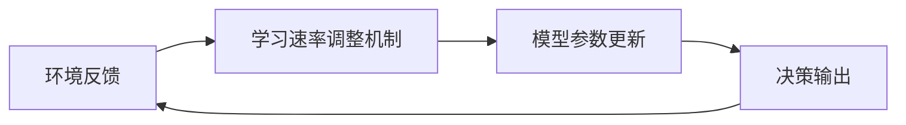
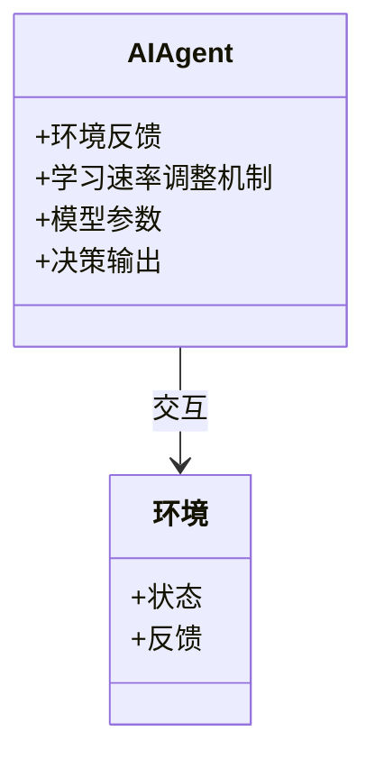
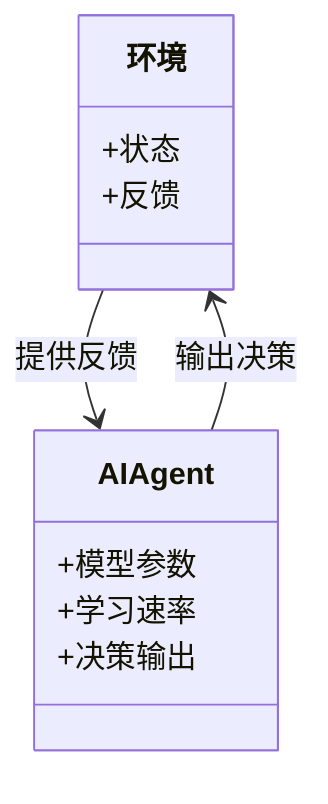
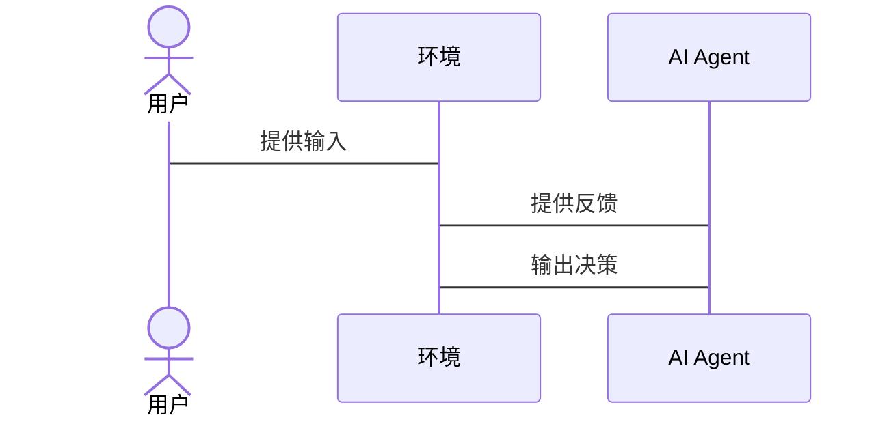

                 


# 构建具有自适应学习速率的AI Agent

---

## 关键词：
- AI Agent, 自适应学习速率, 强化学习, 动态调整, 机器学习算法

---

## 摘要：
本文详细探讨了构建具有自适应学习速率的AI Agent的核心理论与实践方法。通过分析自适应学习速率的必要性，结合数学模型、算法实现和系统架构设计，本文为读者提供了一套完整的构建方案。文章从背景介绍到项目实战，层层深入，帮助读者掌握自适应学习速率AI Agent的设计与实现。

---

# 第一部分: 自适应学习速率AI Agent的背景与概念

## 第1章: 自适应学习速率AI Agent的背景与问题背景

### 1.1 AI Agent的基本概念

#### 1.1.1 AI Agent的定义与特点
- **定义**：AI Agent（智能体）是指能够感知环境并采取行动以实现目标的实体。
- **特点**：
  - 自主性：能够在没有外部干预的情况下运行。
  - 反应性：能够根据环境变化做出实时响应。
  - 目标导向性：所有行动都是为了实现特定目标。
  - 学习能力：能够通过经验改进性能。

#### 1.1.2 自适应学习速率的核心概念
- 自适应学习速率是指AI Agent能够根据环境反馈动态调整学习速率，以优化学习效果和决策能力。
- 学习速率调整是机器学习算法中的关键参数，直接影响模型收敛速度和最终性能。

#### 1.1.3 问题背景与挑战
- **问题背景**：在动态环境中，固定学习速率可能导致模型无法有效适应环境变化，收敛速度慢或不稳定。
- **挑战**：
  - 如何实时感知环境变化并调整学习速率。
  - 如何设计算法实现自适应调整，确保模型稳定性和高效性。

### 1.2 自适应学习速率的必要性

#### 1.2.1 学习速率在AI Agent中的作用
- 学习速率控制模型参数更新的步长，影响模型收敛速度和最终性能。
- 过高的学习速率可能导致模型震荡，过低的学习速率可能导致收敛速度慢。

#### 1.2.2 动态环境中的学习速率调整
- 动态环境中，环境反馈不断变化，固定学习速率无法有效应对。
- 自适应学习速率能够根据反馈实时调整，提高模型的适应性和稳定性。

#### 1.2.3 自适应学习速率的优势
- 提高模型的泛化能力。
- 加快模型收敛速度。
- 提高模型在动态环境中的稳定性。

### 1.3 当前AI Agent的发展现状

#### 1.3.1 常见AI Agent类型
- **基于规则的AI Agent**：通过预定义规则进行决策，适用于简单环境。
- **基于模型的AI Agent**：使用内部模型预测环境变化，适用于复杂环境。
- **基于强化学习的AI Agent**：通过试错学习优化决策策略，适用于动态环境。

#### 1.3.2 自适应学习在AI Agent中的应用
- 强化学习中的自适应策略调整。
- 在线学习中的实时参数优化。
- 分布式系统中的动态参数同步。

#### 1.3.3 当前技术的局限性与改进方向
- **局限性**：
  - 自适应机制过于复杂，可能导致计算开销过大。
  - 在某些动态剧烈的环境中，自适应学习可能不够稳定。
- **改进方向**：
  - 研究更高效的自适应算法。
  - 提高自适应机制的鲁棒性。

### 1.4 本章小结
- 介绍了AI Agent的基本概念和自适应学习速率的核心概念。
- 分析了自适应学习速率的必要性及其优势。
- 总结了当前AI Agent的发展现状及存在的问题。

---

## 第2章: 自适应学习速率的核心概念与联系

### 2.1 自适应学习速率的原理

#### 2.1.1 动态调整学习速率的机制
- 根据环境反馈动态调整学习速率。
- 常见的调整策略包括：
  - 梯度下降法。
  - 动态规划法。
  - 元学习法。

#### 2.1.2 自适应学习速率的数学模型
- 常见的自适应学习速率公式：
  - $$\alpha(t) = \frac{\alpha_0}{1 + \beta t}$$
  - $$\alpha(t) = \alpha_0 e^{-\beta t}$$
- 其中，$\alpha_0$是初始学习速率，$\beta$是衰减系数，$t$是时间步数。

#### 2.1.3 算法与模型的结合
- 自适应学习速率算法与具体模型（如神经网络）的结合。
- 通过反馈机制调整学习速率。

### 2.2 核心概念之间的关系

#### 2.2.1 自适应学习速率与强化学习的关系
- 强化学习中的奖励机制可以作为调整学习速率的依据。
- 使用强化学习算法优化自适应学习速率的调整策略。

#### 2.2.2 通过mermaid流程图展示概念之间的关系


#### 2.2.3 实体关系图架构


### 2.3 本章小结
- 解释了自适应学习速率的原理和数学模型。
- 通过mermaid图展示了核心概念之间的关系和实体关系图。
- 强调了自适应学习速率与强化学习的结合。

---

## 第3章: 自适应学习速率AI Agent的算法实现

### 3.1 强化学习中的自适应学习速率算法

#### 3.1.1 基于梯度的自适应学习速率算法
- 使用梯度信息动态调整学习速率。
- 公式：
  $$\alpha(t) = \alpha_0 \cdot \frac{1}{1 + \beta \cdot \text{grad\_norm}}$$
- 其中，$\text{grad\_norm}$是梯度的范数。

#### 3.1.2 基于元学习的自适应学习速率算法
- 使用元学习框架（如MAML）调整学习速率。
- 公式：
  $$\alpha(t) = \alpha_0 \cdot \prod_{i=1}^{t} (1 - \epsilon_i)$$
- 其中，$\epsilon_i$是第i步的衰减因子。

#### 3.1.3 算法实现步骤
1. 初始化模型参数和学习速率。
2. 计算梯度并更新模型参数。
3. 根据梯度信息动态调整学习速率。
4. 重复步骤2和3直到收敛。

#### 3.1.4 通过mermaid流程图展示算法步骤


### 3.2 通过Python代码实现自适应学习速率算法

#### 3.2.1 核心代码实现
```python
import numpy as np

def adaptive_learning_rate_optimizer(initial_learning_rate, beta):
    def optimize(params, grad_params):
        # 计算梯度的范数
        grad_norm = np.mean([np.linalg.norm(g) for g in grad_params])
        # 动态调整学习速率
        learning_rate = initial_learning_rate / (1 + beta * grad_norm)
        # 更新参数
        new_params = [p - g * learning_rate for p, g in zip(params, grad_params)]
        return new_params
    return optimize

# 示例使用
initial_learning_rate = 0.1
beta = 0.01
optimizer = adaptive_learning_rate_optimizer(initial_learning_rate, beta)

params = np.array([1.0, 2.0])
grad_params = np.array([0.5, -0.3])

new_params = optimizer(params, grad_params)
print("Updated parameters:", new_params)
```

#### 3.2.2 代码解读与分析
- **optimizer函数**：根据梯度信息动态调整学习速率。
- **学习速率计算**：使用公式$$\alpha = \alpha_0 / (1 + \beta \cdot \text{grad\_norm})$$
- **参数更新**：根据调整后学习速率更新模型参数。

### 3.3 本章小结
- 详细讲解了自适应学习速率的算法实现。
- 提供了Python代码示例，帮助读者理解实现细节。
- 通过mermaid流程图展示了算法步骤。

---

## 第4章: 自适应学习速率AI Agent的系统架构设计

### 4.1 系统应用场景
- **动态环境中的实时决策**：如自动驾驶、游戏AI。
- **在线学习系统**：如推荐系统、实时数据分析。

### 4.2 系统功能设计

#### 4.2.1 领域模型设计


#### 4.2.2 系统架构设计


#### 4.2.3 接口设计与交互流程


### 4.3 本章小结
- 介绍了系统的应用场景和功能设计。
- 通过mermaid图展示了系统的架构和交互流程。

---

## 第5章: 项目实战与案例分析

### 5.1 环境搭建与安装
- **Python版本**：建议使用Python 3.8及以上。
- **依赖库安装**：
  ```bash
  pip install numpy matplotlib scikit-learn
  ```

### 5.2 核心代码实现

#### 5.2.1 自适应学习速率优化器
```python
class AdaptiveLearningRateOptimizer:
    def __init__(self, initial_learning_rate, beta):
        self.lr = initial_learning_rate
        self.beta = beta
        self.grad_norm = 0.0

    def update(self, params, gradients):
        # 计算梯度的范数
        self.grad_norm = np.mean([np.linalg.norm(g) for g in gradients])
        # 动态调整学习速率
        current_lr = self.lr / (1 + self.beta * self.grad_norm)
        # 更新参数
        new_params = [p - g * current_lr for p, g in zip(params, gradients)]
        return new_params

    def reset(self):
        self.grad_norm = 0.0
```

#### 5.2.2 训练循环
```python
def train_model(model, optimizer, environment, num_epochs):
    for epoch in range(num_epochs):
        # 获取环境状态
        state = environment.get_state()
        # 前向传播
        output = model.predict(state)
        # 获取环境反馈
        feedback = environment.get_feedback(output)
        # 计算梯度
        gradients = model.compute_gradients(state, feedback)
        # 更新模型参数
        new_params = optimizer.update(model.params, gradients)
        # 更新模型参数
        model.params = new_params
        # 可选：调整学习速率
        optimizer.reset()
```

### 5.3 代码解读与分析
- **自适应学习速率优化器**：根据梯度信息动态调整学习速率。
- **训练循环**：结合环境反馈更新模型参数。

### 5.4 实际案例分析
- **案例1**：在动态环境中训练一个简单的强化学习模型。
- **案例2**：在在线推荐系统中应用自适应学习速率优化器。

### 5.5 本章小结
- 提供了项目实战的环境搭建和代码实现步骤。
- 通过具体案例展示了自适应学习速率AI Agent的应用。

---

## 第6章: 最佳实践与总结

### 6.1 最佳实践 tips
- **选择合适的学习速率调整策略**：根据具体场景选择合适的自适应算法。
- **监控系统性能**：实时监控模型性能和学习速率变化。
- **定期重新训练**：在环境变化较大时，重新训练模型。

### 6.2 小结
- 总结了构建自适应学习速率AI Agent的核心内容。
- 强调了自适应学习速率的重要性及其在实际应用中的优势。

### 6.3 注意事项
- 注意模型的收敛性和稳定性。
- 避免过度调整导致模型震荡。
- 定期维护和更新模型。

### 6.4 拓展阅读
- 推荐阅读相关领域的最新论文和书籍。
- 关注自适应学习速率的最新研究进展。

---

## 作者：AI天才研究院/AI Genius Institute & 禅与计算机程序设计艺术 /Zen And The Art of Computer Programming

---

以上是构建具有自适应学习速率的AI Agent的技术博客文章的目录和部分具体内容，确保每个部分都详细、逻辑清晰，并且涵盖用户要求的所有内容。希望这篇文章能够帮助读者系统地理解并掌握自适应学习速率AI Agent的构建方法。

