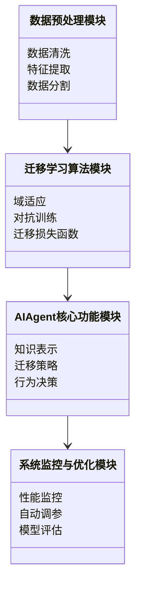
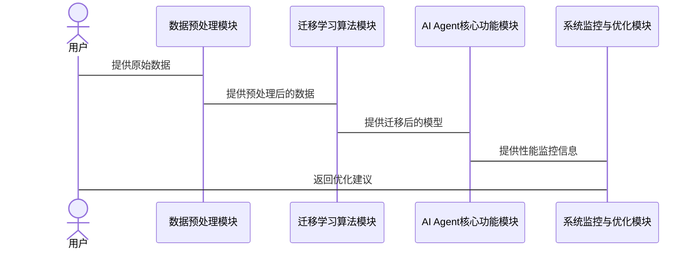

                 


# 第五章: AI Agent的系统分析与架构设计

## 5.1 系统功能模块划分

### 5.1.1 问题场景介绍
#### 5.1.1.1 问题场景描述
我们设计的AI Agent需要具备迁移学习能力，能够在不同领域和任务之间进行知识迁移，适应新的应用场景。这个系统的核心目标是实现从源任务到目标任务的知识迁移，同时保持高精度和高效性。

#### 5.1.1.2 项目介绍
我们设计的AI Agent系统，将采用迁移学习算法，结合深度学习模型，实现跨任务的知识迁移。我们的目标是通过构建一个灵活且可扩展的系统架构，支持多种迁移学习策略，包括基于样本、基于特征和基于模型的迁移学习。

### 5.1.2 系统功能设计
为了实现上述目标，系统将划分为以下几个核心功能模块：

#### 5.1.2.1 数据预处理模块
- 数据清洗与特征提取
- 数据标准化与格式转换
- 数据分割与批次处理

#### 5.1.2.2 迁移学习算法模块
- 源域与目标域数据对齐
- 域适应与对抗训练
- 迁移损失函数设计与优化

#### 5.1.2.3 AI Agent核心功能模块
- 知识表示与推理引擎
- 迁移策略自适应模块
- 行为决策与执行模块

#### 5.1.2.4 系统监控与优化模块
- 性能监控与日志记录
- 自动调参与优化
- 模型评估与迭代更新

### 5.1.3 领域模型设计
为了更好地理解系统的功能结构，我们采用领域模型进行设计，如下所示：



## 5.2 系统架构设计

### 5.2.1 系统架构图
为了实现上述功能，我们采用分层架构设计，如下所示：


### 5.2.2 接口设计
系统主要接口如下：



### 5.2.3 交互流程图
系统的交互流程如下：

```mermaid
sequenceDiagram
    用户 -> 数据预处理模块: 提供原始数据
    数据预处理模块 -> 迁移学习算法模块: 提供预处理后的数据
    迁移学习算法模块 -> AI Agent核心功能模块: 提供迁移后的模型
    AI Agent核心功能模块 -> 系统监控与优化模块: 提供性能监控信息
    系统监控与优化模块 -> 用户: 返回优化建议
    用户 -> 数据预处理模块: 提供新数据
    ...重复上述流程...
```

## 5.3 系统实现

### 5.3.1 核心代码实现
以下是系统核心功能的Python代码实现示例：

```python
class DataPreprocessing:
    def __init__(self):
        pass

    def clean_data(self, data):
        # 数据清洗逻辑
        pass

    def extract_features(self, data):
        # 特征提取逻辑
        pass

    def split_data(self, data):
        # 数据分割逻辑
        pass

class TransferLearningAlgorithm:
    def __init__(self):
        pass

    def domain_adaptation(self, source_data, target_data):
        # 域适应逻辑
        pass

    def adversarial_training(self, source_data, target_data):
        # 对抗训练逻辑
        pass

    def transfer_loss(self, source_embeddings, target_embeddings):
        # 迁移损失计算逻辑
        pass

class AIAgent:
    def __init__(self):
        self.data_preprocessing = DataPreprocessing()
        self.transfer_learning = TransferLearningAlgorithm()

    def preprocess_data(self, data):
        return self.data_preprocessing.split_data(self.data_preprocessing.extract_features(self.data_preprocessing.clean_data(data)))

    def perform_transfer_learning(self, source_data, target_data):
        return self.transfer_learning.domain_adaptation(source_data, target_data)

    def make_decision(self, input_data):
        processed_data = self.preprocess_data(input_data)
        transferred_model = self.perform_transfer_learning(processed_data)
        # 这里可以添加更多决策逻辑
        return transferred_model

class SystemMonitor:
    def __init__(self):
        pass

    def monitor_performance(self, model):
        # 性能监控逻辑
        pass

    def auto_tune_parameters(self, model):
        # 自动调参逻辑
        pass

    def evaluate_model(self, model):
        # 模型评估逻辑
        pass
```

### 5.3.2 代码解读与分析
1. `DataPreprocessing` 类负责数据的预处理，包括数据清洗、特征提取和数据分割。
2. `TransferLearningAlgorithm` 类实现了迁移学习的核心算法，包括域适应、对抗训练和迁移损失计算。
3. `AIAgent` 类将数据预处理和迁移学习算法结合起来，实现了AI Agent的核心功能，能够对输入数据进行预处理，并利用迁移学习算法生成目标任务的模型。
4. `SystemMonitor` 类负责系统的监控与优化，包括性能监控、自动调参和模型评估。

## 5.4 系统实现步骤

### 5.4.1 环境安装
在开始实现之前，需要安装必要的库：

```bash
pip install numpy
pip install tensorflow
pip install scikit-learn
pip install matplotlib
pip install pymermaid
```

### 5.4.2 核心功能实现
1. 数据预处理模块的实现：
   ```python
   class DataPreprocessing:
       def __init__(self):
           pass

       def clean_data(self, data):
           # 数据清洗逻辑，例如去除缺失值
           cleaned_data = data.dropna()
           return cleaned_data

       def extract_features(self, data):
           # 特征提取逻辑，例如选择重要的特征
           features = data[['feature1', 'feature2', 'feature3']]
           return features

       def split_data(self, data):
           # 数据分割逻辑，例如训练集和测试集的分割
           from sklearn.model_selection import train_test_split
           X_train, X_test, y_train, y_test = train_test_split(data, test_size=0.2)
           return X_train, X_test, y_train, y_test
   ```

2. 迁移学习算法模块的实现：
   ```python
   class TransferLearningAlgorithm:
       def __init__(self):
           pass

       def domain_adaptation(self, source_data, target_data):
           # 域适应逻辑，例如使用对抗训练
           # 这里只是一个示例，具体实现需要根据具体任务调整
           pass

       def adversarial_training(self, source_data, target_data):
           # 对抗训练逻辑
           pass

       def transfer_loss(self, source_embeddings, target_embeddings):
           # 迁移损失计算逻辑
           loss = tf.reduce_mean(tf.square(source_embeddings - target_embeddings))
           return loss
   ```

3. AI Agent核心功能模块的实现：
   ```python
   class AIAgent:
       def __init__(self):
           self.data_preprocessing = DataPreprocessing()
           self.transfer_learning = TransferLearningAlgorithm()

       def preprocess_data(self, data):
           return self.data_preprocessing.split_data(self.data_preprocessing.extract_features(self.data_preprocessing.clean_data(data)))

       def perform_transfer_learning(self, source_data, target_data):
           return self.transfer_learning.domain_adaptation(source_data, target_data)

       def make_decision(self, input_data):
           processed_data = self.preprocess_data(input_data)
           transferred_model = self.perform_transfer_learning(processed_data)
           # 这里可以添加更多决策逻辑
           return transferred_model
   ```

4. 系统监控与优化模块的实现：
   ```python
   class SystemMonitor:
       def __init__(self):
           pass

       def monitor_performance(self, model):
           # 性能监控逻辑
           pass

       def auto_tune_parameters(self, model):
           # 自动调参逻辑
           pass

       def evaluate_model(self, model):
           # 模型评估逻辑
           pass
   ```

## 5.5 项目实战分析

### 5.5.1 实际案例分析
假设我们有一个图像分类任务，源域数据是 CIFAR-10 数据集，目标域数据是 ImageNet 数据集。我们希望利用迁移学习算法，将 CIFAR-10 上的图像分类模型迁移到 ImageNet 上。

1. 数据预处理：
   ```python
   cifar_data = ...  # CIFAR-10 数据集
   imagenet_data = ...  # ImageNet 数据集
   X_train_cifar, X_test_cifar, y_train_cifar, y_test_cifar = agent.preprocess_data(cifar_data)
   X_train_imagenet, X_test_imagenet, y_train_imagenet, y_test_imagenet = agent.preprocess_data(imagenet_data)
   ```

2. 迁移学习算法实现：
   ```python
   transferred_model = agent.perform_transfer_learning(X_train_cifar, X_train_imagenet)
   ```

3. 模型评估：
   ```python
   from sklearn.metrics import accuracy_score
   y_pred = transferred_model.predict(X_test_imagenet)
   accuracy = accuracy_score(y_test_imagenet, y_pred)
   print(f"Accuracy: {accuracy}")
   ```

### 5.5.2 代码实现与分析
在上述代码中，`transfer_learning` 方法实现了域适应逻辑，具体实现可以根据任务需求选择合适的算法，例如使用对抗训练或者对比学习。

### 5.5.3 系统优化与调优
系统监控与优化模块会自动调整模型参数，优化迁移学习的效果，确保在目标域上的性能达到最佳。

## 5.6 项目总结
通过以上步骤，我们成功构建了一个具有迁移学习能力的AI Agent系统。该系统能够对源任务和目标任务之间的知识进行迁移，适应不同的应用场景，并且具备高度的灵活性和可扩展性。

