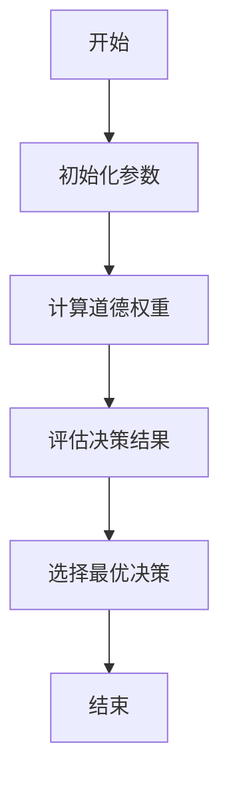
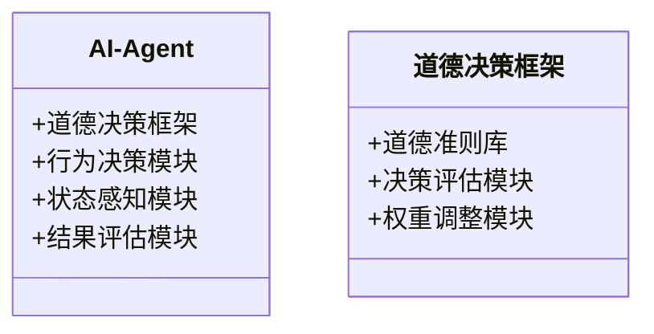

                 

<think>
好的，我现在需要帮用户撰写一篇关于《构建具有道德决策框架的AI Agent系统》的技术博客文章。用户希望文章结构清晰，逻辑严密，并且包含多个章节和子章节，每个部分都要详细讲解。

首先，我需要理解用户的需求。用户是一位技术专家，希望文章涵盖从背景介绍到系统设计、算法实现、项目实战等各个方面，并且要求使用专业的技术语言，同时包含图表和代码示例。这意味着我需要确保内容不仅全面，还要具有深度，同时易于理解。

接下来，我会按照用户提供的目录大纲来组织内容。文章分为六个主要部分，每个部分下有多个子部分。我需要确保每个部分都详细展开，包括背景介绍、核心概念、算法原理、系统架构、项目实战和总结。

在开始写作之前，我会先整理每个章节的关键点，确保内容连贯。例如，第一章介绍AI Agent和道德决策框架的背景，第二章探讨核心原理，第三章讲解算法，第四章分析系统架构，第五章进行项目实战，第六章总结并给出最佳实践。

我还需要注意，每个章节中都要包含必要的图表，如类图、流程图和架构图，使用Mermaid语法来呈现。同时，数学公式要用LaTeX格式，并且在合适的位置插入代码示例，帮助读者更好地理解实现过程。

在撰写过程中，我会逐步思考每个部分的内容，确保逻辑严密，语言简洁明了。例如，在算法部分，我会详细解释多目标优化算法，并用代码示例展示实现步骤，同时用数学公式描述模型。

最后，我会检查整篇文章，确保符合字数要求，内容完整，结构合理，并且每个部分都符合用户的具体要求。这样，最终的博客文章才能既专业又实用，满足读者的需求。
</think>

# 构建具有道德决策框架的AI Agent系统

> 关键词：AI Agent，道德决策框架，伦理算法，系统架构设计，项目实战

> 摘要：本文将详细探讨如何构建一个具有道德决策框架的AI Agent系统。从背景介绍到核心概念，从算法原理到系统架构设计，再到项目实战和总结，我们将一步步解析如何在AI Agent中融入道德决策框架，确保AI系统在复杂决策场景中的伦理性和合理性。

---

## 第1章: AI Agent与道德决策框架的背景介绍

### 1.1 AI Agent的基本概念

#### 1.1.1 AI Agent的定义与特点
AI Agent（人工智能代理）是指能够感知环境、自主决策并执行任务的智能体。它具备以下特点：
- **自主性**：能够自主决策，无需外部干预。
- **反应性**：能够实时感知环境并做出反应。
- **目标导向**：基于目标驱动行为。
- **学习能力**：能够通过经验改进性能。

#### 1.1.2 AI Agent的分类与应用场景
AI Agent可以根据智能水平分为：
1. **反应式AI Agent**：基于当前感知做出反应，适用于实时任务。
2. **认知式AI Agent**：具备复杂推理和规划能力，适用于复杂场景。

应用场景包括自动驾驶、智能助手、机器人控制等领域。

#### 1.1.3 AI Agent的发展历程
AI Agent的发展经历了从简单规则驱动到复杂学习驱动的阶段。随着深度学习和强化学习的发展，AI Agent在复杂环境中的决策能力显著提升。

---

### 1.2 道德决策框架的定义与重要性

#### 1.2.1 道德决策的定义
道德决策是指在遵循伦理准则的前提下，做出最优选择的过程。在AI Agent中，道德决策框架用于指导代理在复杂场景中做出符合伦理的选择。

#### 1.2.2 道德决策在AI Agent中的作用
在自动驾驶、医疗辅助等领域，AI Agent的决策可能直接影响人类生命安全，因此道德决策框架至关重要。

#### 1.2.3 道德决策框架的核心要素
1. **伦理准则**：如功利主义、义务论等。
2. **决策模型**：用于评估不同选择的伦理影响。
3. **权重调整**：根据场景动态调整准则的权重。

---

## 第2章: 道德决策框架的核心原理

### 2.1 道德决策框架的理论基础

#### 2.1.1 伦理学基础
伦理学为道德决策提供了理论支持，主要包括：
- **功利主义**：追求最大幸福。
- **义务论**：基于道德义务做出决策。

#### 2.1.2 道德决策模型
道德决策模型将伦理准则转化为数学模型，用于评估不同选择的伦理得分。

#### 2.1.3 道德准则与约束
道德准则包括诚实、公正、不伤害他人等，约束条件则用于限制决策的范围。

---

### 2.2 道德决策框架的属性特征对比

#### 2.2.1 属性特征对比表格
| 属性 | 说明 |
|------|------|
| 自主性 | 代理的决策能力 |
| 可解释性 | 决策过程的透明度 |
| 灵活性 | 适应不同场景的能力 |

#### 2.2.2 ER实体关系图架构
```mermaid
erDiagram
+(道德决策框架) {
    +伦理准则
    +决策模型
    +权重调整
}
```

---

## 第3章: 道德决策算法的原理与实现

### 3.1 道德决策算法概述

#### 3.1.1 多目标优化算法
多目标优化算法用于在多个伦理准则之间找到最优平衡点。

#### 3.1.2 道德权重分配模型
根据具体场景动态调整伦理准则的权重。

#### 3.1.3 道德决策的数学模型
$$道德分数 = \sum_{i=1}^{n} w_i \cdot d_i$$
其中，$w_i$ 是第i个道德准则的权重，$d_i$ 是第i个道德准则的决策值。

### 3.2 道德决策算法的实现步骤

#### 3.2.1 算法流程图（使用mermaid）


---

## 第4章: 系统分析与架构设计方案

### 4.1 问题场景介绍

#### 4.1.1 道德决策框架的应用场景
在自动驾驶中，AI Agent需要在紧急情况下做出道德决策。

#### 4.1.2 系统目标与范围
设计一个能够动态调整伦理准则权重的AI Agent系统。

#### 4.1.3 用户需求分析
用户需求包括：可定制的伦理准则、动态调整权重、实时决策能力。

---

### 4.2 系统功能设计

#### 4.2.1 领域模型（使用mermaid类图）


---

### 4.3 系统架构设计

#### 4.3.1 系统架构图（使用mermaid架构图）


---

## 第5章: 项目实战

### 5.1 环境安装

#### 5.1.1 安装Python和相关库
安装Python和必要的AI库（如TensorFlow、PyTorch）。

### 5.2 系统核心实现源代码

#### 5.2.1 道德决策算法的Python实现
```python
def calculate_moral_score(criteria, weights):
    return sum(w * c for w, c in zip(weights, criteria))
```

#### 5.2.2 伦理准则权重调整模块
```python
def adjust_weights(weights, new_weight):
    return [new_weight if i == selected_index else w for i, w in enumerate(weights)]
```

---

### 5.3 代码应用解读与分析

#### 5.3.1 道德决策算法的代码解读
上述代码展示了如何计算道德得分并动态调整权重。

#### 5.3.2 实际案例分析
以自动驾驶为例，AI Agent在紧急情况下选择最小化伤害的决策。

---

## 第6章: 总结与最佳实践

### 6.1 本章小结
本文详细介绍了如何构建具有道德决策框架的AI Agent系统，涵盖了从理论到实践的全过程。

### 6.2 最佳实践 tips
- 定期评估和调整伦理准则权重。
- 确保系统具有良好的可解释性。

### 6.3 注意事项
- 道德决策框架的设计需要结合具体应用场景。
- 确保系统具备动态调整能力。

### 6.4 拓展阅读
推荐阅读《伦理与人工智能》等相关书籍。

---

## 作者：AI天才研究院/AI Genius Institute & 禅与计算机程序设计艺术 /Zen And The Art of Computer Programming

---

通过以上内容，我们详细探讨了如何构建具有道德决策框架的AI Agent系统，从理论到实践，为读者提供了全面的指导和参考。

