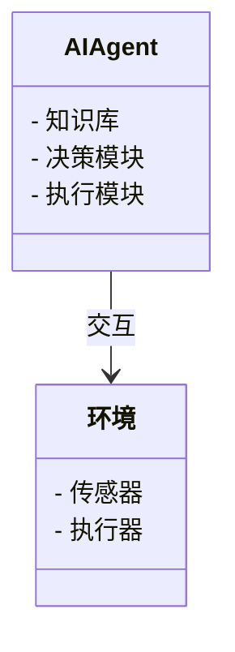

                 


# 构建具有道德决策能力的AI Agent

## 关键词：
- AI Agent，道德决策，伦理框架，强化学习，偏好推理，系统架构

## 摘要：
本文系统地探讨了构建具有道德决策能力的AI Agent的各个方面，包括核心概念、算法原理、系统架构设计及实际案例分析。通过引入伦理框架和强化学习等技术，详细阐述了如何使AI Agent在复杂场景中做出符合伦理的决策。文章从理论到实践，为构建具有道德决策能力的AI Agent提供了全面的指导。

---

# 第1章：AI Agent与道德决策概述

## 1.1 AI Agent的基本概念与分类

### 1.1.1 AI Agent的定义
AI Agent（人工智能代理）是能够感知环境、自主决策并采取行动以实现目标的智能实体。AI Agent可以是软件程序、机器人或其他智能系统，具备以下核心特征：
- **自主性**：能够自主决策，无需外部干预。
- **反应性**：能够实时感知环境并做出响应。
- **目标导向**：基于目标进行决策和行动。

### 1.1.2 AI Agent的分类
AI Agent可以根据智能水平、应用领域和决策方式分类：
- **反应式Agent**：基于当前感知做出反应，适用于简单任务。
- **基于模型的Agent**：使用内部模型和知识库进行决策，适用于复杂任务。
- **学习型Agent**：通过机器学习提升决策能力，适用于动态环境。

## 1.2 道德决策的重要性

### 1.2.1 道德决策的定义
道德决策是指在遵循伦理准则和价值观的前提下，做出合理的选择。在AI Agent中，道德决策能力意味着AI能够在复杂情境中权衡利益，选择最优解决方案。

### 1.2.2 道德决策的挑战
- **伦理多样性**：不同文化、信仰下的道德标准差异。
- **动态环境**：决策环境不断变化，需灵活调整。
- **复杂权衡**：涉及多方利益，需平衡各方需求。

---

# 第2章：AI Agent的结构与道德决策模型

## 2.1 AI Agent的结构

### 2.1.1 知识表示与推理模块
知识表示是AI Agent理解环境的基础，常见的表示方法包括：
- **语义网络**：通过节点和边表示概念及其关系。
- **逻辑推理**：使用逻辑规则进行推理，如一阶逻辑。
- **概率推理**：基于概率论进行不确定性推理。

### 2.1.2 行为选择与决策模块
行为选择是AI Agent的核心功能，涉及以下步骤：
1. **感知环境**：通过传感器或数据源获取信息。
2. **生成候选行动**：基于知识和目标生成可能的行动。
3. **评估行动**：使用评价指标评估每个行动的优劣。
4. **选择最优行动**：基于评估结果选择最佳行动。

## 2.2 道德决策模型的构建

### 2.2.1 基于伦理规则的决策模型
伦理规则是AI Agent做出道德决策的基础，常见的伦理框架包括：
- **义务论**：强调行为的义务和责任。
- **功利主义**：追求最大幸福，以效用最大化为目标。
- **美德伦理**：基于个体的美德和情境进行决策。

### 2.2.2 基于案例推理的决策模型
案例推理是一种基于相似案例的决策方法，适用于伦理决策中的复杂情境。步骤如下：
1. **案例库构建**：收集和整理典型伦理案例。
2. **案例检索**：根据当前情境检索相似案例。
3. **案例分析**：分析案例中的伦理问题。
4. **决策推导**：基于案例分析结果做出决策。

---

# 第3章：强化学习与偏好推理

## 3.1 强化学习基础

### 3.1.1 强化学习的基本概念
强化学习是一种通过试错学习的方法，AI Agent通过与环境交互获得奖励或惩罚，逐步优化决策策略。核心要素包括：
- **状态（State）**：环境当前的状况。
- **动作（Action）**：AI Agent的决策。
- **奖励（Reward）**：对决策的反馈，用于优化策略。

### 3.1.2 基于强化学习的决策算法
Q-learning算法是一种常用的强化学习算法，通过更新Q值表来优化决策。公式如下：
$$ Q(s, a) = Q(s, a) + \alpha (r + \gamma \max Q(s', a') - Q(s, a)) $$
其中：
- \( \alpha \)：学习率。
- \( \gamma \)：折扣因子。
- \( r \)：奖励值。

## 3.2 偏好推理算法

### 3.2.1 偏好推理的定义
偏好推理是基于用户或系统对不同选项的偏好进行推理，帮助AI Agent做出符合偏好的决策。

### 3.2.2 基于相似案例的偏好推理
基于案例的偏好推理方法通过分析相似案例的偏好，推导出当前决策的偏好。步骤如下：
1. **案例库构建**：收集和整理用户偏好案例。
2. **案例检索**：根据当前情境检索相似案例。
3. **偏好分析**：分析案例中的偏好模式。
4. **偏好推导**：基于分析结果推导当前决策的偏好。

---

# 第4章：伦理框架与决策算法

## 4.1 伦理框架的构建

### 4.1.1 伦理框架的层次结构
伦理框架通常包括以下层次：
1. **价值观**：决策的核心原则。
2. **规则**：具体的行为准则。
3. **案例**：具体的应用实例。

### 4.1.2 伦理规则的形式化表示
伦理规则可以通过逻辑表达式进行形式化表示，例如：
$$ \text{如果 } P \text{，则 } Q $$
其中：
- \( P \)：前提条件。
- \( Q \)：结论。

## 4.2 基于伦理的决策算法

### 4.2.1 约束条件下的优化算法
在伦理约束下，AI Agent的决策可以通过优化算法实现。例如，使用线性规划：
$$ \max \sum_{i} w_i x_i $$
$$ \text{约束条件：} \sum_{i} a_i x_i \leq b $$

### 4.2.2 基于伦理的多目标优化
多目标优化在伦理决策中尤为重要，可以通过加权求和法实现：
$$ \text{总目标} = \sum_{i=1}^{n} \lambda_i f_i(x) $$
其中：
- \( \lambda_i \)：目标权重。
- \( f_i(x) \)：目标函数。

---

# 第5章：系统架构设计

## 5.1 问题场景介绍
以自动驾驶为例，AI Agent需要在紧急情况下做出道德决策，如避免碰撞时的选择。

## 5.2 系统功能设计
系统功能包括：
- **环境感知**：通过传感器获取环境信息。
- **决策推理**：基于伦理框架和算法做出决策。
- **行动执行**：执行决策结果。

### 5.2.1 领域模型（Mermaid类图）


### 5.2.2 系统架构（Mermaid架构图）


---

# 第6章：项目实战

## 6.1 环境安装
安装必要的库，如TensorFlow、PyTorch等。

## 6.2 核心实现代码
以下是基于强化学习的道德决策算法实现：
```python
import numpy as np
import gym

env = gym.make('CartPole-v0')
env.seed(42)

# 初始化参数
learning_rate = 0.01
discount_factor = 0.99
epsilon = 0.1

# 初始化Q表
Q = np.zeros([env.observation_space.shape[0], env.action_space.n])

def epsilon_greedy_policy(observation):
    if np.random.random() < epsilon:
        return env.action_space.sample()
    else:
        return np.argmax(Q[observation])

# Q-learning算法
for episode in range(1000):
    observation = env.reset()
    total_reward = 0
    while True:
        action = epsilon_greedy_policy(observation)
        new_observation, reward, done, _ = env.step(action)
        Q[observation, action] = Q[observation, action] + learning_rate * (reward + discount_factor * np.max(Q[new_observation]) - Q[observation, action])
        total_reward += reward
        observation = new_observation
        if done:
            break
    epsilon = max(epsilon * 0.99, 0.01)

print("训练完成！")
```

## 6.3 案例分析
以自动驾驶为例，分析紧急情况下的道德决策，如遇到不可避免的碰撞时，AI Agent应优先保护车内人员的安全。

---

# 第7章：总结与展望

## 7.1 小结
本文系统地介绍了构建具有道德决策能力的AI Agent的方法，包括核心概念、算法原理和系统架构设计。通过实际案例分析，展示了理论在实践中的应用。

## 7.2 展望
未来，随着技术的发展，AI Agent的道德决策能力将更加智能化和人性化，伦理框架也将更加完善。

## 7.3 注意事项
在实际应用中，需考虑伦理框架的多样性和动态性，确保决策的合法性和伦理性。

## 7.4 拓展阅读
推荐阅读《道德机器》（Moral Machines）等书籍，深入了解AI伦理学。

---

# 作者：
AI天才研究院/AI Genius Institute  
禅与计算机程序设计艺术/Zen And The Art of Computer Programming

