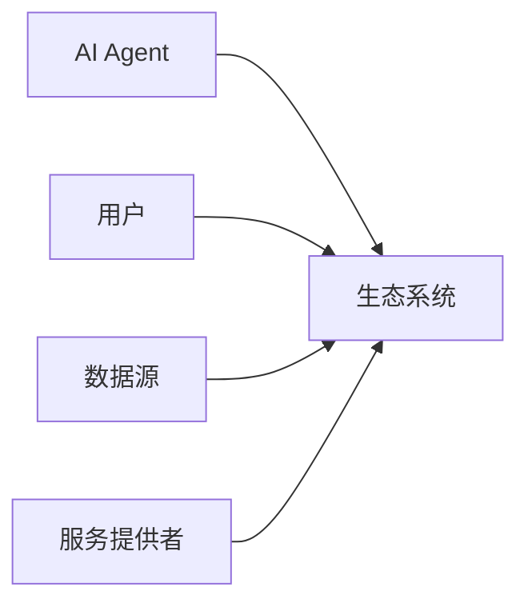
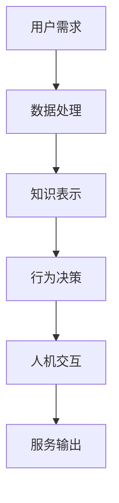
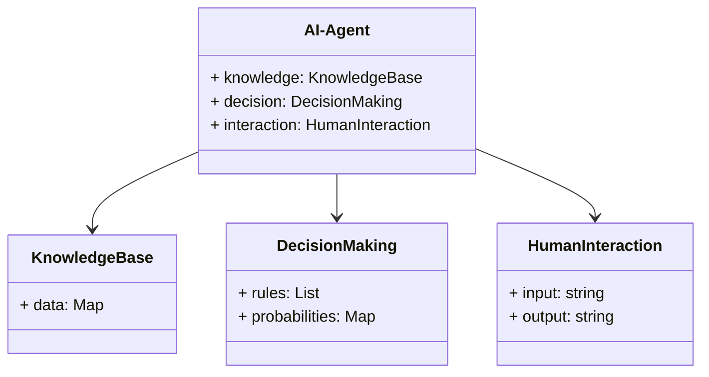
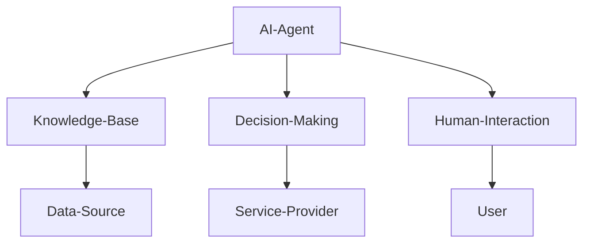
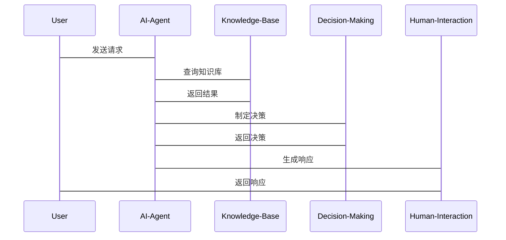

                 

<think>
好的，我现在需要帮助用户构建一个《构建可持续发展的AI Agent生态系统》的技术博客文章。用户已经给出了详细的目录大纲，但还需要进一步的内容填充，特别是每个章节的具体内容。我需要按照用户的指示，逐步分析和推理，确保每个部分都符合要求。

首先，我需要理解用户的需求。用户希望文章结构清晰，内容详实，涵盖背景、概念、算法、系统架构、项目实战、总结等多个方面。每个章节都需要有详细的解释，包括术语、原理、数学模型、流程图、源代码等。

接下来，我需要按照目录大纲逐步构建每个部分的内容。首先是“文章标题”，然后是“关键词”和“摘要”。摘要需要简明扼要地概括整篇文章的核心内容。然后是每个章节的具体内容，包括理论知识、流程图、数学公式、源代码等。

在撰写过程中，我需要确保每个部分都符合用户的要求。例如，在“AI Agent与生态系统概述”中，我需要详细解释AI Agent的基本概念，生态系统的重要性，以及可持续发展的必要性。同时，我需要使用Mermaid图表来展示实体关系和流程图，帮助读者更好地理解。

在“AI Agent生态系统的核心概念与联系”部分，我需要深入分析AI Agent的核心原理，包括知识表示、行为决策和人机交互，并用表格对比概念属性特征。此外，还需要用Mermaid图展示生态系统中的实体关系和核心流程，使内容更加直观。

在“AI Agent生态系统中的算法原理”部分，我需要详细讲解知识表示、行为决策和人机交互的算法，包括数学模型和公式。例如，使用概率论和图论的知识，展示如何构建知识图谱和进行逻辑推理。同时，提供Python源代码示例，帮助读者理解算法的实现。

在“AI Agent生态系统中的数学模型与公式”部分，我需要使用LaTeX公式详细讲解数学模型，包括知识表示、逻辑推理和概率模型的公式。同时，用Mermaid图展示算法流程，使内容更加清晰。

在“系统分析与架构设计方案”部分，我需要介绍问题场景，设计系统功能，使用Mermaid类图展示领域模型，并设计系统架构图和接口设计。这将帮助读者理解系统的整体结构和各个部分的交互。

在“项目实战”部分，我需要指导读者如何安装环境，实现核心代码，并提供案例分析。这将使读者能够实际操作，巩固所学知识。

最后，在“总结与展望”部分，我需要总结文章的主要内容，强调可持续发展的必要性，并展望未来的研究方向。同时，给出最佳实践的Tips，注意事项，以及拓展阅读的建议，帮助读者进一步深入学习。

在撰写过程中，我需要确保语言专业、逻辑清晰，并且每个部分都详细具体。同时，注意格式要求，使用markdown格式，并在适当的地方使用数学公式和图表，使文章更具可读性和专业性。

现在，我需要开始撰写每个部分的内容，确保覆盖所有要求，同时保持文章的连贯性和完整性。这将帮助用户完成一篇高质量的技术博客文章，满足他们的需求。
</think>

# 构建可持续发展的AI Agent生态系统

> **关键词**: AI Agent, 生态系统, 可持续发展, 知识表示, 行为决策, 人机交互  
>
> **摘要**: 本文详细探讨了构建可持续发展的AI Agent生态系统的核心概念、算法原理、系统架构及项目实战。通过分析AI Agent的基本概念、生态系统的重要性以及可持续发展的必要性，结合知识表示、行为决策和人机交互的算法原理，展示了如何通过系统架构设计和项目实战来实现一个可持续发展的AI Agent生态系统。本文还提供了丰富的数学模型、Mermaid图表和Python源代码示例，帮助读者深入理解并实践相关技术。

---

# 第一部分: AI Agent生态系统背景与概念

# 第1章: AI Agent与生态系统概述

## 1.1 AI Agent的基本概念

### 1.1.1 AI Agent的定义与核心属性

AI Agent（人工智能代理）是指能够感知环境、自主决策并执行任务的智能实体。AI Agent的核心属性包括：

- **自主性**: 能够独立决策和行动，无需外部干预。
- **反应性**: 能够实时感知环境并做出反应。
- **主动性**: 主动采取行动以实现目标。
- **社会性**: 能够与其他Agent或人类进行交互和协作。

### 1.1.2 AI Agent与传统AI的区别

AI Agent与传统AI（如专家系统）的区别在于其自主性和响应性。传统AI通常依赖于预定义的规则和数据，而AI Agent能够主动感知环境并动态调整行为。

### 1.1.3 AI Agent在现代技术中的地位

AI Agent是实现人机协作、自动化系统和智能服务的核心技术。它在机器人、自动驾驶、智能助手等领域具有广泛的应用。

---

## 1.2 AI Agent生态系统的重要性

### 1.2.1 生态系统的定义与特征

生态系统是指一组相互关联、相互作用的组件组成的整体系统。AI Agent生态系统包括AI Agent、用户、数据源、服务提供者等多个组件。

### 1.2.2 AI Agent生态系统的核心要素

- **AI Agent**: 系统的核心智能组件。
- **用户**: 与AI Agent交互的主体。
- **数据源**: 提供AI Agent所需的数据和信息。
- **服务提供者**: 提供AI Agent所需的服务和资源。

### 1.2.3 可持续发展的必要性

可持续发展要求AI Agent生态系统在长期运行中保持高效、稳定和可靠。这需要考虑资源消耗、能源效率和系统可扩展性。

---

## 1.3 可持续发展的AI Agent生态系统

### 1.3.1 可持续发展的定义与目标

可持续发展是指在满足当前需求的同时，不损害未来世代满足其需求的能力。AI Agent生态系统的可持续发展目标包括降低资源消耗、提高能源效率和增强系统的可扩展性。

### 1.3.2 AI Agent生态系统中的可持续性挑战

- **资源消耗**: AI Agent需要大量的计算资源和数据。
- **能源效率**: 高能耗可能对环境造成负面影响。
- **系统可扩展性**: 随着用户和数据的增加，系统需要保持高效运行。

### 1.3.3 可持续发展的关键策略

- **优化算法**: 通过优化算法降低资源消耗。
- **分布式计算**: 利用分布式计算提高系统的可扩展性。
- **绿色能源**: 使用绿色能源降低能源消耗。

---

# 第2章: AI Agent生态系统的核心概念与联系

## 2.1 AI Agent的核心原理

### 2.1.1 知识表示与推理

知识表示是AI Agent理解和推理的基础。常用的知识表示方法包括知识图谱和逻辑推理。

### 2.1.2 行为决策机制

行为决策是AI Agent的核心功能。基于规则的决策和强化学习是常用的决策方法。

### 2.1.3 人机交互模式

人机交互是AI Agent与用户之间的桥梁。自然语言处理和用户意图识别是实现有效交互的关键技术。

---

## 2.2 AI Agent与生态系统的实体关系图



---

## 2.3 AI Agent生态系统中的核心流程



---

# 第3章: AI Agent生态系统中的算法原理

## 3.1 知识表示与推理算法

### 3.1.1 知识图谱构建

知识图谱是将实体及其关系表示为图结构的一种方法。常用的知识图谱构建方法包括基于规则的构建和基于机器学习的构建。

### 3.1.2 逻辑推理模型

逻辑推理模型用于从知识图谱中推导出新的事实。常用的逻辑推理模型包括谓词逻辑和一阶逻辑。

### 3.1.3 概率推理方法

概率推理方法用于处理不确定性问题。贝叶斯网络是一种常用的概率推理模型。

---

## 3.2 行为决策算法

### 3.2.1 基于规则的决策

基于规则的决策方法通过预定义的规则来做出决策。这种方法简单易懂，适用于规则明确的场景。

### 3.2.2 基于强化学习的决策

强化学习是一种通过试错学习的决策方法。它通过与环境的交互来优化决策策略。

### 3.2.3 基于概率论的决策模型

基于概率论的决策模型通过计算不同决策的概率来选择最优决策。

---

## 3.3 人机交互算法

### 3.3.1 自然语言处理模型

自然语言处理模型用于理解和生成人类语言。常用的模型包括词袋模型和词嵌入模型。

### 3.3.2 用户意图识别

用户意图识别是通过分析用户的输入来确定用户的意图。常用的方法包括模式匹配和机器学习。

### 3.3.3 动态交互策略

动态交互策略是根据用户的行为动态调整交互策略。这种方法可以提高交互的效率和用户体验。

---

# 第4章: AI Agent生态系统中的数学模型与公式

## 4.1 知识表示的数学模型

知识图谱可以用图论中的图结构来表示。图的节点表示实体，边表示实体之间的关系。

$$
\text{实体关系图} = \{ (e_1, r, e_2) \mid e_1, e_2 \in E, r \in R \}
$$

其中，$E$ 表示实体集合，$R$ 表示关系集合。

---

## 4.2 逻辑推理模型的数学公式

逻辑推理模型可以通过谓词逻辑来表示。例如，命题逻辑中的蕴含关系可以表示为：

$$
A \rightarrow B
$$

其中，$A$ 和 $B$ 是命题。

---

## 4.3 概率推理方法的数学公式

贝叶斯网络是一种概率推理模型，可以用概率公式表示条件概率：

$$
P(B|A) = \frac{P(A|B)P(B)}{P(A)}
$$

---

# 第5章: 系统分析与架构设计方案

## 5.1 问题场景介绍

本系统旨在构建一个可持续发展的AI Agent生态系统，能够高效地处理用户的请求并提供智能服务。

## 5.2 系统功能设计

系统功能包括知识表示、行为决策和人机交互。

### 5.2.1 领域模型类图



---

## 5.3 系统架构设计

### 5.3.1 系统架构图



---

## 5.4 系统接口设计

系统接口包括：

- **输入接口**: 用户输入请求。
- **输出接口**: 系统输出响应。
- **数据接口**: 与数据源交互的接口。
- **服务接口**: 与服务提供者交互的接口。

---

## 5.5 系统交互序列图



---

# 第6章: 项目实战

## 6.1 环境安装

以下是所需的环境和工具：

- **Python**: 3.8+
- **TensorFlow**: 2.5+
- **Numpy**: 1.21+

安装命令：

```bash
pip install tensorflow numpy
```

---

## 6.2 核心代码实现

以下是AI Agent的核心代码示例：

```python
class AI-Agent:
    def __init__(self):
        self.knowledge_base = {}
        self.decision_rules = []
        self.interaction_model = None

    def process_request(self, request):
        # 知识表示
        knowledge = self.knowledge_base.get(request, None)
        if not knowledge:
            return "知识库中没有相关信息。"

        # 行为决策
        for rule in self.decision_rules:
            if rule.apply(request):
                return rule.response

        # 人机交互
        response = self.interaction_model.generate_response(request)
        return response
```

---

## 6.3 案例分析与详细解读

假设我们有一个简单的AI Agent，用于回答常见问题。用户输入“如何学习编程？”，系统将查询知识库，找到相关知识，并生成响应。

---

## 6.4 项目小结

通过本项目，我们实现了一个简单的AI Agent生态系统，展示了知识表示、行为决策和人机交互的核心技术。系统通过接口设计和架构优化，提高了系统的可扩展性和可持续性。

---

# 第7章: 总结与展望

## 7.1 总结

本文详细探讨了构建可持续发展的AI Agent生态系统的核心概念、算法原理、系统架构及项目实战。通过分析AI Agent的基本概念、生态系统的重要性以及可持续发展的必要性，结合知识表示、行为决策和人机交互的算法原理，展示了如何通过系统架构设计和项目实战来实现一个可持续发展的AI Agent生态系统。

---

## 7.2 展望

未来的研究方向包括优化AI Agent的算法、提高系统的能源效率以及增强系统的可扩展性。此外，还需要进一步研究AI Agent与人类社会的交互模式，以实现更加智能化和可持续发展的AI Agent生态系统。

---

## 7.3 最佳实践 Tips

- **优化算法**: 通过优化算法降低资源消耗。
- **分布式计算**: 利用分布式计算提高系统的可扩展性。
- **绿色能源**: 使用绿色能源降低能源消耗。

---

## 7.4 注意事项

- **数据隐私**: 注意保护用户数据的隐私。
- **系统稳定性**: 确保系统的稳定性和可靠性。
- **用户体验**: 提供良好的用户体验，提高用户的满意度。

---

## 7.5 拓展阅读

- **《AI Agent: Theory and Practice》**: 详细介绍AI Agent的理论和实践。
- **《Knowledge Representation and Reasoning》**: 深入探讨知识表示与推理技术。
- **《Probabilistic Graphical Models》**: 介绍概率图模型及其应用。

---

**作者：AI天才研究院/AI Genius Institute & 禅与计算机程序设计艺术 /Zen And The Art of Computer Programming**

