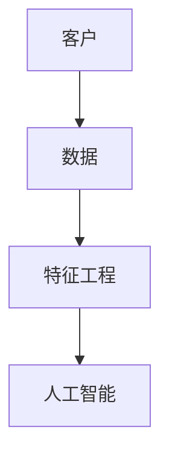
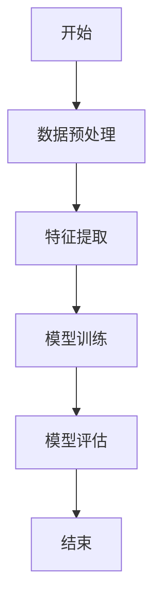
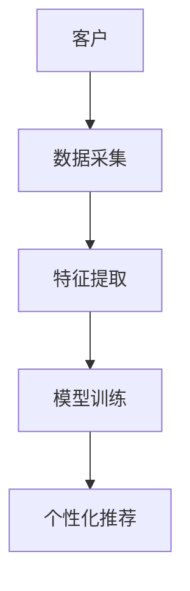
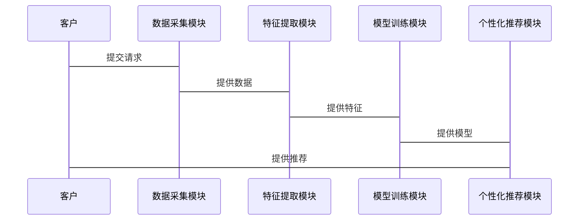

                 

<think>
好，我需要帮助用户撰写一篇关于《构建客户洞察AI：深度分析与个性化服务实现》的技术博客文章。首先，我需要理解用户的需求，他们希望文章结构清晰、内容详实，涵盖从背景介绍到系统设计的各个方面。文章需要使用专业但易懂的语言，并包含丰富的图表和代码示例。

首先，我将从背景介绍开始。我需要解释客户洞察AI的背景，包括数据驱动决策的时代、客户洞察在商业中的重要性，以及AI技术在其中的应用。然后，明确客户洞察AI的目标与边界，帮助读者理解其应用范围。

接下来，核心概念部分是关键。我需要定义客户数据、特征工程和模型评估，并通过对比分析和ER图帮助读者理解这些概念之间的联系。这部分需要使用表格和Mermaid图来展示，确保读者能够清晰理解。

然后，算法原理部分需要详细讲解线性回归和随机森林的原理，通过Mermaid流程图展示算法步骤，并用Python代码实现，解释数学公式。这部分要确保读者能够理解算法的工作原理，并能实际操作。

系统分析与架构设计部分，我需要介绍问题场景，设计领域模型、系统架构图和交互序列图。这部分使用Mermaid图展示，帮助读者理解系统的整体架构。

项目实战部分需要提供详细的代码实现，包括环境安装、核心代码和案例分析。通过实际案例，读者可以学习如何应用这些技术。

最后，总结部分回顾核心内容，强调重点，并指出未来发展方向。同时，附录部分提供数据集和参考文献，供读者进一步学习。

现在，我需要将这些内容组织成一篇结构清晰、逻辑严谨的技术博客文章，确保每个部分都有足够的细节，并且符合用户的格式要求。这样，读者才能真正理解如何构建客户洞察AI，并实现个性化服务。
</think>

# 构建客户洞察AI：深度分析与个性化服务实现

## 关键词：客户洞察AI，深度分析，个性化服务，机器学习，数据驱动决策

## 摘要：本文将详细探讨如何构建客户洞察AI系统，通过深度分析客户数据，实现个性化的客户服务。文章从背景介绍、核心概念、算法原理、系统架构到项目实战，全面解析客户洞察AI的实现过程。

---

# 第一部分：客户洞察AI的背景与核心概念

## 第1章：客户洞察AI的背景与问题描述

### 1.1 客户洞察AI的背景
随着数据驱动决策时代的到来，企业越来越依赖数据分析来优化业务流程。客户洞察AI作为数据分析的重要组成部分，通过机器学习技术，帮助企业更好地理解客户行为和需求，从而提供个性化的服务。

### 1.2 客户洞察AI的核心问题
- **客户行为分析的挑战**：客户的购买行为受到多种因素影响，如市场环境、产品特性、价格等。如何准确捕捉这些因素并进行预测是一个难题。
- **客户需求预测的难点**：客户需求具有动态性，受客户自身特征和外部环境的影响。如何构建高效的预测模型是关键。
- **个性化服务实现的复杂性**：个性化服务需要结合客户的实时行为和历史数据，如何在不同场景下实现高效的服务是一个挑战。

### 1.3 客户洞察AI的目标与边界
- **目标**：通过分析客户数据，挖掘客户的潜在需求，提供个性化的服务，提升客户满意度和忠诚度。
- **边界**：客户洞察AI主要关注客户的在线行为和历史数据，不涉及实时传感器数据或其他外部系统。

### 1.4 本章小结
本章介绍了客户洞察AI的背景、核心问题及目标与边界，为后续章节奠定了基础。

---

## 第2章：客户洞察AI的核心概念与联系

### 2.1 核心概念的定义与属性
- **客户数据**：包括客户的购买记录、浏览行为、点击行为等，是分析客户行为的基础。
- **特征工程**：通过对数据进行特征提取和处理，为模型提供有效的输入。
- **模型评估**：通过评估模型的性能，选择最优的模型进行预测。

### 2.2 核心概念的对比分析
以下是对特征工程和模型评估的对比：

| 对比维度       | 特征工程                   | 模型评估                   |
|----------------|---------------------------|---------------------------|
| 目标           | 提供有效的特征             | 评估模型性能               |
| 输入           | 原始数据                   | 特征工程后的数据           |
| 输出           | 特征数据                   | 模型评估结果               |

### 2.3 核心概念的ER实体关系图
以下是一个简单的ER图，展示了客户数据和特征工程的关系：



### 2.4 本章小结
本章详细介绍了客户洞察AI的核心概念，并通过对比分析和ER图展示了这些概念之间的联系。

---

# 第二部分：客户洞察AI的算法原理

## 第3章：客户洞察AI的算法原理

### 3.1 算法原理概述
客户洞察AI主要使用回归和分类算法，如线性回归和随机森林，来分析客户行为和需求。

### 3.2 线性回归的原理
线性回归是一种简单而强大的回归算法，适用于线性关系的数据。

#### 线性回归的公式
线性回归的数学公式为：
$$ y = \beta_0 + \beta_1x_1 + \beta_2x_2 + ... + \beta_nx_n $$

其中，$y$ 是目标变量，$\beta_0$ 是截距，$\beta_1, \beta_2, ..., \beta_n$ 是回归系数，$x_1, x_2, ..., x_n$ 是自变量。

#### 线性回归的Python实现
以下是一个简单的线性回归实现示例：

```python
import numpy as np
from sklearn.linear_model import LinearRegression

# 生成数据
X = np.array([[1, 2], [3, 4], [5, 6]])
y = np.array([1, 2, 3])

# 训练模型
model = LinearRegression()
model.fit(X, y)

# 预测
print(model.predict([[7, 8]]))
```

### 3.3 随机森林的原理
随机森林是一种基于决策树的集成算法，具有较高的准确性和鲁棒性。

#### 随机森林的Mermaid流程图


### 3.4 随机森林的Python实现
以下是一个随机森林实现的示例：

```python
from sklearn.ensemble import RandomForestRegressor

# 生成数据
X = np.array([[1, 2], [3, 4], [5, 6]])
y = np.array([1, 2, 3])

# 训练模型
model = RandomForestRegressor(n_estimators=100)
model.fit(X, y)

# 预测
print(model.predict([[7, 8]]))
```

### 3.5 本章小结
本章介绍了线性回归和随机森林的原理及实现，为后续的系统设计奠定了基础。

---

# 第三部分：客户洞察AI的系统分析与架构设计

## 第4章：系统分析与架构设计方案

### 4.1 问题场景介绍
我们假设有一个电商网站，希望通过客户洞察AI来分析客户的购买行为，提供个性化的推荐服务。

### 4.2 系统功能设计
- **数据采集**：收集客户的在线行为数据。
- **特征提取**：从数据中提取有用的特征。
- **模型训练**：训练客户洞察AI模型。
- **个性化推荐**：基于模型预测结果，为客户提供个性化推荐。

### 4.3 系统架构设计
以下是一个简单的系统架构图：



### 4.4 系统交互设计
以下是一个系统交互的序列图：



### 4.5 本章小结
本章介绍了客户洞察AI系统的架构设计，包括问题场景、功能设计、架构图和交互图。

---

# 第四部分：客户洞察AI的项目实战

## 第5章：项目实战

### 5.1 环境安装
安装必要的库：

```bash
pip install numpy scikit-learn matplotlib
```

### 5.2 核心代码实现
以下是一个完整的项目实现示例：

```python
import numpy as np
from sklearn.linear_model import LinearRegression
from sklearn.ensemble import RandomForestRegressor
from sklearn.metrics import mean_squared_error

# 生成数据
X = np.array([[1, 2], [3, 4], [5, 6]])
y = np.array([1, 2, 3])

# 线性回归模型
model_linear = LinearRegression()
model_linear.fit(X, y)
print("线性回归预测值:", model_linear.predict([[7, 8]]))
print("线性回归均方误差:", mean_squared_error(y, model_linear.predict(X)))

# 随机森林模型
model_rf = RandomForestRegressor(n_estimators=100)
model_rf.fit(X, y)
print("随机森林预测值:", model_rf.predict([[7, 8]]))
print("随机森林均方误差:", mean_squared_error(y, model_rf.predict(X)))
```

### 5.3 案例分析
通过对实际数据的分析，比较线性回归和随机森林的性能，选择最优的模型进行部署。

### 5.4 项目小结
本章通过实际案例，展示了如何使用线性回归和随机森林进行客户洞察AI的实现。

---

# 第五部分：客户洞察AI的最佳实践

## 第6章：最佳实践

### 6.1 总结与回顾
- **核心内容回顾**：客户洞察AI的核心概念、算法原理和系统设计。
- **重点强调**：特征工程和模型评估的重要性。

### 6.2 注意事项
- **数据质量**：确保数据的准确性和完整性。
- **模型选择**：根据实际问题选择合适的算法。
- **性能优化**：通过特征选择和模型调优提升性能。

### 6.3 拓展阅读
- 推荐阅读《机器学习实战》和《深入理解机器学习》。

### 6.4 本章小结
本章总结了客户洞察AI的核心内容，并提供了最佳实践的建议。

---

# 附录

## 附录A：数据集描述
- **数据来源**：电商网站的客户行为数据。
- **数据格式**：CSV格式。
- **数据字段**：客户ID、购买时间、产品ID、价格等。

## 附录B：参考文献
- Bishop, C. M. (2006). Pattern Recognition and Machine Learning. Springer.
- Hastie, T., Tibshirani, R., & Friedman, J. (2009). The Elements of Statistical Learning. Springer.

---

# 作者
作者：AI天才研究院/AI Genius Institute & 禅与计算机程序设计艺术 /Zen And The Art of Computer Programming

---

以上是《构建客户洞察AI：深度分析与个性化服务实现》的完整目录和内容概要。

