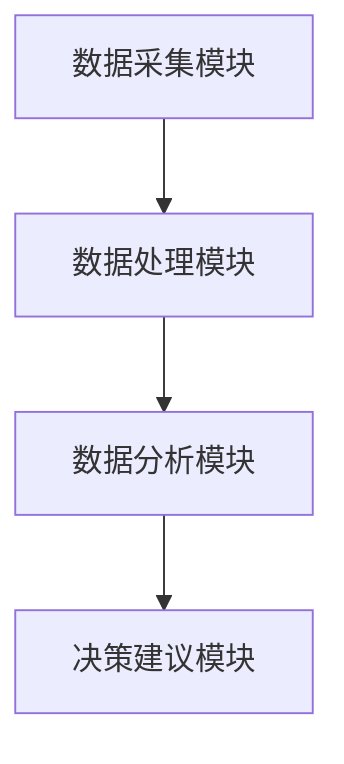
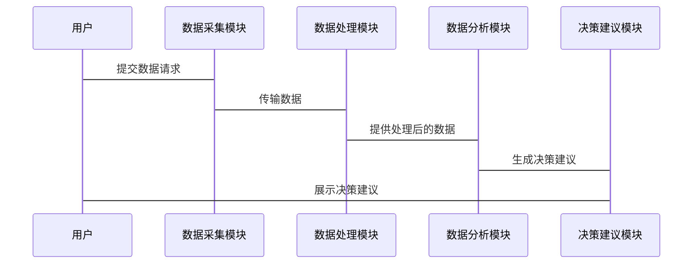

                 

<think>
好的，我现在需要撰写一篇名为《构建智能企业决策支持系统：多维度数据分析与建议》的技术博客文章。首先，我需要理解用户的需求。用户希望我作为一位世界级的人工智能专家、程序员、软件架构师和CTO，撰写一篇结构清晰、逻辑严谨、内容深入的技术博客。

根据用户提供的大纲，文章将分为几个主要部分：背景与意义、数据分析基础、核心算法、系统架构、项目实战和总结。每个部分又细分成小节，确保内容详尽且有条理。

首先，我会从背景与意义开始。这部分需要介绍智能决策支持系统的背景，分析传统决策方式的局限性，以及智能决策支持系统的重要性。我需要确保这部分内容能够引起读者的兴趣，并为后续章节打下基础。

接下来是数据分析基础。这里需要涵盖数据预处理、清洗、标准化、归一化等关键步骤，同时介绍数据可视化的工具和方法。这些内容对于理解后续的算法和系统架构至关重要。

然后是核心算法部分。这里将详细讲解支持向量机（SVM）和随机森林（Random Forest）等算法，包括它们的原理、数学模型以及在企业决策中的应用。这部分需要使用数学公式和流程图来帮助读者理解。

接下来是系统架构设计。我需要讨论系统的功能模块划分、架构设计、接口设计以及交互流程。这部分将涉及分层架构和微服务架构，同时使用类图和序列图来展示系统结构。

项目实战部分需要提供一个具体的案例，从环境搭建到代码实现，再到案例分析，确保读者能够实际操作和理解。

最后是总结与展望。我需要回顾整个系统的构建过程，并展望未来的发展方向。

在写作过程中，我需要确保每个部分都包含足够的细节，同时保持语言的专业性和易懂性。我会使用mermaid图表来辅助解释算法和系统架构，同时使用latex公式来展示数学模型。此外，每个章节的小结将帮助读者巩固所学内容。

现在，我需要按照用户提供的大纲，逐步展开每个部分的内容，确保逻辑连贯，内容详实。这包括每个小节的详细解释、数学公式的正确展示、图表的合理使用以及代码的清晰呈现。

总之，我将系统地分析每个部分，确保内容全面，结构合理，语言专业且易于理解，最终完成一篇高质量的技术博客文章。
</think>

# 构建智能企业决策支持系统：多维度数据分析与建议

## 关键词：智能决策支持系统、多维度数据分析、机器学习、系统架构、项目实战

## 摘要：
本文详细探讨了构建智能企业决策支持系统的各个方面，从数据分析的基础到算法的实现，再到系统的架构设计和项目实战。通过多维度数据分析，结合机器学习算法，构建高效的决策支持系统，为企业提供科学的决策建议。文章内容涵盖系统背景、数据分析、算法原理、系统架构、项目实战以及未来展望，为企业构建智能决策支持系统提供全面的指导和参考。

---

## 第1章: 智能企业决策支持系统概述

### 1.1 智能决策支持系统的背景与意义
#### 1.1.1 传统企业决策方式的局限性
传统的决策方式依赖于人工分析和经验判断，存在以下问题：
- 数据量有限，难以捕捉全貌。
- 分析过程主观性强，缺乏客观依据。
- 决策周期长，难以应对快速变化的市场环境。

#### 1.1.2 智能决策支持系统的定义与特点
智能决策支持系统（IDSS）是利用人工智能、大数据分析和机器学习等技术，为企业提供智能化、数据驱动的决策支持工具。其特点包括：
- 数据驱动：基于大量数据进行分析，提供科学依据。
- 实时性：能够实时处理数据，快速生成决策建议。
- 智能性：通过算法自动学习和优化，提升决策准确性。

#### 1.1.3 智能决策支持系统对企业价值的影响
IDSS能够显著提升企业的决策效率和准确性，降低成本，增强竞争力。例如，在金融行业，IDSS可以实时分析市场数据，提供股票买卖的最佳时机；在制造业，可以通过预测性维护减少设备故障，降低运营成本。

### 1.2 多维度数据分析的重要性
#### 1.2.1 数据分析在企业决策中的作用
数据分析是IDSS的核心，通过分析企业内外部数据，识别潜在问题和机会，为企业决策提供支持。

#### 1.2.2 多维度数据分析的核心概念
多维度数据分析是指从多个维度（如时间、空间、业务线等）对数据进行分析，发现数据间的关联性，挖掘深层信息。

#### 1.2.3 数据分析与企业决策支持的关系
数据分析是连接数据与决策的桥梁，通过分析数据，IDSS能够生成可操作的建议，帮助企业做出更明智的决策。

### 1.3 本章小结
本章介绍了智能决策支持系统的背景、定义、特点及其对企业决策的重要性，为后续内容奠定了基础。

---

## 第2章: 数据分析基础

### 2.1 数据分析的基本概念
#### 2.1.1 数据分析的定义与分类
数据分析是通过统计、挖掘和可视化技术，从数据中提取有价值信息的过程。根据分析目标，可分为描述性分析、诊断性分析、预测性分析和规范性分析。

#### 2.1.2 数据分析的基本流程
数据收集→数据清洗→数据建模→结果分析→可视化。

#### 2.1.3 数据分析的核心工具与技术
常用工具包括Excel、Python（Pandas、NumPy）、R、SQL等。

### 2.2 数据预处理与清洗
#### 2.2.1 数据清洗的必要性
数据清洗是数据分析的第一步，用于处理缺失值、重复值、异常值等问题。

#### 2.2.2 数据清洗的主要方法
- 删除法：删除无用数据。
- 替代法：用均值、中位数等填充缺失值。
- 缩放法：标准化或归一化处理数据。

#### 2.2.3 数据标准化与归一化
标准化：将数据按比例缩放到均值为0，方差为1。
归一化：将数据缩放到[0,1]区间。

### 2.3 数据可视化基础
#### 2.3.1 数据可视化的定义与作用
数据可视化是将数据以图形形式展示，帮助用户更好地理解和分析数据。

#### 2.3.2 常见的数据可视化工具
Matplotlib、Seaborn、Tableau、Power BI等。

#### 2.3.3 数据可视化在决策支持中的应用
通过可视化，用户可以快速发现数据中的趋势、异常和关联性。

### 2.4 本章小结
本章介绍了数据分析的基本概念、流程和工具，并重点讲解了数据清洗和可视化的方法。

---

## 第3章: 数据分析算法基础

### 3.1 常见数据分析算法概述
#### 3.1.1 监督学习与无监督学习
监督学习：有标签数据，用于分类和回归。
无监督学习：无标签数据，用于聚类和降维。

#### 3.1.2 分类、回归与聚类算法
分类算法：逻辑回归、决策树、SVM。
回归算法：线性回归、岭回归。
聚类算法：K-means、DBSCAN。

#### 3.1.3 机器学习在数据分析中的应用
机器学习算法可以用于预测、分类和推荐。

### 3.2 支持向量机（SVM）算法
#### 3.2.1 SVM算法的基本原理
SVM通过构建超平面，将数据分为两类，适用于分类和回归。

#### 3.2.2 SVM算法的数学模型
$$ \text{目标函数：} \min_{w,b,\xi} \frac{1}{2}||w||^2 + C\sum_{i=1}^n \xi_i $$
$$ \text{约束条件：} y_i(w \cdot x_i + b) \geq 1 - \xi_i $$
$$ \xi_i \geq 0 $$

#### 3.2.3 SVM算法在企业决策中的应用
例如，在金融行业用于信用评分，在制造业用于预测性维护。

### 3.3 随机森林（Random Forest）算法
#### 3.3.1 随机森林算法的基本原理
随机森林是通过集成多个决策树模型，提高准确性和鲁棒性。

#### 3.3.2 随机森林算法的数学模型
$$ \text{预测概率：} P(y|x) = \frac{1}{N}\sum_{i=1}^N f_i(x) $$
其中，$f_i(x)$是第i棵树的预测结果。

#### 3.3.3 随机森林算法在企业决策中的应用
例如，在电商行业用于用户画像，在医疗行业用于疾病诊断。

### 3.4 本章小结
本章介绍了几种常用的机器学习算法，并通过数学公式和实际案例，讲解了它们在企业决策中的应用。

---

## 第4章: 系统架构与实现

### 4.1 系统功能模块划分
#### 4.1.1 数据采集模块
负责从数据库、API等来源采集数据。

#### 4.1.2 数据处理模块
对采集到的数据进行清洗、转换和标准化。

#### 4.1.3 数据分析模块
利用机器学习算法对数据进行建模和分析。

#### 4.1.4 决策建议模块
根据分析结果生成决策建议，并可视化展示。

### 4.2 系统架构设计
#### 4.2.1 分层架构设计
- 数据层：存储原始数据。
- 业务逻辑层：处理数据并运行算法。
- 表现层：展示结果和决策建议。

#### 4.2.2 微服务架构设计
- 数据采集服务：负责数据采集。
- 数据处理服务：负责数据清洗和转换。
- 数据分析服务：负责模型训练和预测。
- 决策建议服务：负责生成和展示决策建议。

#### 4.2.3 数据流与功能模块交互图


### 4.3 系统接口设计
#### 4.3.1 数据接口设计
RESTful API接口，用于数据的上传和下载。

#### 4.3.2 用户接口设计
Web界面，用户可以通过界面查看数据和决策建议。

#### 4.3.3 第三方服务接口设计
与第三方数据源（如天气API）对接，获取外部数据。

### 4.4 系统交互流程设计


### 4.5 本章小结
本章详细介绍了系统的功能模块划分、架构设计和接口设计，为后续的项目实现奠定了基础。

---

## 第5章: 项目实战

### 5.1 项目背景与目标
#### 5.1.1 项目背景
以某电商企业为例，希望通过构建IDSS，优化库存管理和销售预测。

#### 5.1.2 项目目标
实现库存预测、销售预测、客户画像等功能。

### 5.2 环境搭建与工具安装
#### 5.2.1 开发环境配置
安装Python、Jupyter Notebook、数据库（MySQL）。

#### 5.2.2 数据库安装与配置
安装MySQL，创建数据库和表结构。

### 5.3 核心实现代码
#### 5.3.1 数据采集模块
```python
import pymysql

def get_data():
    # 连接数据库
    conn = pymysql.connect(host='localhost', user='root', password='password', db='sales_db')
    cursor = conn.cursor()
    # 查询数据
    cursor.execute('SELECT * FROM sales_data')
    data = cursor.fetchall()
    return data

# 示例调用
data = get_data()
print(data)
```

#### 5.3.2 数据处理模块
```python
import pandas as pd

def data_processing(data):
    # 删除缺失值
    data = data.dropna()
    # 标准化处理
    from sklearn.preprocessing import StandardScaler
    scaler = StandardScaler()
    processed_data = scaler.fit_transform(data)
    return processed_data

# 示例调用
processed_data = data_processing(data)
print(processed_data)
```

#### 5.3.3 数据分析模块
```python
from sklearn.ensemble import RandomForestRegressor

def train_model(data, target):
    # 训练模型
    model = RandomForestRegressor()
    model.fit(data, target)
    return model

# 示例调用
model = train_model(processed_data, target)
```

#### 5.3.4 决策建议模块
```python
import matplotlib.pyplot as plt

def generate_recommendation(model, new_data):
    # 预测结果
    prediction = model.predict(new_data)
    # 可视化
    plt.plot(prediction)
    plt.xlabel('Time')
    plt.ylabel('Prediction')
    plt.show()

# 示例调用
recommendation = generate_recommendation(model, new_data)
```

### 5.4 项目小结
通过项目实战，展示了如何将理论应用于实际，从数据采集到模型训练，再到结果可视化，完整地构建了一个智能决策支持系统。

---

## 第6章: 总结与展望

### 6.1 总结
本文详细介绍了构建智能企业决策支持系统的各个方面，从数据分析的基础到算法的实现，再到系统的架构设计和项目实战。通过多维度数据分析和机器学习算法，IDSS能够为企业提供科学的决策建议。

### 6.2 未来展望
未来，随着人工智能和大数据技术的不断发展，IDSS将更加智能化和个性化。企业可以通过实时数据分析，做出更精准的决策，进一步提升竞争力。

---

## 作者：AI天才研究院（AI Genius Institute） & 禅与计算机程序设计艺术（Zen And The Art of Computer Programming）

---

通过本文，读者可以系统地了解如何构建智能企业决策支持系统，并能够在实际项目中应用相关技术。

