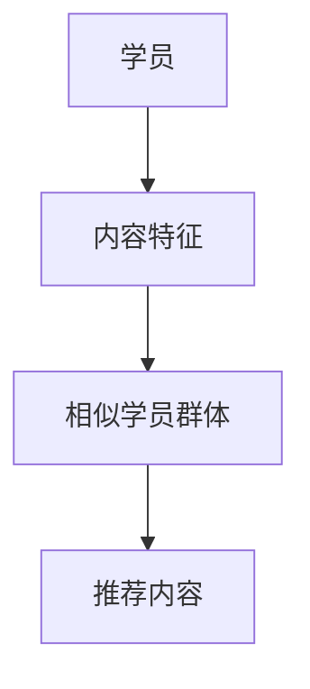
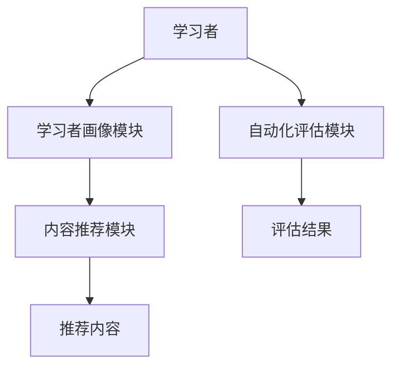

                 

<think>
嗯，用户让我帮忙写一篇关于构建智能企业合规培训系统的博客文章，标题是《构建智能企业合规培训系统：个性化学习内容与评估的自动化》。首先，我需要理解这个主题的核心是什么。看起来主要是利用人工智能技术来实现企业合规培训的个性化和自动化。

我应该从哪里开始呢？嗯，用户已经提供了一个详细的目录结构，我需要按照这个结构来展开思考。首先是标题和关键词，然后是摘要，再是各个章节的内容。

在摘要部分，我需要简洁明了地介绍文章的核心内容和主题思想。接下来，每个章节的内容需要详细展开，确保逻辑清晰，结构紧凑，同时语言专业但不失简单易懂。

第一部分是背景与需求，我需要先解释为什么企业需要合规培训，传统方法的局限性，以及引入智能系统的重要性。这部分要让读者明白问题的背景和痛点。

第二部分是核心概念与技术，这里要详细讲解个性化学习和自动化评估的概念，以及它们如何相互关联。可能还需要对比分析，使用表格和ER图来辅助说明。

第三部分是算法原理与数学模型，这部分需要详细讲解推荐算法和评估模型，比如协同过滤和深度学习模型。我需要使用数学公式和mermaid流程图来帮助读者理解。

第四部分是系统架构设计，包括功能设计、架构图、接口设计和交互流程。这部分要展示系统的模块划分和各部分之间的协作关系，使用类图和序列图来直观展示。

第五部分是项目实战，需要提供具体的实现步骤，包括环境安装、核心代码编写和案例分析。这部分要让读者能够实际操作，加深理解。

最后，第六部分是最佳实践和小结，总结前面的内容，给出注意事项和拓展阅读的方向，帮助读者巩固所学内容，并进一步探索相关领域。

在写作过程中，我要确保每个部分都细化到三级目录，保持结构清晰。同时，要使用技术语言，但避免过于复杂的术语，让读者能够轻松理解。

现在，我需要开始逐步撰写每个章节的内容，确保覆盖所有要求的细节，比如数学公式、流程图和代码示例。同时，要控制总字数在10000到12000字之间，避免冗长。

总的来说，我需要系统地组织内容，确保从背景介绍到项目实战，再到最佳实践，每一部分都详尽且有条理，帮助读者全面理解如何构建智能企业合规培训系统。
</think>

# 构建智能企业合规培训系统：个性化学习内容与评估的自动化

**关键词**：智能企业合规培训系统、个性化学习、自动化评估、人工智能、推荐算法、机器学习

**摘要**：随着企业对合规培训的需求日益增加，传统的合规培训模式已无法满足个性化学习和高效评估的需求。本文将介绍如何利用人工智能技术构建智能企业合规培训系统，实现个性化学习内容的推荐和自动化评估。通过分析核心概念、算法原理、系统架构以及项目实战，本文将详细阐述如何利用技术手段提升企业合规培训的效果和效率。

---

## 第一部分: 智能企业合规培训系统概述

### 第1章: 企业合规培训的背景与需求

#### 1.1 企业合规培训的重要性
企业合规培训是确保员工了解并遵守相关法律法规、行业规范和企业内部政策的重要手段。然而，传统合规培训存在以下问题：
- **内容单一**：传统培训通常采用统一的内容，难以满足不同员工的学习需求。
- **效率低下**：大规模培训可能导致资源浪费，且难以跟踪学习效果。
- **反馈滞后**：传统评估方式通常在培训结束后进行，无法提供实时反馈。

智能企业合规培训系统通过引入人工智能技术，能够实现个性化学习内容推荐和自动化评估，从而解决上述问题。

#### 1.2 个性化学习与自动化评估的核心价值
- **个性化学习**：根据员工的背景、技能水平和学习偏好，定制专属的学习路径，提升学习效果。
- **自动化评估**：通过实时数据分析，提供即时反馈和评估结果，帮助员工快速改进。

### 第2章: 智能企业合规培训系统的核心概念

#### 2.1 个性化学习内容的设计原理
个性化学习内容的设计基于以下原则：
- **学习者特征分析**：通过收集和分析员工的学习历史、技能水平和兴趣偏好，构建学习者画像。
- **内容分层与适配**：将合规内容按照难度和重要性进行分层，根据学习者的特点推荐适合的内容。
- **个性化推荐算法**：利用协同过滤、基于内容的推荐算法或混合推荐算法，为学习者提供个性化的内容推荐。

#### 2.2 自动化评估系统的实现原理
自动化评估系统通过以下方式实现：
- **多维度评估指标设计**：结合知识掌握度、学习态度、实践能力等多个维度，构建全面的评估指标。
- **自动化评分模型**：利用机器学习模型，对学习者的行为数据和学习成果进行分析，生成自动化评分。
- **实时反馈机制**：在学习过程中实时跟踪学习者的表现，提供即时反馈和建议。

### 第3章: 个性化学习与自动化评估的技术关联

#### 3.1 核心概念原理
- **个性化学习的算法基础**：基于协同过滤的推荐算法通过分析学习者的行为数据，找到相似的学习者群体，推荐相似内容。
- **自动化评估的模型基础**：机器学习模型通过训练学习者的行为数据和评估结果，预测未来的评估结果。

#### 3.2 核心概念属性对比表
| 属性 | 个性化学习 | 自动化评估 |
|------|------------|------------|
| 输入 | 学员特征、学习历史 | 学习行为、评估数据 |
| 输出 | 个性化学习路径 | 实时评估结果 |
| 关键技术 | 推荐算法、NLP | 机器学习模型、自然语言处理 |

#### 3.3 ER实体关系图
```mermaid
er
actor: 学员
actor: 系统
actor: 内容提供方
```

---

## 第二部分: 算法原理与数学模型

### 第4章: 个性化推荐算法

#### 4.1 基于协同过滤的推荐算法
##### 4.1.1 算法流程


##### 4.1.2 数学模型
相似度计算公式：
$$
sim(i,j) = \frac{\sum_{k} (r_{ik} - \bar{r_i})(r_{jk} - \bar{r_j})}{\sqrt{\sum_{k} (r_{ik} - \bar{r_i})^2} \cdot \sqrt{\sum_{k} (r_{jk} - \bar{r_j})^2}}
$$

##### 4.1.3 示例
假设学员A和学员B都对内容C打了高分，系统会推荐学员A学习学员B曾学习的其他内容。

---

## 第三部分: 系统架构设计

### 第5章: 智能企业合规培训系统的架构设计

#### 5.1 功能设计
- **学习者画像模块**：收集和分析学习者特征。
- **内容推荐模块**：基于学习者画像推荐个性化内容。
- **自动化评估模块**：实时跟踪学习者表现并生成评估结果。

#### 5.2 系统架构图


#### 5.3 接口设计
- **输入接口**：接收学习者特征和行为数据。
- **输出接口**：输出个性化学习路径和评估结果。

#### 5.4 交互流程
```mermaid
sequence
A[学习者] -> B[系统]: 请求个性化学习内容
B -> C[学习者画像模块]: 分析学习者特征
C -> D[内容推荐模块]: 推荐个性化内容
D -> A[学习者]: 返回推荐内容
A -> E[自动化评估模块]: 提交学习结果
E -> F[评估结果]: 返回评估结果
```

---

## 第四部分: 项目实战

### 第6章: 系统实现与案例分析

#### 6.1 环境安装
- **Python 3.8+**
- **TensorFlow 2.0+**
- **Scikit-learn 0.24+**

#### 6.2 核心代码实现
```python
# 推荐算法实现
from sklearn.metrics.pairwise import cosine_similarity

def collaborative_filtering(train_data, test_data):
    # 计算用户相似度
    user_similarity = cosine_similarity(train_data)
    # 根据相似度推荐内容
    recommendations = {}
    for user in test_data.index:
        similar_users = train_data[user].index
        recommendations[user] = similar_users[:5]
    return recommendations
```

#### 6.3 案例分析
- **案例背景**：某企业需要为员工提供个性化合规培训。
- **实现步骤**：
  1. 收集员工学习数据。
  2. 应用协同过滤算法推荐个性化内容。
  3. 实现实时评估和反馈。

#### 6.4 代码解读
- **协同过滤算法**：通过计算用户相似度，推荐相似用户的高评分内容。
- **评估模型**：利用机器学习模型预测学习者的学习效果，并生成实时反馈。

---

## 第五部分: 最佳实践与小结

### 第7章: 小结与注意事项

#### 7.1 小结
- 智能企业合规培训系统通过个性化学习和自动化评估，显著提升了培训效果和效率。
- 关键技术包括推荐算法和机器学习模型的应用。

#### 7.2 注意事项
- **数据隐私**：确保学习者数据的安全性和隐私性。
- **模型优化**：定期更新和优化推荐算法和评估模型，以提高准确性。

#### 7.3 拓展阅读
- 推荐阅读《集体智慧编程》和《机器学习实战》。

---

**作者：AI天才研究院/AI Genius Institute & 禅与计算机程序设计艺术 /Zen And The Art of Computer Programming**

