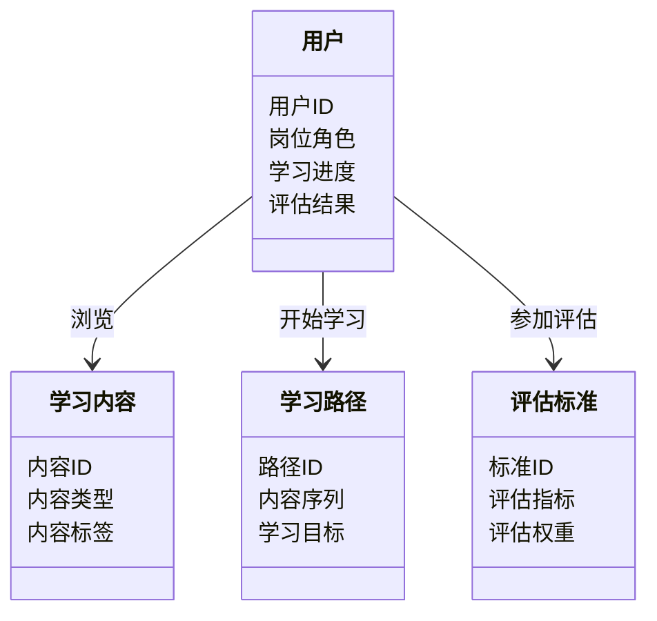

                 


# 构建智能企业合规培训系统：基于角色的个性化学习与评估

## 关键词
- 企业合规培训系统
- 基于角色的学习
- 个性化学习路径
- 自适应评估
- 系统架构设计

## 摘要
随着企业对合规性要求的不断提高，传统的合规培训方式已难以满足个性化和高效性的需求。本文介绍了一种基于角色的个性化学习与评估系统，通过分析合规培训的核心问题，提出了构建智能合规培训系统的解决方案。该系统采用推荐算法和自适应评估机制，为不同角色的用户提供个性化的学习路径和评估方案，从而提高培训效果和效率。文章详细阐述了系统的背景、核心概念、算法原理、系统架构设计以及项目实战，为企业的合规培训提供了创新的思路和实践指导。

---

# 第1章 企业合规培训系统背景与问题分析

## 1.1 企业合规培训的背景

### 1.1.1 合规培训的定义与重要性
合规培训是指为了确保企业员工遵守相关法律法规、行业规范和企业内部政策而进行的培训。随着全球化和数字化的快速发展，企业面临的合规要求日益复杂，合规培训的重要性也逐渐凸显。

### 1.1.2 企业合规培训的现状与挑战
传统的合规培训方式通常采用统一的课程和评估标准，难以满足不同岗位、不同职责员工的个性化需求。此外，培训效果难以量化，员工参与度低，培训成本高等问题也制约了合规培训的效果。

### 1.1.3 基于角色的个性化学习需求
不同岗位的员工在合规培训中的需求差异显著。例如，财务人员需要了解财务合规知识，而法务人员则需要掌握法律合规内容。基于角色的个性化学习能够根据不同岗位的需求，定制专属的学习路径和评估方案。

## 1.2 问题背景与问题描述

### 1.2.1 传统合规培训的痛点
1. **一刀切的课程设计**：忽视了不同岗位员工的个性化需求。
2. **低效的学习体验**：员工难以在有限的时间内掌握所需知识。
3. **难以量化效果**：缺乏有效的评估机制，无法准确衡量培训效果。

### 1.2.2 个性化学习与评估的必要性
1. **提高学习效率**：通过个性化学习路径，员工可以快速掌握核心知识。
2. **增强学习效果**：基于角色的学习内容能够更好地满足员工的实际需求。
3. **量化评估结果**：通过动态评估机制，企业可以更准确地衡量培训效果。

### 1.2.3 系统构建的目标与边界

#### 1.2.3.1 系统目标
1. 构建一个智能化的合规培训平台，支持基于角色的个性化学习。
2. 提供动态调整的学习路径和评估方案，确保培训效果最大化。
3. 实现培训数据的可视化，为企业提供决策支持。

#### 1.2.3.2 系统边界
1. 仅关注企业内部员工的合规培训，不涉及外部培训。
2. 不包括员工绩效评估的其他方面，如技能评估等。

## 1.3 问题解决与系统价值

### 1.3.1 系统如何解决传统问题
1. **个性化学习路径**：根据员工的岗位职责和学习进度，动态调整学习内容。
2. **自适应评估机制**：根据员工的学习表现，实时调整评估标准和内容。
3. **数据驱动的优化**：通过收集和分析学习数据，不断优化学习和评估方案。

### 1.3.2 系统的核心价值与优势
1. **提高学习效率**：通过智能化推荐，减少无效学习时间。
2. **增强学习效果**：针对性的学习内容和评估方案能够更好地满足员工需求。
3. **降低培训成本**：通过数据驱动的优化，减少重复性培训，降低整体成本。

### 1.3.3 系统的适用场景与范围
1. **适用场景**：企业内部员工的合规培训，包括新员工入职培训、岗位晋升培训等。
2. **适用范围**：适用于所有行业，特别是对合规要求较高的金融、法律、医疗等行业。

---

# 第2章 核心概念与系统架构

## 2.1 基于角色的学习模型

### 2.1.1 角色定义与分类
1. **角色定义**：根据员工的岗位职责和权限，将员工划分为不同的角色。
2. **角色分类**：例如，普通员工、管理层、法务人员等。

### 2.1.2 不同角色的学习需求分析
1. **普通员工**：需要掌握基本的合规知识，如公司政策、行为规范等。
2. **管理层**：需要了解更高层次的合规要求，如风险管理、合规策略等。
3. **法务人员**：需要掌握具体的法律法规和合规标准。

### 2.1.3 基于角色的学习内容推荐算法
1. **协同过滤推荐算法**：根据员工的岗位角色和学习历史，推荐相关的内容。
2. **基于内容的推荐算法**：根据学习内容的标签和关键词，推荐相关的内容。

## 2.2 个性化学习路径设计

### 2.2.1 学习路径的设计原则
1. **目标导向**：根据员工的学习目标，设计学习路径。
2. **动态调整**：根据员工的学习进度和表现，实时调整学习路径。

### 2.2.2 基于角色的学习路径规划
1. **初始评估**：通过测试评估员工的知识水平，确定起始学习内容。
2. **动态调整**：根据学习表现，动态调整后续学习内容。

## 2.3 自适应评估机制

### 2.3.1 评估指标的设计
1. **知识掌握度**：通过测试评估员工对知识点的掌握情况。
2. **学习行为分析**：通过分析员工的学习行为，评估其参与度和投入程度。

### 2.3.2 基于表现的评估模型
1. **表现评估模型**：根据员工的学习行为和测试成绩，综合评估其表现。
2. **动态调整评估标准**：根据员工的学习进展，动态调整评估标准。

## 2.4 核心概念对比表

| 对比维度 | 基于角色的学习模型 | 个性化学习路径 | 自适应评估机制 |
|----------|---------------------|-----------------|----------------|
| 定义     | 根据角色推荐学习内容 | 根据需求调整学习路径 | 根据表现动态调整评估标准 |
| 特点     | 高针对性            | 高灵活性         | 高适应性         |
| 优势     | 提高学习效率         | 提高学习效果      | 提高评估准确性     |

## 2.5 系统实体关系图

```mermaid
er
actor: 用户
role: 角色
content: 学习内容
path: 学习路径
assessment: 评估结果
```

---

# 第3章 推荐算法与评估模型

## 3.1 推荐算法原理

### 3.1.1 协同过滤推荐算法

#### 3.1.1.1 算法流程

1. **数据收集**：收集员工的学习历史和偏好。
2. **相似性计算**：计算员工之间的相似性。
3. **推荐内容**：根据相似员工的喜好，推荐学习内容。

#### 3.1.1.2 算法代码示例

```python
def collaborative_filtering(user_id, user_matrix):
    # 计算用户之间的相似性
    similarity = {}
    for user in user_matrix:
        if user != user_id:
            similarity[user] = 1 - abs(user_matrix[user] - user_matrix[user_id]).sum() / len(user_matrix[user])
    # 根据相似性推荐内容
    recommendations = []
    for content in user_matrix[user_id]:
        total = 0
        for similar_user in similarity:
            if content in user_matrix[similar_user]:
                total += similarity[similar_user]
        recommendations.append((content, total))
    return sorted(recommendations, key=lambda x: -x[1])
```

#### 3.1.1.3 数学模型与公式
$$ \text{相似性} = \frac{\sum_{i} |x_i - y_i|}{n} $$

### 3.1.2 基于内容的推荐算法

#### 3.1.2.1 算法流程

1. **内容特征提取**：提取学习内容的特征。
2. **计算相似度**：根据内容特征计算相似度。
3. **推荐内容**：根据相似度推荐内容。

#### 3.1.2.2 算法代码示例

```python
from sklearn.feature_extraction.text import TfidfVectorizer

vectorizer = TfidfVectorizer()
content_features = vectorizer.fit_transform(contents)
```

#### 3.1.2.3 数学模型与公式
$$ \text{相似度} = \frac{\sum_{i} x_i y_i}{\sqrt{\sum_{i} x_i^2} \cdot \sqrt{\sum_{i} y_i^2}} $$

---

## 3.2 评估模型原理

### 3.2.1 基于表现的评估模型

#### 3.2.1.1 算法流程

1. **数据收集**：收集员工的学习行为和测试成绩。
2. **计算表现指标**：根据表现指标计算员工的综合表现。
3. **动态调整评估标准**：根据表现指标动态调整评估标准。

#### 3.2.1.2 算法代码示例

```python
def adaptive_assessment(user_performance, threshold):
    # 动态调整评估标准
    adjusted_threshold = threshold * (1 + user_performance / 100)
    return adjusted_threshold
```

#### 3.2.1.3 数学模型与公式
$$ \text{评估结果} = \text{初始评估标准} \times (1 + \frac{\text{表现指标}}{100}) $$

---

## 3.3 算法实现与优化

### 3.3.1 算法实现

1. **数据预处理**：清洗和归一化数据。
2. **模型训练**：训练推荐算法和评估模型。
3. **模型优化**：通过交叉验证优化模型参数。

### 3.3.2 优化策略

1. **参数调优**：通过网格搜索优化模型参数。
2. **模型融合**：结合协同过滤和基于内容的推荐算法，提高推荐准确率。

---

# 第4章 系统分析与架构设计

## 4.1 问题场景介绍

### 4.1.1 系统目标
构建一个基于角色的个性化学习与评估系统，支持企业员工的合规培训。

### 4.1.2 系统范围
仅关注企业内部员工的合规培训，不涉及外部培训。

## 4.2 系统功能设计

### 4.2.1 领域模型类图



## 4.3 系统架构设计

### 4.3.1 系统架构图

```mermaid
containerDiagram
    客户端 --> 服务端: 请求
    服务端 --> 数据库: 查询
    服务端 --> 推荐算法: 计算推荐
    服务端 --> 评估算法: 计算评估
```

### 4.3.2 系统接口设计

1. **用户登录接口**：用户通过用户名和密码登录系统。
2. **内容推荐接口**：根据用户角色推荐学习内容。
3. **评估接口**：根据用户表现动态调整评估标准。

### 4.3.3 系统交互流程

1. **登录流程**：用户登录系统，系统根据用户角色推荐学习内容。
2. **学习流程**：用户开始学习，系统根据学习进度动态调整学习路径。
3. **评估流程**：用户完成学习后，系统根据表现动态调整评估标准。

---

## 4.4 本章小结

---

# 第5章 项目实战

## 5.1 环境安装与配置

### 5.1.1 安装Python
- 使用Anaconda安装Python 3.8以上版本。

### 5.1.2 安装依赖库
- 使用pip安装Flask、MongoDB、scikit-learn等依赖库。

## 5.2 核心代码实现

### 5.2.1 推荐算法实现

```python
from flask import Flask, jsonify
from sklearn.metrics.pairwise import cosine_similarity

app = Flask(__name__)

@app.route('/recommend', methods=['POST'])
def recommend():
    data = request.json
    user_id = data['user_id']
    user_matrix = get_user_matrix()
    user_profile = user_matrix[user_id]
    similarity = cosine_similarity([user_profile], user_matrix)
    similar_users = similarity.argsort()[0][::-1][1:6]
    recommended_contents = []
    for user in similar_users:
        recommended_contents.extend(user_matrix[user].keys())
    return jsonify({'recommendations': list(set(recommended_contents))})
```

### 5.2.2 评估算法实现

```python
from flask import Flask, jsonify
from sklearn.metrics import accuracy_score

app = Flask(__name__)

@app.route('/assess', methods=['POST'])
def assess():
    data = request.json
    user_performance = data['performance']
    threshold = data['threshold']
    adjusted_threshold = threshold * (1 + user_performance / 100)
    return jsonify({'adjusted_threshold': adjusted_threshold})
```

## 5.3 代码功能解读与分析

### 5.3.1 推荐算法代码解读
- **数据输入**：用户ID和用户矩阵。
- **相似性计算**：使用余弦相似度计算用户之间的相似性。
- **推荐内容**：根据相似用户的偏好推荐内容。

### 5.3.2 评估算法代码解读
- **数据输入**：用户表现和评估阈值。
- **动态调整**：根据用户表现调整评估阈值。

## 5.4 实际案例分析与详细讲解

### 5.4.1 实际案例
某金融企业需要对法务人员进行合规培训，系统根据法务人员的岗位角色推荐相关法律法规内容，并根据其学习表现动态调整评估标准。

### 5.4.2 详细讲解
1. **需求分析**：明确法务人员的合规培训需求。
2. **系统设计**：设计基于角色的学习路径和自适应评估机制。
3. **实施步骤**：安装环境、实现推荐算法和评估算法、测试和优化系统。

---

## 5.5 项目小结

---

# 第6章 最佳实践与总结

## 6.1 小结

### 6.1.1 核心内容总结
本文详细介绍了构建智能企业合规培训系统的背景、核心概念、算法原理、系统架构设计以及项目实战。通过基于角色的个性化学习与评估机制，系统能够有效提高培训效果和效率。

## 6.2 注意事项

### 6.2.1 系统安全
确保系统数据的安全性，防止数据泄露和恶意攻击。

### 6.2.2 数据隐私
遵守相关法律法规，保护员工的隐私信息。

## 6.3 拓展阅读

### 6.3.1 推荐算法优化
可以进一步优化推荐算法，例如结合深度学习模型提高推荐准确率。

### 6.3.2 系统扩展
可以将系统扩展到更多场景，例如员工绩效评估、团队培训等。

---

# 附录

## 附录A API文档

### A.1 系统接口

1. **推荐接口**
   - 请求方式：POST
   - 请求参数：user_id
   - 响应：推荐内容列表

2. **评估接口**
   - 请求方式：POST
   - 请求参数：performance, threshold
   - 响应：调整后的评估阈值

## 附录B 参考文献

1. 《机器学习实战》
2. 《深入浅出协同过滤推荐算法》
3. 《基于角色的个性化学习系统设计》

---

# 作者

作者：AI天才研究院/AI Genius Institute & 禅与计算机程序设计艺术/Zen And The Art of Computer Programming

---

希望这篇博客文章的内容能够满足您的要求！如果需要进一步调整或补充，请随时告知。

