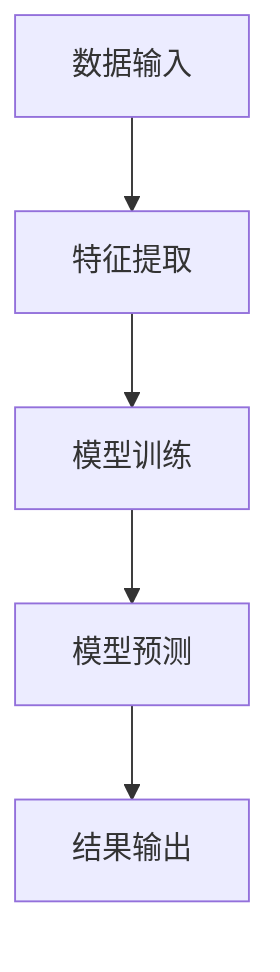

                 


# 构建智能企业合规监控系统：实时违规检测与自动报告生成

> 关键词：企业合规监控，实时违规检测，自动报告生成，智能监控系统，数据安全，合规管理，系统架构设计

> 摘要：本文将详细探讨如何构建一个智能企业合规监控系统，重点介绍实时违规检测与自动报告生成的核心技术与实现方案。通过分析系统背景、设计原理、算法实现、系统架构及项目实战，全面解析构建智能合规监控系统的各个方面，为企业合规管理提供理论与实践指导。

---

## 第1章：企业合规监控系统背景与需求

### 1.1 合规监控的重要性
- **1.1.1 企业合规的基本概念**：介绍企业合规的定义、范围及其在现代企业中的重要性。
- **1.1.2 合规监控的核心目标**：分析合规监控的主要目标，包括风险控制、法律遵循等。
- **1.1.3 智能化合规监控的必要性**：探讨传统合规监控的局限性，引出智能化监控的必要性。

### 1.2 智能企业合规监控系统的需求分析
- **1.2.1 传统合规监控的痛点**：分析传统合规监控在效率、准确性等方面的不足。
- **1.2.2 智能化合规监控的优势**：阐述智能化监控在实时性、精准性、自动化等方面的优势。
- **1.2.3 企业对实时违规检测的需求**：分析企业在合规监控中对实时检测的具体需求。
- **1.2.4 自动报告生成的业务价值**：探讨自动报告生成对企业管理效率提升的价值。

### 1.3 本章小结
总结本章内容，强调构建智能企业合规监控系统的必要性和重要性。

---

## 第2章：智能企业合规监控系统的核心概念

### 2.1 合规监控系统的关键组成部分
- **2.1.1 数据采集模块**：介绍数据采集模块的功能、实现方式及其在系统中的作用。
- **2.1.2 违规检测模块**：详细讲解违规检测模块的核心功能和实现方法。
- **2.1.3 报告生成模块**：分析报告生成模块的设计思路和实现流程。
- **2.1.4 系统管理模块**：探讨系统管理模块的功能及其在系统运行中的作用。

### 2.2 实时违规检测的原理
- **2.2.1 数据流的实时处理**：介绍实时数据流处理的基本原理和实现方式。
- **2.2.2 违规检测算法的分类**：分析常见违规检测算法的分类及其特点。
- **2.2.3 检测结果的反馈机制**：探讨检测结果的反馈机制及其对系统优化的意义。

### 2.3 自动报告生成的流程
- **2.3.1 报告模板的设计**：介绍报告模板设计的原则和方法。
- **2.3.2 数据抽取与分析**：分析数据抽取与分析的具体实现步骤。
- **2.3.3 报告自动生成与分发**：探讨报告自动生成与分发的实现流程及其优化方法。

### 2.4 本章小结
总结本章内容，强调系统各部分之间的协同作用。

---

## 第3章：实时违规检测算法原理

### 3.1 常见违规检测算法介绍
- **3.1.1 基于规则的检测算法**：介绍基于规则的检测算法的基本原理及其优缺点。
- **3.1.2 基于统计的检测算法**：分析基于统计的检测算法的实现方法及其应用场景。
- **3.1.3 基于机器学习的检测算法**：探讨基于机器学习的检测算法，包括监督学习和无监督学习。
- **3.1.4 基于深度学习的检测算法**：分析基于深度学习的检测算法及其在实际中的应用。

### 3.2 基于监督学习的违规检测模型
- **3.2.1 数据标注与特征提取**：介绍数据标注的过程及特征提取的方法。
- **3.2.2 模型训练与优化**：分析模型训练的过程、优化方法及其对检测准确率的影响。
- **3.2.3 模型评估与调优**：探讨模型评估的指标及其调优方法。

### 3.3 算法实现的数学模型
- **3.3.1 线性回归模型**：介绍线性回归模型的数学表达式及其在违规检测中的应用。
  $$ y = \beta_0 + \beta_1x + \epsilon $$
- **3.3.2 支持向量机模型**：分析支持向量机模型的数学表达式及其在分类问题中的应用。
  $$ \text{maximize} \quad \frac{1}{2}\|w\|^2 $$
  $$ \text{subject to} \quad y_i(w \cdot x_i + b) \geq 1 $$
- **3.3.3 神经网络模型**：探讨神经网络模型的数学表达式及其在深度学习中的应用。
  $$ y = \sigma(w x + b) $$
  其中，$\sigma$ 表示激活函数。

### 3.4 算法流程图
使用 mermaid 绘制算法流程图：


### 3.5 本章小结
总结本章内容，强调不同算法的优缺点及其适用场景。

---

## 第4章：自动报告生成系统设计

### 4.1 报告生成模块的功能设计
- **4.1.1 数据抽取与处理**：介绍数据抽取的过程及处理方法。
- **4.1.2 报告模板的设计与管理**：分析报告模板设计的原则及管理方法。
- **4.1.3 自动生成与格式化**：探讨报告自动生成的实现方法及其格式化技巧。

### 4.2 报告生成的实现流程
- **4.2.1 数据源的选择与整合**：介绍数据源选择的原则及整合方法。
- **4.2.2 数据分析与处理**：分析数据分析的过程及处理方法。
- **4.2.3 报告内容生成与输出**：探讨报告内容生成的实现步骤及其输出方式。

### 4.3 报告生成的算法实现
- **4.3.1 基于规则的报告生成算法**：介绍基于规则的报告生成算法及其实现步骤。
- **4.3.2 基于模板的报告生成算法**：分析基于模板的报告生成算法及其应用场景。

### 4.4 本章小结
总结本章内容，强调报告生成模块的重要性及其在系统中的作用。

---

## 第5章：系统架构设计与实现

### 5.1 系统架构设计
- **5.1.1 系统功能设计**：介绍系统的功能模块及其相互关系。
- **5.1.2 系统架构设计图**：使用 mermaid 绘制系统架构设计图。
  ```mermaid
  graph TD
      A[数据采集模块] --> B[违规检测模块]
      B --> C[报告生成模块]
      C --> D[系统管理模块]
  ```

### 5.2 系统接口设计
- **5.2.1 系统接口设计原则**：介绍系统接口设计的原则及其重要性。
- **5.2.2 系统接口实现**：分析系统接口的具体实现方法及其注意事项。

### 5.3 系统交互设计
- **5.3.1 系统交互流程图**：使用 mermaid 绘制系统交互流程图。
  ```mermaid
  graph TD
      A[用户输入] --> B[数据处理模块]
      B --> C[违规检测模块]
      C --> D[报告生成模块]
      D --> E[报告输出]
  ```

### 5.4 本章小结
总结本章内容，强调系统架构设计在构建智能企业合规监控系统中的重要性。

---

## 第6章：项目实战与优化

### 6.1 项目环境搭建
- **6.1.1 环境安装与配置**：介绍项目环境搭建的具体步骤及其注意事项。
- **6.1.2 开发工具选择**：分析开发工具的选择原则及其对项目开发的影响。

### 6.2 核心代码实现
- **6.2.1 数据采集模块实现**：提供数据采集模块的核心代码并进行详细解读。
- **6.2.2 违规检测模块实现**：分析违规检测模块的核心代码及其实现方法。
- **6.2.3 报告生成模块实现**：介绍报告生成模块的核心代码及其实现流程。

### 6.3 实际案例分析
- **6.3.1 案例背景介绍**：介绍实际案例的背景及其重要性。
- **6.3.2 案例分析与实现**：分析实际案例的实现过程及其优化方法。
- **6.3.3 案例总结**：总结实际案例的实现成果及其对企业的价值。

### 6.4 本章小结
总结本章内容，强调项目实战对理论知识的应用和验证。

---

## 第7章：总结与展望

### 7.1 本章总结
- 回顾全文，总结智能企业合规监控系统的核心内容及其重要性。

### 7.2 未来展望
- 探讨智能企业合规监控系统未来的发展方向及其潜在的技术突破。

### 7.3 最佳实践 tips
- 提供一些实际操作中的经验和建议，帮助读者更好地构建智能企业合规监控系统。

### 7.4 本章小结
总结本章内容，强调构建智能企业合规监控系统的重要性和未来的发展潜力。

---

## 作者：AI天才研究院/AI Genius Institute & 禅与计算机程序设计艺术 /Zen And The Art of Computer Programming

