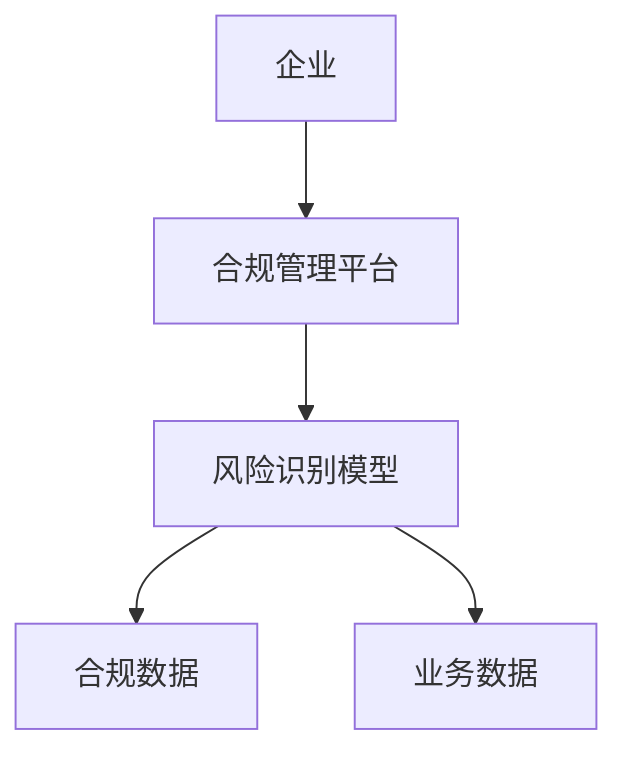
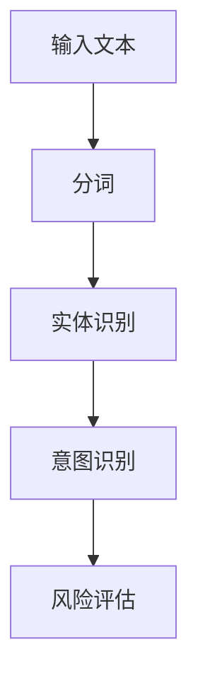
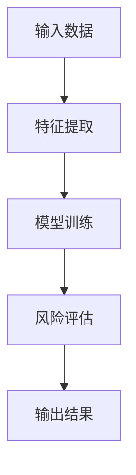

                 

# 构建智能企业合规管理平台：AI辅助风险识别

> 关键词：企业合规管理、AI辅助、风险识别、智能平台、系统架构

> 摘要：随着企业合规管理需求的不断增加，传统的合规管理方式逐渐显现出效率低下、覆盖面不足等问题。通过引入人工智能技术，构建智能企业合规管理平台，能够实现对合规风险的智能化识别和评估，从而提高企业合规管理的效率和准确性。本文将详细探讨如何利用AI技术构建智能企业合规管理平台，重点分析AI在风险识别中的应用，包括算法原理、系统架构设计以及实际项目实现等。

---

# 第1章: 企业合规管理概述

## 1.1 合规管理的基本概念

### 1.1.1 合规管理的定义与内涵
合规管理是指企业为确保其经营行为符合相关法律法规、行业标准和企业内部规章制度而进行的一系列管理活动。合规管理的核心目标是降低企业经营风险，避免因违规行为导致的法律纠纷和经济损失。

### 1.1.2 企业合规管理的重要性
在当前全球化和数字化的背景下，企业面临的合规要求日益繁多，合规管理的重要性愈发凸显。有效的合规管理不仅能够帮助企业规避法律风险，还能提升企业的声誉和市场竞争力。

### 1.1.3 构建智能合规管理平台的意义
传统的合规管理主要依赖人工审查和手动记录，效率低下且容易出现疏漏。通过引入人工智能技术，构建智能合规管理平台能够实现对海量数据的自动分析和风险识别，显著提高合规管理的效率和准确性。

---

## 1.2 企业合规管理的核心要素

### 1.2.1 合规义务与责任分配
合规义务包括法律法规要求、行业标准、企业内部规章制度等多个方面。合规管理需要明确各部门和岗位的合规责任，确保合规义务得到有效落实。

### 1.2.2 合规风险的识别与评估
合规风险是指企业在经营活动中可能违反相关法律法规或内部规章制度而导致的法律风险。合规风险的识别与评估是合规管理的核心环节，需要结合企业的实际情况进行动态调整。

### 1.2.3 合规管理的流程与方法
合规管理的流程通常包括风险识别、风险评估、风险控制、监控与改进等环节。通过建立科学的合规管理流程，企业能够系统化地应对合规风险。

---

## 1.3 AI在企业合规管理中的作用

### 1.3.1 AI技术如何辅助合规管理
人工智能技术在合规管理中的应用主要体现在数据处理、模式识别、自然语言处理等方面。通过AI技术，企业可以实现合规数据的自动化采集、分析和报告生成。

### 1.3.2 AI在风险识别中的优势
AI技术能够快速处理大量数据，识别潜在的合规风险，帮助企业在风险发生前采取预防措施。相比于传统的人工审查，AI的风险识别更加高效和精准。

### 1.3.3 构建智能合规管理平台的意义
通过构建智能合规管理平台，企业能够实现合规管理的自动化和智能化，降低合规成本，提高合规管理的效率和效果。

---

## 1.4 本章小结
本章从企业合规管理的基本概念、核心要素以及AI在其中的作用三个方面进行了详细阐述。合规管理是企业降低经营风险、提升竞争力的重要手段，而AI技术的应用为合规管理的智能化提供了有力支持。

---

# 第2章: AI辅助风险识别的核心概念与联系

## 2.1 合规风险识别的原理

### 2.1.1 风险识别的定义与方法
风险识别是指通过系统化的方法，识别企业经营活动中可能存在的各种风险。合规风险识别需要结合企业的业务特点和合规要求，采用定性和定量相结合的方法进行。

### 2.1.2 AI在风险识别中的核心原理
AI技术通过机器学习、自然语言处理等技术，能够从大量的文本、数据中提取关键信息，识别潜在的合规风险。AI的风险识别过程通常包括数据采集、特征提取、模型训练和风险评估等步骤。

### 2.1.3 风险识别的流程与模型
AI辅助风险识别的流程通常包括数据预处理、特征提取、模型训练、风险评估和结果分析等步骤。常用的模型包括支持向量机（SVM）、随机森林（Random Forest）和深度学习模型等。

---

## 2.2 核心概念对比分析

### 2.2.1 合规风险与业务风险的对比
合规风险是指企业在经营活动中可能违反相关法律法规或内部规章制度而导致的法律风险，而业务风险是指企业在经营活动中可能面临的各种不确定性因素导致的经济损失。两者虽然有区别，但在实际管理中常常相互关联。

### 2.2.2 AI模型与传统规则引擎的对比
传统规则引擎是基于预定义的规则进行判断，而AI模型能够通过学习数据自动生成规则，具有更强的适应性和灵活性。AI模型在处理复杂和模糊问题时表现更为出色。

### 2.2.3 风险识别的准确性与效率对比
AI模型在风险识别的准确性和效率上通常优于传统规则引擎，尤其是在处理海量数据和复杂场景时，AI的优势更加明显。

---

## 2.3 系统实体关系图

---

## 2.4 本章小结
本章重点分析了AI辅助风险识别的核心概念与联系，包括风险识别的原理、AI模型的优势以及系统实体关系图。通过AI技术，企业能够更高效地识别和管理合规风险。

---

# 第3章: AI辅助风险识别的算法原理

## 3.1 自然语言处理在合规文本分析中的应用

### 3.1.1 NLP技术简介
自然语言处理（NLP）是人工智能的核心技术之一，主要用于处理和分析人类语言。在合规管理中，NLP技术可以用于合同审查、政策解读等场景。

### 3.1.2 常见的NLP模型与工具
常用的NLP模型包括词袋模型（Bag of Words）、TF-IDF、Word2Vec、BERT等。NLP工具则包括 spaCy、NLTK、HanLP 等。

### 3.1.3 NLP在合规文本分析中的流程
合规文本分析的流程通常包括文本预处理、分词、实体识别、情感分析和风险评估等步骤。以下是合规文本分析的流程图：

---

## 3.2 机器学习模型在风险识别中的应用

### 3.2.1 机器学习的基本原理
机器学习是一种通过数据训练模型的技术，能够从数据中学习规律并进行预测。常用的机器学习算法包括线性回归、支持向量机、随机森林、神经网络等。

### 3.2.2 常见的机器学习算法
- **支持向量机（SVM）**：适用于分类问题，具有良好的泛化能力。
- **随机森林（Random Forest）**：适用于分类和回归问题，具有较强的鲁棒性。
- **神经网络（Neural Network）**：适用于复杂的数据模式识别，尤其是深度学习模型（如CNN、RNN）在处理非结构化数据时表现优异。

### 3.2.3 基于机器学习的风险识别模型
以下是基于机器学习的风险识别模型的流程图：

---

## 3.3 本章小结
本章详细介绍了自然语言处理和机器学习在合规风险识别中的应用，包括NLP技术、常见机器学习算法以及风险识别模型的流程图。通过AI技术，企业能够更高效地进行合规风险识别和管理。

---

接下来，我将继续按照目录大纲的结构，撰写后续章节的内容。通过详细阐述每个部分，确保文章内容完整且符合技术深度的要求。

