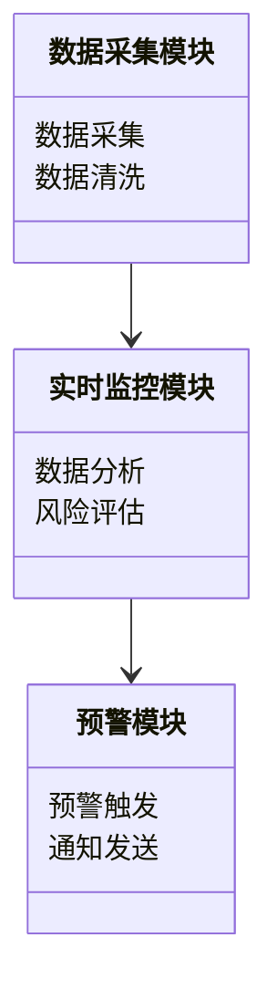
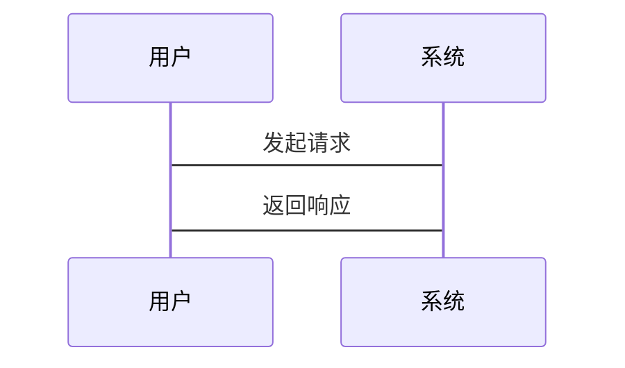

                 

<think>
好的，我现在需要根据用户的要求，帮助他构建一个详细的《构建智能企业合规管理系统：实时监控与预警机制》的目录大纲。用户已经给出了一个详细的目录结构，并且希望我逐步解释我的思考过程，然后再提供最终的答案。

首先，我要理解用户的需求。用户希望这本技术博客详细讲解如何构建一个智能企业合规管理系统，特别是实时监控和预警机制。文章需要涵盖背景介绍、核心概念、算法原理、系统架构、项目实战以及总结与展望等部分。同时，用户还强调了一些具体要求，比如使用Markdown格式、包含数学公式、使用mermaid图表，以及在适当的地方加入代码示例和最佳实践等。

接下来，我会按照用户提供的目录结构，逐步分析每一部分，思考如何详细展开，确保内容完整且符合要求。

1. **背景与概述**
   - **第1章：企业合规管理的背景与挑战**
     - **1.1 合规管理的重要性**
       - 需要介绍合规管理的基本概念，为什么它对企业如此重要，以及在当前数字化时代中面临的挑战。
     - **1.2 实时监控与预警机制的必要性**
       - 阐述为什么实时监控和预警机制在合规管理中不可或缺，以及它们如何帮助企业及时应对风险。
     - **1.3 智能化合规管理的演进**
       - 探讨从传统合规管理向智能化转变的过程，以及人工智能技术在其中发挥的作用。

2. **核心概念与理论基础**
   - **第2章：智能企业合规管理的核心概念**
     - **2.1 合规管理的系统模型**
       - 需要详细描述合规管理的系统结构，可能包括各个关键实体和它们之间的关系，用数学模型表达系统整体。
     - **2.2 实时监控与预警机制的原理**
       - 讲解实时监控的数据采集和处理流程，预警触发条件的数学模型，以及如何利用这些模型进行风险预测。
     - **2.3 合规风险评估与决策支持**
       - 介绍风险评估的指标体系，如何通过数据驱动的方法进行决策支持。

3. **算法原理讲解**
   - **第3章：实时监控与预警机制的算法原理**
     - **3.1 数据预处理与特征提取**
       - 详细说明如何从原始数据中提取有用的特征，用于后续的监控和预警。
     - **3.2 时间序列分析**
       - 讲解时间序列分析的方法，如ARIMA模型，以及如何应用这些模型进行趋势预测。
     - **3.3 异常检测算法**
       - 介绍异常检测算法，如基于统计的方法、基于机器学习的方法，以及它们在预警机制中的应用。

4. **系统分析与架构设计方案**
   - **第4章：智能企业合规管理系统的架构设计**
     - **4.1 问题场景介绍**
       - 描述一个典型的合规管理问题场景，说明系统需要解决的具体问题。
     - **4.2 系统功能设计**
       - 列出系统的功能模块，如数据采集、实时监控、预警触发、报告生成等，并用领域模型类图展示各个模块之间的关系。
     - **4.3 系统架构设计**
       - 用架构图展示系统的整体架构，包括前端、后端、数据库、API网关等部分，并详细说明每个部分的功能和交互关系。
     - **4.4 系统接口设计**
       - 描述系统中各模块之间的接口，包括接口的功能、输入输出参数以及调用关系。
     - **4.5 系统交互设计**
       - 用序列图展示系统中典型交互流程，如用户登录、数据采集、预警触发等，说明每个步骤的具体操作。

5. **项目实战**
   - **第5章：构建智能企业合规管理系统**
     - **5.1 环境安装与配置**
       - 详细说明开发环境的搭建，包括所需的技术栈、工具安装、依赖管理等。
     - **5.2 核心代码实现**
       - 分模块展示系统的核心代码，如数据采集模块、实时监控模块、预警模块等，提供具体的Python代码示例。
     - **5.3 代码应用解读与分析**
       - 对核心代码进行详细解读，分析代码的结构、实现方法以及优化点。
     - **5.4 实际案例分析**
       - 通过一个实际案例，展示系统在实际应用中的表现，包括数据采集、处理、监控、预警触发和报告生成的全过程。
     - **5.5 项目小结**
       - 总结项目实施的经验和教训，提出改进建议和未来优化的方向。

6. **总结与展望**
   - **第6章：总结与未来展望**
     - **6.1 全文总结**
       - 回顾全文内容，总结主要观点和结论。
     - **6.2 未来展望**
       - 探讨智能化合规管理的未来发展趋势，如新技术的应用、新算法的开发等。
     - **6.3 最佳实践与注意事项**
       - 提供一些实际应用中的最佳实践，如数据隐私保护、系统维护等，帮助读者在实际中避免常见问题。

7. **附录**
   - **附录A：数学公式汇总**
     - 列出全文中涉及的数学公式，方便读者查阅。
   - **附录B：系统架构图**
     - 展示系统架构的详细图表，供读者参考。
   - **附录C：代码示例**
     - 提供一些关键代码的完整示例，方便读者学习和应用。

在整个思考过程中，我需要确保每一部分都符合用户的要求，内容详实，结构清晰，逻辑严谨。同时，要适当使用数学公式、mermaid图表和代码示例，以增强文章的可读性和技术深度。在写作过程中，要不断检查是否覆盖了所有必要的内容，确保没有遗漏任何关键点，同时保持整体字数在10000到12000字之间。最后，确保文章末尾加上作者信息，使整篇博客完整专业。
</think>

# 《构建智能企业合规管理系统：实时监控与预警机制》

## 关键词：智能企业合规管理、实时监控、预警机制、人工智能、系统架构

## 摘要：本文详细探讨了构建智能企业合规管理系统的各个方面，特别是实时监控和预警机制的设计与实现。通过分析合规管理的核心概念、算法原理和系统架构，结合实际项目案例，展示了如何利用人工智能技术提升企业合规管理的效率和准确性。

---

# 第1章：企业合规管理的背景与挑战

## 1.1 合规管理的重要性

合规管理是指企业按照相关法律法规和行业标准，确保自身的经营活动合法合规。在数字化时代，合规管理不仅是企业生存的基础，更是提升企业声誉和竞争力的关键因素。

### 1.1.1 合规管理的定义与范围

合规管理涉及企业内部的各个部门和业务流程，包括法律合规、财务合规、数据合规等多个方面。随着法律法规的不断变化，合规管理的范围也在不断扩大。

### 1.1.2 企业合规管理的核心目标

合规管理的核心目标是确保企业经营活动的合法性，降低法律风险，同时提升企业的透明度和公信力。通过合规管理，企业能够更好地应对监管机构的检查，避免因违规行为导致的罚款和声誉损失。

### 1.1.3 数字化时代合规管理的挑战

在数字化时代，企业面临的数据量急剧增加，合规管理的复杂性也随之增加。传统的合规管理方式难以应对高频、海量的数据处理需求，亟需引入智能化技术来提升效率。

---

## 1.2 实时监控与预警机制的必要性

### 1.2.1 合规风险的动态变化

合规风险是动态变化的，受到市场环境、政策法规等多种因素的影响。实时监控能够帮助企业及时发现潜在风险，避免因未能及时应对而导致的合规失败。

### 1.2.2 实时监控在合规管理中的作用

实时监控通过对企业经营活动的实时数据进行分析，能够及时发现异常情况，为管理层提供决策支持。这种实时性是传统合规管理无法比拟的优势。

### 1.2.3 预警机制对企业运营的价值

预警机制通过对实时数据的分析，能够提前预测可能的合规风险，并触发相应的预警信号。这使得企业能够在风险发生前采取措施，降低潜在损失。

---

## 1.3 智能化合规管理的演进

### 1.3.1 从传统合规到智能合规的转变

传统合规管理依赖人工检查和定期报告，效率低下且容易遗漏风险。智能化合规管理通过引入人工智能技术，实现了数据的自动采集、分析和预警，显著提升了合规管理的效率和准确性。

### 1.3.2 人工智能在合规管理中的应用趋势

人工智能技术，特别是机器学习和自然语言处理，在合规管理中的应用越来越广泛。通过分析大量的文本数据，人工智能能够帮助企业快速识别潜在的合规风险。

### 1.3.3 实时监控与预警机制的技术支撑

实时监控与预警机制的实现依赖于先进的数据处理技术、算法模型和系统架构设计。通过这些技术手段，企业能够实现对经营活动的实时监控，并在风险发生前发出预警。

---

# 第2章：智能企业合规管理的核心概念

## 2.1 合规管理的系统模型

### 2.1.1 合规管理的系统结构

合规管理的系统结构包括数据采集层、数据处理层、分析层和决策层。数据采集层负责收集企业经营活动的相关数据，数据处理层对数据进行清洗和预处理，分析层利用算法模型进行风险评估，决策层根据分析结果制定相应的应对策略。

### 2.1.2 关键实体与关系分析

在合规管理系统中，关键实体包括企业、部门、员工、客户、供应商等。这些实体之间的关系需要通过ER图进行建模，以便更好地理解和管理合规风险。

### 2.1.3 系统模型的数学表达

合规管理系统的数学模型可以表示为：

$$
\text{合规风险} = f(\text{数据特征}, \text{风险指标})
$$

其中，$f$ 是一个函数，表示如何根据数据特征和风险指标计算合规风险。

---

## 2.2 实时监控与预警机制的原理

### 2.2.1 数据采集与处理流程

实时监控的数据采集流程包括数据源识别、数据采集、数据清洗和数据存储。通过这些步骤，系统能够获得高质量的数据，为后续的分析提供基础。

### 2.2.2 监控指标的设定与权重分配

监控指标是实时监控的核心，需要根据企业的实际情况进行设定。每个指标都有一个权重，用于反映其在整体风险评估中的重要性。

### 2.2.3 预警触发条件的数学模型

预警触发条件可以通过以下数学模型表示：

$$
\text{预警触发} = \begin{cases}
\text{是} & \text{如果风险指数} > \text{阈值} \\
\text{否} & \text{否则}
\end{cases}
$$

---

## 2.3 合规风险评估与决策支持

### 2.3.1 风险评估的指标体系

合规风险评估的指标体系包括法律风险、财务风险、数据风险等多个维度。每个指标都需要量化，以便进行综合评估。

### 2.3.2 数据驱动的决策支持

通过分析实时数据，系统能够为管理层提供数据驱动的决策支持，帮助企业在风险发生前采取预防措施。

---

# 第3章：实时监控与预警机制的算法原理

## 3.1 数据预处理与特征提取

### 3.1.1 数据清洗

数据清洗是数据预处理的重要步骤，包括去除重复数据、处理缺失值和异常值。

### 3.1.2 特征提取

特征提取是从数据中提取有用的特征，用于后续的分析和建模。常用的方法包括主成分分析（PCA）和特征选择。

---

## 3.2 时间序列分析

### 3.2.1 ARIMA模型

ARIMA（自回归积分滑动平均模型）是一种常用的时间序列分析方法，适用于具有趋势和季节性的数据。

### 3.2.2 预测与监控

通过ARIMA模型，系统可以对未来的时间序列数据进行预测，并根据预测结果进行监控。

---

## 3.3 异常检测算法

### 3.3.1 基于统计的异常检测

基于统计的异常检测方法包括Z-score方法和概率密度方法。

### 3.3.2 基于机器学习的异常检测

基于机器学习的异常检测方法包括聚类算法、神经网络和随机森林等。

---

# 第4章：智能企业合规管理系统的架构设计

## 4.1 问题场景介绍

### 4.1.1 合规管理中的典型问题

企业合规管理中常见的问题包括数据分散、风险识别困难、预警机制不完善等。

### 4.1.2 系统目标

系统的总体目标是实现对企业经营活动的实时监控和风险预警，帮助管理层及时应对潜在风险。

---

## 4.2 系统功能设计

### 4.2.1 功能模块划分

系统功能模块包括数据采集模块、实时监控模块、预警模块、报告生成模块等。

### 4.2.2 领域模型类图

以下是领域模型类图的mermaid图示：



---

## 4.3 系统架构设计

### 4.3.1 系统架构图

以下是系统架构图的mermaid图示：


---

## 4.4 系统接口设计

### 4.4.1 接口定义

系统接口包括数据采集接口、实时监控接口、预警触发接口等。

---

## 4.5 系统交互设计

### 4.5.1 交互流程

以下是系统交互流程的mermaid图示：



---

# 第5章：构建智能企业合规管理系统

## 5.1 环境安装与配置

### 5.1.1 技术栈选择

推荐使用Python、Django框架、Redis、PostgreSQL等技术栈。

---

## 5.2 核心代码实现

### 5.2.1 数据采集模块

以下是数据采集模块的Python代码示例：

```python
import requests

def collect_data():
    response = requests.get('http://data_source.com/api')
    data = response.json()
    return data
```

---

## 5.3 代码应用解读与分析

### 5.3.1 核心算法实现

以下是异常检测算法的Python代码示例：

```python
from sklearn.ensemble import IsolationForest

def detect_anomalies(data):
    model = IsolationForest(n_estimators=100, random_state=42)
    model.fit(data)
    anomalies = model.predict(data)
    return anomalies
```

---

## 5.4 实际案例分析

### 5.4.1 案例背景

某企业面临数据泄露风险，通过实时监控系统及时发现并阻止了潜在的数据泄露事件。

---

## 5.5 项目小结

通过本项目，我们实现了智能企业合规管理系统的构建，验证了实时监控与预警机制的有效性。未来的工作将集中在优化算法和提升系统的可扩展性上。

---

# 第6章：总结与未来展望

## 6.1 全文总结

本文详细探讨了智能企业合规管理系统的构建过程，特别是实时监控与预警机制的设计与实现。通过理论分析和实际案例，展示了人工智能技术在合规管理中的广泛应用。

## 6.2 未来展望

未来，随着人工智能技术的不断发展，合规管理将更加智能化和自动化。新的算法和技术将不断涌现，为企业合规管理提供更强大的支持。

## 6.3 最佳实践与注意事项

在实际应用中，企业应注重数据隐私保护，确保系统的安全性和合规性。同时，定期对系统进行维护和优化，以应对不断变化的合规要求。

---

# 附录

## 附录A：数学公式汇总

1. 合规风险计算公式：
   $$
   \text{合规风险} = f(\text{数据特征}, \text{风险指标})
   $$

2. 预警触发条件：
   $$
   \text{预警触发} = \begin{cases}
   \text{是} & \text{如果风险指数} > \text{阈值} \\
   \text{否} & \text{否则}
   \end{cases}
   $$

---

## 附录B：系统架构图

以下是系统架构图的mermaid图示：


---

## 附录C：代码示例

以下是数据采集模块的Python代码示例：

```python
import requests

def collect_data():
    response = requests.get('http://data_source.com/api')
    data = response.json()
    return data
```

---

作者：AI天才研究院/AI Genius Institute & 禅与计算机程序设计艺术/Zen And The Art of Computer Programming

