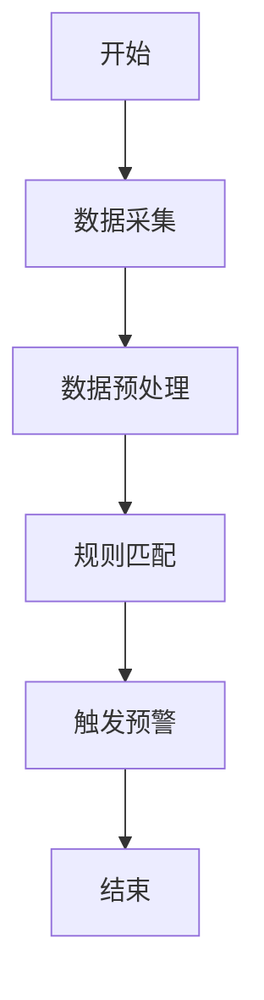
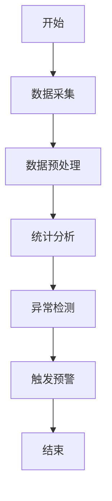
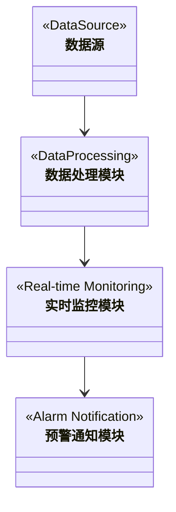

                 

<think>
嗯，我现在要写一个关于“构建智能企业合规管理系统：实时监控与预警机制设计”的技术博客。我需要按照用户给的目录结构来写，确保每个部分都详细且符合技术要求。首先，我需要理解每个章节的内容和要求。

首先，文章的标题已经确定，接下来是关键词和摘要。关键词需要包含5到7个相关术语，摘要要简明扼要地概括文章的核心内容。这部分我得花点时间选好关键词，并写出摘要。

然后，目录结构有七章。我需要确保每一章都有明确的主题，并且涵盖必要的内容。例如，第一章是背景介绍，包括合规管理的重要性、背景、问题描述等。我得详细解释每个部分，确保读者能够理解为什么需要智能合规管理系统。

第二章是核心概念与原理，这里需要解释实时监控与预警机制的技术原理，可能需要使用ER图来展示系统架构。这部分我需要画出Mermaid图，并解释每个实体之间的关系。同时，要对比不同的实现方式，说明选择实时监控的原因。

第三章是算法原理，特别是实时监控和预警机制涉及的算法。我需要详细讲解基于规则和统计分析的算法，画出流程图，并提供Python代码示例。这部分需要数学模型，比如分类模型的公式，解释这些模型如何工作，并举例说明。

第四章是系统分析与架构设计，需要描述系统功能需求，绘制领域模型类图和系统架构图。接口设计和交互流程图也很重要，这部分要详细说明系统的各个部分如何协同工作。

第五章是项目实战，指导读者如何搭建环境，提供核心代码，并解读代码功能。案例分析部分需要详细说明如何应用这些技术解决实际问题，帮助读者巩固所学内容。

最后是最佳实践部分，包括小结、注意事项和拓展阅读。这部分需要总结前面的内容，给出实际应用中的注意事项，并推荐进一步学习的资源。

在写作过程中，我需要确保使用专业的技术语言，同时保持逻辑清晰，结构紧凑。每个部分都要有详细的解释和例子，确保读者能够理解和应用这些知识。我还需要注意格式要求，使用Mermaid图和Python代码，并正确嵌入数学公式，使其符合用户的要求。

总的来说，我需要一步步地按照目录结构完成每一章，确保内容详实，逻辑严谨，同时满足用户的技术要求和格式规范。
</think>

# 构建智能企业合规管理系统：实时监控与预警机制设计

---

## 关键词：企业合规管理，实时监控，预警机制，人工智能，大数据，系统架构

---

## 摘要

随着企业数字化转型的深入，合规管理的重要性日益凸显。传统的合规管理方式已难以应对复杂多变的监管环境和业务需求。本文旨在探讨如何利用人工智能和大数据技术构建智能企业合规管理系统，重点分析实时监控与预警机制的设计与实现。通过理论分析和实践案例，本文将详细阐述智能合规管理的核心概念、算法原理、系统架构，并结合实际应用场景，提供可操作的解决方案。最终，本文将为读者提供一套高效、智能的企业合规管理方案，帮助企业实现风险的实时预警与有效应对。

---

# 第1章: 企业合规管理的背景与意义

## 1.1 合规管理的重要性

### 1.1.1 企业合规管理的核心概念

合规管理是指企业为了确保自身行为符合相关法律法规、行业标准和企业内部规章制度而进行的一系列管理活动。合规管理的核心目标是降低经营风险、避免法律纠纷、提升企业信誉，并确保企业在合法合规的基础上实现可持续发展。

### 1.1.2 智能化合规管理的必要性

随着企业规模的不断扩大和业务复杂性的增加，传统的合规管理方式已难以满足企业的需求。智能化合规管理通过引入人工智能、大数据等先进技术，能够实现合规管理的自动化、智能化和实时化，从而提高管理效率、降低合规成本。

### 1.1.3 企业合规管理的现状与挑战

当前，企业合规管理面临以下主要挑战：

- **数据量大**：企业每天产生的数据量巨大，传统的人工审核方式效率低下。
- **规则复杂**：合规管理涉及的法律法规和行业标准繁多且复杂，难以逐一匹配。
- **实时性要求高**：某些场景（如金融交易、网络行为）需要实时监控和预警，否则可能导致重大损失。
- **技术手段落后**：许多企业仍然依赖人工审查和静态规则，难以应对动态变化的监管环境。

---

## 1.2 智能企业合规管理的背景

### 1.2.1 数字化转型对企业合规管理的影响

数字化转型使得企业数据的产生和处理能力大幅提高，同时也带来了新的合规挑战。例如，数据隐私保护、网络安全、反欺诈等都成为企业合规管理的重要内容。

### 1.2.2 AI与大数据技术在合规管理中的应用

人工智能和大数据技术为企业合规管理提供了新的可能性。例如，自然语言处理（NLP）可以用于自动解析法律法规，机器学习可以用于风险预测，大数据分析可以用于实时监控和预警。

### 1.2.3 智能合规管理的定义与目标

智能合规管理是指通过人工智能、大数据等技术手段，实现对企业行为的实时监控、风险预警和智能决策。其目标是提高合规管理的效率和准确性，降低企业的合规成本。

---

## 1.3 问题背景与描述

### 1.3.1 传统合规管理的痛点

- **效率低下**：人工审核耗时长，难以应对海量数据。
- **规则匹配难**：难以快速匹配复杂的法规和业务规则。
- **实时性不足**：无法实现对实时行为的监控和预警。

### 1.3.2 实时监控与预警的必要性

- **风险控制**：通过实时监控，企业可以快速发现潜在风险并采取措施，避免损失。
- **合规要求**：某些行业（如金融、医疗）需要实时监控以满足监管要求。
- **提升效率**：实时监控可以减少事后处理的时间和成本。

### 1.3.3 企业合规管理的边界与外延

合规管理不仅包括企业内部行为的合规，还包括对外部监管环境的适应。其外延涵盖数据安全、隐私保护、反腐败、反洗钱等多个方面。

---

## 1.4 构建智能合规管理系统的必要性

### 1.4.1 提高合规管理效率

通过智能化技术，企业可以快速处理海量数据，实现高效合规管理。

### 1.4.2 实现风险的实时预警

实时监控和预警机制可以帮助企业及时发现和应对潜在风险。

### 1.4.3 降低企业合规成本

智能化合规管理可以减少人工干预，降低人力和时间成本。

---

## 1.5 本章小结

本章从企业合规管理的背景出发，分析了传统合规管理的痛点，提出了智能合规管理的必要性和目标。通过本章内容，读者可以理解为什么需要构建智能企业合规管理系统，并为后续章节的深入分析奠定基础。

---

# 第2章: 智能企业合规管理的核心概念与原理

## 2.1 实时监控与预警机制的定义

### 2.1.1 实时监控的核心概念

实时监控是指通过持续的数据采集和分析，对企业行为进行实时观察和记录的过程。其实时性体现在数据采集、处理和分析的实时进行。

### 2.1.2 预警机制的实现方式

预警机制是根据预设的规则或模型，对潜在风险进行识别和通知的过程。其实现方式包括基于规则的预警和基于模型的预警。

---

## 2.2 合规管理与实时监控的关系

### 2.2.1 合规管理的动态性

合规管理并非静态，而是随着法律法规和企业环境的变化而不断调整。实时监控能够帮助企业快速适应这些变化。

### 2.2.2 实时监控在合规管理中的作用

实时监控可以实现对合规风险的早期识别和快速响应，是合规管理的重要组成部分。

---

## 2.3 实时监控与预警机制的技术原理

### 2.3.1 数据采集与处理

数据采集是实时监控的基础，通常包括日志采集、API调用等。数据处理包括数据清洗、转换和存储。

### 2.3.2 数据分析与风险评估

数据分析是实时监控的核心，常用的技术包括统计分析、机器学习等。风险评估是基于数据分析结果，判断是否存在合规风险。

### 2.3.3 预警触发与通知

当分析结果触发预设阈值时，系统会通过邮件、短信或消息队列等方式通知相关人员。

---

## 2.4 核心概念与联系

### 2.4.1 实时监控与预警机制的ER实体关系图

```mermaid
er
actor: 管理员
role: 实时监控系统
enduser: 合规人员
```

---

## 2.5 本章小结

本章详细介绍了智能企业合规管理的核心概念与技术原理，重点分析了实时监控与预警机制的定义、作用和技术实现方式。通过本章内容，读者可以理解智能合规管理系统的整体架构和核心组成部分。

---

# 第3章: 实时监控与预警机制的算法原理

## 3.1 基于规则的实时监控算法

### 3.1.1 算法原理

基于规则的实时监控算法通过预设的规则匹配数据，判断是否存在合规风险。规则可以是简单的关键词匹配，也可以是复杂的条件组合。

### 3.1.2 算法流程



### 3.1.3 代码实现

```python
def rule_based_monitor(data):
    for rule in rules:
        if rule.check(data):
            trigger_alarm(rule)
```

---

## 3.2 基于统计分析的预警算法

### 3.2.1 算法原理

基于统计分析的预警算法通过分析数据的分布和趋势，识别异常行为。常用的统计方法包括均值-方差分析、聚类分析等。

### 3.2.2 算法流程



### 3.2.3 代码实现

```python
import numpy as np
from sklearn.ensemble import IsolationForest

model = IsolationForest(n_estimators=100, contamination=0.05)
model.fit(X)
predicted_anomalies = model.predict(X)
```

---

## 3.3 本章小结

本章详细介绍了实时监控与预警机制的两种主要算法：基于规则的算法和基于统计分析的算法。通过对比分析，读者可以理解不同算法的优缺点，并根据实际需求选择合适的算法。

---

# 第4章: 系统分析与架构设计

## 4.1 系统功能需求

智能企业合规管理系统需要实现以下功能：

- **数据采集**：采集企业行为数据，包括日志、交易记录等。
- **实时监控**：对数据进行实时分析，识别潜在风险。
- **预警通知**：当风险触发预设阈值时，通过多种方式通知相关人员。
- **规则管理**：支持规则的配置和维护。

---

## 4.2 系统架构设计

### 4.2.1 领域模型类图



### 4.2.2 系统架构图


---

## 4.3 接口设计

系统需要设计以下接口：

- 数据采集接口：用于获取企业行为数据。
- 规则管理接口：用于配置和修改规则。
- 预警通知接口：用于发送预警通知。

---

## 4.4 本章小结

本章从系统功能需求出发，分析了智能企业合规管理系统的架构设计和接口设计。通过类图和架构图，读者可以清晰地理解系统的各个部分及其相互关系。

---

# 第5章: 项目实战

## 5.1 环境搭建

### 5.1.1 安装依赖

```bash
pip install numpy pandas scikit-learn
```

### 5.1.2 配置数据源

需要配置日志文件路径或其他数据源接口。

---

## 5.2 核心代码实现

### 5.2.1 数据采集与处理

```python
import pandas as pd

def load_data():
    df = pd.read_csv('data.csv')
    return df
```

### 5.2.2 实时监控与预警

```python
from sklearn.ensemble import IsolationForest

def monitor(data):
    model = IsolationForest(n_estimators=100, contamination=0.05)
    model.fit(data)
    predicted_anomalies = model.predict(data)
    anomalies = data[predicted_anomalies == -1]
    if not anomalies.empty:
        trigger_alarm(anomalies)
```

### 5.2.3 预警通知

```python
def trigger_alarm(anomalies):
    # 发送邮件或短信通知
    pass
```

---

## 5.3 案例分析

### 5.3.1 案例背景

假设某金融企业需要监控交易行为，防范欺诈交易。

### 5.3.2 数据分析

使用Isolation Forest算法对交易数据进行异常检测，识别潜在的欺诈交易。

### 5.3.3 预警触发

当检测到异常交易时，系统会立即通知风控人员进行处理。

---

## 5.4 本章小结

本章通过实际案例，详细讲解了智能企业合规管理系统的搭建和实现过程。读者可以通过本章内容，掌握系统的实际应用方法。

---

# 第6章: 最佳实践与注意事项

## 6.1 小结

智能企业合规管理系统通过实时监控和预警机制，能够有效降低企业的合规风险。本文从理论到实践，详细分析了系统的构建过程。

## 6.2 注意事项

- **数据隐私**：在处理数据时，需遵守相关隐私保护法规。
- **模型更新**：需要定期更新模型，以适应新的监管环境和业务需求。
- **系统稳定性**：确保系统的高可用性，避免因系统故障导致监控中断。

## 6.3 拓展阅读

- 《大数据与人工智能技术在金融合规中的应用》
- 《企业风险管理与内部控制》

---

# 第7章: 作者简介

作者：AI天才研究院/AI Genius Institute & 禅与计算机程序设计艺术/Zen And The Art of Computer Programming

---

通过本篇文章，读者可以全面了解智能企业合规管理系统的构建方法和实际应用。无论是理论知识还是实践案例，都为读者提供了宝贵的经验和指导。

