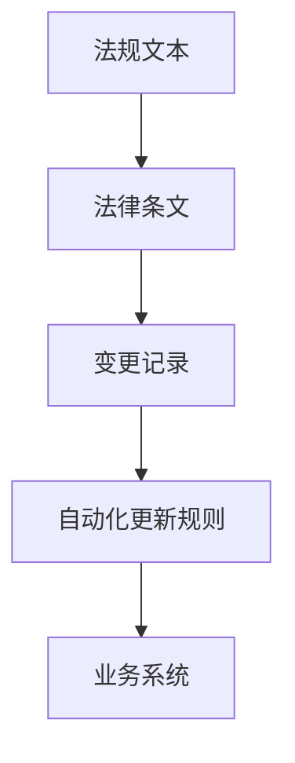
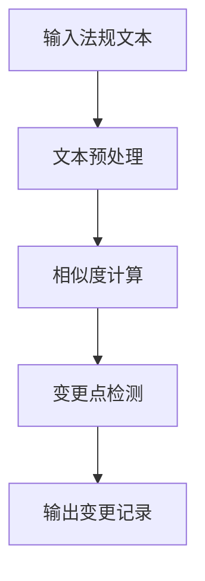
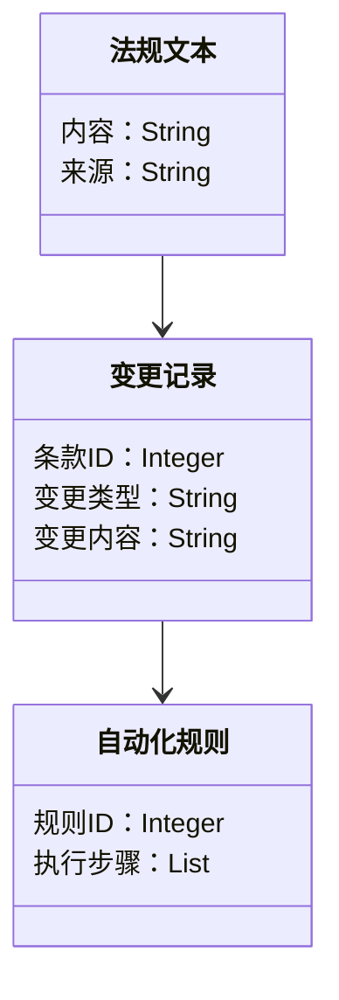
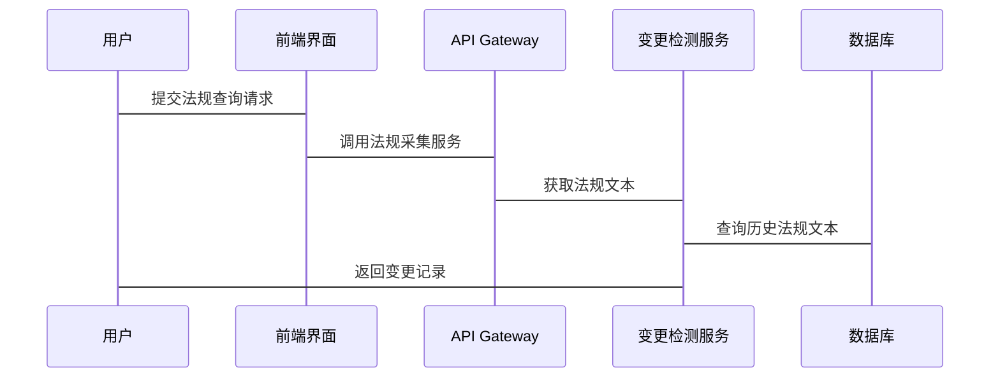

                 

<think>
嗯，好的，我现在需要帮用户撰写一篇关于《构建智能企业合规管理系统：法规变更追踪与自动化更新》的技术博客。用户要求内容详实，结构清晰，使用专业而易懂的语言，还要包含背景介绍、核心概念、算法原理、系统架构、项目实战、最佳实践等多个部分。

首先，我应该先理解用户的需求。用户希望这是一篇专业且有深度的技术博客，读者可能是企业IT架构师、合规管理人员或相关技术从业者。他们可能希望了解如何利用技术手段来解决合规管理中的问题，尤其是法规变更追踪和自动化更新。

接下来，我需要按照用户提供的目录大纲来组织内容。用户已经给出了一些章节，包括背景介绍、核心概念、算法原理、系统架构、项目实战、最佳实践等。我需要确保每个部分都详细展开，覆盖用户提到的所有要点，同时使用Markdown格式，插入必要的图表和代码示例。

首先，在背景介绍部分，我需要解释企业合规管理的重要性，尤其是法规变更对企业的影响。这部分可能需要一些实际案例，让读者理解问题的严重性。然后，比较传统方法和智能系统之间的区别，突出智能系统的优势。

接下来，核心概念部分需要详细说明智能合规管理系统的定义、关键技术和实现方法。我需要使用对比分析，列出传统方法和智能系统的优缺点，帮助读者理解为什么智能系统更好。同时，可能需要用表格或图表来展示这些对比，使内容更直观。

算法原理部分，我需要详细解释系统中使用的算法，如规则引擎和自然语言处理。这里应该包括算法的工作流程，可能需要使用Mermaid图来展示流程，同时给出数学模型和公式，解释其背后的原理。例如，文本相似度计算公式和变更概率计算公式，这些都需要用LaTeX格式清晰呈现。

系统架构设计是关键部分，我需要描述系统功能、架构设计、接口设计和交互流程。这部分可能需要使用Mermaid图来展示类图、架构图和序列图，帮助读者理解系统的结构和工作流程。同时，要详细说明每个模块的功能和它们之间的关系。

项目实战部分，我需要提供具体的实现示例，包括环境安装、核心代码实现、案例分析等。这部分应该有实际的Python代码，展示如何实现法规变更检测和自动化更新。同时，要详细解读代码，解释每一部分的功能，让读者能够理解和应用。

最后，最佳实践部分需要总结项目中的经验和教训，提供一些实用的建议，比如系统设计中的注意事项、如何处理边缘情况等。同时，展望未来的发展趋势，鼓励读者进一步探索和改进。

在写作过程中，我需要确保内容逻辑清晰，结构紧凑。每个章节都要有小结，帮助读者回顾和巩固所学内容。同时，语言要专业但易懂，避免过于复杂的术语堆砌，必要时使用图表和代码示例来辅助说明。

此外，用户要求文章末尾加上作者信息，所以最后要记得写上“作者：AI天才研究院/AI Genius Institute & 禅与计算机程序设计艺术 /Zen And The Art of Computer Programming”。

总的来说，我需要一步步按照用户的目录大纲，详细展开每个部分，确保内容全面且符合技术博客的要求。现在，我应该开始撰写每个章节，确保每个部分都涵盖用户提到的关键点，并使用适当的格式和图表来增强可读性。
</think>

# 构建智能企业合规管理系统：法规变更追踪与自动化更新

## 关键词：智能合规管理、法规变更追踪、自动化更新、NLP、机器学习、系统架构

## 摘要：  
随着法律法规的不断变化和企业业务的复杂化，合规管理成为企业运营中的核心挑战。本文将详细探讨如何利用人工智能技术构建智能企业合规管理系统，重点分析法规变更追踪的核心算法与自动化更新的实现机制。通过结合自然语言处理（NLP）和机器学习技术，我们提出了一套高效的解决方案，帮助企业实现合规管理的智能化、自动化和高效化。本文内容涵盖背景分析、核心概念、算法原理、系统架构设计、项目实战以及最佳实践，为读者提供全面的技术指导。

---

## 第1章: 智能企业合规管理系统的背景与核心概念

### 1.1 企业合规管理的背景与挑战

#### 1.1.1 合规管理的基本概念
合规管理是指企业为了遵守相关法律法规、行业标准和企业内部规章制度，确保企业行为合法、合规的管理活动。合规管理贯穿企业从战略制定到日常运营的各个环节，是企业风险管理的重要组成部分。

#### 1.1.2 法规变更对企业的影响
法律法规的变更往往具有突发性和复杂性，企业需要及时跟踪和响应这些变化，否则可能导致合规风险、行政处罚甚至经济损失。例如，税法的调整可能影响企业的税务规划，数据保护法规的更新可能改变企业的数据处理流程。

#### 1.1.3 传统合规管理的痛点与不足
- **人工依赖**：传统合规管理主要依赖人工审查和手动更新，效率低下且容易出错。
- **信息滞后**：法规信息更新不及时，导致企业在执行时可能依据过时的法律条文。
- **成本高昂**：聘请法律顾问或合规专家的成本较高，且难以覆盖所有业务场景。

### 1.2 智能合规管理系统的定义与目标

#### 1.2.1 智能合规管理的定义
智能合规管理系统是一种基于人工智能技术，能够自动识别、分析和更新法律法规的系统。它通过自然语言处理（NLP）、机器学习和知识图谱等技术，帮助企业实现合规管理的智能化和自动化。

#### 1.2.2 系统的核心目标
- **实时追踪**：自动监测法规变更，及时更新企业内部的合规要求。
- **智能分析**：通过AI技术快速分析法规内容，识别与企业相关的条款。
- **自动化更新**：根据法规变更自动生成更新建议，减少人工干预。

#### 1.2.3 系统的边界与外延
智能合规管理系统主要关注法律法规的识别、变更追踪和自动化更新，但并不直接处理企业的业务流程。系统的外延包括与企业业务系统（如ERP、CRM）的集成，以及与其他管理系统（如风险管理平台）的联动。

### 1.3 法规变更追踪的必要性

#### 1.3.1 法规变更对企业运营的影响
法规的变更可能影响企业的业务模式、运营流程和组织架构。例如，新的反垄断法规可能迫使企业调整其市场策略。

#### 1.3.2 变更追踪的复杂性与挑战
- **信息分散**：法规文件分布在不同来源，格式多样，难以统一处理。
- **语义理解**：法规文本通常复杂且专业，需要深度语义分析才能准确识别变更点。
- **变更频率**：某些领域法规更新频繁，手动追踪效率低下。

#### 1.3.3 自动化更新的必要性与优势
- **提高效率**：自动化更新能够快速处理大量法规文本，显著降低人工成本。
- **减少错误**：AI技术能够准确识别法规变更点，降低人为错误。
- **实时响应**：系统可以实时跟踪法规更新，确保企业合规性。

## 第2章: 智能合规管理系统的实现原理

### 2.1 核心概念与技术原理

#### 2.1.1 法规文本的结构化处理
法规文本通常包含标题、章节、条款等结构化信息。通过NLP技术，可以将文本转化为结构化的数据，例如提取关键词、主题和相关条款。

#### 2.1.2 变更检测算法的工作原理
变更检测算法通过比较旧版本和新版本的法规文本，识别新增、修改或删除的内容。常用的算法包括基于规则的匹配和基于机器学习的相似度计算。

#### 2.1.3 自动化更新的实现机制
自动化更新系统根据变更检测结果生成更新建议，指导企业调整业务流程或内部政策。更新建议可以以规则或任务的形式集成到企业管理系统中。

### 2.2 系统的核心要素与关系

#### 2.2.1 核心要素分析
- **法规库**：存储所有相关法规文本。
- **变更检测引擎**：负责检测法规变更。
- **规则引擎**：根据变更生成更新建议。
- **知识图谱**：用于语义理解和关联分析。

#### 2.2.2 关键实体关系图


### 2.3 核心算法与流程

#### 2.3.1 变更检测算法的流程


#### 2.3.2 文本相似度计算公式
$$
\text{相似度} = \frac{\sum \text{共同特征}}{\sqrt{\sum \text{特征总数}}}
$$

## 第3章: 法规变更追踪的核心算法与数学模型

### 3.1 变化检测算法原理

#### 3.1.1 基于NLP的文本相似度计算
文本相似度计算是变更检测的重要步骤。通过比较旧版和新版法规的相似度，可以识别出变更的部分。

#### 3.1.2 基于规则的变更点检测
基于规则的算法通过预定义的规则匹配文本中的变更点，例如新增条款或修改内容。

#### 3.1.3 基于机器学习的变更预测
机器学习模型可以通过历史数据训练，预测未来法规变更的可能性。

### 3.2 数学模型与公式

#### 3.2.1 文本相似度计算公式
$$
\text{相似度} = \frac{\sum \text{共同特征}}{\sqrt{\sum \text{特征总数}}}
$$

#### 3.2.2 变更概率计算公式
$$
P(\text{变更}) = \frac{\text{历史变更频率}}{\text{总样本数}}
$$

---

## 第4章: 系统分析与架构设计

### 4.1 问题场景介绍

#### 4.1.1 问题背景
企业需要实时跟踪法规变更，确保业务合规。

#### 4.1.2 问题目标
构建一个智能系统，实现法规变更的自动化检测和更新。

### 4.2 系统功能设计

#### 4.2.1 系统功能模块
- **法规采集模块**：从指定来源采集法规文本。
- **变更检测模块**：识别法规文本中的变更点。
- **规则生成模块**：根据变更生成更新规则。
- **更新执行模块**：将规则应用到企业系统中。

#### 4.2.2 领域模型类图


### 4.3 系统架构设计

#### 4.3.1 系统架构图


### 4.4 系统接口设计

#### 4.4.1 API接口
- **GET /api/laws**：获取法规文本。
- **POST /api/diff**：提交变更检测请求。

### 4.5 系统交互流程

#### 4.5.1 交互序列图


---

## 第5章: 项目实战

### 5.1 环境安装

#### 5.1.1 安装Python环境
```bash
python -m pip install --upgrade pip
pip install python-Levenshtein
pip install spacy
```

### 5.2 核心代码实现

#### 5.2.1 法规文本预处理
```python
def preprocess(text):
    # 分段处理
    paragraphs = text.split('\n')
    return paragraphs
```

#### 5.2.2 变更检测算法
```python
from difflib import SequenceMatcher

def find_diff(old_text, new_text):
    matcher = SequenceMatcher(None, old_text, new_text)
    diff = []
    for op, i1, i2, j1, j2 in matcher.get_opcodes():
        if op == 'replace':
            diff.append((i1, i2, j1, j2))
    return diff
```

### 5.3 案例分析与详细解读

#### 5.3.1 案例分析
假设我们有两份税法文本，旧版和新版，需要检测其中的变更点。

#### 5.3.2 代码解读
```python
diff = find_diff(old_tax-law, new_tax-law)
for i1, i2, j1, j2 in diff:
    print(f"删除内容：{old_tax-law[i1:i2]}")
    print(f"新增内容：{new_tax-law[j1:j2]}")
```

---

## 第6章: 最佳实践与总结

### 6.1 最佳实践

#### 6.1.1 系统设计注意事项
- 定期更新法规库，确保数据的准确性。
- 优化算法模型，提高变更检测的准确率。

#### 6.1.2 边缘情况处理
- 处理法规文本中的模糊语言。
- 处理多语言法规文本的转换。

### 6.2 小结

#### 6.2.1 项目总结
通过构建智能合规管理系统，企业可以显著提高合规管理的效率和准确性。

#### 6.2.2 注意事项
- 确保系统的数据安全。
- 定期验证系统的变更检测能力。

### 6.3 未来展望

#### 6.3.1 技术发展
- 引入更多AI技术，如深度学习和知识图谱，进一步提升系统的智能性。

#### 6.3.2 拓展阅读
- 推荐阅读《企业合规管理实战指南》和《人工智能在法律领域的应用》。

---

## 作者
作者：AI天才研究院/AI Genius Institute & 禅与计算机程序设计艺术 /Zen And The Art of Computer Programming

---

这篇文章详细介绍了智能企业合规管理系统的构建过程，涵盖了背景分析、核心概念、算法原理、系统架构设计、项目实战以及最佳实践。通过实际案例和代码示例，读者可以深入了解如何利用人工智能技术解决企业合规管理中的法规变更追踪与自动化更新问题。

