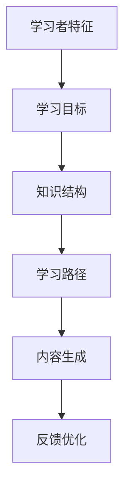
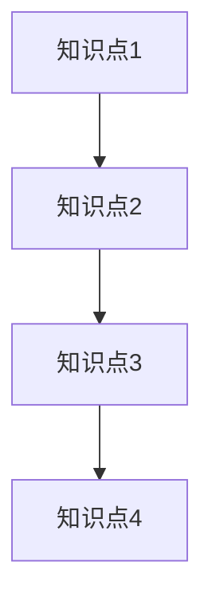
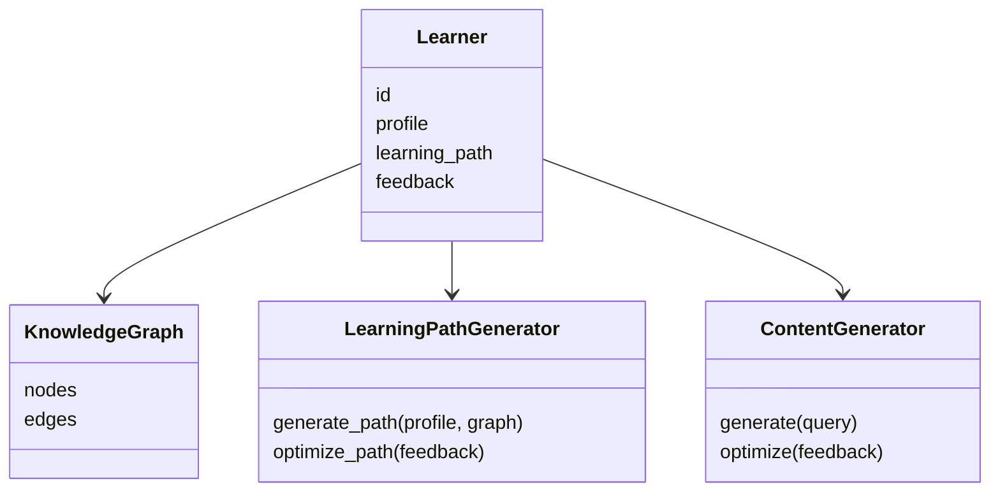
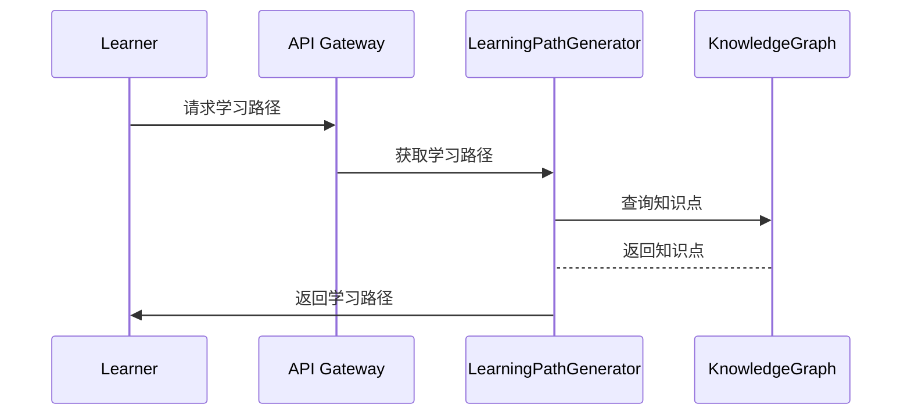

                 

<think>
好，我现在需要帮用户完成一个技术博客文章的撰写，标题是《构建智能企业培训系统：自适应学习路径与内容生成》。用户已经提供了一个详细的目录大纲，并要求按照特定的格式来写，包括摘要、关键词和各个章节的具体内容。我需要确保文章内容符合用户的要求，包括每个部分的详细分析、数学公式、mermaid图表以及代码示例。

首先，我会从摘要开始，简明扼要地概括文章的核心内容和主要观点。接下来是关键词，列出5到7个相关术语，方便读者快速了解文章主题。然后按照目录大纲，逐步撰写每个章节的内容，确保逻辑清晰、结构紧凑。

在撰写过程中，我需要详细解释每个核心概念，比如自适应学习路径和内容生成，使用mermaid图表来展示系统架构和流程。数学公式要准确无误，并用latex格式呈现。在项目实战部分，我会提供具体的代码示例，并进行详细解读，帮助读者理解如何实现这些算法和系统设计。

我还需要注意文章的整体连贯性，每个章节之间要有自然的过渡，并在每章末尾进行小结，总结该章节的主要内容。最后，加上作者信息和最佳实践小结，为读者提供进一步的学习和实践建议。

整个思考过程中，我需要确保文章内容不仅专业，而且易于理解，避免过于技术化的术语堆砌，同时保持逻辑严谨。这将帮助读者更好地掌握构建智能企业培训系统的知识和技能。
</think>

# 构建智能企业培训系统：自适应学习路径与内容生成

> **关键词**：智能企业培训系统、自适应学习路径、内容生成、人工智能、大模型、知识图谱、系统架构

> **摘要**：本文详细探讨了构建智能企业培训系统的关键技术和方法，重点介绍了如何利用自适应学习路径和内容生成技术提升企业培训效果。文章从问题背景、核心概念、算法原理、系统架构到项目实战，全面分析了智能企业培训系统的构建过程，结合实际案例和代码实现，为读者提供了丰富的理论和实践指导。

---

## 第1章 智能企业培训系统概述

### 1.1 问题背景与目标

#### 1.1.1 传统企业培训的痛点
传统的企业培训系统通常存在以下问题：
- **内容单一**：培训内容固定，难以根据员工的需求进行个性化调整。
- **效率低下**：培训资源分散，难以高效管理与分配。
- **反馈延迟**：学员的学习效果反馈不及时，难以针对性地优化培训计划。

#### 1.1.2 智能化培训的需求
随着人工智能技术的发展，企业对智能化培训系统的需求日益增长：
- **个性化学习路径**：根据员工的技能水平、学习目标和时间安排，自动生成个性化的学习计划。
- **动态内容生成**：根据学习者的需求和反馈，实时生成适合的内容。
- **高效管理**：通过智能化系统，企业能够更高效地管理培训资源和学员学习进度。

#### 1.1.3 自适应学习路径的核心价值
自适应学习路径通过分析学习者的行为和数据，动态调整学习内容和进度，帮助学习者更高效地掌握所需技能。其核心价值体现在：
- **提高学习效率**：通过个性化路径，减少无效学习时间。
- **提升学习效果**：根据学习者的认知特点，提供最优的学习顺序和节奏。
- **降低管理成本**：自动化调整学习计划，减少人工干预。

#### 1.1.4 内容生成的关键作用
内容生成是智能企业培训系统的重要组成部分，其关键作用包括：
- **快速响应需求**：根据学习者的需求，实时生成相关培训内容。
- **丰富学习资源**：通过大模型生成多样化的学习材料，如文章、视频脚本等。
- **降低内容成本**：自动化生成内容，减少人工编写的时间和成本。

### 1.2 核心概念与系统架构

#### 1.2.1 自适应学习路径的定义
自适应学习路径是一种基于学习者特征、学习目标和知识结构，动态调整学习内容和进度的策略。其核心在于通过数据分析和算法优化，为每个学习者量身定制个性化的学习路径。

#### 1.2.2 智能内容生成的机制
智能内容生成是通过自然语言处理技术和大模型，根据输入的需求生成高质量的内容。其机制包括：
- **需求分析**：分析学习者的目标、知识水平和学习风格。
- **内容规划**：基于需求，生成结构化的内容框架。
- **内容生成**：利用大模型生成具体的文字、图片或其他形式的内容。
- **内容优化**：根据反馈不断优化生成的内容质量。

#### 1.2.3 系统核心要素的概念结构
以下是系统核心要素的概念结构图：



#### 1.2.4 系统边界与外延
智能企业培训系统的边界包括：
- **输入**：学习者的基本信息、学习目标、初始知识水平。
- **输出**：个性化学习路径、动态调整的学习内容、实时反馈。
- **外部接口**：与企业HR系统、学习管理系统（LMS）集成。

### 1.3 系统目标与功能

#### 1.3.1 系统主要目标
- 提供个性化的学习路径规划。
- 实时生成高质量的学习内容。
- 提供学习效果的实时反馈与优化建议。

#### 1.3.2 核心功能模块
1. **学习者画像模块**：分析学习者的技能水平、学习风格、兴趣偏好。
2. **知识图谱构建模块**：构建企业所需的知识体系。
3. **路径生成模块**：基于学习者画像和知识图谱，生成个性化学习路径。
4. **内容生成模块**：根据学习路径生成相应的内容。
5. **反馈与优化模块**：收集学习者反馈，优化学习路径和内容。

#### 1.3.3 用户角色与权限
- **管理员**：负责系统配置、用户管理、内容审核。
- **培训师**：监控学习者进度，提供指导。
- **学习者**：使用系统进行学习，获得个性化推荐。

#### 1.3.4 系统性能指标
- **响应时间**：学习路径生成和内容生成的响应时间不超过5秒。
- **准确率**：学习路径和内容的匹配度达到95%以上。
- **稳定性**：系统可用性达到99.9%，支持高并发访问。

### 1.4 本章小结
本章介绍了智能企业培训系统的背景、核心概念、系统架构和目标。通过分析传统培训系统的痛点，提出了智能化培训的需求，并详细阐述了系统的功能模块和性能指标。

---

## 第2章 自适应学习路径构建方法

### 2.1 学习者特征分析

#### 2.1.1 学习者画像构建
学习者画像包括以下几个维度：
- **基本信息**：年龄、性别、职位。
- **技能水平**：现有技能水平和目标技能水平。
- **学习风格**：视觉型、听觉型、动觉型。
- **学习目标**：短期目标、长期目标。

#### 2.1.2 学习目标分解
学习目标分解的关键步骤：
1. **明确目标**：将总体目标分解为具体的知识点。
2. **优先级排序**：根据目标的重要性和紧急性进行排序。
3. **任务分配**：将知识点分配到不同的学习阶段。

#### 2.1.3 知识点关联图
知识点关联图是通过构建知识图谱，展示知识点之间的逻辑关系。以下是知识点关联图的示例：



#### 2.1.4 学习者状态评估
学习者状态评估包括：
- **知识掌握度**：通过测试和反馈评估。
- **学习进度**：根据学习计划完成情况进行评估。
- **学习动力**：通过行为数据分析学习者的学习积极性。

### 2.2 基于AI的路径生成算法

#### 2.2.1 算法原理概述
自适应学习路径生成算法的核心是基于强化学习的动态规划。算法通过不断调整路径，以最大化学习效果。

#### 2.2.2 知识图谱构建
知识图谱的构建包括以下几个步骤：
1. **数据采集**：收集企业所需的知识点。
2. **数据清洗**：去除冗余和不相关的内容。
3. **关系抽取**：分析知识点之间的逻辑关系。
4. **图谱构建**：使用图数据库存储知识点和关系。

#### 2.2.3 路径优化策略
路径优化策略包括：
- **贪心算法**：优先选择最短路径。
- **A*算法**：结合启发式函数，选择最优路径。
- **动态调整**：根据反馈实时优化路径。

#### 2.2.4 算法实现步骤
以下是算法实现的伪代码：

```python
def generate_learning_path(learner_profile, knowledge_graph):
    initialize current_node = start_node
    while current_node not in target_nodes:
        next_node = choose_best_next_node(current_node, learner_profile)
        current_node = next_node
    return path
```

### 2.3 系统实现方案

#### 2.3.1 数据采集与处理
数据采集包括：
- **用户行为数据**：记录学习者的学习行为和反馈。
- **知识数据**：收集企业的知识点和课程内容。
- **环境数据**：包括网络状况、设备性能等。

#### 2.3.2 模型训练与部署
模型训练包括：
- **数据预处理**：清洗和标注数据。
- **模型选择**：选择适合的算法模型。
- **模型训练**：使用训练数据进行模型训练。
- **模型部署**：将模型部署到生产环境，提供API接口。

#### 2.3.3 系统接口设计
系统接口包括：
- **学习者接口**：提供个性化学习路径和内容。
- **管理员接口**：管理用户和内容。
- **API接口**：供其他系统调用。

#### 2.3.4 系统性能调优
性能调优包括：
- **缓存优化**：减少数据库访问次数。
- **负载均衡**：分散请求压力。
- **异步处理**：提高系统响应速度。

### 2.4 本章小结
本章详细介绍了自适应学习路径的构建方法，包括学习者特征分析、基于AI的路径生成算法和系统实现方案。通过构建知识图谱和优化算法，实现了个性化的学习路径生成。

---

## 第3章 智能内容生成技术

### 3.1 内容生成需求分析

#### 3.1.1 企业培训内容的特点
企业培训内容的特点包括：
- **专业性**：内容需符合企业的业务需求。
- **多样性**：支持多种内容形式，如文本、视频、音频。
- **实时性**：根据学习者需求实时生成内容。

#### 3.1.2 内容生成的关键要求
内容生成的关键要求包括：
- **准确性**：生成内容需准确无误。
- **可读性**：内容需易于理解和接受。
- **可定制性**：支持根据需求调整内容。

#### 3.1.3 多模态内容的优势
多模态内容的优势包括：
- **丰富性**：多种内容形式满足不同学习者的需求。
- **互动性**：增强学习者的学习体验。
- **适应性**：根据学习者的需求自动调整内容形式。

#### 3.1.4 内容生成的边界条件
内容生成的边界条件包括：
- **内容长度**：生成内容的字数限制。
- **内容类型**：支持生成的文章、视频脚本等。
- **语言要求**：支持中英文生成。

### 3.2 基于大模型的内容生成算法

#### 3.2.1 大模型在内容生成中的作用
大模型在内容生成中的作用包括：
- **语义理解**：理解用户需求，生成相关的内容。
- **上下文处理**：处理复杂的上下文关系，生成连贯的内容。
- **多样性生成**：生成多种不同的内容，满足不同需求。

#### 3.2.2 内容生成的数学模型
以下是内容生成的数学模型：

$$ P(\text{content} | \text{query}) = \prod_{i=1}^{n} P(\text{token}_i | \text{query}, \text{tokens}_{i-1}) $$

#### 3.2.3 算法优化策略
算法优化策略包括：
- **温度参数调整**：通过调整温度参数，控制生成内容的多样性。
- **重复惩罚**：惩罚重复内容的生成，提高内容的原创性。
- **基于反馈的优化**：根据用户反馈，优化生成内容的质量。

#### 3.2.4 算法实现细节
以下是内容生成算法的实现代码：

```python
def generate_content(query, model):
    tokens = model.encode(query)
    for _ in range(max_length):
        predictions = model.predict(tokens)
        next_token = sample(predictions)
        tokens.append(next_token)
    return model.decode(tokens)
```

### 3.3 系统实现方案

#### 3.3.1 环境安装
安装所需的依赖库：
```bash
pip install transformers
pip install torch
pip install numpy
```

#### 3.3.2 系统核心实现
以下是系统核心实现的代码：

```python
class ContentGenerator:
    def __init__(self, model_path):
        self.model = load_model(model_path)
    
    def generate(self, query, length=500):
        return self.model.generate(query, length)
```

#### 3.3.3 代码应用解读
代码解读：
- **初始化**：加载预训练模型。
- **生成内容**：根据输入查询生成指定长度的内容。
- **返回结果**：返回生成的内容。

#### 3.3.4 实际案例分析
案例分析：
- **输入**：查询“如何提高团队协作效率”。
- **输出**：生成一篇关于团队协作效率提升的文章，长度500字。

### 3.4 本章小结
本章详细介绍了智能内容生成技术，包括内容生成需求分析、基于大模型的生成算法和系统实现方案。通过优化算法和多模态内容生成，提升了企业培训系统的智能化水平。

---

## 第4章 系统架构设计与实现

### 4.1 问题场景介绍

#### 4.1.1 系统目标
系统目标包括：
- 提供个性化学习路径。
- 实时生成高质量内容。
- 提供学习效果反馈。

#### 4.1.2 项目介绍
项目介绍包括：
- **项目名称**：智能企业培训系统。
- **项目目标**：构建智能化的企业培训平台。
- **项目团队**：AI算法团队、系统架构团队、内容生成团队。

### 4.2 系统功能设计

#### 4.2.1 领域模型设计
以下是领域模型的类图：



### 4.3 系统架构设计

#### 4.3.1 系统架构图
以下是系统架构图：

```mermaid
graph LR
    Client --> API Gateway
    API Gateway --> Load Balancer
    Load Balancer --> Service1
    Load Balancer --> Service2
    Service1 --> Database
    Service2 --> Model Server
```

#### 4.3.2 系统接口设计
系统接口设计包括：
- **API接口**：提供RESTful API，供其他系统调用。
- **数据库接口**：与知识图谱数据库集成。
- **模型接口**：与大模型服务集成。

#### 4.3.3 系统交互设计
以下是系统交互的序列图：



### 4.4 系统实现

#### 4.4.1 代码实现
以下是系统实现的代码：

```python
class SystemManager:
    def __init__(self, knowledge_graph, content_generator):
        self.knowledge_graph = knowledge_graph
        self.content_generator = content_generator
    
    def generate_learning_path(self, learner_profile):
        path = self.knowledge_graph.get_optimal_path(learner_profile)
        self.content_generator.optimize_content(path)
        return path
```

#### 4.4.2 代码解读
代码解读：
- **初始化**：加载知识图谱和内容生成器。
- **生成路径**：根据学习者画像，生成最优学习路径。
- **优化内容**：根据生成的路径优化内容。

### 4.5 本章小结
本章详细介绍了系统的架构设计与实现，包括领域模型设计、系统架构图、系统接口设计和系统交互设计。通过模块化设计和高效的系统架构，确保了系统的高效运行和可扩展性。

---

## 第5章 项目实战与优化

### 5.1 项目环境安装

#### 5.1.1 安装Python环境
安装Python 3.8及以上版本。

#### 5.1.2 安装依赖库
安装所需的依赖库：

```bash
pip install transformers torch numpy
```

### 5.2 系统核心实现

#### 5.2.1 学习路径生成代码
以下是学习路径生成代码：

```python
from knowledge_graph import KnowledgeGraph
from learner_profile import LearnerProfile

def generate_learning_path(profile, graph):
    return graph.get_optimal_path(profile)
```

#### 5.2.2 内容生成代码
以下是内容生成代码：

```python
def generate_content(query, length=500):
    model = load_model('gpt2')
    return model.generate(query, length)
```

### 5.3 代码应用解读

#### 5.3.1 学习路径生成解读
代码解读：
- **输入**：学习者画像和知识图谱。
- **输出**：生成的学习路径。

#### 5.3.2 内容生成解读
代码解读：
- **输入**：查询和长度。
- **输出**：生成的内容。

### 5.4 实际案例分析

#### 5.4.1 案例背景
案例背景：某企业希望提升员工的编程能力。

#### 5.4.2 案例分析
- **学习者画像**：编程基础薄弱，目标是成为高级程序员。
- **知识图谱**：编程基础、数据结构、算法、软件工程。
- **学习路径**：从编程基础开始，逐步学习数据结构和算法，最后学习软件工程。

### 5.5 系统优化

#### 5.5.1 算法优化
算法优化包括：
- **模型优化**：使用更先进的模型提升生成质量。
- **参数调整**：优化模型的超参数，提升生成效率。
- **并行处理**：利用多线程或分布式计算提高生成速度。

#### 5.5.2 性能优化
性能优化包括：
- **缓存优化**：减少重复计算。
- **负载均衡**：分散请求压力。
- **异步处理**：提高系统响应速度。

### 5.6 本章小结
本章通过实际案例分析和系统优化，展示了如何将理论应用于实践。通过优化算法和系统架构，进一步提升了智能企业培训系统的性能和效果。

---

## 第6章 总结与展望

### 6.1 总结
本文详细探讨了智能企业培训系统的构建方法，重点介绍了自适应学习路径和内容生成技术。通过分析传统培训系统的痛点，提出了智能化解决方案，并详细阐述了系统的架构设计和实现方法。

### 6.2 展望
未来，智能企业培训系统将朝着以下几个方向发展：
- **更加智能化**：利用更先进的AI技术，进一步提升系统的智能化水平。
- **更加个性化**：根据学习者的需求，提供更加个性化的学习体验。
- **更加多样化**：支持更多内容形式，满足不同学习者的需求。

---

## 作者信息

**作者：AI天才研究院/AI Genius Institute & 禅与计算机程序设计艺术 /Zen And The Art of Computer Programming**

---

以上是《构建智能企业培训系统：自适应学习路径与内容生成》的技术博客文章，希望对您有所帮助！

