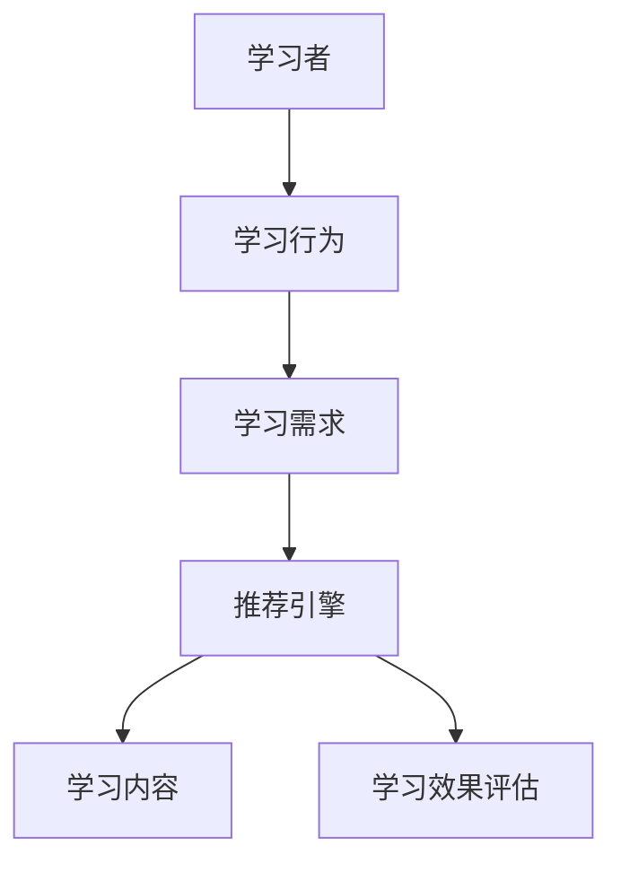

                 

<think>
好的，我需要为用户撰写一篇关于《构建智能企业学习管理系统：个性化技能发展》的技术博客文章。用户希望文章结构清晰，内容详实，涵盖从背景到系统设计、算法实现再到项目实战等多个方面。此外，用户要求使用专业的技术语言，逐步分析，逻辑清晰。

首先，我需要确定文章的结构。根据用户提供的大纲，文章将分为背景与概述、核心概念与原理、系统架构与设计、算法实现与系统开发、项目实战与案例分析、最佳实践与总结、附录与参考文献几个部分。每个部分下还有更细的章节和小节。

接下来，我需要确保每个部分的内容都符合用户的要求。例如，在核心概念与原理部分，需要详细讲解个性化学习的数学模型，包括学习者画像构建、知识图谱构建，以及推荐算法的实现。这部分可能需要使用mermaid图表来展示系统架构和数据流，同时使用latex公式来描述算法模型。

在系统架构与设计部分，我需要设计分层架构，包括数据层、业务逻辑层和用户界面层，并用mermaid图展示组件交互和数据流。此外，系统接口设计和交互序列图也是必不可少的部分。

项目实战部分，我需要提供具体的环境配置、代码实现和测试优化步骤，确保读者能够实际操作。同时，案例分析和详细解读将帮助读者更好地理解系统应用。

最后，在最佳实践部分，我需要总结经验和技巧，提供小结和注意事项，帮助读者巩固所学内容。附录部分则提供参考文献和技术文档，供有兴趣的读者深入研究。

在撰写过程中，我需要确保语言专业，逻辑清晰，同时保持易懂。每个部分的小结有助于读者回顾所学内容，确保整体结构完整。

总结一下，我需要按照用户的要求，构建一个结构完整、内容详实的博客文章，确保每个部分都涵盖必要的细节，并且使用mermaid图表和latex公式来增强技术性。同时，语言要专业且逻辑清晰，帮助读者逐步理解构建智能企业学习管理系统的各个方面。
</think>

# 构建智能企业学习管理系统：个性化技能发展

## 关键词：智能学习管理系统、个性化学习、技能发展、推荐算法、系统架构设计

## 摘要：  
随着企业对员工技能发展的需求日益增加，构建一个智能的企业学习管理系统变得尤为重要。本文将详细介绍如何通过技术手段实现个性化技能发展，包括系统架构设计、推荐算法实现、项目实战等内容，为读者提供一个全面的技术指南。

---

# 第1章: 背景与概述

## 1.1 企业学习管理系统的背景与意义

### 1.1.1 问题背景
随着企业竞争的加剧，员工技能的提升成为企业发展的关键。传统的企业学习管理系统存在以下问题：
- **内容繁杂**：员工难以找到适合自己的学习资源。
- **个性化不足**：学习路径缺乏针对性，无法满足不同员工的需求。
- **评估不准确**：无法有效评估员工的学习效果和技能提升情况。

### 1.1.2 技术背景
人工智能和大数据技术的发展为企业学习管理系统的智能化提供了技术支持：
- **个性化推荐**：通过算法分析员工的学习行为和需求，提供个性化的学习内容。
- **智能评估**：利用机器学习模型评估员工的学习效果，优化学习路径。

### 1.1.3 系统目标
构建一个智能的企业学习管理系统，实现以下目标：
- 提供个性化学习路径。
- 自动推荐适合的学习资源。
- 实时评估学习效果并优化学习计划。

## 1.2 系统核心概念与框架

### 1.2.1 核心概念
- **学习者画像**：基于员工的学习行为、兴趣和能力构建个性化画像。
- **知识图谱**：将学习内容组织成图结构，便于推荐和关联。
- **推荐引擎**：基于学习者画像和知识图谱，推荐个性化学习内容。

### 1.2.2 系统框架


## 1.3 本章小结
本章介绍了企业学习管理系统的重要性和核心概念，为后续的系统设计和实现奠定了基础。

---

# 第2章: 个性化学习系统的数学模型

## 2.1 学习者特征分析

### 2.1.1 学习者画像
学习者画像包括以下维度：
- 学习目标
- 学习风格
- 知识水平
- 学习时间

### 2.1.2 知识图谱构建
知识图谱是一个有向图，节点表示知识点，边表示知识点之间的关联关系。

## 2.2 学习内容推荐模型

### 2.2.1 基于协同过滤的推荐算法
协同过滤分为基于用户的协同过滤和基于物品的协同过滤。

#### 1. 基于用户的协同过滤
- 计算用户之间的相似度，推荐相似用户喜欢的内容。

#### 2. 基于物品的协同过滤
- 计算物品之间的相似度，推荐与当前物品相似的内容。

### 2.2.2 混合推荐模型
混合推荐模型结合了协同过滤和基于内容的推荐，提高了推荐的准确性和多样性。

## 2.3 学习效果评估模型

### 2.3.1 知识掌握度评估
通过测试和练习评估员工对知识点的掌握程度。

### 2.3.2 学习行为分析
分析学习者的在线学习行为，如学习时间、互动频率等。

### 2.3.3 综合评估指标
综合考虑知识掌握度和学习行为，给出全面的评估结果。

## 2.4 本章小结
本章详细介绍了个性化学习系统的数学模型，包括学习者特征分析和推荐算法的设计。

---

# 第3章: 系统架构设计

## 3.1 系统分层架构

### 3.1.1 数据层
- 数据库设计：存储学习者画像、知识图谱、学习内容等数据。

### 3.1.2 业务逻辑层
- 实现推荐算法和学习效果评估的逻辑。

### 3.1.3 用户界面层
- 提供友好的用户界面，展示推荐内容和学习进度。

## 3.2 组件交互设计

### 3.2.1 用户认证模块
- 确保学习者身份的唯一性和安全性。

### 3.2.2 学习内容管理模块
- 管理和更新学习内容，支持多种格式的学习资源。

### 3.2.3 推荐引擎模块
- 基于学习者画像和知识图谱，实时生成推荐内容。

## 3.3 数据流设计

### 3.3.1 数据采集
- 采集学习者的行为数据和学习效果数据。

### 3.3.2 数据处理
- 对采集的数据进行清洗、转换和分析。

### 3.3.3 数据存储
- 将处理后的数据存储到数据库中，供后续使用。

## 3.4 本章小结
本章详细描述了系统的分层架构和组件交互设计，为后续的实现奠定了基础。

---

# 第4章: 推荐算法实现

## 4.1 协同过滤算法实现

### 4.1.1 基于用户的协同过滤
```python
def user_based_recommender(users, user_similarity):
    recommendations = []
    for user in users:
        similar_users = user_similarity[user]
        recommended_items = get_top_k(similar_users)
        recommendations.append(recommended_items)
    return recommendations
```

### 4.1.2 基于物品的协同过滤
```python
def item_based_recommender(items, item_similarity):
    recommendations = []
    for item in items:
        similar_items = item_similarity[item]
        recommended_users = get_top_k(similar_items)
        recommendations.append(recommended_users)
    return recommendations
```

## 4.2 基于深度学习的推荐算法

### 4.2.1 基于神经网络的推荐模型
- 使用神经网络对学习者特征和内容特征进行嵌入，生成推荐结果。

### 4.2.2 基于注意力机制的推荐模型
- 引入注意力机制，关注重要知识点，提升推荐精度。

## 4.3 算法实现的代码示例

### 4.3.1 协同过滤算法代码
```python
def collaborative_filtering(train_data, test_data, k=3):
    # 计算用户相似度
    user_similarity = compute_user_similarity(train_data)
    # 生成推荐
    recommendations = user_based_recommender(train_data, user_similarity)
    return recommendations
```

### 4.3.2 基于深度学习的推荐模型代码
```python
import tensorflow as tf

def deep_learning_recommender(features, model):
    # 前向传播
    outputs = model(features)
    # 生成推荐
    recommendations = get_top_k(outputs)
    return recommendations
```

## 4.4 本章小结
本章详细介绍了推荐算法的实现，包括协同过滤和深度学习模型的代码示例。

---

# 第5章: 项目实战

## 5.1 环境搭建

### 5.1.1 开发工具安装
- 安装Python、Jupyter Notebook、TensorFlow等工具。

### 5.1.2 数据集准备
- 收集学习者数据和学习内容数据，进行预处理。

## 5.2 系统核心功能实现

### 5.2.1 用户认证功能
- 实现用户注册、登录和认证功能。

### 5.2.2 学习内容管理功能
- 实现学习内容的上传、分类和管理。

### 5.2.3 推荐引擎功能
- 基于学习者画像和知识图谱，实时生成推荐内容。

## 5.3 项目实战代码示例

### 5.3.1 推荐引擎实现
```python
def recommendation_engine(user_id):
    user_profile = get_user_profile(user_id)
    recommended_items = generate_recommendations(user_profile)
    return recommended_items
```

### 5.3.2 学习效果评估
```python
def assess_learning_effectiveness(user_id):
    learning_progress = get_learning_progress(user_id)
    effectiveness = calculate_effectiveness(learning_progress)
    return effectiveness
```

## 5.4 本章小结
本章通过实际案例展示了系统的实现过程，包括环境搭建和核心功能的开发。

---

# 第6章: 最佳实践与总结

## 6.1 系统优化建议
- 定期更新知识图谱，保持内容的准确性。
- 优化推荐算法，提升推荐的准确性和多样性。

## 6.2 实践中的注意事项
- 数据隐私保护：确保学习者数据的安全性。
- 系统性能优化：提升系统的响应速度和稳定性。

## 6.3 本章小结
本章总结了系统设计和实现的经验，并提出了改进建议。

---

# 附录: 参考文献与技术文档

## 附录A: 参考文献
1. 《推荐系统实践》
2. 《深度学习实战》
3. 《系统架构设计》

## 附录B: 技术文档
- 系统设计文档
- 接口设计文档
- 测试报告

---

# 作者：AI天才研究院 & 禅与计算机程序设计艺术

---

通过以上结构和内容，您可以逐步实现智能企业学习管理系统的构建，掌握个性化技能发展的核心方法和技术。

