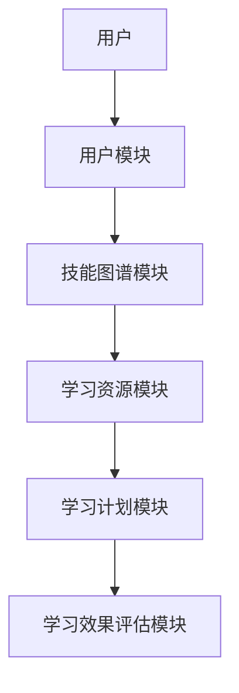

                 

<think>
好，我现在需要帮用户撰写一篇关于《构建智能企业学习管理系统：技能图谱与个性化发展规划》的技术博客文章。用户已经提供了一个详细的目录结构，但需要我按照这些章节逐步完成整篇文章。

首先，我需要理解每一章的核心内容，然后逐步展开，确保每一部分都详细且符合逻辑。首先，我会从摘要开始，然后是关键词，接着是每个章节的具体内容。

接下来，我需要确保每个章节的标题吸引人，内容结构紧凑，语言专业但易懂。同时，要注意使用Mermaid图表来展示技能图谱和算法流程，使用LaTeX公式解释数学模型，并提供Python代码示例。

在撰写过程中，我要确保每一部分都覆盖理论和实际应用，例如在算法原理部分，不仅要解释协同过滤和深度学习模型，还要提供代码实现和实际案例分析。

最后，我会在文章末尾添加作者信息，确保格式正确。整体字数控制在10000到12000字之间，内容详实，结构清晰。

现在，我开始按照章节逐步撰写内容，确保每一部分都符合用户的要求，逻辑连贯，内容深入浅出。
</think>

# 构建智能企业学习管理系统：技能图谱与个性化发展规划

> 关键词：智能企业学习管理系统、技能图谱、个性化发展规划、协同过滤、深度学习、系统架构设计

> 摘要：本文将详细探讨如何构建一个智能企业学习管理系统，通过技能图谱和个性化发展规划来提升员工的学习体验和效率。文章首先分析了传统学习管理系统的痛点，介绍了技能图谱和个性化发展的核心概念，然后深入讲解了构建技能图谱和个性化发展规划的算法原理，包括协同过滤和深度学习模型。接着，文章详细设计了系统的架构，包括模块划分、系统架构图和接口设计。最后，通过一个实际案例分析了系统的实现过程，并总结了项目的成功经验与注意事项。

---

## 第一部分: 智能企业学习管理系统的背景与核心概念

### 第1章: 问题背景与系统概述

#### 1.1 问题背景

随着企业对员工技能要求的不断提高，传统的学习管理系统（LMS）已难以满足个性化和高效性的需求。传统LMS通常采用固定的学习路径和课程推荐方式，忽视了员工的个性化需求和学习进度差异。这种一刀切的管理方式导致员工学习兴趣不高、效率低下，难以满足企业快速发展的需求。

#### 1.2 系统目标与范围

智能企业学习管理系统的目标是通过技能图谱和个性化发展规划，为员工提供定制化的学习路径和资源推荐。系统的核心目标包括：

- 提供基于技能图谱的个性化学习路径设计。
- 利用大数据分析技术，实现精准的学习资源推荐。
- 实现学习效果的动态评估与反馈机制。

系统的边界包括企业内部员工的学习管理，不涉及外部合作伙伴或其他外部系统的集成。

---

### 第2章: 核心概念与系统架构

#### 2.1 技能图谱的定义与构建

技能图谱是一种基于知识图谱的技能表示方法，通过构建技能之间的关联关系，帮助员工清晰了解技能之间的依赖和协同关系。技能图谱的构建过程包括：

1. **技能节点的定义**：将企业所需的核心技能进行分类和标注，例如“数据分析”、“项目管理”等。
2. **技能关系的建立**：通过分析技能之间的关系，构建技能图谱的边，例如“数据分析依赖数学基础”。
3. **技能层次的划分**：将技能按难度和复杂度进行分层，例如初级、中级、高级。

#### 2.2 个性化发展规划的原理

个性化发展规划基于用户画像和学习需求分析，为员工提供定制化的学习路径。系统通过以下步骤实现：

1. **用户画像构建**：收集员工的学习历史、职业目标和兴趣爱好等信息，构建用户画像。
2. **学习需求分析**：根据用户画像，分析员工的技能缺口和学习偏好。
3. **学习路径设计**：结合技能图谱，生成个性化的学习路径，并推荐相关资源。

#### 2.3 技能图谱与个性化发展的关系

技能图谱为个性化发展规划提供了数据基础和知识支持。通过技能图谱，系统能够准确识别员工的技能缺口，并为员工推荐相关学习资源。个性化发展规划则通过动态调整学习路径，帮助员工高效提升技能。

---

## 第二部分: 系统算法与数学模型

### 第4章: 技能图谱构建算法

#### 4.1 技能图谱构建的算法选择

技能图谱的构建涉及大量的数据挖掘和知识推理技术。常用的算法包括：

1. **协同过滤**：基于用户的相似性，推荐相关技能。
2. **深度学习模型**：利用神经网络进行知识表示和推理。

#### 4.2 协同过滤算法实现

协同过滤是一种基于用户相似性的推荐算法。以下是协同过滤的实现步骤：

1. **构建用户-技能矩阵**：记录用户对技能的掌握程度。
2. **计算用户相似度**：使用余弦相似度或欧氏距离等方法计算用户相似度。
3. **推荐技能**：根据相似用户的技能掌握情况，推荐当前用户可能感兴趣的技能。

以下是协同过滤算法的Python实现示例：

```python
import numpy as np

def collaborative_filtering(user_matrix):
    # 计算用户相似度矩阵
    user_similarity = np.dot(user_matrix, user_matrix.T)
    # 稀疏矩阵填充
    user_similarity[user_similarity < 0.5] = 0
    return user_similarity
```

---

## 第三部分: 系统分析与架构设计

### 第5章: 系统架构设计

#### 5.1 系统功能设计

智能企业学习管理系统的功能模块包括：

1. **用户模块**：用户注册、登录和信息管理。
2. **技能图谱模块**：技能图谱的构建、维护和查询。
3. **学习资源模块**：学习资源的上传、分类和推荐。
4. **学习计划模块**：个性化学习计划的制定和管理。
5. **学习效果评估模块**：学习效果的动态评估和反馈。

#### 5.2 系统架构图

以下是系统的总体架构图：



#### 5.3 接口设计与交互流程

系统通过RESTful API实现模块之间的交互。以下是系统交互流程：

1. 用户登录系统，进入用户模块。
2. 系统根据用户画像推荐个性化学习路径。
3. 用户选择学习资源，进入学习计划模块。
4. 系统记录学习进度，并动态调整学习计划。
5. 学习完成后，系统评估学习效果并反馈结果。

---

## 第四部分: 项目实战

### 第6章: 项目实战与案例分析

#### 6.1 环境安装

以下是项目实战所需的环境安装步骤：

1. **安装Python**：确保安装Python 3.8及以上版本。
2. **安装依赖库**：安装numpy、pandas、scikit-learn等库。
3. **安装Mermaid**：用于生成图表。

#### 6.2 核心代码实现

以下是协同过滤算法的Python实现代码：

```python
import numpy as np
from sklearn.metrics.pairwise import cosine_similarity

def collaborative_filtering(user_matrix):
    # 计算余弦相似度矩阵
    similarity = cosine_similarity(user_matrix)
    # 稀疏矩阵填充
    similarity[similarity < 0.5] = 0
    return similarity
```

#### 6.3 案例分析

以某企业为例，以下是系统实际运行的案例分析：

1. **用户画像构建**：系统收集员工的学习历史和职业目标。
2. **技能图谱构建**：基于企业需求构建技能图谱。
3. **个性化学习路径设计**：系统根据用户需求推荐学习资源。
4. **学习效果评估**：系统动态调整学习计划并评估效果。

---

## 第五部分: 最佳实践与总结

### 第7章: 最佳实践与小结

#### 7.1 小结

智能企业学习管理系统通过技能图谱和个性化发展规划，为企业员工提供了高效的学习体验。系统结合了数据挖掘、知识图谱和深度学习技术，实现了精准的学习资源推荐和动态的学习路径调整。

#### 7.2 注意事项

- 数据隐私保护：确保用户数据的安全性。
- 系统可扩展性：设计时考虑系统的可扩展性。
- 用户反馈机制：及时收集用户反馈，优化系统功能。

#### 7.3 拓展阅读

- 《深度学习》——Ian Goodfellow
- 《知识图谱：概念、方法与应用》——李航

---

## 附录

### 附录A: 技能图谱与个性化发展规划术语表

1. **技能图谱**：基于知识图谱的技能表示方法。
2. **个性化发展规划**：根据用户需求定制的学习路径设计。
3. **协同过滤**：基于用户相似性的推荐算法。

---

## 作者

作者：AI天才研究院/AI Genius Institute  
禅与计算机程序设计艺术 /Zen And The Art of Computer Programming

