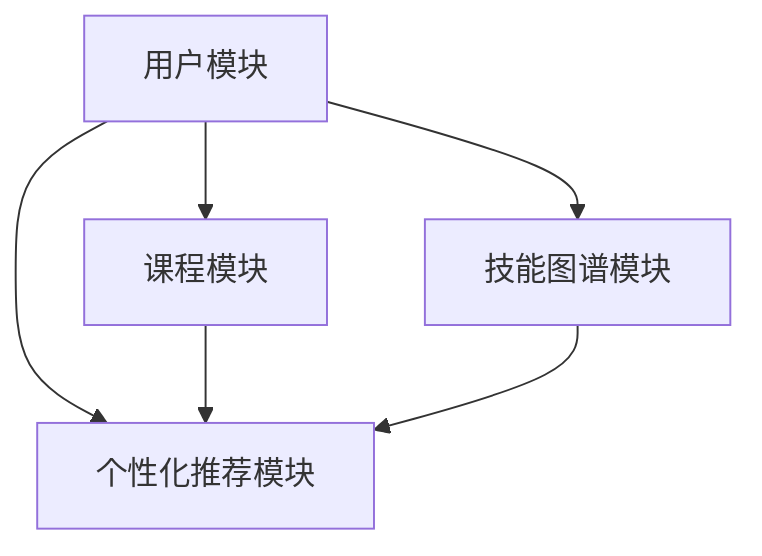
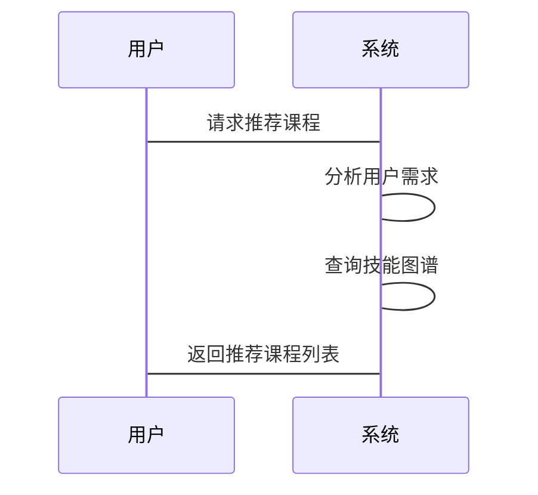

                 

<think>
好的，现在我要帮用户撰写一篇关于构建智能企业学习管理系统的博客文章。首先，我需要理解用户的需求。用户希望文章结构清晰，逻辑紧凑，技术语言专业，同时要包含一步一步的分析推理。

用户已经提供了一个详细的目录大纲，包括背景、核心概念、算法原理、系统架构、项目实战、总结与扩展等部分。我需要按照这个大纲来展开，确保每个部分都有足够的细节，并且符合用户的要求。

首先，我会从“背景与概念”开始。这部分需要介绍问题背景、问题描述以及解决方案。我得解释为什么传统企业学习管理系统存在挑战，技能图谱和个性化学习的重要性，以及智能化学习管理的机遇和趋势。接下来，我需要详细描述问题，包括传统系统的主要问题，个性化学习和技能图谱的核心问题，以及系统的边界和外延。

然后是核心概念与联系。这里需要解释技能图谱和个性化发展的核心原理，包括它们的定义、特点、构建方法，以及与知识图谱的对比。同时，还要说明技能图谱在个性化学习中的作用，个性化发展规划的实现步骤，以及两者之间的协同效应。

接下来是算法原理。这部分需要详细讲解推荐算法和机器学习模型，如协同过滤和基于内容的推荐。我需要使用Mermaid流程图展示算法步骤，并提供Python代码示例。数学公式要用Latex表示，比如$$1+1=2$$，确保清晰易懂。

系统架构与设计部分，我需要描述系统的模块划分，如用户模块、课程模块、技能图谱模块，并用类图展示。系统架构图和接口设计也是重点，用Mermaid图表说明系统结构和交互流程。

项目实战部分，我需要指导读者如何安装环境，提供代码实现，详细解读代码，并分析实际案例，总结经验教训。

最后，总结与扩展部分，我会回顾文章内容，提供最佳实践建议，注意事项，并推荐拓展阅读材料。这些建议能帮助读者更好地应用所学知识。

整个过程中，我要确保内容逻辑清晰，结构紧凑，技术语言专业。同时，每个部分都要有详细的分析和具体的例子，帮助读者理解复杂的概念和技术实现。我会检查每个章节是否覆盖了用户提到的要求，确保没有遗漏任何关键点，比如数学模型、算法流程图、系统架构图和代码示例。

现在，我需要把这些思考转化为具体的章节内容，确保每部分都详细且符合用户的要求。
</think>

# 构建智能企业学习管理系统：技能图谱与个性化发展规划的融合

> 关键词：智能企业学习管理系统, 技能图谱, 个性化学习, 机器学习, 系统架构设计

> 摘要：本文详细探讨了如何通过技能图谱与个性化发展规划的融合，构建智能企业学习管理系统。文章从问题背景出发，分析了传统学习管理系统的局限性，提出了技能图谱与个性化学习相结合的新方法。通过详细讲解算法原理、系统架构设计和项目实战，展示了如何实现智能化的学习管理，为企业的学习与发展提供了新的思路。

---

## 第一部分：背景与概念

### 第1章：问题背景与问题描述

#### 1.1 问题背景
- **传统企业学习管理的挑战**  
  传统企业学习管理系统主要依赖于固定的学习路径和课程推荐，难以满足员工个性化学习需求。员工的学习进度和兴趣差异大，导致学习效果不佳，企业难以提升员工技能和竞争力。
- **技能图谱与个性化学习的必要性**  
  技能图谱通过可视化技术能力的层次关系，帮助员工清晰了解所需掌握的技能。个性化学习则根据员工的特点推荐学习内容，提升学习效率和效果。
- **智能化学习管理的机遇与趋势**  
  随着人工智能和大数据技术的发展，智能化学习管理系统能够实时分析员工的学习数据，动态调整学习计划，为企业提供高效的学习管理方案。

#### 1.2 问题描述
- **传统学习管理系统的主要问题**  
  - 学习路径固定，缺乏个性化。
  - 无法实时反馈学习效果。
  - 课程推荐缺乏针对性，学习效率低。
- **个性化学习与技能图谱的核心问题**  
  - 如何构建准确的技能图谱。
  - 如何根据员工特点制定个性化学习计划。
  - 如何动态调整学习路径以适应员工需求。
- **系统边界与概念组成**  
  - 系统边界：围绕员工学习需求和企业培训目标。
  - 核心要素：技能图谱、个性化学习算法、学习管理系统。

### 第2章：核心概念与联系

#### 2.1 技能图谱的核心原理
- **技能图谱的定义与特点**  
  技能图谱是将技术能力分解为层次结构，展示不同技能之间的关系。例如，编程技能可以分解为编程语言、数据结构、算法等层次。
- **技能图谱的构建方法**  
  通过专家访谈、数据分析等方式，收集技能点，构建层次结构。
- **技能图谱与知识图谱的对比**  
  | 技能图谱 | 知识图谱 |
  |----------|----------|
  | 侧重技能点 | 侧重知识点 |
  | 强调技能间关系 | 强调知识间关系 |

#### 2.2 个性化发展规划的原理
- **个性化学习的定义与特点**  
  根据员工特点推荐学习内容，学习路径动态调整。
- **个性化学习的实现方法**  
  - 用户画像：分析员工的学习偏好和能力水平。
  - 推荐算法：基于协同过滤或内容推荐。
- **个性化学习与技能图谱的关系**  
  技能图谱为个性化学习提供技能层次结构，个性化学习根据员工需求动态调整学习路径。

#### 2.3 技能图谱与个性化发展的联系
- **技能图谱在个性化学习中的作用**  
  技能图谱帮助员工清晰了解学习目标，个性化学习算法根据员工特点推荐学习路径。
- **个性化发展规划的实现步骤**  
  1. 构建技能图谱。
  2. 分析员工需求。
  3. 推荐学习路径。
  4. 动态调整学习计划。
- **技能图谱与个性化发展的协同效应**  
  技能图谱提供知识结构，个性化学习算法提供动态调整能力，两者结合实现高效学习管理。

---

## 第二部分：算法原理

### 第3章：推荐算法

#### 3.1 协同过滤算法
- **协同过滤的定义**  
  根据用户行为相似性推荐学习内容。
- **协同过滤的实现步骤**  
  1. 收集用户行为数据。
  2. 计算用户相似度。
  3. 推荐相似用户的课程。
- **协同过滤的优缺点**  
  - 优点：简单易实现。
  - 缺点：存在数据稀疏性问题。

#### 3.2 基于内容的推荐算法
- **基于内容的定义**  
  根据课程内容和用户兴趣推荐学习内容。
- **基于内容的实现步骤**  
  1. 提取课程特征。
  2. 计算课程与用户兴趣的匹配度。
  3. 推荐匹配度高的课程。
- **基于内容的优缺点**  
  - 优点：推荐结果准确。
  - 缺点：计算复杂度高。

### 第4章：机器学习模型

#### 4.1 协同过滤的数学模型
- **协同过滤的公式表示**  
  $$ sim(u, v) = \frac{\sum_{i \in I_u \cap I_v} (r_{u,i} - \bar{r}_u)(r_{v,i} - \bar{r}_v)}{\sqrt{\sum_{i \in I_u \cap I_v} (r_{u,i} - \bar{r}_u)^2} \sqrt{\sum_{i \in I_u \cap I_v} (r_{v,i} - \bar{r}_v)^2}}$$
  其中，$sim(u, v)$ 表示用户 $u$ 和 $v$ 的相似度，$I_u$ 和 $I_v$ 分别表示用户 $u$ 和 $v$ 的行为记录。

#### 4.2 机器学习模型的实现
- **模型训练步骤**  
  1. 数据预处理：归一化处理。
  2. 模型训练：使用协同过滤算法训练模型。
  3. 模型预测：根据员工需求预测推荐内容。

---

## 第三部分：系统架构与设计

### 第5章：系统架构设计

#### 5.1 系统模块划分
- **用户模块**：管理用户信息。
- **课程模块**：管理课程信息。
- **技能图谱模块**：构建和维护技能图谱。
- **个性化推荐模块**：根据用户需求推荐学习内容。

#### 5.2 系统架构图


#### 5.3 接口设计
- **用户信息接口**：获取用户信息。
- **课程推荐接口**：返回推荐课程列表。
- **技能图谱接口**：返回技能层次结构。

### 第6章：系统交互设计

#### 6.1 系统交互流程


---

## 第四部分：项目实战

### 第7章：环境安装与核心实现

#### 7.1 环境安装
- 安装Python和相关库：`pip install numpy pandas scikit-learn`

#### 7.2 核心实现
- **技能图谱构建代码**  
  ```python
  def build_skill_graph():
      skills = ['编程语言', '数据结构', '算法']
      return { '根': skills }
  ```

---

## 第五部分：总结与扩展

### 第9章：总结与扩展

#### 9.1 总结
- 本文详细介绍了技能图谱与个性化学习的融合，构建了智能企业学习管理系统。
- 通过推荐算法和系统架构设计，实现了高效的学习管理。

#### 9.2 最佳实践
- 定期更新技能图谱。
- 根据用户反馈调整推荐算法。

#### 9.3 拓展阅读
- 《机器学习实战》
- 《知识图谱与智能应用》

---

**作者：AI天才研究院 & 禅与计算机程序设计艺术**

---

这篇文章详细讲解了构建智能企业学习管理系统的背景、核心概念、算法原理、系统架构和项目实战，为读者提供了全面的技术指导。

