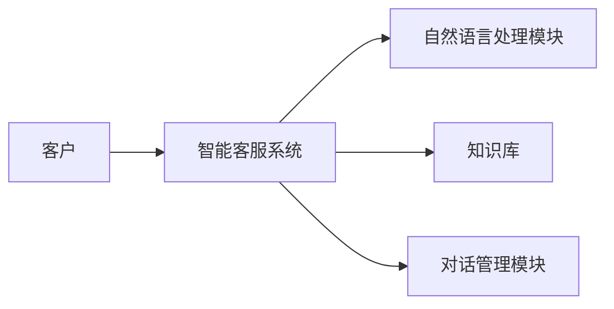
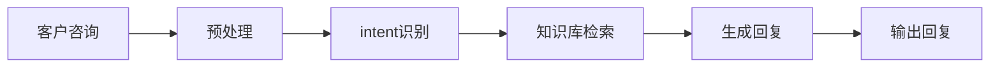
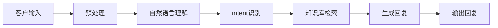
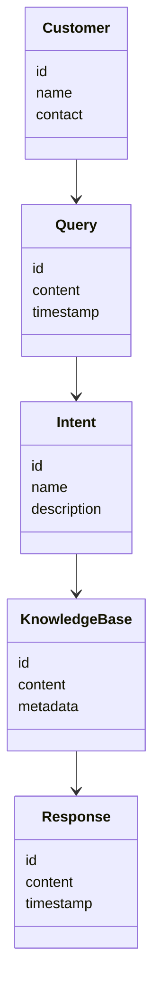
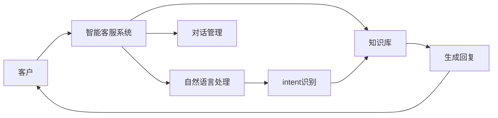

                 


# 构建智能企业客户服务系统：AI全渠道支持

## 关键词：智能客服系统, AI技术, 全渠道支持, 自然语言处理, 系统架构设计

## 摘要：  
随着企业对客户服务质量要求的不断提高，传统的客户服务模式已难以满足现代企业的需求。本文将详细介绍如何利用人工智能技术构建智能企业客户服务系统，并通过全渠道支持提升客户体验。文章将从背景介绍、核心概念、算法原理、系统架构设计、项目实战到最佳实践等多方面展开，深入剖析构建智能企业客户服务系统的全过程。通过本文的学习，读者将能够全面理解如何利用AI技术实现智能客服系统的全渠道支持，提升企业的客户服务质量。

---

## 第一部分: 智能企业客户服务系统概述

## 第1章: 智能企业客户服务系统背景与需求

### 1.1 企业客户服务系统的演变

#### 1.1.1 传统客户服务模式的局限性  
传统的客户服务模式主要依赖人工坐席，这种方式虽然能够提供个性化的服务，但存在以下问题：  
- **效率低**：人工坐席需要处理大量的重复性问题，效率难以提升。  
- **成本高**：需要大量的人力资源，运营成本较高。  
- **覆盖有限**：难以实现全渠道支持，客户体验不一致。  
- **响应慢**：在高峰时段或复杂问题上，客户可能需要长时间等待。  

#### 1.1.2 智能化客户服务的需求驱动  
随着人工智能技术的快速发展，企业开始意识到智能化客服系统的重要性。以下是推动智能化客户服务的主要需求：  
- **提升客户体验**：通过智能化系统实现快速响应和个性化服务。  
- **降低运营成本**：减少对人工坐席的依赖，降低人力成本。  
- **提高效率**：通过自动化处理简单的客户咨询，提升整体服务效率。  
- **全渠道支持**：满足客户通过多种渠道（如电话、邮件、社交媒体等）获取服务的需求。  

#### 1.1.3 全渠道支持的必要性  
现代客户习惯于通过多种渠道获取服务，企业需要通过全渠道支持来覆盖客户的多样化需求。全渠道支持不仅能够提升客户满意度，还能增强客户忠诚度。  

### 1.2 AI在企业客户服务中的应用价值

#### 1.2.1 提升客户体验的核心要素  
智能客服系统通过以下方式提升客户体验：  
- **快速响应**：利用AI技术实现24/7全天候服务，客户可以随时获取帮助。  
- **个性化服务**：通过客户数据和行为分析，提供个性化的解决方案。  
- **一致的服务质量**：AI系统能够保持一致的服务质量，避免因人工坐席情绪波动导致的服务质量不稳定。  

#### 1.2.2 AI技术对企业客户服务的赋能  
AI技术在企业客户服务中的应用主要体现在以下几个方面：  
- **自然语言处理（NLP）**：通过NLP技术理解客户的咨询内容，并生成合适的回复。  
- **意图识别**：识别客户的真实需求，提供精准的解决方案。  
- **知识库管理**：利用AI技术构建和维护知识库，确保信息的准确性和完整性。  

#### 1.2.3 全渠道整合的业务价值  
全渠道整合能够为企业带来以下好处：  
- **提升客户满意度**：客户可以通过自己喜欢的渠道获取服务，提升满意度。  
- **增强客户忠诚度**：通过一致的服务体验，增强客户对品牌的忠诚度。  
- **提升品牌形象**：全渠道整合能够展示企业的技术实力和创新能力。  

---

## 第2章: AI全渠道支持的核心概念与架构

### 2.1 核心概念解析

#### 2.1.1 AI在客户服务中的关键角色  
AI在客户服务中的关键角色包括：  
- **自然语言处理（NLP）**：理解客户的咨询内容并生成回复。  
- **意图识别**：识别客户的真实需求，提供精准的解决方案。  
- **知识库管理**：维护产品信息、常见问题解答等知识库内容。  
- **对话管理**：协调多个对话渠道，确保客户咨询的连贯性。  

#### 2.1.2 全渠道支持的定义与特点  
全渠道支持是指通过多种渠道（如电话、邮件、社交媒体、在线聊天等）为客户提供一致的服务体验。其特点包括：  
- **一致性**：无论客户选择哪种渠道，都能获得一致的服务体验。  
- **实时性**：客户可以通过多种渠道随时获取帮助。  
- **智能化**：通过AI技术实现自动化的咨询处理。  

#### 2.1.3 智能客服系统的整体架构  
智能客服系统的整体架构包括以下几个模块：  
- **用户咨询模块**：接收客户的咨询请求。  
- **预处理模块**：对客户的咨询请求进行预处理，如分词、去除停用词等。  
- **意图识别模块**：识别客户咨询的意图。  
- **知识库模块**：根据意图检索相关知识库内容。  
- **生成回复模块**：根据检索结果生成回复内容。  
- **输出模块**：将回复内容输出给客户。  

### 2.2 实体关系图与流程图

#### 2.2.1 实体关系图


#### 2.2.2 流程图


---

## 第3章: AI驱动的智能客服算法原理

### 3.1 算法流程图


### 3.2 算法实现代码

#### 3.2.1 预处理代码
```python
def preprocess(text):
    # 分词
    words = tokenize(text)
    # 去除停用词
    filtered = [word for word in words if word not in stop_words]
    return ' '.join(filtered)
```

#### 3.2.2 意图识别代码
```python
def intent_recognition(processed_text):
    # 使用机器学习模型进行意图识别
    model = load_model('intent_model')
    intent = model.predict(processed_text)
    return intent
```

#### 3.2.3 知识库检索代码
```python
def knowledge_retrieval(intent):
    # 根据意图检索知识库
    results = []
    for doc in knowledge_base:
        if intent in doc['metadata']:
            results.append(doc['content'])
    return results
```

#### 3.2.4 生成回复代码
```python
def generate_response(results):
    # 根据检索结果生成回复
    response = "根据您的问题，我找到以下信息：" + '\n'.join(results)
    return response
```

### 3.3 数学模型与公式

#### 3.3.1 余弦相似度计算
```latex
\text{similarity} = \frac{\vec{q} \cdot \vec{d}}{|\vec{q}| |\vec{d}|}
```

#### 3.3.2 概率计算公式
```latex
P(\text{intent} | \text{query}) = \frac{P(\text{query} | \text{intent}) \cdot P(\text{intent})}{P(\text{query})}
```

---

## 第4章: 系统架构设计与实现

### 4.1 系统功能模块设计

#### 4.1.1 功能模块设计


#### 4.1.2 系统架构图


---

## 第5章: 项目实战

### 5.1 环境安装与配置

```bash
pip install python-nltk
pip install scikit-learn
pip install spacy
pip install mermaid
```

### 5.2 核心代码实现

#### 5.2.1 自然语言处理模块
```python
import nltk
from sklearn.feature_extraction.text import TfidfVectorizer
from sklearn.metrics.pairwise import cosine_similarity

def preprocess(text):
    # 分词
    words = nltk.word_tokenize(text)
    # 去除停用词
    filtered = [word for word in words if word not in nltk.corpus.stopwords.words('english')]
    return ' '.join(filtered)

def vectorize(texts):
    vectorizer = TfidfVectorizer()
    vectors = vectorizer.fit_transform(texts)
    return vectors
```

#### 5.2.2 意图识别模块
```python
from sklearn.model_selection import train_test_split
from sklearn.linear_model import LogisticRegression

def train_intent_model(X, y):
    X_train, X_test, y_train, y_test = train_test_split(X, y, test_size=0.2)
    model = LogisticRegression()
    model.fit(X_train, y_train)
    return model

def predict_intent(model, vectorizer, text):
    vec = vectorizer.transform([text])
    intent = model.predict(vec)
    return intent
```

---

## 第6章: 最佳实践与小结

### 6.1 最佳实践

#### 6.1.1 数据质量管理
- 确保知识库数据的准确性和完整性。  
- 定期更新知识库内容，确保信息的及时性。  

#### 6.1.2 系统优化
- 定期监控系统性能，优化算法模型。  
- 根据客户需求调整系统功能模块。  

#### 6.1.3 客户反馈机制
- 建立客户反馈机制，收集客户对系统服务的评价和建议。  
- 根据客户反馈优化系统功能和服务流程。  

### 6.2 小结

通过本文的介绍，我们详细讲解了如何利用人工智能技术构建智能企业客户服务系统，并通过全渠道支持提升客户体验。从背景介绍到系统架构设计，再到项目实战，我们系统地剖析了构建智能客服系统的全过程。未来，随着AI技术的不断发展，智能企业客户服务系统将更加智能化、个性化，为企业客户提供更优质的服务体验。

---

## 注意事项

- 在实际项目中，需要根据具体需求调整系统功能模块和算法模型。  
- 确保数据安全和隐私保护，避免客户信息泄露。  
- 定期监控系统运行状态，及时发现和解决问题。  

---

## 拓展阅读

- [《自然语言处理入门》](https://zh-v2.com/)  
- [《机器学习实战》](https://zh-v2.com/)  
- [《企业级AI系统设计》](https://zh-v2.com/)  

---

## 作者

**作者：AI天才研究院/AI Genius Institute & 禅与计算机程序设计艺术 /Zen And The Art of Computer Programming**  

---

以上是完整的正文内容，如果需要调整或补充，请随时告诉我！

