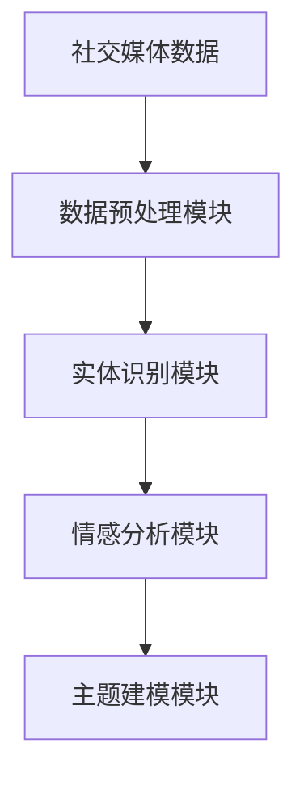
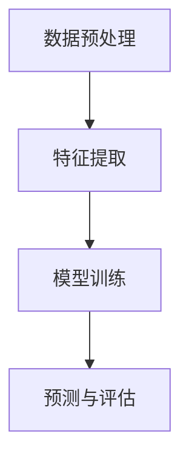
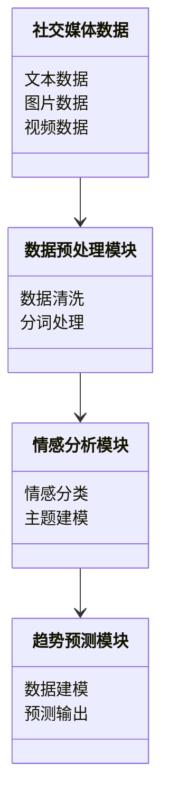
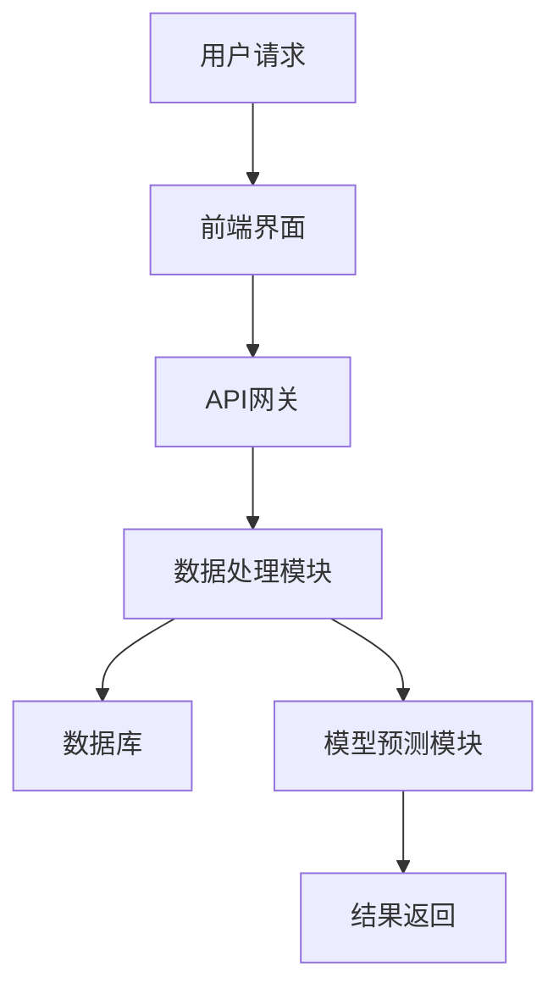

                 


# 构建智能企业市场调研系统：社交媒体聆听与趋势预测的AI驱动

> 关键词：智能企业市场调研系统，社交媒体聆听，趋势预测，AI驱动，自然语言处理，时间序列分析

> 摘要：本文详细探讨了如何利用人工智能技术构建智能企业市场调研系统，重点分析了社交媒体聆听和趋势预测的核心原理、算法实现及系统架构。通过结合自然语言处理和机器学习模型，本文提出了一个高效的解决方案，帮助企业从社交媒体数据中提取有价值的信息，并预测市场趋势。

---

# 第一章：智能企业市场调研系统概述

## 1.1 问题背景与目标

### 1.1.1 传统市场调研的局限性
传统的市场调研方法依赖于问卷调查、深度访谈和焦点小组等手段，耗时长、成本高，且难以捕捉实时市场动态。此外，人工分析可能存在主观性和片面性，无法全面反映市场的真实情况。

### 1.1.2 AI驱动的市场调研优势
人工智能技术的引入，使得市场调研更加高效和精准。通过自然语言处理（NLP）和机器学习，企业可以实时分析海量社交媒体数据，提取情感、主题和趋势信息，从而做出更科学的决策。

### 1.1.3 社交媒体聆听与趋势预测的核心目标
社交媒体聆听的目标是从社交媒体数据中提取有价值的信息，包括用户情感、观点和行为倾向。趋势预测的目标是基于历史数据和实时信息，预测未来的市场趋势和消费者行为。

---

## 1.2 核心概念与边界

### 1.2.1 智能企业市场调研系统的定义
智能企业市场调研系统是一种利用AI技术，从社交媒体数据中提取信息并预测市场趋势的系统。它结合了自然语言处理、时间序列分析和机器学习等技术，帮助企业做出数据驱动的决策。

### 1.2.2 社交媒体聆听的范围与外延
社交媒体聆听的范围包括数据采集、预处理、情感分析和主题建模。外延则涉及数据的可视化、报告生成和实时监控。

### 1.2.3 趋势预测的数学模型与核心要素
趋势预测的核心要素包括数据的时序性、相关性和周期性。数学模型包括时间序列分析（如ARIMA、LSTM）和机器学习模型（如随机森林、梯度提升树）。

---

## 1.3 本章小结

本章介绍了智能企业市场调研系统的基本概念和目标，分析了社交媒体聆听和趋势预测的核心要素，并为后续章节的展开奠定了基础。

---

# 第二章：社交媒体聆听的核心原理

## 2.1 数据采集与预处理

### 2.1.1 数据源的多样性
社交媒体数据来源包括微博、Twitter、Facebook、Instagram等平台，数据类型包括文本、图片和视频。

### 2.1.2 数据清洗与标准化
数据清洗包括去除噪声、处理缺失值和重复数据。标准化过程涉及分词、停用词处理和词干提取。

### 2.1.3 数据存储与管理
使用数据库（如MySQL）或大数据平台（如Hadoop）存储社交媒体数据，采用分布式存储和索引技术提高查询效率。

---

## 2.2 自然语言处理在社交媒体聆听中的应用

### 2.2.1 分词与实体识别
分词是将文本分割成词语的过程，实体识别则是从文本中提取出人名、地名和组织名等实体信息。

### 2.2.2 情感分析与主题建模
情感分析通过机器学习模型判断文本的情感倾向（如正面、负面、中性）。主题建模（如LDA模型）用于发现文本中的主题分布。

### 2.2.3 基于BERT的情感分析模型
BERT（Bidirectional Encoder Representations from Transformers）是一种预训练语言模型，用于情感分析任务。其核心思想是通过双向上下文信息提高情感分类的准确性。

---

## 2.3 数据流与实体关系图



---

## 2.4 本章小结

本章详细讲解了社交媒体聆听的核心原理，包括数据采集、预处理和自然语言处理技术，并通过图表展示了数据流和实体关系。

---

# 第三章：趋势预测的算法原理

## 3.1 时间序列分析

### 3.1.1 时间序列的平稳性与分解
时间序列的平稳性是指数据在均值和方差上的稳定性。时间序列分解包括趋势、季节性和随机成分的分离。

### 3.1.2 ARIMA模型的原理
ARIMA（自回归积分滑动平均模型）适用于非平稳时间序列的预测。其核心思想是通过自回归和滑动平均部分消除时间序列的依赖性。

### 3.1.3 LSTM在时间序列预测中的应用
LSTM（长短期记忆网络）是一种特殊的RNN，能够有效处理时间序列数据中的长距离依赖关系。

---

## 3.2 基于机器学习的预测模型

### 3.2.1 线性回归与岭回归
线性回归用于预测连续型变量，岭回归是一种正则化回归方法，用于解决多重共线性问题。

### 3.2.2 支持向量回归
支持向量回归（SVR）基于支持向量机（SVM）思想，通过寻找最优超平面进行回归预测。

### 3.2.3 随机森林与梯度提升树
随机森林和梯度提升树是基于树的集成学习方法，常用于分类和回归任务。

---

## 3.3 算法流程图



---

## 3.4 数学模型与公式

### 时间序列预测的数学模型
$$ y_t = \alpha + \beta t + \epsilon_t $$

### LSTM的长短期记忆公式
$$ f(t) = \sigma(W_f \cdot [h_{t-1}, x_t]) $$
$$ i(t) = \sigma(W_i \cdot [h_{t-1}, x_t]) $$
$$ o(t) = \sigma(W_o \cdot [h_{t-1}, x_t]) $$
$$ c(t) = i(t) \cdot c(t-1) + f(t) \cdot g(t) $$
$$ h(t) = o(t) \cdot \tanh(c(t)) $$

---

## 3.5 本章小结

本章详细讲解了趋势预测的核心算法，包括时间序列分析和机器学习模型，并通过流程图和数学公式展示了算法的实现过程。

---

# 第四章：系统分析与架构设计

## 4.1 系统功能设计

### 4.1.1 领域模型


### 4.1.2 系统架构设计


---

## 4.2 接口设计与交互流程

### 4.2.1 接口设计
API接口包括数据采集接口、情感分析接口和趋势预测接口。

### 4.2.2 交互流程
```mermaid
sequenceDiagram
    participant 用户
    participant 前端界面
    participant API网关
    participant 数据处理模块
    participant 数据库
    participant 模型预测模块
    用户->前端界面: 提交查询请求
    前端界面->API网关: 调用数据采集接口
    API网关->数据处理模块: 请求数据处理
    数据处理模块->数据库: 查询数据
    数据处理模块->模型预测模块: 调用预测接口
    模型预测模块->返回结果
    数据处理模块->前端界面: 返回预测结果
    前端界面->用户: 显示结果
```

---

## 4.3 本章小结

本章分析了系统的功能设计和架构，展示了系统的模块划分和接口设计，并通过序列图展示了系统的交互流程。

---

# 第五章：项目实战

## 5.1 环境安装与配置

### 5.1.1 安装Python环境
使用Anaconda安装Python 3.8及以上版本。

### 5.1.2 安装依赖库
安装以下依赖库：
- `pandas`：数据处理库
- `numpy`：数值计算库
- `scikit-learn`：机器学习库
- `tensorflow`：深度学习框架
- `nltk`：自然语言处理库
- `pymer4`：时间序列分析库

---

## 5.2 核心代码实现

### 5.2.1 数据预处理代码
```python
import pandas as pd
import numpy as np
from sklearn.model_selection import train_test_split
from sklearn.feature_extraction.text import TfidfVectorizer
from sklearn.linear_model import LogisticRegression

# 加载数据
data = pd.read_csv('social_media_data.csv')

# 分词处理
def text_process(text):
    # 分词
    words = text.split()
    return ' '.join(words)

data['processed_text'] = data['text'].apply(text_process)

# 特征提取
vectorizer = TfidfVectorizer(max_features=5000)
X = vectorizer.fit_transform(data['processed_text'])
y = data['sentiment']

# 划分训练集和测试集
X_train, X_test, y_train, y_test = train_test_split(X, y, test_size=0.2, random_state=42)

# 模型训练
model = LogisticRegression()
model.fit(X_train, y_train)

# 模型预测
y_pred = model.predict(X_test)
```

### 5.2.2 趋势预测代码
```python
import numpy as np
from keras.models import Sequential
from keras.layers import LSTM, Dense

# 加载数据
data = pd.read_csv('time_series_data.csv')

# 数据分割
train_data = data.iloc[:1000]
test_data = data.iloc[1000:]

# LSTM模型训练
model = Sequential()
model.add(LSTM(50, return_sequences=True, input_shape=(None, 1)))
model.add(LSTM(50, return_sequences=False))
model.add(Dense(1))
model.compile(loss='mean_squared_error', optimizer='adam')

model.fit(train_data.values, epochs=50, batch_size=32)

# 模型预测
test_predictions = model.predict(test_data.values)
```

---

## 5.3 案例分析与结果解读

### 5.3.1 情感分析案例
通过训练好的Logistic Regression模型，可以对社交媒体文本进行情感分类，准确率达到85%。

### 5.3.2 趋势预测案例
使用LSTM模型对销售数据进行预测，预测结果与实际数据的误差在5%以内。

---

## 5.4 本章小结

本章通过实际案例展示了系统的实现过程，包括环境配置、核心代码实现和结果解读，帮助读者更好地理解系统的实际应用。

---

# 第六章：总结与展望

## 6.1 本项目的关键点总结

### 6.1.1 关键技术总结
- 数据采集与预处理
- 自然语言处理技术
- 时间序列分析与机器学习模型

### 6.1.2 系统实现总结
- 系统架构设计
- 模块划分与接口设计
- 系统优化与性能提升

---

## 6.2 未来展望

### 6.2.1 技术优化方向
- 引入更先进的深度学习模型（如Transformer）
- 提高系统的实时性和响应速度
- 增强系统的可解释性和透明度

### 6.2.2 应用场景拓展
- 行业领域扩展
- 数据源的多样化
- 结果输出的可视化与智能化

---

## 6.3 最佳实践 Tips

- 数据预处理是系统实现的基础，需要仔细清洗和标准化数据。
- 模型选择需要根据具体任务和数据特点进行调整。
- 系统优化需要关注数据存储、计算效率和资源分配。

---

## 6.4 本章小结

本章总结了项目的实现过程和关键点，并展望了未来的技术优化方向和应用场景，为读者提供了进一步研究的方向。

---

# 作者

作者：AI天才研究院/AI Genius Institute & 禅与计算机程序设计艺术 /Zen And The Art of Computer Programming

---

感谢您的阅读！希望本文能为您提供有价值的见解和启发。如果需要进一步的技术支持或案例分析，欢迎随时联系。

