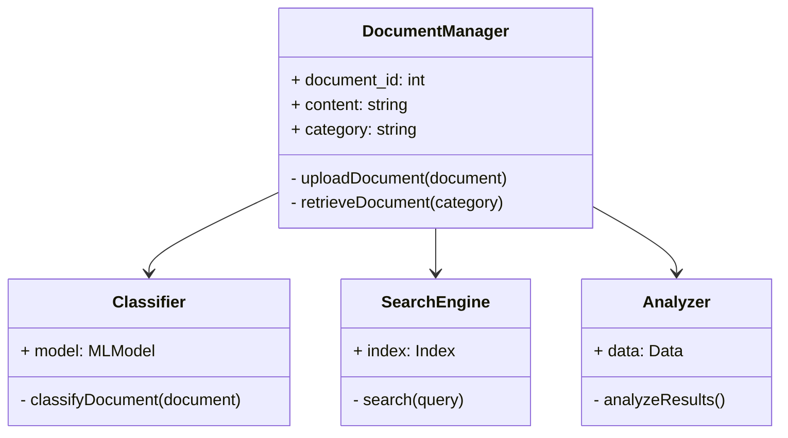
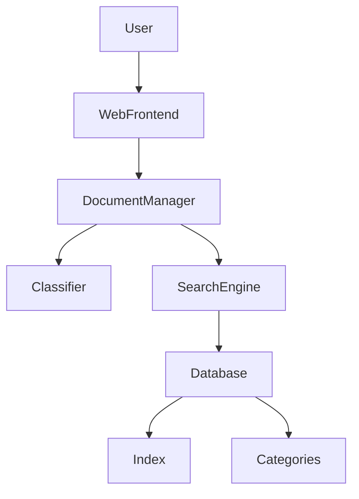

                 


# 构建智能企业文档管理系统：AI辅助分类与检索

## 关键词：智能文档管理、AI辅助分类、自然语言处理、机器学习、企业文档检索

## 摘要

在当今数字化转型的浪潮中，企业文档管理的重要性日益凸显。传统文档管理方式存在效率低、分类复杂、检索困难等问题，而人工智能（AI）技术的引入为这些问题提供了有效的解决方案。本文将详细探讨如何利用AI技术构建智能企业文档管理系统，重点介绍文档分类与检索的核心技术、系统架构设计以及实际项目实现。通过机器学习和自然语言处理技术，我们能够实现高效的文档自动化分类与智能检索，显著提升企业文档管理的效率和准确性。文章内容包括从背景介绍到系统设计，再到项目实战的全链条分析，帮助读者全面掌握构建智能文档管理系统的相关知识。

---

# 第1章: 企业文档管理的重要性

## 1.1 企业文档管理的核心问题

### 1.1.1 文档管理的基本概念

文档管理是指对企业的各类文件、报告、合同、技术资料等进行存储、分类、检索和归档的过程。传统的文档管理方式依赖于人工操作，存在效率低、分类复杂、检索困难等问题。

### 1.1.2 传统文档管理的局限性

- **分类复杂**：文档种类繁多，人工分类耗时且容易出错。
- **检索效率低**：面对海量文档，人工检索效率低下，难以快速找到所需文件。
- **缺乏智能化**：传统文档管理缺乏智能化手段，难以实现自动化处理和智能检索。

### 1.1.3 智能文档管理的必要性

随着企业文档数量的激增，传统的文档管理方式已无法满足需求。AI技术的引入能够通过自动化分类、智能检索和数据分析等功能，显著提升文档管理的效率和准确性。

## 1.2 AI在文档管理中的应用前景

### 1.2.1 AI技术如何提升文档管理效率

- **自动化分类**：通过机器学习和自然语言处理技术，AI能够自动对文档进行分类，减少人工干预。
- **智能检索**：基于深度学习的检索算法能够快速准确地找到所需文档，提高检索效率。
- **数据分析**：AI技术能够从文档中提取有价值的信息，为企业决策提供支持。

### 1.2.2 企业文档分类与检索的痛点

- **分类不准确**：传统分类方法依赖人工经验，容易出错。
- **检索效率低**：面对海量文档，人工检索耗时且效率低下。
- **信息孤岛**：文档分散在不同系统中，难以统一管理。

### 1.2.3 AI辅助文档管理的未来趋势

随着AI技术的不断发展，文档管理将更加智能化和自动化。未来的文档管理系统将具备更强的自适应能力和智能化功能，能够实时分析文档内容，提供个性化的管理服务。

---

# 第2章: 智能文档管理系统的核心概念

## 2.1 文档分类与检索的基本原理

### 2.1.1 文档分类的定义与方法

文档分类是指根据文档的内容、主题或属性，将其划分到不同的类别中。常见的分类方法包括基于规则的分类、基于统计的分类和基于机器学习的分类。

### 2.1.2 文档检索的定义与技术

文档检索是指通过一定的方法和工具，从文档库中快速找到所需文档的过程。常见的检索技术包括基于关键词的检索、基于语义的检索和基于内容的检索。

### 2.1.3 分类与检索的关系

文档分类和检索是相辅相成的过程。分类能够帮助缩小检索范围，而检索则需要依赖分类的准确性。

## 2.2 AI辅助文档管理的核心技术

### 2.2.1 机器学习在文档分类中的应用

机器学习是一种通过数据训练模型，使其能够自动分类文档的技术。常用的算法包括支持向量机（SVM）、随机森林和神经网络等。

### 2.2.2 自然语言处理在文档检索中的应用

自然语言处理（NLP）技术能够理解文档的内容和语义，从而提高检索的准确性。常见的NLP技术包括分词、实体识别和情感分析等。

### 2.2.3 深度学习模型在文档管理中的优势

深度学习模型，如卷积神经网络（CNN）和循环神经网络（RNN），在文档分类和检索中表现出色，能够处理复杂的文档结构和语义信息。

## 2.3 系统架构与功能概述

### 2.3.1 系统架构的基本组成

智能文档管理系统通常由前端界面、后端服务、数据库和AI处理模块组成。前端界面用于用户交互，后端服务负责业务逻辑处理，数据库用于存储文档和分类信息，AI处理模块负责文档的分类和检索。

### 2.3.2 系统功能模块划分

- **文档上传模块**：用户可以通过系统上传文档，系统会自动进行分类和存储。
- **分类管理模块**：管理员可以对分类进行管理和调整。
- **检索模块**：用户可以通过关键词或条件快速检索所需文档。
- **分析模块**：系统可以对文档进行数据分析，提取有价值的信息。

### 2.3.3 系统核心功能的实现逻辑

系统的核心功能包括文档上传、分类、检索和分析。上传的文档会经过预处理、特征提取和分类等步骤，最终存储到数据库中。检索时，系统会根据用户的查询条件，快速匹配并返回相关文档。

---

# 第3章: 机器学习与自然语言处理技术

## 3.1 机器学习基础

### 3.1.1 机器学习的基本概念

机器学习是一种通过数据训练模型，使其能够自动分类文档的技术。常用的算法包括支持向量机（SVM）、随机森林和神经网络等。

### 3.1.2 常见的机器学习算法

- **支持向量机（SVM）**：适用于小规模数据集，分类准确率高。
- **随机森林**：适用于大规模数据集，能够处理高维数据。
- **神经网络**：适用于复杂数据，分类能力强。

### 3.1.3 机器学习在文档分类中的应用

通过训练模型，机器学习能够自动对文档进行分类。例如，使用SVM对文档进行主题分类，或者使用随机森林对文档进行多分类。

## 3.2 自然语言处理技术

### 3.2.1 NLP的基本概念与技术

自然语言处理（NLP）是一种通过计算机理解、处理和生成人类语言的技术。常用的NLP技术包括分词、实体识别和情感分析等。

### 3.2.2 文本预处理与特征提取

文本预处理包括分词、去除停用词和词干提取等。特征提取则是将文本转换为向量，以便机器学习算法进行处理。

### 3.2.3 基于NLP的文档检索技术

通过NLP技术，系统能够理解用户的查询意图，并基于语义进行检索，提高检索的准确性。

## 3.3 深度学习在文档管理中的应用

### 3.3.1 深度学习的基本概念

深度学习是一种基于人工神经网络的机器学习技术，能够处理复杂的文档结构和语义信息。

### 3.3.2 深度学习模型在文档分类中的应用

常用的深度学习模型包括卷积神经网络（CNN）和循环神经网络（RNN）。这些模型在处理文本数据时表现出色，能够实现高精度的文档分类。

### 3.3.3 深度学习在文档检索中的应用

深度学习模型可以用于文本相似度计算，从而提高文档检索的准确性。

---

# 第4章: 系统设计与架构

## 4.1 系统功能设计

### 4.1.1 领域模型设计

系统功能模块包括文档上传、分类管理、检索模块和分析模块。每个模块都有明确的功能和职责。

### 4.1.2 领域模型类图

以下是系统功能模块的类图：



### 4.1.3 交互流程图

以下是系统交互流程图：

```mermaid
flowchart TD
    User --> DocumentManager: Upload document
    DocumentManager --> Classifier: Classify document
    DocumentManager --> SearchEngine: Index document
    User --> SearchEngine: Search query
    SearchEngine --> Classifier: Retrieve documents
    SearchEngine --> Analyzer: Analyze results
    SearchEngine --> User: Return results
```

## 4.2 系统架构设计

### 4.2.1 系统架构图

以下是系统的架构图：



### 4.2.2 模块划分与协作

系统模块包括前端界面、后端服务、AI处理模块和数据库。各模块协作完成文档的上传、分类、检索和分析。

---

# 第5章: 项目实战

## 5.1 环境搭建

### 5.1.1 开发环境安装

- **Python 3.8+**
- **TensorFlow 2.0+**
- **NLTK**
- **Jieba**
- **Flask**

### 5.1.2 数据集准备

需要准备一个包含多类别文档的数据集，例如科技、财经、法律等领域的文档。

## 5.2 系统核心实现

### 5.2.1 文档分类实现

使用TF-IDF进行特征提取，结合SVM进行分类。

```python
from sklearn.feature_extraction.text import TfidfVectorizer
from sklearn import svm

# 文档预处理
def preprocess(text):
    # 分词处理
    words = jieba.lcut(text)
    # 去除停用词
    filtered = [word for word in words if word not in stop_words]
    return ' '.join(filtered)

# 特征提取
vectorizer = TfidfVectorizer()
X = vectorizer.fit_transform(documents)

# 训练SVM分类器
clf = svm.SVC()
clf.fit(X, labels)

# 预测分类
test_text = "这是一篇关于人工智能的文章。"
test_vec = vectorizer.transform([test_text])
print(clf.predict(test_vec))
```

### 5.2.2 文档检索实现

使用余弦相似度进行语义检索。

```python
from sklearn.metrics.pairwise import cosine_similarity

# 计算余弦相似度
def compute_similarity(query, documents):
    vec = vectorizer.transform([query])
    similarities = cosine_similarity(vec, X)
    return similarities[0]

# 检索结果
query = "人工智能"
similarity_scores = compute_similarity(query, documents)
top_n = 5
results = [documents[i] for i in range(len(similarity_scores)) if similarity_scores[i] > 0.8][:top_n]
```

## 5.3 系统测试与优化

### 5.3.1 测试用例设计

设计多种测试用例，包括正常情况、边界情况和异常情况。

### 5.3.2 性能优化

优化算法和数据结构，提高分类和检索的效率。

---

# 第6章: 优化与扩展

## 6.1 系统性能优化

### 6.1.1 算法优化

通过调整模型参数和优化算法，提高分类和检索的效率和准确率。

### 6.1.2 数据优化

优化数据预处理流程，提高数据质量，减少噪声。

## 6.2 系统安全性提升

### 6.2.1 数据加密

对敏感数据进行加密存储，确保数据安全。

### 6.2.2 权限管理

实现用户权限管理，确保只有授权用户才能访问敏感文档。

## 6.3 系统扩展

### 6.3.1 与其他系统的集成

将智能文档管理系统与其他企业系统集成，例如ERP、CRM等。

### 6.3.2 功能扩展

增加更多的功能模块，例如文档版本管理、多人协作等。

---

# 第7章: 总结与展望

## 7.1 总结

本文详细探讨了构建智能企业文档管理系统的相关技术，包括AI辅助分类与检索的核心算法、系统架构设计和项目实战。通过机器学习和自然语言处理技术，我们能够实现高效的文档管理，显著提升企业的效率和竞争力。

## 7.2 展望

随着AI技术的不断发展，智能文档管理系统将更加智能化和自动化。未来的文档管理系统将具备更强的自适应能力和智能化功能，能够实时分析文档内容，提供个性化的管理服务。

---

# 作者

**作者：AI天才研究院/AI Genius Institute & 禅与计算机程序设计艺术 /Zen And The Art of Computer Programming**

