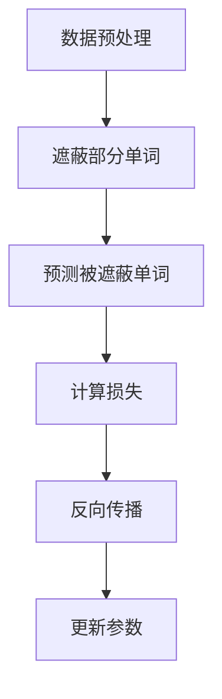
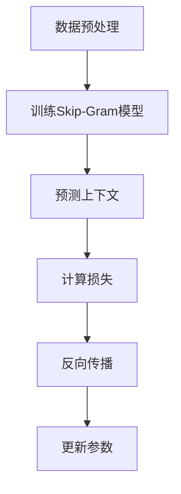
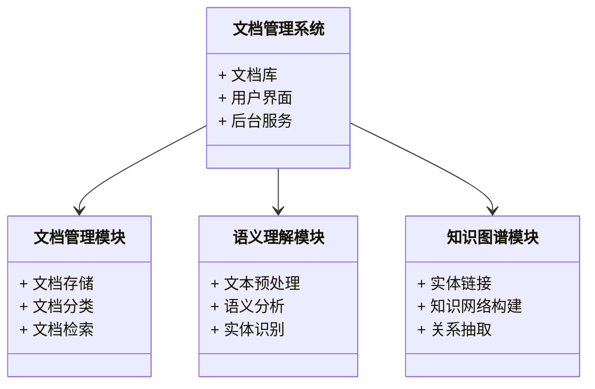
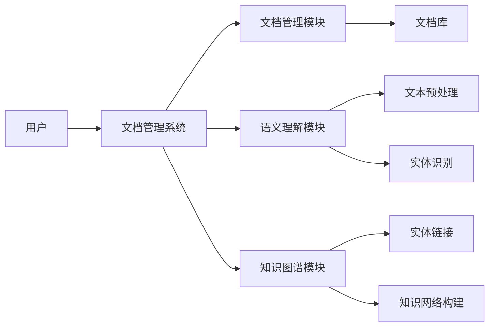
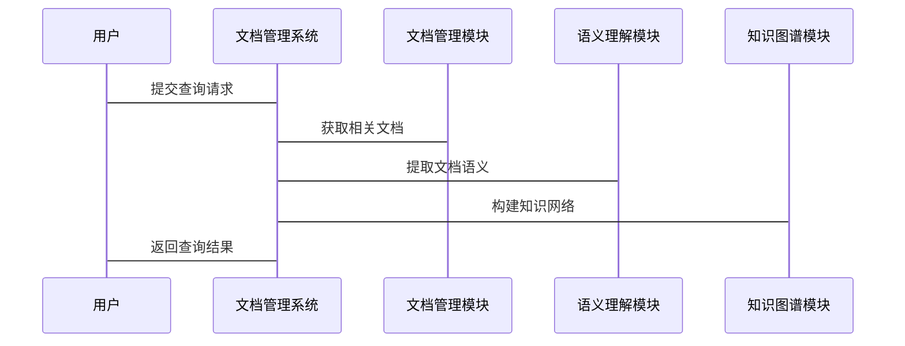

                 

<think>
嗯，用户希望我写一篇关于构建智能企业文档管理系统的技术博客，标题是《构建智能企业文档管理系统：语义理解与知识链接》。看起来这是一个挺专业的话题，涉及自然语言处理和知识图谱等技术。

首先，我需要理解用户的需求。他们可能是一位技术专家，或者是CTO，想要深入了解如何利用语义理解和知识链接来优化企业文档管理。用户还特别提到要结构清晰，逻辑严密，所以我要确保内容分章节详细，每部分都有足够的技术深度。

接下来，用户给了一个详细的目录结构，包括背景与概述、核心概念与技术、算法原理、系统架构设计、项目实战、最佳实践等部分。我需要按照这个结构来展开，每个章节下再细分小节，确保内容全面。

然后，我要考虑每个部分的具体内容。比如在背景与问题描述部分，需要分析传统文档管理的痛点，以及引入智能技术的必要性。核心概念部分要详细讲解语义理解、知识链接等术语，可能还需要对比分析和实体关系图。

在算法原理部分，我需要解释BERT和Word2Vec的工作原理，用流程图和代码示例来说明。同时，数学公式要用LaTeX格式呈现，确保准确性和易读性。

系统架构设计方面，我需要描述模块的功能，使用类图和架构图来展示结构。项目实战部分则需要提供环境安装步骤、代码实现和案例分析，让读者能够实际操作。

最后，最佳实践部分要总结经验，给出注意事项和扩展阅读的建议，帮助读者更好地应用这些技术。

现在，我需要按照这些思路组织内容，确保逻辑连贯，技术细节到位。同时，语言要专业但不失清晰，避免过于晦涩，让读者容易理解。可能还需要检查每个部分是否覆盖了用户要求的所有要素，确保没有遗漏。

总的来说，我需要一步步地构建这篇文章，从背景到技术，再到实现和应用，确保每个环节都详细且有深度，满足用户的需求。
</think>

# 构建智能企业文档管理系统：语义理解与知识链接

> 关键词：智能文档管理，语义理解，知识链接，知识图谱，自然语言处理

> 摘要：本文详细探讨了如何构建智能企业文档管理系统，重点介绍了语义理解与知识链接的核心技术。通过分析企业文档管理的现状与挑战，结合语义理解算法和知识图谱构建方法，提出了一套完整的解决方案，并通过项目实战展示了技术实现过程。

---

# 第一部分: 背景与问题描述

## 第1章: 背景与问题描述

### 1.1 企业文档管理的现状与挑战

随着企业数字化转型的推进，文档管理已成为企业运营的核心环节。传统的文档管理系统主要依赖关键字匹配和基于规则的检索，难以应对以下问题：

- **信息孤岛**：文档分散在不同系统中，难以统一管理和利用。
- **语义理解不足**：基于关键字的检索无法准确理解文档内容，导致搜索效率低下。
- **知识关联性弱**：文档之间的关联性未被充分利用，难以支持知识共享与复用。
- **数据碎片化**：文档内容分散，缺乏结构化处理，难以支持智能分析。

### 1.2 问题描述

智能企业文档管理系统的目标是通过语义理解与知识链接技术，解决以下问题：

- **提升检索效率**：通过语义理解实现智能检索，减少误检和漏检。
- **增强知识关联性**：通过知识链接技术，构建文档间的语义网络，支持跨文档的知识推理。
- **支持智能分析**：通过结构化处理和知识图谱构建，实现文档内容的深度分析与利用。

### 1.3 解决方案

结合自然语言处理（NLP）技术和知识图谱构建方法，本文提出了一套智能企业文档管理系统的解决方案，包括以下步骤：

1. **文档预处理**：对文档进行分词、句法分析和实体识别。
2. **语义理解**：利用深度学习模型（如BERT、Word2Vec）提取文档语义信息。
3. **知识图谱构建**：基于语义理解结果，构建文档间的关系网络。
4. **智能检索与分析**：结合语义理解与知识图谱，实现智能检索和知识推理。

### 1.4 边界与外延

本文主要关注语义理解与知识链接技术在企业文档管理中的应用，暂不涉及文档存储与安全性问题。边界包括：

- 文档范围：企业内部文档（如报告、合同、技术文档）。
- 功能范围：智能检索、知识关联与分析。
- 数据范围：结构化与非结构化文档的混合处理。

### 1.5 核心要素

- **语义理解**：基于NLP技术实现文档内容的理解与表示。
- **知识链接**：构建文档间的语义网络，支持知识推理。
- **知识图谱**：用于存储和管理文档间的语义关系。
- **智能检索**：基于语义理解实现高效检索。

---

# 第二部分: 核心概念与技术原理

## 第2章: 核心概念与技术原理

### 2.1 语义理解的核心概念

#### 2.1.1 语义理解的定义

语义理解是指通过自然语言处理技术，理解文本的语义信息，提取文本中的实体、关系和意图。语义理解的核心在于将非结构化的文本转化为结构化的语义表示。

#### 2.1.2 语义理解的关键技术

- **分词与词性标注**：将文本分割成词语，并标注词语的词性。
- **句法分析**：分析句子的语法结构，识别主谓宾关系。
- **实体识别**：识别文本中的命名实体（如人名、地名、组织名）。
- **关系抽取**：提取文本中的实体关系（如“XX公司与XX部门存在合作关系”）。
- **语义表示**：将文本转化为向量表示（如Word2Vec、BERT）。

#### 2.1.3 语义理解的实现方法

- **基于规则的方法**：通过预定义规则进行文本分析。
- **统计学习方法**：基于机器学习模型（如SVM、随机森林）进行文本分类。
- **深度学习方法**：利用神经网络（如RNN、BERT）进行语义理解。

### 2.2 知识链接的原理与应用

#### 2.2.1 知识链接的定义

知识链接是指将文档中的实体、概念和事件与外部知识库（如维基百科、知识图谱）进行关联，构建文档间的语义网络。

#### 2.2.2 知识链接的实现技术

- **知识图谱构建**：将文档中的实体和关系表示为知识图谱中的节点和边。
- **实体链接**：将文档中的实体与知识库中的实体进行映射。
- **语义网络构建**：基于实体链接结果，构建文档间的语义网络。

#### 2.2.3 知识链接的应用场景

- **跨文档推理**：通过知识链接实现跨文档的知识推理。
- **智能问答**：基于知识图谱提供更精准的问答服务。
- **知识共享**：通过知识链接实现文档间知识的共享与复用。

### 2.3 语义理解与知识链接的对比分析

#### 2.3.1 核心概念对比表格

| 对比维度         | 语义理解                      | 知识链接                      |
|------------------|-----------------------------|-----------------------------|
| 目标             | 理解文本的语义信息            | 构建文档间的语义网络          |
| 输入             | 文本内容                     | 文本中的实体与关系           |
| 输出             | 文本的语义表示                | 文档间的语义网络             |
| 技术基础         | NLP技术（如分词、实体识别）   | 知识图谱构建技术             |
| 应用场景         | 智能检索、文本分类           | 跨文档推理、智能问答         |

#### 2.3.2 ER实体关系图架构

以下是文档管理系统中实体关系的ER图：

```mermaid
er
actor: 用户 {
  id: int
  username: string
  password: string
}
document: 文档 {
  id: int
  title: string
  content: string
  create_time: datetime
}
metadata: 元数据 {
  id: int
  document_id: int
  key: string
  value: string
}
entity: 实体 {
  id: int
  name: string
  type: string
}
relation: 关系 {
  id: int
  entity1_id: int
  entity2_id: int
  relation_type: string
}
```

---

# 第三部分: 算法原理与实现

## 第3章: 语义理解算法原理

### 3.1 基于深度学习的语义理解算法

#### 3.1.1 BERT模型的原理

BERT（Bidirectional Encoder Representations from Transformers）是一种基于Transformer的预训练语言模型，通过双向编码实现语义理解。BERT的训练目标包括：

1. **Masked Language Model (MLM)**：随机遮蔽部分单词，预测被遮蔽单词的词义。
2. **Next Sentence Prediction (NSP)**：预测下一句话是否是原文档的下一句。

#### 3.1.2 Word2Vec模型的原理

Word2Vec是一种将词语映射为低维向量的模型，主要包含两种实现方式：

1. **CBOW（Continuous Bag of Words）**：基于上下文预测当前词。
2. **Skip-Gram（连续跳跃）**：基于当前词预测上下文。

#### 3.1.3 模型训练与优化

以下是BERT模型的训练流程：



以下是Word2Vec模型的训练流程：



### 3.2 算法实现代码示例

以下是BERT模型的Python实现示例：

```python
import torch
import torch.nn as nn
import torch.nn.functional as F

class BERT(nn.Module):
    def __init__(self, vocab_size, hidden_size=768):
        super(BERT, self).__init__()
        self.token_embeddings = nn.Embedding(vocab_size, hidden_size)
        self.position_embeddings = nn.Embedding(512, hidden_size)
        self.transformer_layers = nn.ModuleList([
            nn.TransformerEncoderLayer(hidden_size, nhead=8)
            for _ in range(6)
        ])
        self.dropout = nn.Dropout(0.1)

    def forward(self, input_ids):
        token_embeddings = self.token_embeddings(input_ids)
        position_embeddings = self.position_embeddings(torch.arange(input_ids.size(1), device=input_ids.device).unsqueeze(0).repeat(input_ids.size(0), 1))
        embeddings = token_embeddings + position_embeddings
        embeddings = self.dropout(embeddings)
        for layer in self.transformer_layers:
            embeddings = layer(embeddings)
        return embeddings
```

以下是Word2Vec模型的Python实现示例：

```python
import torch
import torch.nn as nn
import torch.nn.functional as F

class Word2Vec(nn.Module):
    def __init__(self, vocab_size, embedding_dim=100):
        super(Word2Vec, self).__init__()
        self.embedding = nn.Embedding(vocab_size, embedding_dim)
        self.context = nn.Linear(embedding_dim, embedding_dim)
        self.dropout = nn.Dropout(0.5)

    def forward(self, input_words):
        embed = self.embedding(input_words)
        embed = self.dropout(embed)
        context = self.context(embed.mean(dim=1))
        return context
```

### 3.3 数学模型与公式

#### 3.3.1 BERT模型的数学公式

BERT的损失函数包括MLM损失和NSP损失：

$$
\text{MLM损失} = -\sum_{i=1}^{N} \log p(w_i|x)
$$

$$
\text{NSP损失} = -\log p(y|x)
$$

其中，$w_i$ 是被遮蔽的单词，$x$ 是上下文，$y$ 是句子的标签（0表示不是下一句，1表示是下一句）。

#### 3.3.2 Word2Vec模型的数学公式

Word2Vec的损失函数可以表示为：

$$
\text{损失} = -\sum_{i=1}^{N} \log p(w_{i+1}|w_i)
$$

其中，$w_{i}$ 是当前词，$w_{i+1}$ 是上下文词。

---

# 第四部分: 系统分析与架构设计

## 第4章: 系统分析与架构设计

### 4.1 问题场景介绍

本文设计的智能企业文档管理系统主要用于企业内部文档的智能管理，解决以下问题：

- **文档检索效率低**：传统关键字检索无法准确理解文档内容。
- **知识共享不足**：文档之间的关联性未被充分利用。
- **分析能力有限**：无法支持深度语义分析与知识推理。

### 4.2 系统功能设计

以下是系统功能模块的类图：



### 4.3 系统架构设计

以下是系统的架构图：



### 4.4 系统接口设计

以下是系统接口设计的序列图：



---

# 第五部分: 项目实战

## 第5章: 项目实战

### 5.1 环境安装与配置

以下是项目实战所需的环境安装步骤：

1. **安装Python**：确保安装了Python 3.8或更高版本。
2. **安装PyTorch**：使用以下命令安装：
   ```bash
   pip install torch torchvision torchaudio
   ```
3. **安装Hugging Face库**：使用以下命令安装：
   ```bash
   pip install transformers
   ```

### 5.2 核心代码实现

以下是项目实战的核心代码实现：

```python
from transformers import BertTokenizer, BertModel
import torch

# 初始化BERT分词器和模型
tokenizer = BertTokenizer.from_pretrained('bert-base-cased')
model = BertModel.from_pretrained('bert-base-cased')

# 定义输入文本
text = "This is an example sentence."

# 分词
tokens = tokenizer(text, return_tensors='pt')

# 模型编码
with torch.no_grad():
    outputs = model(**tokens)
    sentence_embedding = outputs.last_hidden_state[:, 0, :]

# 提取语义向量
semantic_vector = sentence_embedding.numpy()

print(semantic_vector)
```

### 5.3 代码应用解读与分析

以上代码实现了基于BERT模型的语义向量提取，主要步骤包括：

1. **分词**：使用BERT分词器对输入文本进行分词。
2. **编码**：将分词后的文本输入BERT模型，获取句向量。
3. **提取语义向量**：从BERT模型的输出中提取语义向量。

### 5.4 实际案例分析

假设我们有以下两篇文档：

- 文档1： "我们的公司成立于2020年。"
- 文档2： "公司总部位于上海。"

通过BERT模型提取语义向量后，可以计算两篇文档之间的余弦相似度：

$$
\text{余弦相似度} = \frac{\text{向量1} \cdot \text{向量2}}{|\text{向量1}| \cdot |\text{向量2}|}
$$

通过计算，可以发现两篇文档的相似度较高，从而支持知识图谱中的关联性分析。

---

# 第六部分: 最佳实践与总结

## 第6章: 最佳实践与总结

### 6.1 小结

本文详细探讨了智能企业文档管理系统的构建过程，重点介绍了语义理解与知识链接的核心技术。通过分析企业文档管理的现状与挑战，结合自然语言处理和知识图谱技术，提出了一套完整的解决方案。

### 6.2 注意事项

在实际应用中，需要注意以下问题：

- **数据质量**：语义理解的效果依赖于高质量的训练数据。
- **模型选择**：选择适合具体场景的语义理解模型。
- **性能优化**：优化模型的推理速度和资源占用。

### 6.3 扩展阅读

- **自然语言处理**：深入学习BERT、GPT等模型的原理与应用。
- **知识图谱**：研究知识图谱的构建与应用，如图神经网络。
- **智能检索**：探索更高效的检索算法，如DPR（Dual Encoding）。

---

作者：AI天才研究院/AI Genius Institute & 禅与计算机程序设计艺术 /Zen And The Art of Computer Programming

