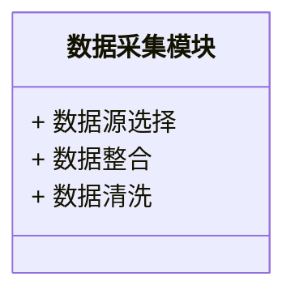
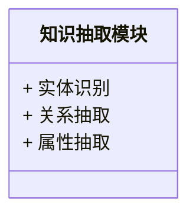
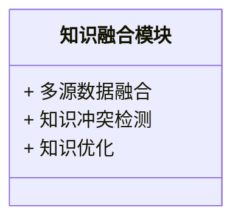

                 


```
# 构建智能企业知识图谱：深化领域理解与应用

> 关键词：知识图谱，企业智能，数据建模，知识工程，深度学习

> 摘要：知识图谱作为一种强大的知识表示和组织技术，正在为企业智能化转型提供有力支持。本文将系统地介绍知识图谱的核心概念、构建方法、算法原理及实际应用，深入探讨如何通过知识图谱深化对企业业务的理解与应用。文章结合实际案例，详细讲解了知识图谱在企业中的构建流程、技术实现及系统架构设计，并给出了最佳实践与未来发展方向的展望。

---

# 第一部分: 知识图谱与企业智能应用概述

# 第1章: 知识图谱的基本概念与背景

## 1.1 什么是知识图谱
### 1.1.1 知识图谱的定义
知识图谱是一种以图结构形式表示知识的技术，由实体（概念）、关系和属性组成，用于描述真实世界中的各种实体及其之间的关联。

### 1.1.2 知识图谱的核心要素：实体、关系、属性
- **实体**：知识图谱的基本组成单元，代表现实世界中的具体事物或抽象概念。
- **关系**：描述实体之间的关联，通常是动词短语或名词短语。
- **属性**：描述实体的特性或特征，通常以属性-值对的形式存在。

### 1.1.3 知识图谱的构建目标与价值
- **目标**：构建一个完整、准确、可扩展的知识库，支持智能检索、推理和决策。
- **价值**：提升企业数据利用率，支持智能决策，促进跨部门知识共享。

## 1.2 知识图谱的技术背景
### 1.2.1 知识图谱与语义理解
知识图谱通过语义理解技术，将文本数据转化为结构化的知识表示，为自然语言处理提供支持。

### 1.2.2 知识图谱与大数据技术的结合
大数据技术为知识图谱的构建提供了海量数据支持，而知识图谱则为大数据分析提供了语义理解能力。

### 1.2.3 知识图谱在企业中的应用前景
知识图谱在企业中的应用前景广阔，包括智能搜索、推荐系统、知识管理、智能问答等领域。

## 1.3 企业知识图谱的构建意义
### 1.3.1 提升企业数据利用率
通过结构化知识表示，企业可以更高效地利用数据，挖掘潜在价值。

### 1.3.2 支持智能决策
知识图谱为企业的智能决策提供了知识支持，能够帮助企业在复杂场景中做出更明智的决策。

### 1.3.3 促进跨部门知识共享
知识图谱将分散在不同部门的知识整合起来，促进跨部门的知识共享与协作。

## 1.4 本章小结
本章介绍了知识图谱的基本概念、核心要素及其在企业中的应用价值，为后续内容奠定了基础。

---

# 第二部分: 知识图谱的核心概念与联系

# 第2章: 知识图谱的核心概念解析

## 2.1 知识图谱的构成要素
### 2.1.1 实体与概念
- **实体**：具体事物，如“苹果”、“知识图谱”。
- **概念**：抽象概念，如“水果”、“技术”。

### 2.1.2 关系与属性
- **关系**：描述实体之间的关联，如“属于”、“包含”。
- **属性**：描述实体的特性，如“颜色”、“形状”。

### 2.1.3 知识图谱的结构特征
知识图谱通常以图结构表示，包含节点（实体或概念）和边（关系）。

## 2.2 知识图谱的核心原理
### 2.2.1 实体识别与链接
通过自然语言处理技术，从文本中识别实体并建立实体间的链接。

### 2.2.2 关系抽取与建模
从文本中抽取关系，并将其建模为结构化的知识表示。

### 2.2.3 属性抽取与扩展
从文本中抽取属性，并扩展成结构化的属性-值对。

## 2.3 知识图谱的表示方法
### 2.3.1 三元组表示法
三元组表示法：（实体，关系，实体/属性-值）。

### 2.3.2 图结构表示法
图结构表示法：通过节点和边表示实体及其关系。

### 2.3.3 知识图谱的层次化组织
层次化组织：将知识图谱按层次结构进行组织，便于管理和查询。

## 2.4 本章小结
本章详细讲解了知识图谱的核心概念及其表示方法，为后续的构建与应用奠定了理论基础。

---

# 第三部分: 知识图谱的构建方法与技术

# 第3章: 知识图谱的构建流程

## 3.1 数据采集与预处理
### 3.1.1 数据源的选择与整合
从多种数据源（如数据库、文档、网页等）采集数据，并进行整合。

### 3.1.2 数据清洗与标准化
对采集的数据进行清洗，去除噪声，并进行标准化处理。

### 3.1.3 数据标注与结构化
将非结构化数据标注为结构化的知识表示。

## 3.2 知识抽取与建模
### 3.2.1 实体识别与抽取
使用自然语言处理技术从文本中识别实体。

### 3.2.2 关系抽取与建模
从文本中抽取关系，并将其建模为结构化的知识表示。

### 3.2.3 属性抽取与扩展
从文本中抽取属性，并扩展成结构化的属性-值对。

## 3.3 知识融合与优化
### 3.3.1 多源数据融合
将来自不同数据源的知识进行融合，消除冲突。

### 3.3.2 知识冲突检测与解决
检测知识图谱中的冲突，并进行解决。

### 3.3.3 知识图谱的优化与完善
对知识图谱进行优化，提升其准确性和完整性。

## 3.4 本章小结
本章详细讲解了知识图谱的构建流程，包括数据采集与预处理、知识抽取与建模、知识融合与优化等步骤。

---

# 第四部分: 知识图谱的算法原理与实现

# 第4章: 知识图谱的表示学习

## 4.1 知识图谱表示学习的概述
### 4.1.1 表示学习的目标
将知识图谱中的实体和关系表示为低维向量，便于后续的计算和推理。

### 4.1.2 常见的表示学习方法
- **基于矩阵分解的表示学习**：如Skip-Gram、CBOW等。
- **基于神经网络的表示学习**：如GloVe、BERT等。

## 4.2 知识图谱表示学习的算法实现
### 4.2.1 基于矩阵分解的表示学习
- **矩阵分解模型**：将知识图谱中的实体和关系表示为矩阵中的行和列。
- **实现步骤**：
  1. 初始化实体向量和关系向量。
  2. 训练模型，优化向量，使预测值与实际值一致。

### 4.2.2 基于神经网络的表示学习
- **神经网络模型**：如GraphSAGE、GAT等。
- **实现步骤**：
  1. 构建图结构，输入节点特征。
  2. 使用神经网络进行特征提取和表示学习。

### 4.2.3 常见算法的优缺点对比
| 算法名称 | 优点 | 缺点 |
|----------|------|------|
| 矩阵分解 | 简单高效 | 不适合大规模数据 |
| 神经网络 | 表示能力强 | 需要大量数据和计算资源 |

## 4.3 知识图谱表示学习的数学模型
### 4.3.1 矩阵分解模型的数学公式
$$
\text{预测值} = \text{实体向量} \times \text{关系向量} \times \text{实体向量}^T
$$

### 4.3.2 神经网络模型的数学公式
$$
\text{输出} = \text{输入} \times \text{权重} + \text{偏置} \times \text{激活函数}
$$

## 4.4 本章小结
本章详细讲解了知识图谱的表示学习方法，包括矩阵分解和神经网络两种主要方法，并给出了具体的数学模型和实现步骤。

---

# 第五部分: 知识图谱的系统架构与设计

# 第5章: 知识图谱系统的架构设计

## 5.1 系统功能设计
### 5.1.1 数据采集模块
- 负责从多种数据源采集数据。
- 使用Mermaid类图表示：



### 5.1.2 知识抽取模块
- 负责从数据中抽取实体、关系和属性。
- 使用Mermaid类图表示：



### 5.1.3 知识融合模块
- 负责融合多源数据，消除冲突。
- 使用Mermaid类图表示：



## 5.2 系统架构设计
### 5.2.1 分层架构设计
- **数据层**：存储原始数据和结构化知识。
- **服务层**：提供知识抽取、融合和表示学习的服务。
- **应用层**：提供用户接口，支持知识查询和应用。

### 5.2.2 系统接口设计
- **输入接口**：接收原始数据和用户查询。
- **输出接口**：返回结构化知识和查询结果。

### 5.2.3 系统交互流程
- 用户提交查询请求。
- 系统从数据层提取知识。
- 系统返回查询结果。

## 5.3 本章小结
本章详细讲解了知识图谱系统的架构设计，包括功能模块划分、系统架构设计和系统交互流程。

---

# 第六部分: 知识图谱的项目实战

# 第6章: 知识图谱的项目实战

## 6.1 环境安装与配置
### 6.1.1 安装Python环境
- 使用Anaconda安装Python 3.8以上版本。

### 6.1.2 安装依赖库
- 使用pip安装numpy、pandas、networkx、tensorflow等库。

## 6.2 系统核心实现
### 6.2.1 数据预处理
```python
import pandas as pd

def preprocess_data(data):
    # 数据清洗
    data = data.dropna()
    # 数据标准化
    data = data.astype(str)
    return data
```

### 6.2.2 知识抽取与建模
```python
from sklearn.feature_extraction.text import TfidfVectorizer

vectorizer = TfidfVectorizer()
tfidf = vectorizer.fit_transform(texts)
```

### 6.2.3 知识图谱的表示学习
```python
import tensorflow as tf

def model_fn():
    input_layer = tf.keras.layers.Input(shape=(100,))
    dense_layer = tf.keras.layers.Dense(64, activation='relu')(input_layer)
    output_layer = tf.keras.layers.Dense(1, activation='sigmoid')(dense_layer)
    model = tf.keras.Model(inputs=input_layer, outputs=output_layer)
    return model
```

## 6.3 实际案例分析
### 6.3.1 案例背景
- 以某企业的产品知识图谱构建为例。

### 6.3.2 案例分析
- 数据采集：从企业产品文档中提取产品信息。
- 知识抽取：抽取产品名称、功能、用途等信息。
- 知识融合：整合不同文档中的产品信息，消除冲突。

## 6.4 项目小结
本章通过实际案例展示了知识图谱的构建过程，包括环境配置、核心代码实现和案例分析。

---

# 第七部分: 知识图谱的最佳实践与展望

# 第7章: 最佳实践与小结

## 7.1 最佳实践
### 7.1.1 数据质量的重要性
- 确保数据的准确性、完整性和一致性。

### 7.1.2 模型选择与调优
- 根据具体场景选择合适的模型，并进行调优。

### 7.1.3 知识图谱的可扩展性
- 设计可扩展的架构，方便后续数据的扩展和模型的更新。

## 7.2 小结
知识图谱作为一种强大的知识表示和组织技术，正在为企业智能化转型提供有力支持。本文系统地介绍了知识图谱的核心概念、构建方法、算法原理及实际应用，深入探讨了如何通过知识图谱深化对企业业务的理解与应用。

## 7.3 注意事项
- 数据隐私和安全问题需要特别关注。
- 知识图谱的构建和应用需要结合企业的具体需求。

## 7.4 未来展望
- 知识图谱与人工智能的深度融合。
- 知识图谱在更多领域的应用探索。

---

# 作者：AI天才研究院 & 禅与计算机程序设计艺术
```

