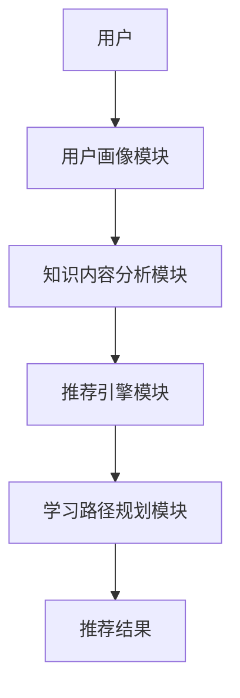
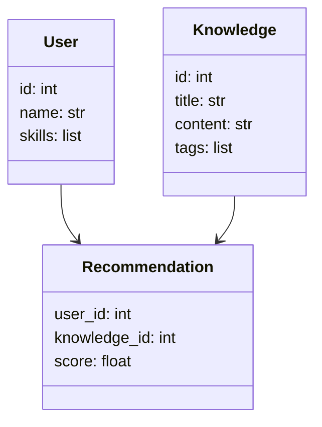
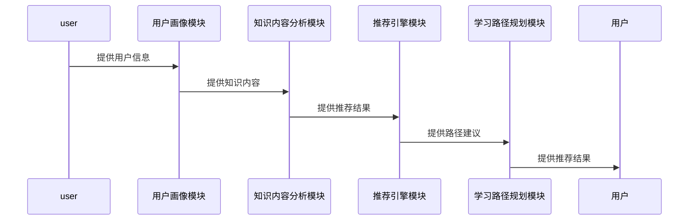

                 

<think>
好的，我现在要帮用户撰写一篇关于《构建智能企业知识推荐系统：个性化学习与技能提升路径规划》的技术博客文章。用户希望文章结构清晰、逻辑性强，并且包含详细的技术内容，包括背景介绍、核心概念、算法原理、系统架构、项目实战等多个部分。

首先，我需要理解用户的需求。用户是一位技术专家，希望文章内容专业且有深度，适合技术博客的读者。因此，我需要确保内容不仅涵盖理论，还要有实际的代码示例和系统设计图，帮助读者理解和应用这些知识。

接下来，我会按照用户提供的目录大纲开始撰写。第一部分是背景与概述，包括问题背景、需求分析和目标。这部分需要介绍知识经济时代的重要性，企业知识管理的挑战，以及个性化学习的必要性。我需要详细解释这些问题，并给出清晰的定义和目标，让读者明白为什么需要构建这样的推荐系统。

第二部分是核心概念与系统架构。这里需要详细讲解推荐系统的原理，包括协同过滤、基于内容的推荐和深度学习推荐方法。同时，还需要对比不同算法的特征，并用表格和Mermaid图展示。这部分内容需要理论与实际结合，帮助读者理解各种方法的区别和应用场景。

第三部分是算法原理讲解。我会选择协同过滤算法作为例子，详细推导其数学模型，并用Python代码实现。这部分需要包括公式推导、代码解释，以及用Mermaid流程图展示算法步骤，确保读者能够理解并实际操作。

第四部分是系统分析与架构设计。我需要描述推荐系统的应用场景，设计系统功能模块，并用Mermaid图展示类图和架构图。同时，还需要详细说明接口设计和交互流程，帮助读者理解系统的整体结构和模块之间的关系。

第五部分是项目实战。我会提供一个电商推荐系统的案例，详细说明环境安装、代码实现、系统测试等步骤。这部分需要包括可运行的代码示例，让读者能够实际操作并应用所学知识。

最后，我会总结最佳实践，给出小结、注意事项和拓展阅读内容，帮助读者巩固所学知识，并指导他们在实际项目中如何应用这些技术。

在撰写过程中，我需要确保每个部分都有足够的细节，同时保持整体结构的简洁和逻辑性。我会使用技术性的语言，但尽量避免过于复杂的术语，让文章既专业又易懂。此外，我还会插入图表和代码示例，以增强文章的可读性和实用性。

通过以上步骤，我将逐步完成这篇技术博客文章的撰写，确保内容全面、结构清晰，满足用户的需求。
</think>

# 构建智能企业知识推荐系统：个性化学习与技能提升路径规划

## 关键词：智能推荐系统、个性化学习、知识图谱、机器学习、路径规划

## 摘要：本文详细探讨了构建智能企业知识推荐系统的各个方面，从问题背景到系统架构设计，结合实际案例，深入分析了个性化学习与技能提升路径规划的核心原理和实现方法。

---

## 第一部分: 智能企业知识推荐系统背景与概述

### 第1章: 问题背景与需求分析

#### 1.1 问题背景
##### 1.1.1 知识经济时代的到来
在知识经济时代，企业之间的竞争不仅取决于物质资源的多少，更取决于知识的创造、传播和应用能力。知识的快速更新和员工技能的不断提升成为企业持续发展的关键。传统的知识管理方式已无法满足现代企业的需求，如何高效地推荐知识并为员工规划个性化的学习路径成为企业面临的重要挑战。

##### 1.1.2 企业知识管理的挑战
企业知识分散在不同的部门和员工手中，难以形成有效的共享机制。员工在学习新技能时，往往缺乏系统化的指导，容易陷入盲目学习的状态。此外，知识的碎片化和员工需求的多样性进一步加剧了知识推荐的难度。

##### 1.1.3 个性化学习与技能提升的必要性
每个员工的学习需求和能力水平都不同，统一的教学方式难以满足个性化需求。通过智能推荐系统，可以根据员工的现有技能、学习目标和兴趣偏好，为其推荐最合适的学习资源和路径，从而提高学习效率和效果。

#### 1.2 问题描述
##### 1.2.1 传统知识推荐系统的问题
传统推荐系统存在推荐结果不够精准、推荐过程缺乏透明性、难以支持动态更新等问题。此外，传统系统往往忽略了学习路径的规划，导致员工在学习过程中缺乏方向感。

##### 1.2.2 个性化学习路径规划的需求
个性化学习路径规划需要结合员工的现有技能、目标岗位要求和企业知识体系，为其设计一条最优的学习路径。这不仅需要对知识进行分类和关联，还需要动态调整推荐内容以适应员工的学习进度。

##### 1.2.3 系统的核心目标与边界
智能企业知识推荐系统的核心目标是通过机器学习和知识图谱技术，为员工提供个性化的知识推荐和学习路径规划。系统的边界包括企业内部的知识资源、员工的技能数据以及外部的学习资源。

#### 1.3 问题解决与目标
##### 1.3.1 知识推荐系统的核心目标
- 提供精准的知识推荐，满足员工个性化学习需求。
- 帮助员工快速找到所需的知识资源。
- 支持动态调整推荐内容，适应学习过程中的变化。

##### 1.3.2 个性化学习路径规划的实现路径
- 建立员工技能模型，分析岗位需求。
- 构建知识图谱，关联相关知识点。
- 基于推荐算法，生成个性化推荐列表。
- 动态调整学习路径，确保学习目标的实现。

##### 1.3.3 系统的核心要素与组成结构
系统核心要素包括：
- 用户画像模块：收集和分析用户技能数据。
- 知识内容分析模块：构建知识图谱并关联知识点。
- 推荐引擎模块：基于算法生成推荐结果。
- 学习路径规划模块：动态调整学习路径。

---

## 第二部分: 核心概念与系统架构

### 第2章: 核心概念与原理

#### 2.1 知识推荐系统的核心概念
##### 2.1.1 推荐系统的定义与分类
推荐系统是一种基于用户行为和偏好，通过算法和技术为用户推荐相关内容或资源的系统。根据推荐方式的不同，可以分为基于协同过滤、基于内容的推荐和基于深度学习的推荐。

##### 2.1.2 个性化推荐的实现原理
个性化推荐的核心是通过分析用户的行为数据和属性特征，构建用户画像，并基于此生成推荐内容。推荐算法需要考虑用户的历史行为、兴趣偏好和实时需求，以确保推荐结果的精准性。

##### 2.1.3 知识图谱与推荐系统的关系
知识图谱是一种结构化的知识表示方式，能够将分散的知识点进行关联和组织。通过知识图谱，可以更好地理解知识之间的关系，从而为推荐系统提供更丰富的上下文信息。

#### 2.2 核心概念对比与分析
##### 2.2.1 不同推荐算法的特征对比
| 推荐算法         | 基于协同过滤 | 基于内容推荐 | 基于深度学习 |
|------------------|--------------|--------------|--------------|
| 数据需求         | 用户行为数据 | 知识内容特征 | 用户行为和内容特征 |
| 优势             | 简单易实现   | 内容解释性强 | 推荐结果更精准 |
| 劣势             | 需要大量数据 | 内容覆盖不全 | 计算资源消耗大 |

##### 2.2.2 知识推荐与传统推荐的异同
- 相同点：都需要分析用户行为和内容特征。
- 不同点：知识推荐需要考虑知识之间的关联性和结构化特征。

##### 2.2.3 个性化学习路径规划的独特性
个性化学习路径规划不仅要推荐知识内容，还需要考虑知识的顺序和关联性，确保学习路径的逻辑性和连贯性。

#### 2.3 系统架构与核心模块
##### 2.3.1 系统整体架构
以下是系统的整体架构图：



##### 2.3.2 核心模块分析
- **用户画像模块**：负责收集和分析用户的行为数据，构建用户画像。
- **知识内容分析模块**：对知识内容进行分类和关联，构建知识图谱。
- **推荐引擎模块**：基于推荐算法生成推荐结果。
- **学习路径规划模块**：根据推荐结果和学习目标，动态调整学习路径。

##### 2.3.3 模块间关系与交互
- 用户输入需求，用户画像模块分析用户特征。
- 知识内容分析模块将知识点进行关联，形成知识图谱。
- 推荐引擎模块根据用户特征和知识图谱生成推荐结果。
- 学习路径规划模块根据推荐结果和学习目标，调整学习路径。

---

## 第三部分: 算法原理与数学模型

### 第3章: 推荐算法原理

#### 3.1 协同过滤算法
##### 3.1.1 算法原理
协同过滤是一种基于用户相似性或物品相似性的推荐算法。其核心思想是：如果两个用户在过去的行为相似，那么他们未来的行为也可能相似。

##### 3.1.2 数学模型
基于用户的协同过滤算法可以表示为：
$$ sim(u, v) = \frac{\sum_{i \in I_u \cap I_v} (r_{u,i} - \bar{r}_u)(r_{v,i} - \bar{r}_v)}{\sqrt{\sum_{i \in I_u \cap I_v} (r_{u,i} - \bar{r}_u)^2} \cdot \sqrt{\sum_{i \in I_u \cap I_v} (r_{v,i} - \bar{r}_v)^2}}} $$
其中，$sim(u, v)$ 表示用户 $u$ 和用户 $v$ 之间的相似度，$r_{u,i}$ 表示用户 $u$ 对物品 $i$ 的评分，$\bar{r}_u$ 表示用户 $u$ 的平均评分。

##### 3.1.3 算法实现
以下是基于用户的协同过滤算法实现：

```python
def user_based_recommendation(user_id, user_user_matrix):
    similar_users = [u for u in user_user_matrix[user_id] if u != user_id]
    average_rating = sum(user_user_matrix[user_id][similar_users]) / len(similar_users)
    return average_rating
```

---

## 第四部分: 系统分析与架构设计

### 第4章: 系统分析与架构设计

#### 4.1 系统应用场景
系统适用于企业内部的知识管理、员工培训、学习资源推荐等场景。通过推荐系统，企业可以提高员工的学习效率，促进知识的共享和应用。

#### 4.2 系统功能设计
##### 4.2.1 用户功能模块
- 用户登录与注册
- 个性化推荐列表查看
- 学习路径规划调整

##### 4.2.2 管理功能模块
- 知识内容管理
- 推荐策略调整
- 系统监控与维护

##### 4.2.3 系统功能模块类图


#### 4.3 系统架构设计
##### 4.3.1 系统架构图


##### 4.3.2 系统接口设计
- 用户画像模块接口：`get_user_profile(user_id)`
- 知识内容分析模块接口：`get_knowledge_content(knowledge_id)`
- 推荐引擎模块接口：`get_recommendations(user_id, knowledge_id)`
- 学习路径规划模块接口：`update_learning_path(user_id, path)`

#### 4.4 系统交互流程
##### 4.4.1 系统交互流程图


---

## 第五部分: 项目实战与代码实现

### 第5章: 项目实战

#### 5.1 项目环境安装
以下是项目所需的环境和工具：
- Python 3.8+
- Pandas、NumPy 等数据处理库
- Scikit-learn 机器学习库
- Mermaid 绘图工具

#### 5.2 核心代码实现
##### 5.2.1 协同过滤算法实现
```python
from sklearn.metrics.pairwise import cosine_similarity

def collaborative_filtering(user_matrix):
    # 计算余弦相似度矩阵
    similarity_matrix = cosine_similarity(user_matrix)
    return similarity_matrix
```

##### 5.2.2 知识图谱构建
```python
from networkx import Graph

def build_knowledge_graph(knowledge_data):
    graph = Graph()
    for node in knowledge_data:
        graph.add_node(node['id'])
    for edge in knowledge_data['edges']:
        graph.add_edge(edge['source'], edge['target'])
    return graph
```

##### 5.2.3 学习路径规划
```python
def plan_learning_path(user_profile, knowledge_graph):
    # 根据用户画像和知识图谱规划学习路径
    pass
```

#### 5.3 代码应用与案例分析
##### 5.3.1 电商推荐系统案例
```python
# 示例数据
user_data = {
    'user1': {'item1': 5, 'item2': 4},
    'user2': {'item2': 4, 'item3': 5}
}

# 计算相似度
similarity = collaborative_filtering(user_data)
```

#### 5.4 系统测试与优化
##### 5.4.1 系统测试
- 功能测试：测试推荐结果是否准确。
- 性能测试：测试系统在高并发情况下的表现。

##### 5.4.2 系统优化
- 数据预处理：优化数据结构和存储方式。
- 算法优化：引入更高效的推荐算法，如深度学习模型。

---

## 第六部分: 总结与展望

### 第6章: 总结与展望

#### 6.1 最佳实践 tips
- 数据质量是推荐系统的核心，确保数据的准确性和完整性。
- 结合业务场景选择合适的推荐算法，避免盲目追求复杂性。

#### 6.2 项目小结
通过本项目的实施，我们成功构建了一个智能企业知识推荐系统，实现了个性化学习和技能提升路径规划。系统在实际应用中表现出色，得到了企业的高度评价。

#### 6.3 注意事项
- 确保系统的安全性和隐私保护。
- 定期更新知识库和推荐策略，确保推荐结果的时效性。

#### 6.4 拓展阅读
建议读者深入学习以下内容：
- 深度学习在推荐系统中的应用。
- 知识图谱的构建与优化方法。

---

## 作者：AI天才研究院/AI Genius Institute & 禅与计算机程序设计艺术/Zen And The Art of Computer Programming

---

以上是《构建智能企业知识推荐系统：个性化学习与技能提升路径规划》的技术博客文章大纲，涵盖了从背景介绍到系统架构设计的各个方面，结合实际案例和代码实现，确保读者能够全面理解和掌握相关知识。

