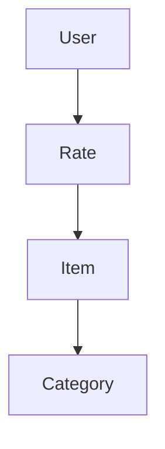
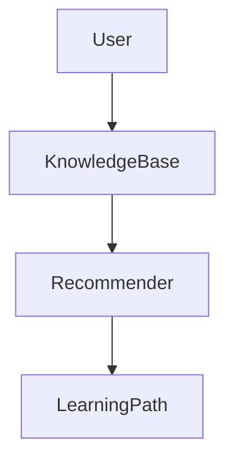

                 


# 构建智能企业知识推荐系统：个性化学习路径与资源推荐

## 关键词：智能推荐系统, 个性化学习, 知识管理, 机器学习, 企业培训

## 摘要：  
随着知识经济的快速发展，企业对员工的学习能力和知识储备提出了更高的要求。传统的知识管理方式难以满足个性化学习需求，而智能推荐系统可以通过分析学习者的行为、兴趣和能力，提供个性化的学习路径和资源推荐，从而提升学习效率和企业竞争力。本文将探讨如何构建一个基于机器学习的智能企业知识推荐系统，详细分析其核心算法、系统架构和实现方法，为企业知识管理提供新的思路。

---

# 正文

## 第一部分: 背景与核心概念

### 第1章: 问题背景与需求分析

#### 1.1 问题背景
企业知识管理的核心目标是帮助员工快速获取所需的知识和技能，以应对快速变化的市场需求。然而，传统的企业培训体系存在以下问题：
- **知识资源分散**：企业内部的知识资源（如文档、课程、案例）分散在不同的系统中，员工难以快速找到。
- **学习路径单一**：员工的学习路径往往由企业统一制定，难以满足个性化需求。
- **推荐精准度低**：传统推荐系统通常基于简单的规则或统计方法，难以准确匹配员工的学习需求。

#### 1.2 问题描述
智能知识推荐系统的目标是通过分析员工的学习行为、兴趣和能力，提供个性化的学习路径和资源推荐。具体包括以下功能：
- 根据员工的历史学习行为（如课程完成情况、测试成绩）推荐相关课程。
- 根据员工的岗位职责和职业发展规划，推荐相关的知识资源。
- 根据员工的学习进度和知识掌握程度，动态调整推荐内容。

#### 1.3 核心概念与系统架构
智能知识推荐系统的核心要素包括：
- **用户模型**：记录用户的基本信息、学习记录、兴趣偏好等。
- **知识库**：存储企业内部的知识资源，如课程、文档、案例等。
- **推荐算法**：基于用户模型和知识库，生成个性化推荐结果。

## 第二部分: 核心概念与联系

### 第2章: 智能知识推荐系统的核心原理

#### 2.1 推荐系统的核心原理
智能推荐系统的核心在于算法的选择和实现。以下是几种常见的推荐算法：
1. **协同过滤推荐**：基于用户的行为相似性进行推荐。
2. **基于内容的推荐**：基于知识资源的内容特征进行推荐。
3. **混合推荐**：结合协同过滤和内容推荐的优点，提升推荐精准度。

#### 2.2 核心概念对比分析
以下是不同推荐方法的特征对比：
| 方法类型 | 基于协同过滤 | 基于内容推荐 | 混合推荐 |
|----------|--------------|--------------|----------|
| 准确率   | 中等          | 高            | 最高      |
| 实时性   | 低            | 中等          | 中等      |
| 计算复杂度 | 高            | 中等          | 高        |

#### 2.3 实体关系图
以下是系统的核心实体关系图：


## 第三部分: 算法原理与数学模型

### 第3章: 协同过滤算法的实现原理

#### 3.1 协同过滤算法的数学模型
协同过滤算法的核心是构建一个用户-物品矩阵：
$$ R = [r_{ij}] \in \mathbb{R}^{m \times n} $$
其中，$m$表示用户数量，$n$表示物品数量，$r_{ij}$表示用户$i$对物品$j$的评分。

#### 3.2 协同过滤算法的实现步骤
1. **数据预处理**：对原始数据进行归一化处理。
2. **相似度计算**：计算用户之间的相似度（如余弦相似度）。
3. **推荐生成**：基于相似用户的偏好，预测当前用户的评分。

#### 3.3 协同过滤算法的优缺点
- **优点**：简单易实现，适合数据稀疏场景。
- **缺点**：计算复杂度高，难以实时响应。

## 第四部分: 系统分析与架构设计

### 第4章: 问题场景介绍

#### 4.1 问题场景
企业知识推荐系统需要解决以下问题：
- 如何高效地存储和管理企业知识资源。
- 如何准确地分析用户需求。
- 如何实时地生成推荐结果。

### 第4.2 系统功能设计
以下是系统的核心功能模块：
- 用户管理模块：负责用户注册、登录、信息管理。
- 知识库管理模块：负责知识资源的存储、分类、检索。
- 推荐引擎模块：负责推荐算法的实现和结果生成。
- 学习路径规划模块：根据推荐结果生成个性化学习路径。

### 第4.3 系统架构图
以下是系统架构图：


## 第五部分: 项目实战

### 第5章: 环境安装

#### 5.1 环境要求
- Python 3.6及以上版本
- 安装必要的库：numpy、pandas、scikit-learn

### 第5.2 核心代码实现
以下是协同过滤算法的Python实现：
```python
import numpy as np
from sklearn.metrics.pairwise import cosine_similarity

# 数据预处理
def preprocess(data):
    # 假设data是原始评分矩阵
    return data

# 相似度计算
def compute_similarity(data):
    return cosine_similarity(data)

# 推荐生成
def generate_recommendations(similarity_matrix, user_id):
    # 假设similarity_matrix是余弦相似度矩阵
    # 返回推荐结果
    pass

# 示例调用
data = np.array([[4, 3, 0], [0, 1, 5], [2, 0, 0]])
similarity = compute_similarity(data)
recommendations = generate_recommendations(similarity, 0)
print(recommendations)
```

### 第5.3 代码应用解读
上述代码展示了协同过滤算法的基本实现。首先，对数据进行预处理，然后计算用户之间的相似度，最后生成推荐结果。

### 第5.4 实际案例分析
通过一个简单的案例，分析如何通过协同过滤算法实现知识推荐。

## 第六部分: 最佳实践

### 第6章: 小结

#### 6.1 总结
智能企业知识推荐系统的核心在于算法的选择和实现。通过协同过滤、内容推荐等算法，可以有效提升推荐的精准度和实时性。

#### 6.2 注意事项
- 确保数据质量和多样性。
- 定期更新知识库和推荐模型。

#### 6.3 拓展阅读
建议读者进一步学习机器学习中的深度学习方法，如神经网络和深度协同过滤，以提升推荐系统的性能。

---

# 作者：AI天才研究院 & 禅与计算机程序设计艺术

