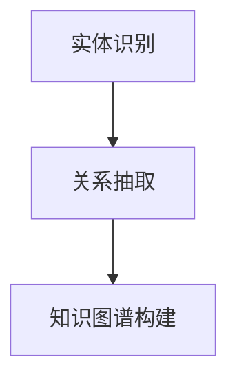
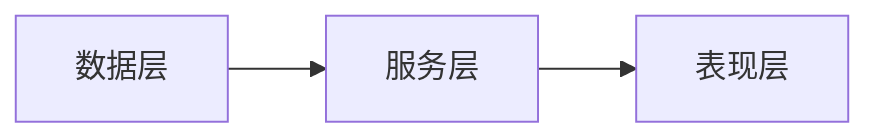
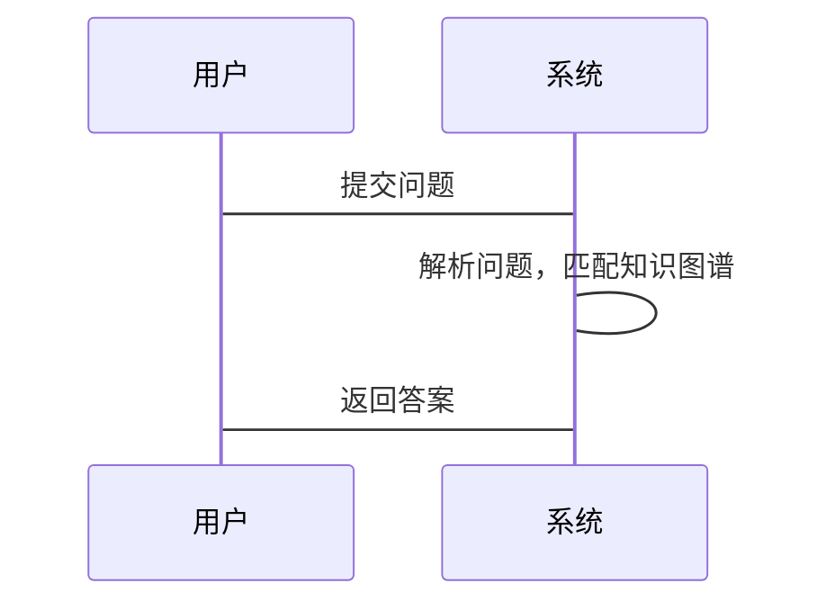

                 


# 构建智能企业知识管理平台：知识图谱与智能问答

**关键词**：知识图谱、智能问答、企业知识管理、问答系统、自然语言处理、知识管理平台、智能问答系统

**摘要**：  
在企业知识管理领域，知识图谱与智能问答系统的结合为企业提供了更高效、更智能的知识管理方式。本文详细探讨了知识图谱的构建与管理方法，分析了智能问答系统的实现原理，并结合实际案例，展示了如何将知识图谱与智能问答系统集成，构建智能企业知识管理平台。文章还讨论了系统架构设计、算法优化及实际应用中的注意事项，为企业在知识管理领域的实践提供了理论支持和实践指导。

---

# 第1章: 知识图谱与智能问答概述

## 1.1 知识图谱的定义与特点

### 1.1.1 知识图谱的定义  
知识图谱是一种以图结构形式表示知识的语义网络，其中节点表示实体或概念，边表示实体之间的关系。知识图谱能够将分散的知识点有机地连接起来，形成一个可计算的语义网络。

### 1.1.2 知识图谱的核心特点  
- **语义性**：通过实体间的关系和属性描述，赋予数据语义。  
- **结构化**：采用图结构，便于计算机理解和推理。  
- **动态性**：支持实时更新和扩展，适应数据变化。  
- **可扩展性**：能够处理大规模数据，支持分布式存储。

### 1.1.3 知识图谱与传统知识管理的区别  
传统知识管理通常依赖于文档存储和简单的关键词检索，而知识图谱通过语义连接和结构化数据，实现了知识的深度理解和智能检索。

---

## 1.2 智能问答的定义与特点

### 1.2.1 智能问答的定义  
智能问答系统是一种基于自然语言处理技术，能够理解和回答用户提出的复杂问题的问答系统。与传统问答系统相比，智能问答系统能够更好地理解上下文，并利用外部知识库提供更准确的答案。

### 1.2.2 智能问答的核心特点  
- **自然语言理解**：能够解析用户的问题，识别意图和实体。  
- **知识检索**：基于知识图谱或其他知识库，快速定位答案。  
- **自适应学习**：通过用户反馈不断优化回答质量。  
- **多轮对话**：支持上下文理解，实现更自然的对话体验。

### 1.2.3 智能问答与传统问答系统的区别  
传统问答系统通常依赖预定义的规则或关键词匹配，而智能问答系统通过自然语言处理和知识图谱技术，能够理解用户的真实需求，并提供更精准的答案。

---

## 1.3 知识图谱与智能问答的联系

### 1.3.1 知识图谱在智能问答中的作用  
知识图谱为智能问答系统提供了丰富的语义信息，帮助系统理解问题背后的深层含义，并从知识库中快速定位相关答案。

### 1.3.2 智能问答如何利用知识图谱提升性能  
通过知识图谱的语义连接，智能问答系统能够实现更准确的答案匹配，并支持复杂问题的推理与解答。

### 1.3.3 知识图谱与智能问答的结合案例  
例如，在企业内部，智能问答系统可以通过知识图谱快速检索员工手册、公司政策等信息，为员工提供高效的帮助。

---

## 1.4 企业知识管理平台的构建背景

### 1.4.1 企业知识管理的需求与挑战  
随着企业规模的扩大，知识管理的需求日益迫切。传统知识管理方式效率低下，难以满足快速变化的业务需求。

### 1.4.2 知识图谱与智能问答在企业中的应用前景  
知识图谱与智能问答的结合为企业知识管理带来了新的可能性，能够提高知识利用效率，降低管理成本。

### 1.4.3 企业知识管理平台的核心目标与价值  
- **目标**：构建一个智能化、结构化的知识管理体系。  
- **价值**：提高知识利用率，支持决策优化，提升企业竞争力。

---

## 1.5 本章小结  
本章介绍了知识图谱与智能问答的基本概念、特点及其在企业知识管理中的应用前景。接下来的章节将详细探讨知识图谱的构建方法和智能问答系统的实现原理。

---

# 第2章: 知识图谱的构建与管理

## 2.1 知识图谱的构建方法

### 2.1.1 知识抽取与实体识别  
知识抽取是将文本中的实体、关系和属性提取出来，构建知识图谱的基础。  
- **实体识别**：使用自然语言处理技术，识别文本中的实体（如人名、组织名）。  
- **关系抽取**：识别实体之间的关系（如“属于”、“构成”）。



### 2.1.2 知识融合与冲突处理  
知识融合是将多个数据源中的知识进行整合，解决数据冲突问题。  
- **数据清洗**：去除重复或错误的数据。  
- **冲突检测**：识别数据中的矛盾，并进行人工或自动化的修复。

### 2.1.3 知识扩展与动态更新  
知识图谱需要不断扩展和更新，以适应新的知识需求。  
- **动态更新**：定期更新知识图谱，添加新知识。  
- **版本控制**：记录知识图谱的变化，便于追溯和管理。

---

## 2.2 知识图谱的存储与管理

### 2.2.1 图数据库的选择与特点  
常用的图数据库包括Neo4j、OrientDB等。  
- **Neo4j**：支持高效的图遍历操作，适合大规模数据存储。  
- **OrientDB**：支持文档型和图型数据存储，具有灵活的查询能力。

### 2.2.2 知识图谱的存储结构  
知识图谱通常以节点和边的形式存储。  
- **节点**：表示实体或概念。  
- **边**：表示实体之间的关系。

### 2.2.3 知识图谱的查询与检索  
- **SPARQL**：一种用于查询知识图谱的语⾔，支持复杂的语义查询。  
- **图遍历算法**：如深度优先搜索（DFS）和广度优先搜索（BFS），用于高效查询。

---

## 2.3 知识图谱的扩展与维护

### 2.3.1 知识图谱的动态更新  
- **实时更新**：通过API接口实时更新知识图谱。  
- **批量更新**：定期批量处理新增数据。

### 2.3.2 知识图谱的版本控制  
- **版本管理**：记录每次修改的历史版本，便于回滚和追溯。  
- **权限控制**：设置访问权限，确保知识图谱的安全性。

### 2.3.3 知识图谱的可扩展性设计  
- **模块化设计**：将知识图谱划分为多个模块，便于扩展和维护。  
- **异构数据支持**：支持多种数据格式，便于与其他系统集成。

---

## 2.4 本章小结  
本章详细介绍了知识图谱的构建方法、存储管理以及扩展维护策略，为后续章节的智能问答系统实现奠定了基础。

---

# 第3章: 智能问答系统的实现原理

## 3.1 智能问答的核心算法

### 3.1.1 基于规则的问答系统  
基于预定义的规则，对用户问题进行匹配和回答。  
- **规则定义**：通过正则表达式或关键词匹配用户问题。  
- **优点**：实现简单，适用于特定场景。  
- **缺点**：灵活性差，难以应对复杂问题。

### 3.1.2 基于检索的问答系统  
通过检索知识库中的现有答案，生成回答。  
- **向量空间模型**：将问题和答案映射到向量空间，计算相似度。  
- **BM25算法**：用于文本检索，提高答案的准确性。

### 3.1.3 基于生成的问答系统  
利用自然语言生成技术，自动生成回答。  
- **序列到序列模型**：如GPT、BERT，能够生成自然流畅的回答。  
- **优点**：灵活性高，能够应对复杂问题。  
- **缺点**：生成内容可能缺乏准确性，需要结合知识库进行优化。

---

## 3.2 智能问答中的自然语言处理技术

### 3.2.1 分词与词性标注  
- **分词**：将输入文本分割成词语。  
- **词性标注**：识别词语的词性（如名词、动词）。


### 3.2.2 句法分析与语义理解  
- **句法分析**：分析句子的语法结构。  
- **语义理解**：理解句子的语义，提取关键信息。

### 3.2.3 智能问答中的上下文理解  
通过上下文理解，智能问答系统能够识别多轮对话中的关联性，提供更精准的回答。

---

## 3.3 智能问答的训练与优化

### 3.3.1 基于监督学习的问答系统训练  
- **数据标注**：人工标注问答对，用于模型训练。  
- **模型训练**：使用深度学习模型（如BERT）进行训练，优化回答质量。

### 3.3.2 基于无监督学习的问答系统训练  
- **无监督学习**：利用未标注数据，通过聚类或自监督学习进行模型优化。  
- **优点**：减少人工标注成本。  
- **缺点**：模型性能可能不如监督学习。

### 3.3.3 智能问答系统的调优与评估  
- **模型调优**：通过调整超参数和优化算法，提高回答准确率。  
- **评估指标**：如准确率、召回率、F1值等。

---

## 3.4 本章小结  
本章详细探讨了智能问答系统的核心算法和实现原理，为后续章节的知识图谱与智能问答的结合奠定了理论基础。

---

# 第4章: 知识图谱与智能问答的结合

## 4.1 知识图谱在智能问答中的应用

### 4.1.1 知识图谱支持智能问答的功能  
- **语义理解**：通过知识图谱的语义信息，提升智能问答的准确性。  
- **上下文推理**：利用知识图谱进行复杂问题的推理与解答。

### 4.1.2 知识图谱与智能问答的结合案例  
例如，在医疗领域，智能问答系统可以通过知识图谱快速检索病人的病史和诊断信息，辅助医生进行诊断。

---

## 4.2 智能问答系统的优化与提升

### 4.2.1 知识图谱的优化  
- **数据质量**：确保知识图谱中的数据准确无误。  
- **推理能力**：增强知识图谱的推理能力，支持复杂问题的解答。

### 4.2.2 智能问答系统的优化  
- **算法优化**：改进智能问答算法，提高回答的准确率和响应速度。  
- **用户体验优化**：设计友好的用户界面，提升用户体验。

---

## 4.3 知识图谱与智能问答的融合创新

### 4.3.1 知识图谱与深度学习的结合  
- **知识增强的深度学习模型**：利用知识图谱中的语义信息，增强深度学习模型的表达能力。

### 4.3.2 智能问答的可解释性提升  
- **知识图谱的可解释性**：通过知识图谱的语义信息，提高智能问答系统的可解释性。

---

## 4.4 本章小结  
本章探讨了知识图谱与智能问答的结合方式，分析了两者在企业知识管理中的协同作用，并展望了未来的融合创新方向。

---

# 第5章: 企业知识管理平台的系统设计与实现

## 5.1 系统功能设计

### 5.1.1 知识图谱管理模块  
- **知识抽取**：从企业文档中提取实体、关系和属性。  
- **知识融合**：整合多个数据源的知识，构建统一的知识图谱。

### 5.1.2 智能问答模块  
- **问题理解**：解析用户的问题，提取关键信息。  
- **知识检索**：基于知识图谱，快速定位相关知识。  
- **生成回答**：根据检索结果，生成自然流畅的回答。

---

## 5.2 系统架构设计

### 5.2.1 分层架构设计  
- **数据层**：存储知识图谱和问答历史。  
- **服务层**：提供知识抽取、融合和问答服务。  
- **表现层**：用户界面，与用户交互。



### 5.2.2 微服务架构设计  
- **知识图谱服务**：负责知识图谱的构建和管理。  
- **智能问答服务**：负责接收用户问题并返回答案。  
- **网关服务**：处理API请求，路由到相应服务。

---

## 5.3 系统接口设计

### 5.3.1 API接口设计  
- **GET /knowledge-graph**：获取知识图谱数据。  
- **POST /question**：提交用户问题，获取回答。

### 5.3.2 接口文档  
详细描述每个接口的请求格式、返回格式和错误处理方式。

---

## 5.4 系统交互设计

### 5.4.1 用户与系统交互流程  
1. 用户提交问题。  
2. 系统解析问题，匹配知识图谱中的相关知识。  
3. 系统生成回答并返回给用户。



---

## 5.5 本章小结  
本章详细描述了企业知识管理平台的系统设计与实现，包括功能设计、架构设计、接口设计和交互设计。

---

# 第6章: 项目实战与案例分析

## 6.1 环境安装与配置

### 6.1.1 知识图谱构建工具  
- **Neo4j**：图数据库，支持知识图谱的构建与存储。  
- **Python库**：如networkx，用于图数据的处理。

### 6.1.2 智能问答框架  
- **spaCy**：自然语言处理库，支持分词、实体识别等功能。  
- **Hugging Face**：提供多种预训练模型，支持智能问答。

---

## 6.2 知识图谱构建与管理

### 6.2.1 核心代码实现  
```python
from neo4j import GraphDatabase
from neo4j.exceptions import ServiceUnavailable

class KnowledgeGraph:
    def __init__(self, uri, user, password):
        self.driver = GraphDatabase.driver(uri, auth=(user, password))
    
    def add_entity(self, label, properties):
        with self.driver.session() as session:
            session.run(
                "CREATE (:{} {{}})".format(label),
                properties
            )
    
    def add_relation(self, start_label, start_id, relation, end_label, end_id):
        with self.driver.session() as session:
            session.run(
                "MATCH (a:{start_label} {{id: {start_id}}}), (b:{end_label} {{id: {end_id}}}) "
                "CREATE (a)-[r:{relation}]->(b)".format(
                    start_label=start_label,
                    start_id=start_id,
                    relation=relation,
                    end_label=end_label,
                    end_id=end_id
                )
            )
```

### 6.2.2 数据库操作示例  
```python
kg = KnowledgeGraph("bolt://localhost:7687", "neo4j", "password")
kg.add_entity("Person", {"name": "Alice", "age": 30})
kg.add_relation("Person", "Alice", "works_in", "Company", "ABC Corp")
```

---

## 6.3 智能问答系统实现

### 6.3.1 智能问答核心代码  
```python
from transformers import pipeline

qa_pipeline = pipeline("question-answering", model="bert-base-cased")

def answer_question(context, question):
    return qa_pipeline(question=question, context=context)
```

### 6.3.2 知识图谱与问答系统结合  
```python
from neo4j import GraphDatabase
import spacy

nlp = spacy.load("en_core_web_sm")

def process_question(question):
    doc = nlp(question)
    # 提取实体和关系
    entities = [(ent.text, ent.label_) for ent in doc.ents]
    # 查询知识图谱
    kg_service = KnowledgeGraph("bolt://localhost:7687", "neo4j", "password")
    answer = kg_service.query(entities)
    return answer
```

---

## 6.4 实际案例分析

### 6.4.1 案例背景  
假设某企业需要构建一个内部知识管理平台，用于员工查询公司政策、产品信息等。

### 6.4.2 系统实现  
- 知识图谱构建：从员工手册和公司政策中提取实体和关系，构建知识图谱。  
- 智能问答系统：通过自然语言处理技术，解析员工的问题，并利用知识图谱快速检索答案。

### 6.4.3 实施效果  
- 提高了员工的知识获取效率。  
- 减少了人工客服的工作量，降低了管理成本。

---

## 6.5 本章小结  
本章通过实际案例分析，展示了知识图谱与智能问答系统在企业知识管理中的应用价值，并提供了具体的实现代码和系统设计。

---

# 第7章: 总结与展望

## 7.1 总结  
本文详细探讨了知识图谱与智能问答系统在企业知识管理中的应用，分析了两者的构建方法和实现原理，并结合实际案例，展示了如何将两者结合，构建智能企业知识管理平台。

## 7.2 未来展望  
随着人工智能技术的不断发展，知识图谱与智能问答系统将更加智能化和高效化。未来的研究方向包括：  
- **多模态知识图谱**：结合图像、音频等多种数据形式，构建更全面的知识图谱。  
- **自适应问答系统**：通过用户行为分析，不断优化问答系统的性能。  
- **知识图谱的实时更新**：利用实时数据流，动态更新知识图谱，提升系统的实时性。

---

# 作者：AI天才研究院 & 禅与计算机程序设计艺术

---

通过本文的系统阐述，读者可以全面了解知识图谱与智能问答系统的核心原理和实际应用，为企业构建智能知识管理平台提供了有力的技术支持。

