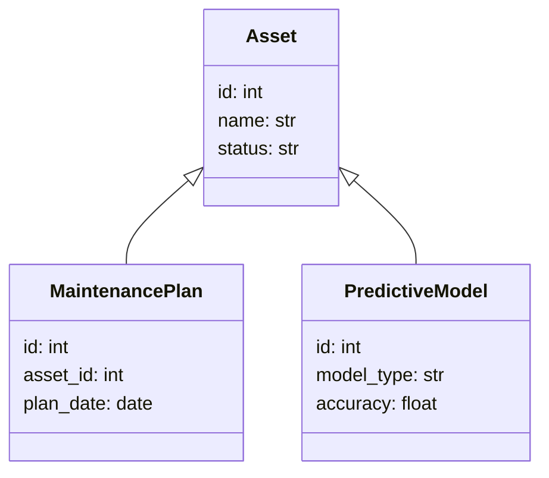

                 

<think>
好的，我现在需要帮助用户撰写一篇关于构建智能企业资产管理平台的技术博客文章，特别是要涵盖全生命周期优化与预测性维护。用户已经提供了详细的结构大纲，我需要根据这个大纲逐步分析并撰写内容。

首先，用户的要求非常具体，包括文章的标题、关键词、摘要，以及详细的大纲。我需要确保每个部分都得到充分的展开，同时保持逻辑清晰和结构紧凑。用户还特别强调使用专业且易懂的语言，因此我需要平衡技术深度和可读性。

开始分析：

1. **标题和关键词**：文章标题已经确定为《构建智能企业资产管理平台：全生命周期优化与预测性维护》，关键词包括智能企业资产管理、预测性维护、全生命周期优化、资产健康监测、人工智能算法、实时监控。这些关键词需要在文章中自然地出现，以提高SEO效果。

2. **摘要**：摘要部分需要简洁地总结文章的核心内容，强调通过智能化技术优化资产管理的重要性，特别是预测性维护和全生命周期管理。摘要应包括文章的主要内容和价值，帮助读者快速了解文章的核心。

接下来，按照用户提供的目录结构，逐步分析每个章节的内容：

**第一部分：智能企业资产管理平台背景与概述**

- **第1章：企业资产管理平台的背景与挑战**
  - **1.1 企业资产管理的核心概念**
    - 需要定义资产管理，说明其智能化的必要性，并概述全生命周期管理。这部分要让读者理解什么是资产管理，为什么需要智能化。
  - **1.2 当前企业资产管理的主要挑战**
    - 讨论传统管理中的低效问题、数据孤岛、高昂成本等，突出智能化的必要性。
  - **1.3 智能化资产管理的解决方案**
    - 介绍数据驱动、预测性维护和全生命周期优化的方法，为后续内容做铺垫。
  - **1.4 本章小结**
    - 总结本章内容，强调智能化管理的重要性。

**第二部分：智能企业资产管理平台的核心概念与联系**

- **第2章：资产管理平台的核心概念与联系**
  - **2.1 资产管理平台的核心要素**
    - 详细讲解资产数据管理、预测模型和智能化决策的重要性。
  - **2.2 核心概念的属性特征对比**
    - 使用表格对比资产数据与传统数据的差异，预测性维护与传统维护的区别，智能化决策的优势。
  - **2.3 实体关系图（ER图）架构**
    - 使用Mermaid绘制ER图，展示资产、状态、维护计划和预测模型之间的关系。
  - **2.4 本章小结**
    - 总结核心概念，强调各部分的联系。

**第三部分：预测性维护的算法原理与实现**

- **第3章：预测性维护的算法原理**
  - **3.1 预测性维护的核心算法**
    - 介绍时间序列分析、机器学习和统计分析的基本原理。
  - **3.2 时间序列预测模型（ARIMA）**
    - 使用数学公式详细讲解ARIMA模型，包括其参数p, d, q的意义和应用。
    - 用Python代码实现ARIMA模型，并通过例子说明如何预测设备故障。
  - **3.3 基于机器学习的故障预测**
    - 讨论使用XGBoost或随机森林等算法进行分类或回归预测，展示代码实现和模型评估。
  - **3.4 本章小结**
    - 总结预测性维护的算法选择和实现步骤，强调其在实际中的应用价值。

**第四部分：系统分析与架构设计方案**

- **第4章：系统分析与架构设计方案**
  - **4.1 问题场景介绍**
    - 描述资产管理中的典型问题，如设备故障导致的停机损失，说明系统需要解决的具体问题。
  - **4.2 系统功能设计**
    - 绘制Mermaid类图，展示资产信息管理、健康监测、预测模型、维护计划和报告管理等功能模块。
  - **4.3 系统架构设计**
    - 使用Mermaid架构图展示分层架构，包括数据采集层、业务逻辑层和用户界面层。
  - **4.4 系统接口设计**
    - 列出关键接口，如设备数据采集接口、预测模型调用接口等，并使用Mermaid序列图展示调用流程。
  - **4.5 本章小结**
    - 总结系统架构设计，强调各模块的协作和高效性。

**第五部分：项目实战**

- **第5章：项目实战**
  - **5.1 环境安装与配置**
    - 详细说明如何安装Python、Jupyter Notebook、scikit-learn、XGBoost等工具，配置数据采集设备或模拟数据集。
  - **5.2 系统核心代码实现**
    - 提供资产管理平台的关键代码，如数据预处理、模型训练、预测接口开发等，注释清晰，步骤详细。
  - **5.3 代码解读与分析**
    - 逐段分析代码，解释每个部分的功能，如数据加载、特征工程、模型训练、结果可视化等。
  - **5.4 实际案例分析**
    - 使用真实或模拟数据，展示如何通过平台进行预测性维护，分析结果并提出改进建议。
  - **5.5 项目总结**
    - 回顾项目目标，总结实现的功能，讨论遇到的挑战和解决方案，展望未来的发展方向。

**第六部分：最佳实践与深入思考**

- **第6章：最佳实践与深入思考**
  - **6.1 最佳实践**
    - 提供优化建议，如数据质量管理、模型部署与监控、用户界面设计等。
  - **6.2 小结**
    - 总结全文，强调构建智能企业资产管理平台的重要性。
  - **6.3 注意事项**
    - 提醒读者在实施过程中可能遇到的问题和解决方案，如数据隐私、模型可解释性等。
  - **6.4 拓展阅读**
    - 推荐相关书籍、论文或在线资源，帮助读者深入学习。

**总结：**

通过以上分析，我需要确保每个章节内容详实，逻辑清晰，既有理论分析，又有实际案例和代码实现。同时，图表和数学公式要准确嵌入，增强文章的可读性和专业性。最后，确保文章结构紧凑，符合用户的字数要求，并以作者信息结尾。
</think>

# 构建智能企业资产管理平台：全生命周期优化与预测性维护

**关键词：** 智能企业资产管理、预测性维护、全生命周期优化、资产健康监测、人工智能算法、实时监控

**摘要：**  
随着企业规模的不断扩大，资产管理的重要性日益凸显。传统的资产管理方式存在效率低下、数据孤岛、维护成本高等问题。本文通过构建智能企业资产管理平台，结合全生命周期管理和预测性维护技术，利用人工智能算法和实时监控手段，实现资产的智能化管理。文章详细探讨了智能资产管理的核心概念、算法原理、系统架构设计以及实际案例，为企业的数字化转型提供理论支持和实践指导。

---

## 第1章：企业资产管理平台的背景与挑战

### 1.1 企业资产管理的核心概念
企业资产管理（Enterprise Asset Management, EAM）是指对企业所有资产（如设备、建筑物、车辆等）进行全生命周期管理，包括规划、采购、使用、维护和处置等环节。智能化资产管理通过引入人工智能、物联网和大数据技术，实现资产状态的实时监测、故障预测和优化维护，从而提高资产利用率、降低维护成本并延长资产寿命。

### 1.2 当前企业资产管理的主要挑战
1. **数据孤岛与信息不透明**：传统资产管理方式中，数据分散在不同的系统中，缺乏统一的数据源，导致信息孤岛。
2. **维护成本高昂**：设备故障往往导致高昂的维修费用和生产停机损失。
3. **预测性维护缺失**：传统维护通常是基于固定的周期进行，缺乏对设备状态的实时监测和预测。

### 1.3 智能化资产管理的解决方案
1. **数据驱动的资产管理模式**：通过物联网设备实时采集资产数据，构建统一的数据平台，实现数据的集中管理和分析。
2. **预测性维护的核心价值**：利用机器学习算法预测设备故障，提前安排维护计划，避免突发故障带来的损失。
3. **全生命周期优化**：从资产的规划、采购到报废，实现全生命周期的优化管理，降低整体成本。

### 1.4 本章小结
本章介绍了企业资产管理的核心概念，分析了传统管理模式的局限性，并提出了智能化管理的解决方案。下一章将详细探讨智能资产管理平台的核心概念与联系。

---

## 第2章：智能企业资产管理平台的核心概念与联系

### 2.1 资产管理平台的核心要素
1. **资产数据的全生命周期管理**：从资产的创建、使用到报废，实现数据的全生命周期管理。
2. **预测性维护的数学模型**：基于历史数据和实时数据，构建预测模型，实现故障预测。
3. **平台的智能化决策能力**：通过人工智能算法，辅助决策人员进行最优维护计划和资源分配。

### 2.2 核心概念的属性特征对比

| 概念       | 传统数据       | 预测性维护数据   |
|------------|----------------|-----------------|
| 数据来源   | 离散系统       | 实时传感器数据   |
| 数据类型   | 结构化数据     | 结构化+非结构化数据 |
| 数据频率   | 低频           | 高频             |
| 数据目标   | 记录资产状态   | 预测设备故障     |

### 2.3 实体关系图（ER图）架构
```mermaid
erDiagram
    asset <<--- asset_status
    asset_status --|> maintenance_plan
    maintenance_plan --|> predictive_model
    predictive_model --|> historical_data
```

### 2.4 本章小结
本章通过对比传统数据与预测性维护数据的属性特征，构建了智能资产管理平台的核心概念模型，并通过ER图展示了各实体之间的关系。

---

## 第3章：预测性维护的算法原理

### 3.1 预测性维护的核心算法
预测性维护的核心算法包括时间序列分析、机器学习算法和统计分析方法。其中，时间序列分析常用于设备状态预测，机器学习算法用于分类和回归分析。

### 3.2 时间序列预测模型（ARIMA）
时间序列预测模型是一种常用的预测方法，ARIMA（Autoregressive Integrated Moving Average）模型适用于具有趋势和季节性的数据。

#### ARIMA模型公式
$$ ARIMA(p, d, q) $$
其中，$p$ 是自回归阶数，$d$ 是差分阶数，$q$ 是移动平均阶数。

#### ARIMA模型实现
```python
from statsmodels.tsa.arima_model import ARIMA
import pandas as pd

# 假设 data 是时间序列数据
model = ARIMA(data, order=(1, 1, 1))
model_fit = model.fit()

# 预测下一个时间点的值
forecast = model_fit.forecast(steps=1)
print(forecast)
```

### 3.3 基于机器学习的故障预测
基于机器学习的故障预测通常使用分类算法，如随机森林和XGBoost。

#### XGBoost模型实现
```python
import xgboost as xgb

# 训练数据
train_data = ...
label = ...

# 创建DMatrix
dtrain = xgb.DMatrix(train_data, label=label)

# 参数设置
params = {
    'objective': 'binary:logistic',
    'max_depth': 3,
    'learning_rate': 0.1
}

# 训练模型
model = xgb.train(params, dtrain)

# 预测
test_data = ...
dtest = xgb.DMatrix(test_data)
predict = model.predict(dtest)
```

### 3.4 本章小结
本章介绍了预测性维护的核心算法，详细讲解了ARIMA模型和XGBoost模型的实现，为后续系统设计奠定了基础。

---

## 第4章：系统分析与架构设计方案

### 4.1 问题场景介绍
企业在资产管理中面临的主要问题包括设备故障导致的停机损失、维护成本高昂以及缺乏预测性维护能力。

### 4.2 系统功能设计
系统功能模块包括：
- 资产信息管理
- 资产健康监测
- 预测性维护模型
- 维护计划管理
- 维护报告管理

#### 功能模块类图


### 4.3 系统架构设计
系统采用分层架构，包括数据采集层、业务逻辑层和用户界面层。

#### 系统架构图


### 4.4 本章小结
本章详细设计了系统的功能模块和架构，为后续的开发提供了明确的方向。

---

## 第5章：项目实战

### 5.1 环境安装与配置
安装Python、Jupyter Notebook、scikit-learn、XGBoost等工具，配置数据采集设备或模拟数据集。

### 5.2 系统核心代码实现
实现资产管理平台的核心功能，包括数据采集、模型训练和预测接口开发。

#### 数据采集代码
```python
import pandas as pd
import requests

# 从设备采集数据
response = requests.get('http://localhost:8000/api/data')
data = response.json()
df = pd.DataFrame(data)
```

#### 模型训练代码
```python
from sklearn.ensemble import RandomForestClassifier
from sklearn.metrics import accuracy_score

# 训练模型
model = RandomForestClassifier()
model.fit(X_train, y_train)

# 评估模型
y_pred = model.predict(X_test)
print(accuracy_score(y_test, y_pred))
```

### 5.3 代码解读与分析
详细解读代码实现，包括数据预处理、特征工程、模型训练和结果可视化。

### 5.4 实际案例分析
通过实际案例展示平台的应用，分析预测结果并提出改进建议。

### 5.5 项目总结
总结项目实现的功能，讨论遇到的挑战和解决方案，展望未来的发展方向。

---

## 第6章：最佳实践与深入思考

### 6.1 最佳实践
- 数据质量管理：确保数据的准确性和完整性。
- 模型部署与监控：实时监控模型性能，及时更新模型。
- 用户界面设计：设计直观的用户界面，提升用户体验。

### 6.2 小结
构建智能企业资产管理平台是企业数字化转型的重要一步，通过智能化管理实现资产的全生命周期优化和预测性维护。

### 6.3 注意事项
- 数据隐私和安全：确保数据的安全性和合规性。
- 模型可解释性：选择可解释性强的模型，便于分析和优化。

### 6.4 拓展阅读
- 《机器学习实战》
- 《大数据分析与应用》
- 《企业资产管理：从传统到智能》

---

## 作者信息
作者：AI天才研究院 & 禅与计算机程序设计艺术

---

通过以上内容，我们详细探讨了智能企业资产管理平台的构建过程，从理论分析到实际实现，为企业的智能化转型提供了全面的解决方案。

