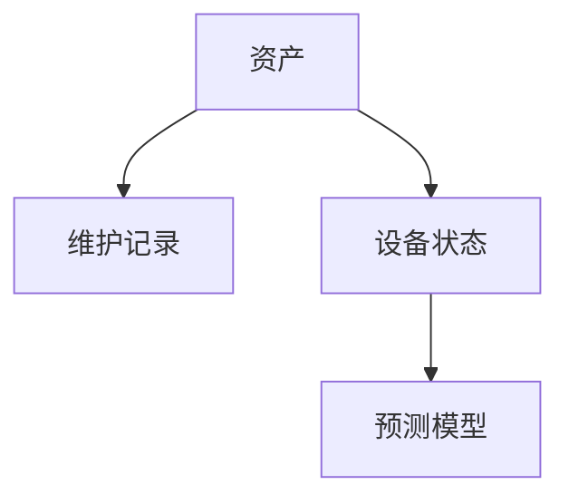
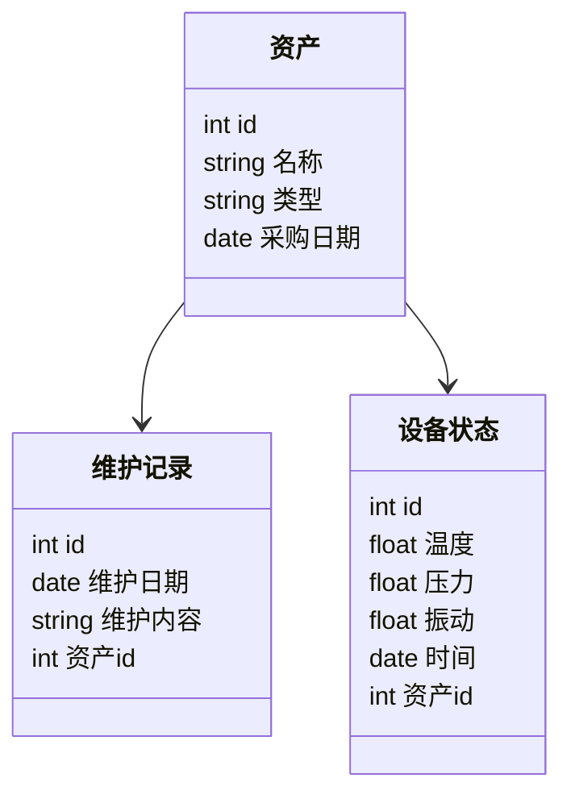
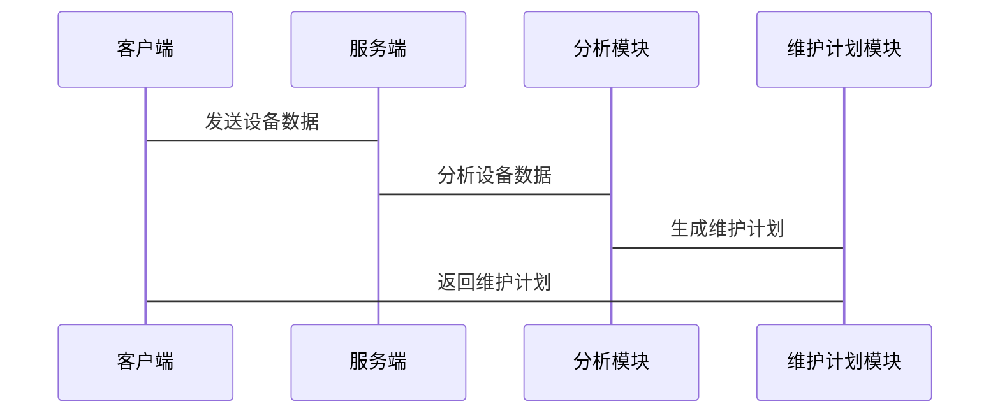

                 


# 构建智能企业资产管理平台：全生命周期优化与预测性维护系统

## 关键词：企业资产管理，预测性维护，全生命周期管理，机器学习，系统架构，算法实现

## 摘要：本文将详细介绍如何构建一个智能企业资产管理平台，涵盖预测性维护和全生命周期管理的核心概念。通过数学模型和机器学习算法的实现，结合系统架构设计和项目实战，提供一个全面的解决方案，助力企业提升资产管理效率和降低维护成本。

---

# 第一部分：智能企业资产管理平台概述

## 第1章：企业资产管理平台的背景与挑战

### 1.1 企业资产管理的重要性

#### 1.1.1 资产管理的核心概念
资产是企业运营的核心资源，包括设备、工具、建筑物等。有效的资产管理能够提高企业的运营效率，降低维护成本，并延长资产的使用寿命。

#### 1.1.2 传统资产管理的局限性
传统的资产管理方式通常依赖人工记录和维护，存在效率低、数据不准确、维护计划不合理等问题，导致维护成本高，甚至可能引发设备故障停机的风险。

#### 1.1.3 数字化转型对企业资产管理的需求
随着数字化转型的推进，企业需要通过智能化的管理手段，利用大数据和人工智能技术，实现资产管理的优化和预测性维护，从而提高企业的竞争力。

### 1.2 预测性维护与全生命周期管理

#### 1.2.1 预测性维护的定义与优势
预测性维护是一种基于设备状态数据的维护策略，通过预测设备的健康状况，提前安排维护计划，避免设备故障的发生。其优势在于减少停机时间、降低维护成本和提高设备利用率。

#### 1.2.2 全生命周期管理的内涵
全生命周期管理是指从资产的规划、采购、使用、维护到报废的整个生命周期进行管理，确保资产在整个生命周期内的高效利用和管理优化。

#### 1.2.3 预测性维护与全生命周期管理的结合
通过将预测性维护融入全生命周期管理，企业可以在设备的全生命周期内实现动态管理，实时监控设备状态，优化维护计划，提高资产的整体效益。

---

## 第2章：智能企业资产管理平台的核心概念

### 2.1 预测性维护的数学模型

#### 2.1.1 时间序列分析模型
时间序列分析是一种常用的预测方法，通过分析历史数据的变化趋势，预测未来的设备状态。常见的模型包括ARIMA和LSTM网络。

#### 2.1.2 基于机器学习的故障预测模型
机器学习模型能够通过训练设备的历史数据，学习设备的故障模式，从而实现故障预测。常用的算法包括随机森林、支持向量机和深度学习模型。

#### 2.1.3 维护策略优化算法
维护策略优化算法通过分析设备的故障概率和维护成本，制定最优的维护计划，降低维护成本和提高设备可用性。

### 2.2 全生命周期管理的系统架构

#### 2.2.1 资产信息管理模块
资产信息管理模块负责管理资产的基本信息，包括设备型号、规格、采购时间等。

#### 2.2.2 维护计划管理模块
维护计划管理模块根据预测性维护的结果，生成维护计划，安排维护任务。

#### 2.2.3 数据采集与分析模块
数据采集与分析模块负责采集设备的实时数据，通过数据分析和处理，生成设备的状态报告，为预测性维护提供数据支持。

### 2.3 核心概念与联系

#### 2.3.1 预测性维护与全生命周期管理的关系
预测性维护是全生命周期管理的重要组成部分，通过对设备状态的实时监控和预测，优化维护计划，延长设备寿命。

#### 2.3.2 实体关系图（ER图）展示


---

# 第二部分：预测性维护的算法原理

## 第3章：预测性维护的算法实现

### 3.1 时间序列分析模型

#### 3.1.1 ARIMA模型
ARIMA（自回归积分滑动平均）模型是一种常用的时间序列分析模型，适用于具有趋势和季节性的数据。

#### 3.1.2 LSTM网络
LSTM（长短期记忆网络）是一种深度学习模型，能够捕捉时间序列数据中的长期依赖关系，适用于复杂的设备状态预测。

#### 3.1.3 模型实现步骤
1. 数据预处理：清洗数据，处理缺失值和异常值。
2. 模型训练：选择合适的模型参数，训练模型。
3. 模型预测：利用训练好的模型，预测未来的设备状态。

### 3.2 基于机器学习的故障预测

#### 3.2.1 数据预处理
数据预处理是机器学习模型实现的关键步骤，包括数据清洗、特征提取和数据转换。

#### 3.2.2 特征提取与选择
特征提取是从原始数据中提取有助于模型预测的特征，特征选择是通过评估特征的重要性，选择最优的特征组合。

#### 3.2.3 模型训练与评估
模型训练是通过训练数据，调整模型参数，使模型能够准确预测设备状态。模型评估是通过测试数据，评估模型的准确性和性能。

### 3.3 维护策略优化算法

#### 3.3.1 基于遗传算法的优化
遗传算法是一种常用的优化算法，适用于多目标优化问题，能够找到最优的维护策略。

#### 3.3.2 基于动态规划的策略选择
动态规划是一种优化算法，适用于分阶段决策问题，能够制定最优的维护计划。

#### 3.3.3 算法实现与优化
通过优化算法实现，提高维护策略的效率和准确性，降低维护成本。

## 第4章：算法实现与代码示例

### 4.1 时间序列分析模型代码

```python
import pandas as pd
import numpy as np
from statsmodels.tsa.arima.model import ARIMA

# 数据预处理
data = pd.read_csv('设备数据.csv')
data = data['设备状态'].values

# 模型训练
model = ARIMA(data, order=(1, 1, 1))
model_fit = model.fit()

# 模型预测
forecast = model_fit.forecast(steps=10)
```

### 4.2 基于机器学习的故障预测代码

```python
import pandas as pd
import numpy as np
from sklearn.ensemble import RandomForestClassifier
from sklearn.metrics import accuracy_score

# 数据预处理
data = pd.read_csv('设备数据.csv')
X = data.drop('设备状态', axis=1)
y = data['设备状态']

# 特征选择
selected_features = ['温度', '压力', '振动']
X_selected = X[selected_features]

# 模型训练
model = RandomForestClassifier(n_estimators=100)
model.fit(X_selected, y)

# 模型预测
new_data = pd.read_csv('新设备数据.csv')
X_new = new_data[selected_features]
y_pred = model.predict(X_new)

# 模型评估
print(accuracy_score(y_true, y_pred))
```

---

# 第三部分：系统分析与架构设计

## 第5章：系统分析与架构设计方案

### 5.1 问题场景介绍
企业资产管理平台需要实现设备的全生命周期管理，包括设备信息管理、维护计划管理、数据采集与分析等功能。

### 5.2 项目介绍
本项目旨在构建一个智能企业资产管理平台，实现设备的预测性维护和全生命周期管理，提升企业的资产管理效率和降低成本。

### 5.3 系统功能设计

#### 5.3.1 领域模型


### 5.4 系统架构设计

#### 5.4.1 系统架构图
```mermaid
archiitecture
    客户端 <---(HTTP)--> 服务端
    服务端 --> 数据库
    服务端 --> 分析模块
    分析模块 --> 维护计划模块
```

### 5.5 系统接口设计
系统接口设计包括API接口的设计，用于数据的采集、分析和维护计划的生成。

### 5.6 系统交互设计

#### 5.6.1 系统交互流程图


---

# 第四部分：项目实战

## 第6章：项目实战

### 6.1 环境安装

#### 6.1.1 安装Python
```bash
python --version
pip install --upgrade pip
```

#### 6.1.2 安装依赖库
```bash
pip install pandas numpy statsmodels scikit-learn
```

### 6.2 核心代码实现

#### 6.2.1 数据采集与分析模块
```python
import pandas as pd
import numpy as np
from statsmodels.tsa.arima.model import ARIMA
from sklearn.ensemble import RandomForestClassifier

# 数据采集
data = pd.read_csv('设备数据.csv')

# 数据分析
selected_features = ['温度', '压力', '振动']
X_selected = data[selected_features]
y = data['设备状态']

# 时间序列分析
model_arima = ARIMA(data['设备状态'], order=(1, 1, 1))
model_arima_fit = model_arima.fit()

# 机器学习模型
model_rfc = RandomForestClassifier(n_estimators=100)
model_rfc.fit(X_selected, y)
```

#### 6.2.2 维护计划管理模块
```python
# 预测性维护
new_data = pd.read_csv('新设备数据.csv')
X_new = new_data[selected_features]
y_pred = model_rfc.predict(X_new)

# 生成维护计划
maintenance_plan = {
    '设备id': new_data['设备id'].values,
    '预测故障时间': y_pred,
    '建议维护日期': new_data['时间'] + pd.Timedelta(days=7)
}
```

### 6.3 实际案例分析
通过实际案例分析，验证系统的有效性和准确性，优化系统的性能。

### 6.4 项目小结
总结项目的实现过程，提出改进建议和未来发展方向。

---

# 第五部分：总结与展望

## 第7章：总结与展望

### 7.1 最佳实践 tips
- 数据质量是预测性维护的基础，确保数据的准确性和完整性。
- 定期优化模型，适应设备状态的变化。
- 结合企业的实际情况，灵活调整系统的功能和架构。

### 7.2 小结
本文详细介绍了智能企业资产管理平台的构建过程，从背景到实战，涵盖了预测性维护和全生命周期管理的核心概念和实现方法。

### 7.3 注意事项
- 系统的安全性和稳定性需要高度重视。
- 数据隐私和合规性需要符合相关法律法规。

### 7.4 拓展阅读
建议读者进一步阅读相关领域的书籍和文献，深入了解预测性维护和全生命周期管理的最新技术和应用。

---

# 作者：AI天才研究院/AI Genius Institute & 禅与计算机程序设计艺术 /Zen And The Art of Computer Programming

