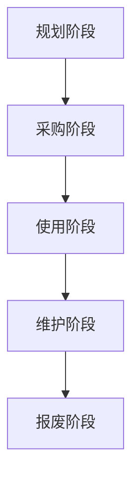
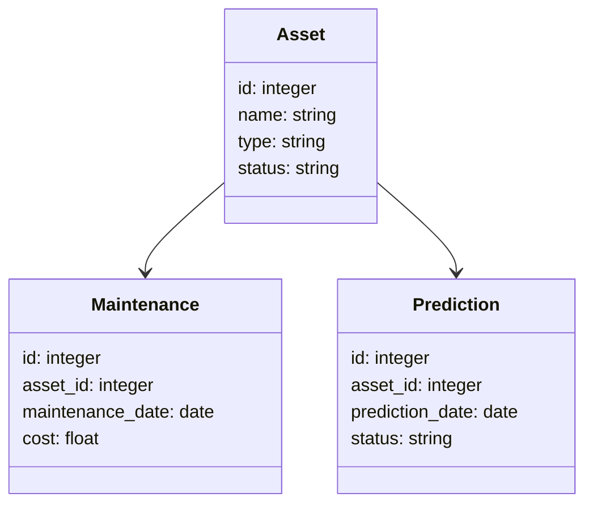
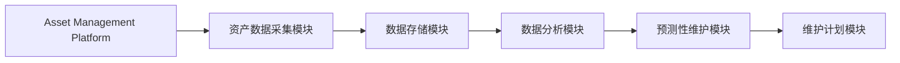
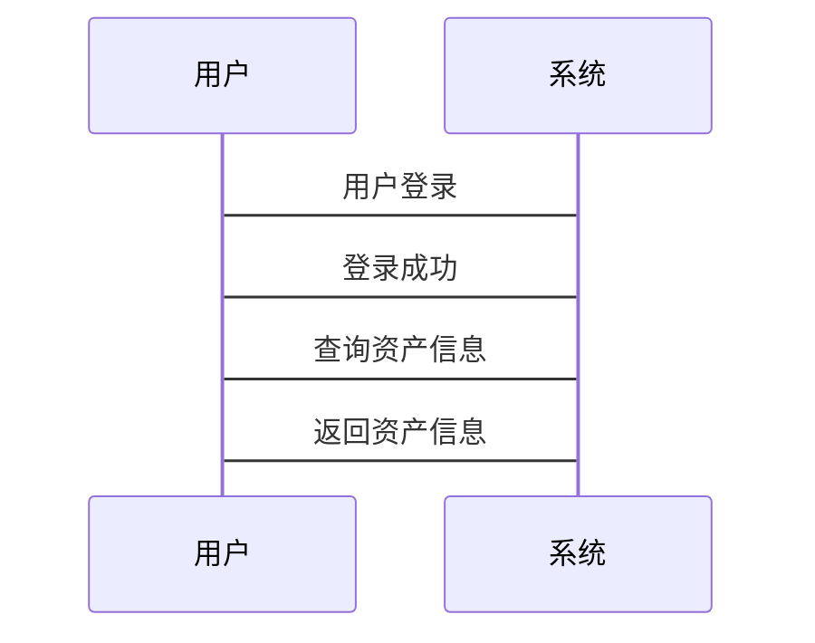

                 

<think>
好，我需要按照用户的要求来写一篇关于构建智能企业资产管理平台的技术博客文章。首先，我得理解用户的需求。他们需要一篇结构清晰、逻辑严谨、内容详实的技术博客，涵盖从背景到系统实现的各个方面。文章需要使用专业但易懂的语言，配以图表和代码示例，帮助读者深入理解。

首先，我得确定文章的结构。用户已经提供了一个详细的大纲，我需要按照这个大纲来展开。第一部分是背景与概述，包括智能资产管理平台的背景、挑战、全生命周期管理以及预测性维护与成本优化。这部分需要让读者了解为什么需要智能资产管理平台，传统方法的不足，以及智能化带来的优势。

接下来是核心技术部分，包括核心算法与数学模型、系统分析与架构设计，以及项目实战。这部分需要详细讲解技术实现，比如预测性维护的算法选择、数学模型的构建，系统架构的设计，以及如何在实际项目中应用这些技术。

最后是最佳实践部分，总结经验，给出注意事项和扩展阅读的建议，帮助读者巩固所学内容，并指导他们进一步学习和实践。

在写作过程中，我需要确保每个章节内容详细，逻辑清晰。例如，在讲解预测性维护的算法时，不仅要有理论分析，还要有具体的数学公式和代码示例，帮助读者理解如何实现这些算法。

此外，图表的使用也很重要。我需要使用Mermaid来绘制流程图、类图和序列图，直观地展示系统结构和算法流程。同时，数学公式需要用Latex格式独立展示，确保清晰易读。

在完成所有内容后，我需要检查文章是否符合字数要求，是否覆盖了所有关键点，以及是否满足用户的格式和内容要求。确保文章结构完整，内容丰富，能够帮助读者全面理解智能企业资产管理平台的构建过程。

总的来说，我需要一步步按照用户提供的大纲，详细展开每个部分，确保每个小节都内容充实，逻辑严谨。同时，注意语言的简洁和专业性，配以必要的图表和代码示例，帮助读者更好地理解和应用这些技术。
</think>

# 构建智能企业资产管理平台：全生命周期成本优化与预测性维护

> 关键词：智能企业资产管理平台，预测性维护，全生命周期管理，成本优化，机器学习，时间序列分析

> 摘要：本文详细探讨了构建智能企业资产管理平台的核心技术与方法，重点介绍了资产全生命周期管理、预测性维护策略以及基于机器学习的成本优化方案。通过系统分析与架构设计，结合实际项目案例，为读者提供了从理论到实践的完整指导。

---

# 第一部分: 智能企业资产管理平台背景与概述

## 第1章: 企业资产管理平台的背景与挑战

### 1.1 企业资产管理的重要性

#### 1.1.1 资产管理的基本概念
资产是企业运营的核心资源，包括设备、工具、建筑物等。有效的资产管理能够提高企业的运营效率，降低维护成本，延长资产使用寿命。

#### 1.1.2 企业资产管理的核心目标
- **提高资产利用率**：通过科学的管理，最大化资产的使用效率。
- **降低维护成本**：通过预测性维护，减少突发故障和维修成本。
- **延长资产寿命**：通过全生命周期管理，延长资产的使用寿命。

#### 1.1.3 数字化转型对资产管理的影响
数字化技术（如物联网、大数据、人工智能）的应用，使得资产管理更加智能化和高效化。

### 1.2 传统资产管理的局限性

#### 1.2.1 资产管理的痛点分析
- 数据分散：资产信息分散在不同部门，难以统一管理。
- 维护不及时：传统维护方式依赖人工检查，容易出现维护延迟。
- 成本高昂：突发故障可能导致高昂的维修费用和生产中断。

#### 1.2.2 传统资产管理的效率问题
- 人工成本高：需要大量人员进行资产管理。
- 数据不准确：缺乏实时数据支持，决策依据不足。
- 维护计划不合理：难以预测设备故障，导致维护计划不合理。

#### 1.2.3 数据孤岛与信息不透明的挑战
- 数据孤岛：各部门之间数据无法共享，导致信息不透明。
- 信息滞后：传统管理方式依赖人工记录，信息更新滞后。

### 1.3 智能化资产管理的解决方案

#### 1.3.1 智能化资产管理的概念
智能化资产管理利用物联网、大数据、人工智能等技术，实现资产的全生命周期管理，提高管理效率和决策能力。

#### 1.3.2 全生命周期管理的必要性
全生命周期管理包括资产的规划、采购、使用、维护和报废等阶段，确保资产在整个生命周期内高效利用。

#### 1.3.3 预测性维护的核心价值
通过预测设备故障，提前安排维护，减少突发故障和维修成本。

---

## 第2章: 资产全生命周期管理

### 2.1 资产全生命周期的概念

#### 2.1.1 资产生命周期的阶段划分
资产的生命周期分为以下几个阶段：
1. 规划阶段：确定资产需求，制定采购计划。
2. 采购阶段：采购资产，完成资产登记。
3. 使用阶段：资产投入使用，记录使用情况。
4. 维护阶段：定期维护资产，预防故障。
5. 报废阶段：资产无法使用，进行报废处理。

#### 2.1.2 各阶段的管理特点
- **规划阶段**：注重需求分析和预算控制。
- **采购阶段**：强调供应商选择和合同管理。
- **使用阶段**：关注资产的高效利用和状态监控。
- **维护阶段**：重视预防性维护和故障处理。
- **报废阶段**：注重资产的回收和环保处理。

#### 2.1.3 全生命周期管理的意义
全生命周期管理能够帮助企业实现资产的高效利用，降低维护成本，延长资产寿命。

### 2.2 资产管理的全生命周期模型

#### 2.2.1 资产管理流程图


### 2.3 全生命周期管理的关键要素

#### 2.3.1 资产数据的完整性
- 数据完整性是全生命周期管理的基础，确保资产信息的准确性和完整性。

#### 2.3.2 业务流程的标准化
- 标准化的业务流程能够提高管理效率，减少人为错误。

#### 2.3.3 数据分析的准确性
- 准确的数据分析能够支持科学的决策，优化资产管理效果。

---

## 第3章: 预测性维护与成本优化

### 3.1 预测性维护的基本概念

#### 3.1.1 预测性维护的定义
预测性维护是一种基于设备状态监测的维护方式，通过预测设备故障，提前安排维护。

#### 3.1.2 预测性维护的实现方式
- **基于传感器数据的分析**：通过传感器采集设备运行数据，利用机器学习算法预测设备状态。
- **基于历史数据的分析**：通过历史维护数据，建立预测模型，预测未来维护需求。

#### 3.1.3 预测性维护的优势
- 提高设备利用率：通过预测性维护，减少设备故障停机时间。
- 降低维护成本：通过预测性维护，减少突发故障和维修费用。
- 延长设备寿命：通过预防性维护，延长设备使用寿命。

### 3.2 预测性维护的数学模型

#### 3.2.1 机器学习算法的适用性分析
常用的机器学习算法包括：
- **线性回归**：适用于简单线性关系的预测。
- **支持向量机（SVM）**：适用于分类和回归问题。
- **随机森林**：适用于非线性关系的预测。

#### 3.2.2 时间序列分析模型
常用的时间序列分析模型包括：
- **ARIMA模型**：适用于具有趋势和季节性的数据。
- **LSTM模型**：适用于长期依赖关系的预测。

#### 3.2.3 维护成本的优化算法
通过机器学习算法预测维护成本，优化维护计划，降低整体维护成本。

### 3.3 成本优化的策略

#### 3.3.1 资产使用效率的提升
- 通过优化资产使用计划，提高资产利用率，降低单位资产的维护成本。

#### 3.3.2 维护成本的预测与控制
- 通过预测性维护，降低突发故障和维修费用。

#### 3.3.3 资产寿命周期的延长
- 通过全生命周期管理，延长资产寿命，降低整体成本。

---

# 第二部分: 智能企业资产管理平台的核心技术

## 第4章: 核心算法与数学模型

### 4.1 预测性维护的算法选择

#### 4.1.1 机器学习算法的适用性分析
- **线性回归**：适用于简单线性关系的预测。
- **支持向量机（SVM）**：适用于分类和回归问题。
- **随机森林**：适用于非线性关系的预测。

#### 4.1.2 时间序列分析模型的优劣比较
- **ARIMA模型**：适用于具有趋势和季节性的数据。
- **LSTM模型**：适用于长期依赖关系的预测。

#### 4.1.3 基于回归分析的预测模型
$$y = \beta_0 + \beta_1x + \epsi

---

## 第5章: 系统分析与架构设计

### 5.1 系统功能设计

#### 5.1.1 领域模型类图


### 5.2 系统架构设计

#### 5.2.1 系统架构图


### 5.3 系统接口设计

#### 5.3.1 API接口设计
- **资产信息查询接口**：根据资产ID查询资产信息。
- **维护记录查询接口**：根据资产ID查询维护记录。
- **预测性维护接口**：根据资产ID查询预测性维护信息。

### 5.4 系统交互流程图

#### 5.4.1 用户登录流程


---

## 第6章: 项目实战

### 6.1 环境安装

#### 6.1.1 Python环境安装
安装Python和必要的库：
```bash
pip install numpy
pip install pandas
pip install scikit-learn
```

### 6.2 系统核心实现源代码

#### 6.2.1 预测性维护模型实现
```python
import numpy as np
from sklearn.linear_model import LinearRegression

# 示例数据
X = np.array([[1], [2], [3], [4], [5]])
y = np.array([2, 3, 5, 4, 6])

# 训练模型
model = LinearRegression()
model.fit(X, y)

# 预测
predicted_y = model.predict(X)
print(predicted_y)
```

#### 6.2.2 时间序列分析模型实现
```python
import pandas as pd
from statsmodels.tsa.arima_model import ARIMA

# 示例数据
data = pd.Series([1, 2, 3, 4, 5], index=pd.date_range('2023-01-01', periods=5))

# 训练模型
model = ARIMA(data, order=(1, 0, 0))
model_fit = model.fit()

# 预测
forecast = model_fit.forecast(steps=5)
print(forecast)
```

### 6.3 案例分析与解读

#### 6.3.1 预测性维护案例
假设某设备的历史维护数据如下：
| 资产ID | 维护日期 | 故障类型 |
|--------|----------|----------|
| 1      | 2023-01-01 | 无故障 |
| 1      | 2023-02-15 | 故障A |
| 1      | 2023-03-10 | 故障B |

通过机器学习算法，预测设备的故障时间，提前安排维护计划。

---

## 第7章: 最佳实践与总结

### 7.1 小结
智能企业资产管理平台通过全生命周期管理和预测性维护，能够有效降低维护成本，提高资产利用率。

### 7.2 注意事项
- 数据质量：确保数据的准确性和完整性。
- 模型选择：根据实际情况选择合适的算法和模型。
- 系统集成：确保系统与其他企业管理系统的无缝集成。

### 7.3 拓展阅读
- 《机器学习实战》
- 《时间序列分析与应用》
- 《企业资产管理平台设计》

---

# 作者：AI天才研究院 & 禅与计算机程序设计艺术

---

以上是文章的完整内容，涵盖了从背景到系统实现的各个方面，结合了理论与实践，提供了详细的代码示例和系统架构设计。

