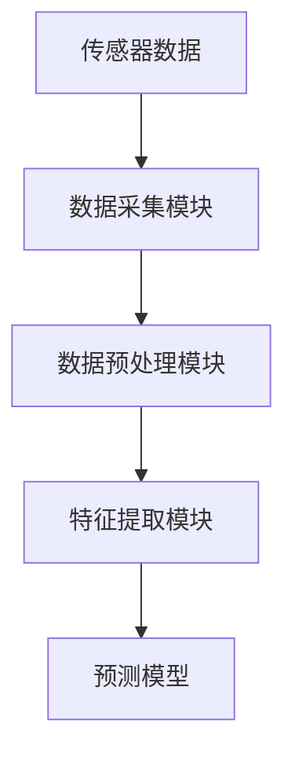
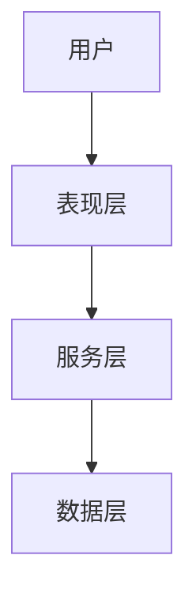
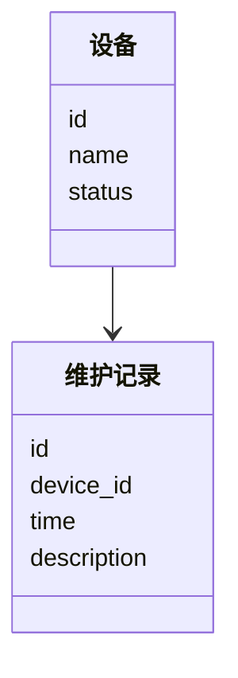
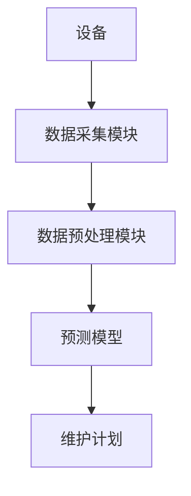
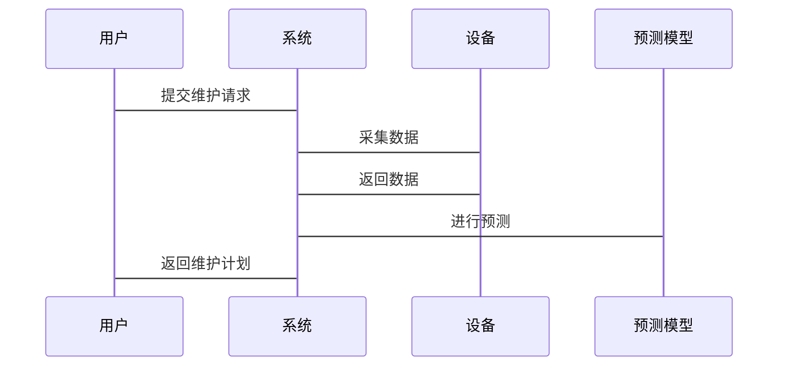

                 

<think>
好，我需要撰写一篇关于《构建智能企业资产管理平台：预测性维护与资源优化》的技术博客文章。首先，我需要明确文章的主题和目标读者。这篇文章主要针对企业IT管理人员、软件架构师以及对资产管理平台感兴趣的技术人员。

接下来，我需要确定文章的结构。根据用户提供的目录大纲，文章分为几个主要部分：背景介绍、核心概念、算法原理、系统架构、项目实战等。我需要确保每一部分都涵盖必要的内容，并且逻辑清晰。

首先，第一部分是背景介绍。我需要解释为什么企业资产管理如此重要，以及传统方法的局限性。这部分需要简洁明了，帮助读者理解问题背景。

第二部分是核心概念，包括预测性维护和资源优化。我需要详细解释这些概念，并通过对比分析，说明它们如何相互作用。这里可能需要一些图表来辅助说明。

第三部分是算法原理。我需要选择合适的算法，比如时间序列分析和深度学习模型，并详细讲解它们的工作原理。这部分可能需要包含数学公式和代码示例，以增强技术深度。

第四部分是系统架构设计。我需要描述系统的整体架构，包括分层架构和微服务架构，并使用图表展示系统架构图和接口设计。

最后，项目实战部分需要通过一个具体案例来展示如何实现这些系统。包括环境安装、核心代码实现、案例分析和项目总结。

在写作过程中，我需要确保语言简洁专业，逻辑严谨。同时，适当加入小结和注意事项，帮助读者更好地理解和应用这些知识。

总之，我需要系统性地整理思路，确保每一部分内容详实、结构清晰，最终完成一篇高质量的技术博客文章。
</think>

# 构建智能企业资产管理平台：预测性维护与资源优化

## 关键词：
智能企业资产管理，预测性维护，资源优化，人工智能，算法原理，系统架构

## 摘要：
本文详细探讨了构建智能企业资产管理平台的核心技术，包括预测性维护和资源优化的关键原理和实现方法。通过分析数据驱动的预测模型、优化算法和系统架构设计，本文为读者提供了从理论到实践的全面指导，帮助企业在资产管理中实现智能化转型。

---

# 第一部分：智能企业资产管理平台概述

## 第1章：企业资产管理平台的背景与挑战

### 1.1 企业资产管理的核心概念

#### 1.1.1 问题背景与问题描述
企业资产管理（Enterprise Asset Management，EAM）是企业管理中的重要环节，涉及对企业资产的全生命周期管理。传统资产管理方式依赖人工操作，存在维护成本高、效率低、维护计划不精准等问题。随着企业规模的扩大，这些问题变得更加突出，亟需智能化解决方案。

#### 1.1.2 传统资产管理的局限性
- **数据孤岛**：各部门数据分散，缺乏统一的管理平台。
- **维护成本高**：人工检查和维护效率低，且难以预测设备故障。
- **资源浪费**：由于缺乏精准的预测，可能导致维护过度或不足。

#### 1.1.3 智能化资产管理的必要性
智能化资产管理通过引入人工智能、大数据分析等技术，可以实现对设备状态的实时监控、故障预测和资源优化配置，从而降低维护成本、提高设备利用率。

### 1.2 资产管理平台的核心目标

#### 1.2.1 资产全生命周期管理
从资产的采购、安装、使用、维护到报废，实现全生命周期的数字化管理。

#### 1.2.2 资源优化配置
通过数据分析和优化算法，实现资源的高效配置，避免浪费。

#### 1.2.3 预测性维护的价值
通过预测设备故障，提前安排维护计划，减少停机时间，提高设备利用率。

### 1.3 智能企业资产管理的边界与外延

#### 1.3.1 系统边界
智能资产管理平台的边界包括设备数据采集、数据分析、预测模型构建和维护计划生成。

#### 1.3.2 与相关系统的交互
- 与企业资源计划（ERP）系统的集成。
- 与生产执行系统（MES）的集成。
- 与物联网（IoT）设备的数据交互。

#### 1.3.3 业务范围的扩展
从单纯的资产管理扩展到生产优化、成本控制和企业决策支持。

---

## 第2章：预测性维护与资源优化的核心概念

### 2.1 预测性维护的定义与特点

#### 2.1.1 预测性维护的定义
预测性维护是基于设备运行数据，利用预测模型预测设备故障，提前安排维护计划的一种维护方式。

#### 2.1.2 预测性维护的核心特点
- **数据驱动**：依赖传感器数据和历史数据进行预测。
- **实时性**：能够实时监控设备状态，快速响应。
- **精准性**：通过算法优化，提高故障预测的准确性。

#### 2.1.3 预测性维护与传统维护的区别
| 特性                | 预测性维护                 | 传统维护                 |
|---------------------|--------------------------|--------------------------|
| 数据来源            | 实时传感器数据             | 人工检查和记录           |
| 维护时机            | 预测故障后安排维护           | 定期或故障后维护           |
| 成本                | 降低维护成本               | 维护成本较高             |

### 2.2 资源优化的核心原理

#### 2.2.1 资源优化的定义
资源优化是指通过科学的规划和算法，合理分配企业资源，以达到最大效率和最小成本的目标。

#### 2.2.2 资源优化的关键要素
- **资源分配**：合理分配设备、人员和时间。
- **成本控制**：最小化维护成本。
- **效率提升**：最大化设备利用率。

#### 2.2.3 资源优化的数学模型
资源优化可以转化为一个典型的线性规划问题，目标函数和约束条件如下：

$$
\text{目标函数：} \quad \min \sum_{i=1}^{n} c_i x_i
$$

$$
\text{约束条件：} \quad \sum_{i=1}^{n} a_i x_i \leq b
$$

其中，$c_i$ 是资源 $i$ 的成本，$x_i$ 是资源 $i$ 的分配量，$a_i$ 是资源 $i$ 的使用限制，$b$ 是总的资源限制。

### 2.3 预测性维护与资源优化的联系

#### 2.3.1 预测性维护如何支持资源优化
通过预测设备故障，资源优化可以提前安排维护人员和备件，避免资源浪费。

#### 2.3.2 资源优化对预测性维护的反向影响
资源优化的结果可以反向优化预测模型，提高预测的准确性。

#### 2.3.3 两者结合的协同效应
预测性维护和资源优化的结合可以实现设备的智能化管理和资源的高效利用，显著提升企业的运营效率。

---

## 第3章：数据驱动的预测性维护

### 3.1 数据采集与预处理

#### 3.1.1 数据来源与类型
- **传感器数据**：设备运行状态数据。
- **历史维护记录**：设备的历史故障和维护记录。
- **环境数据**：温度、湿度等环境因素。

#### 3.1.2 数据清洗与特征提取
- 数据清洗：去除噪声数据和异常值。
- 特征提取：提取设备运行的关键特征，如振动、温度、压力等。

#### 3.1.3 数据流图


### 3.2 预测模型的构建与优化

#### 3.2.1 时间序列分析模型
- **ARIMA模型**：适合处理具有趋势和季节性的数据。
  $$ ARIMA(p, d, q) $$
  其中，$p$ 是自回归阶数，$d$ 是差分阶数，$q$ 是移动平均阶数。

#### 3.2.2 基于深度学习的预测模型
- **LSTM网络**：适合处理时间序列数据，具有记忆功能。
  $$ LSTM(\text{输入门}、\text{遗忘门}、\text{输出门}) $$

#### 3.2.3 模型评估与优化
- 评估指标：准确率、召回率、F1值。
- 优化方法：交叉验证、超参数调优。

### 3.3 预测性维护的实现流程

#### 3.3.1 数据采集与特征提取
```python
import pandas as pd
import numpy as np

# 数据采集
data = pd.read_csv('sensor_data.csv')
# 特征提取
features = data[['temperature', 'vibration', 'pressure']]
```

#### 3.3.2 模型训练与部署
```python
from sklearn.ensemble import RandomForestClassifier

# 训练模型
model = RandomForestClassifier()
model.fit(features, labels)
# 预测
new_data = pd.read_csv('new_sensor_data.csv')
new_features = new_data[['temperature', 'vibration', 'pressure']]
predictions = model.predict(new_features)
```

#### 3.3.3 维护策略生成与执行
- 根据预测结果生成维护计划。
- 自动触发维护流程，减少人工干预。

---

## 第4章：资源优化的算法原理

### 4.1 资源优化的数学模型

#### 4.1.1 线性规划模型
$$
\min \sum_{i=1}^{n} c_i x_i
$$
$$
\sum_{i=1}^{n} a_i x_i \leq b
$$
$$
x_i \geq 0
$$

#### 4.1.2 动态规划模型
动态规划适用于多阶段决策问题，通过分阶段解决问题，逐步优化。

#### 4.1.3 非线性优化模型
当目标函数或约束条件为非线性时，可以使用非线性规划模型。

### 4.2 基于预测的资源分配算法

#### 4.2.1 基于时间序列的资源分配
根据设备的预测故障时间，合理安排维护人员和备件。

#### 4.2.2 基于深度学习的资源分配
利用深度学习模型预测设备的负载情况，动态分配资源。

#### 4.2.3 混合型资源分配策略
结合多种预测方法，制定最优的资源分配方案。

### 4.3 算法实现与优化

#### 4.3.1 算法实现步骤
1. 数据预处理。
2. 模型训练。
3. 资源分配。

#### 4.3.2 算法优化方法
- 参数调整。
- 并行计算。
- 增量优化。

#### 4.3.3 算法性能评估
- 计算效率。
- 资源利用率。
- 成本节约。

---

## 第5章：系统架构与设计

### 5.1 系统架构设计

#### 5.1.1 分层架构设计
- **数据层**：存储设备数据和维护记录。
- **服务层**：实现预测和优化功能。
- **表现层**：提供用户界面。

#### 5.1.2 微服务架构设计
- **数据采集服务**：负责数据的采集和传输。
- **预测服务**：负责设备故障的预测。
- **优化服务**：负责资源的优化配置。

#### 5.1.3 架构图


### 5.2 系统功能设计

#### 5.2.1 领域模型图


#### 5.2.2 系统架构图


#### 5.2.3 系统接口设计
- 数据接口：提供REST API，供其他系统调用。
- 维护计划接口：提供维护计划的生成和执行接口。

#### 5.2.4 系统交互图


---

## 第6章：项目实战

### 6.1 环境安装

#### 6.1.1 安装Python环境
- 安装Anaconda或Miniconda。
- 配置虚拟环境。

#### 6.1.2 安装依赖库
```bash
pip install numpy pandas scikit-learn matplotlib
```

### 6.2 系统核心实现源代码

#### 6.2.1 数据采集模块
```python
import serial
import time

# 串口通信
ser = serial.Serial('COM3', 9600)
while True:
    data = ser.readline().decode()
    print(data)
    time.sleep(1)
```

#### 6.2.2 预测模型实现
```python
from sklearn.ensemble import RandomForestClassifier

# 训练模型
model = RandomForestClassifier()
model.fit(X_train, y_train)

# 预测
y_pred = model.predict(X_test)
```

#### 6.2.3 资源优化实现
```python
import numpy as np

# 线性规划模型
c = np.array([1, 2, 3])
A = np.array([[1, 1, 0], [0, 1, 1]])
b = np.array([20, 15])
result = np.linalg.lstsq(A, b, rcond=None)[0]
print(result)
```

### 6.3 案例分析与详细讲解

#### 6.3.1 案例背景
某制造企业希望优化设备维护计划，减少维护成本。

#### 6.3.2 数据分析
通过传感器数据和历史维护记录，构建预测模型，预测设备故障时间。

#### 6.3.3 资源优化
根据预测结果，合理安排维护人员和备件，制定最优维护计划。

### 6.4 项目小结

#### 6.4.1 项目成果
- 成功实现预测性维护。
- 显著降低维护成本。
- 提高设备利用率。

#### 6.4.2 经验总结
- 数据质量至关重要。
- 模型选择和优化是关键。
- 系统集成和接口设计需要周密考虑。

---

## 第7章：总结与展望

### 7.1 总结
本文详细探讨了智能企业资产管理平台的构建方法，重点介绍了预测性维护和资源优化的核心技术。通过数据驱动的预测模型和优化算法，可以实现设备的智能化管理和资源的高效利用。

### 7.2 展望
未来，随着人工智能和物联网技术的不断发展，智能资产管理平台将更加智能化和自动化。可以进一步研究如何结合边缘计算和区块链技术，提升系统的安全性和实时性。

---

## 附录

### 附录A：工具安装说明
- Python安装：https://www.python.org/downloads/
- Anaconda安装：https://www.anaconda.com/

### 附录B：数据集说明
- 传感器数据集：包含设备运行状态的传感器数据。
- 维护记录数据集：包含设备的历史维护记录。

---

作者：AI天才研究院 & 禅与计算机程序设计艺术

