                 


# 构建智能企业资源规划(ERP)系统：AI深度集成与实时优化

> 关键词：企业资源规划(ERP)、人工智能(AI)、机器学习、实时优化、系统架构设计、数据处理与分析

> 摘要：随着人工智能技术的快速发展，企业资源规划(ERP)系统正在经历一场深刻的变革。本文将详细探讨如何将AI技术深度集成到ERP系统中，实现实时优化和智能决策。文章从ERP系统的背景介绍出发，深入分析智能ERP的核心概念与技术原理，结合实际案例，展示如何通过AI算法优化ERP系统的功能模块，最后总结构建智能ERP系统的最佳实践和未来发展方向。

---

# 第1章：智能ERP系统背景介绍

## 1.1 企业资源规划(ERP)系统概述

### 1.1.1 ERP系统的基本概念
企业资源规划（Enterprise Resource Planning，ERP）系统是一种集成化管理信息系统，旨在整合企业各个部门（如财务、生产、销售、采购、库存等）的数据和业务流程，实现信息共享和高效管理。传统的ERP系统通过模块化设计，将企业的核心业务流程进行标准化处理，帮助企业实现流程优化和资源合理分配。

### 1.1.2 ERP系统的功能模块与特点
- **功能模块**：
  - 财务管理：包括会计、财务报表生成、预算管理等。
  - 生产管理：包括生产计划、物料需求计划（MRP）、车间控制等。
  - 销售与分销：包括订单管理、客户关系管理、渠道管理等。
  - 采购与供应链管理：包括供应商管理、采购计划、库存管理等。
  - 人力资源管理：包括员工信息管理、考勤、薪资计算等。

- **特点**：
  - 集成化：统一的数据源和业务流程。
  - 标准化：遵循行业标准和规范。
  - 可扩展性：支持不同规模和行业的需求。

### 1.1.3 ERP系统在企业管理中的作用
ERP系统通过整合企业内外部资源，优化业务流程，提高企业运营效率，降低成本，增强企业的竞争力。传统的ERP系统虽然功能强大，但往往缺乏灵活性和实时优化能力，难以应对市场环境的快速变化。

---

## 1.2 AI技术与ERP系统的结合

### 1.2.1 AI技术在企业管理中的应用潜力
人工智能（AI）技术的快速发展为企业管理带来了新的可能性。AI可以通过数据分析、模式识别、智能决策等技术，帮助企业实现更高效、更智能的管理。在ERP系统中，AI技术可以用于预测分析、智能推荐、自动化决策等场景，显著提升系统的智能化水平。

### 1.2.2 智能ERP系统的定义与目标
智能ERP系统是指通过集成AI技术，实现对企业资源的智能规划、实时优化和自主决策的ERP系统。其目标是通过AI算法和大数据分析，实时感知企业内外部环境的变化，自动调整业务策略，优化资源配置，从而提升企业的竞争力和应变能力。

### 1.2.3 智能ERP系统的应用场景
- **销售预测**：基于历史销售数据和市场趋势，预测未来销售情况，优化库存管理和生产计划。
- **供应链优化**：通过实时监控供应链数据，预测潜在的供应链风险，并提出优化建议。
- **生产调度**：基于生产数据和设备状态，优化生产计划，提高设备利用率。
- **成本控制**：通过分析成本构成，发现浪费点，提出降低成本的方案。

---

## 1.3 智能ERP系统的开发与应用趋势

### 1.3.1 当前ERP系统的发展现状
传统ERP系统虽然功能强大，但存在以下问题：
- 数据孤岛：各部门之间的数据难以实时共享和协同。
- 响应速度慢：复杂的业务流程导致决策周期长。
- 缺乏灵活性：难以快速适应市场环境的变化。

### 1.3.2 AI技术对ERP系统的推动作用
AI技术的引入为ERP系统注入了新的活力：
- **数据驱动的决策**：通过分析海量数据，提供更精准的决策支持。
- **实时优化**：AI算法可以实时监控企业运行状态，动态调整业务策略。
- **自动化能力**：通过自动化处理，减少人工干预，提高效率。

### 1.3.3 智能ERP系统的未来发展趋势
- **智能化**：AI技术的深度集成将使ERP系统更加智能化，能够自主学习和优化。
- **实时化**：系统将更加注重实时数据处理和实时决策。
- **个性化**：根据企业的具体需求，提供定制化的解决方案。

---

# 第2章：智能ERP系统的核心概念

## 2.1 智能ERP系统的构成要素

### 2.1.1 数据采集与处理
智能ERP系统需要实时采集和处理来自企业内外部的数据，包括：
- **内部数据**：财务数据、生产数据、销售数据等。
- **外部数据**：市场数据、供应链数据、竞争对手数据等。

### 2.1.2 AI算法模型
AI算法是智能ERP系统的核心，用于对数据进行分析和预测。常用的算法包括：
- 机器学习算法：如线性回归、支持向量机（SVM）。
- 深度学习算法：如卷积神经网络（CNN）、循环神经网络（RNN）。
- 强化学习算法：如Q-learning、Deep Q-Network（DQN）。

### 2.1.3 系统集成与优化
智能ERP系统的优化需要考虑以下几个方面：
- **数据集成**：确保数据的准确性和一致性。
- **算法优化**：通过调整模型参数和优化算法，提高预测精度。
- **系统性能**：确保系统在实时运行中的稳定性和响应速度。

---

## 2.2 智能ERP系统的核心技术

### 2.2.1 机器学习在ERP中的应用
机器学习是一种通过数据训练模型的技术，广泛应用于智能ERP系统中。例如，可以通过机器学习模型预测销售趋势，优化库存管理。

**机器学习流程图（Mermaid）**：
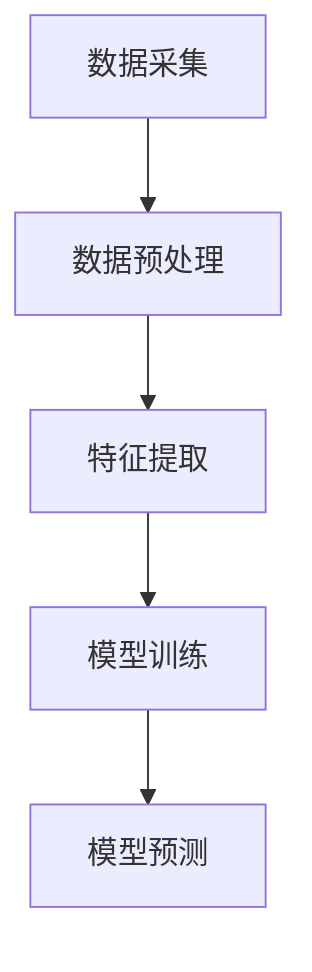

### 2.2.2 深度学习在ERP中的应用
深度学习是一种基于人工神经网络的机器学习技术，适用于处理非结构化数据，如文本、图像等。例如，可以通过深度学习模型分析市场舆情，辅助制定市场策略。

**深度学习流程图（Mermaid）**：
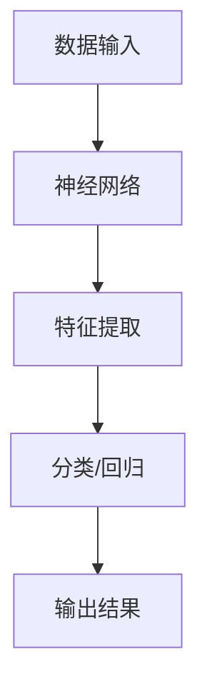

### 2.2.3 强化学习在ERP中的应用
强化学习是一种通过与环境互动来学习策略的技术，适用于动态环境下的决策问题。例如，可以通过强化学习优化生产调度，提高设备利用率。

**强化学习流程图（Mermaid）**：
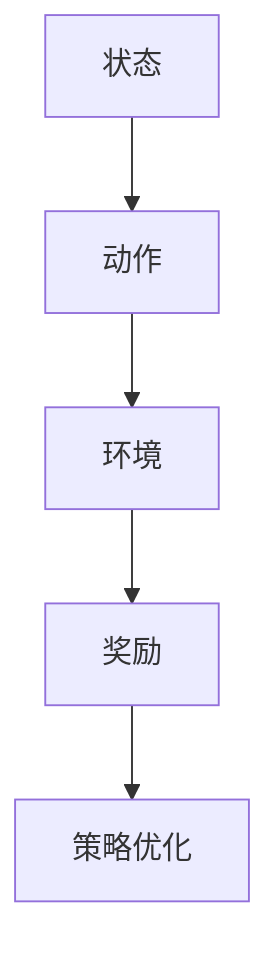

---

## 2.3 智能ERP系统的数据流与信息处理

### 2.3.1 数据采集与预处理
数据采集是智能ERP系统的第一步，需要从企业内外部获取相关数据。数据预处理包括数据清洗、特征提取和数据标注。

**数据流图（Mermaid）**：
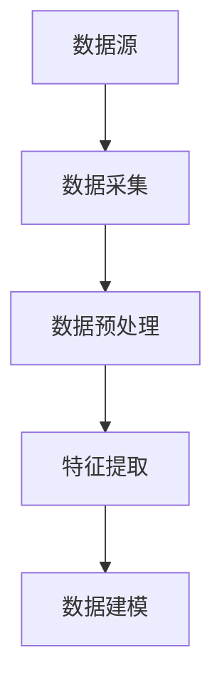

### 2.3.2 数据分析与建模
数据分析与建模是智能ERP系统的核心，通过训练模型对数据进行分析和预测。模型的评估与优化是确保模型性能的重要步骤。

**数据建模流程图（Mermaid）**：
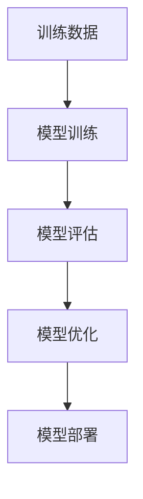

### 2.3.3 数据可视化与反馈优化
数据可视化是智能ERP系统的重要组成部分，通过直观的图表展示数据和模型结果，帮助用户更好地理解和优化决策。

**数据可视化流程图（Mermaid）**：
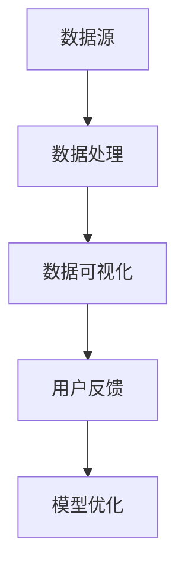

---

# 第3章：智能ERP系统的算法原理

## 3.1 机器学习算法在ERP中的应用

### 3.1.1 监督学习算法
监督学习是一种基于标签数据的机器学习方法，适用于回归和分类问题。例如，可以通过线性回归模型预测销售量。

**线性回归公式**：
$$ y = \beta_0 + \beta_1 x + \epsilon $$
其中，$y$ 是目标变量，$x$ 是自变量，$\beta_0$ 和 $\beta_1$ 是模型参数，$\epsilon$ 是误差项。

### 3.1.2 非监督学习算法
非监督学习是一种基于无标签数据的机器学习方法，适用于聚类和降维问题。例如，可以通过K-means算法对客户进行分群。

**K-means算法步骤**：
1. 随机选择K个初始质心。
2. 计算每个数据点到质心的距离，将数据点归类到最近的质心。
3. 计算新的质心位置。
4. 重复步骤2和3，直到质心不再变化。

### 3.1.3 强化学习算法
强化学习是一种基于奖励机制的机器学习方法，适用于动态环境下的决策问题。例如，可以通过Q-learning算法优化生产调度。

**Q-learning公式**：
$$ Q(s, a) = Q(s, a) + \alpha [r + \gamma \max Q(s', a') - Q(s, a)] $$
其中，$s$ 是当前状态，$a$ 是动作，$r$ 是奖励，$\gamma$ 是折扣因子，$\alpha$ 是学习率。

---

## 3.2 深度学习算法在ERP中的应用

### 3.2.1 卷积神经网络（CNN）
CNN适用于处理图像数据，例如，可以通过CNN分析产品缺陷图像，实现质量检测。

**CNN结构图（Mermaid）**：
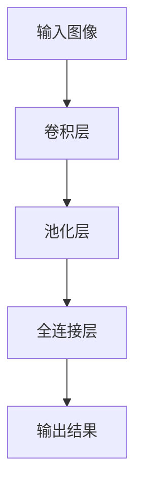

### 3.2.2 循环神经网络（RNN）
RNN适用于处理序列数据，例如，可以通过RNN分析销售时间序列数据，预测未来趋势。

**RNN结构图（Mermaid）**：
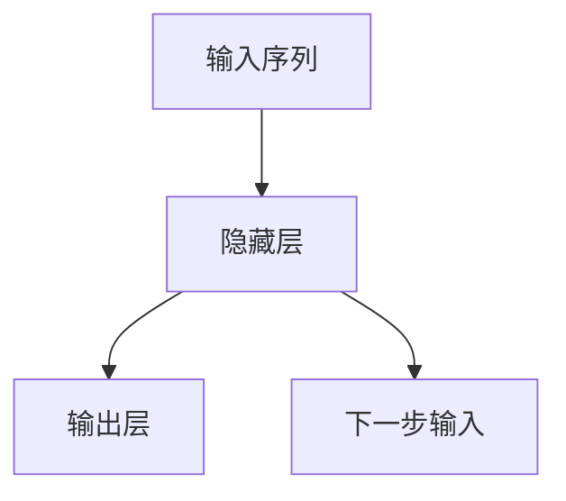

### 3.2.3 图神经网络（GNN）
GNN适用于处理图结构数据，例如，可以通过GNN分析供应链网络，预测潜在风险。

**GNN结构图（Mermaid）**：
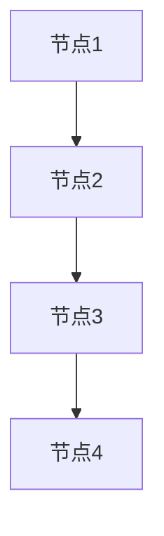

---

## 3.3 算法选择与优化策略

### 3.3.1 算法选择的依据
- 数据类型：结构化数据选择机器学习算法，非结构化数据选择深度学习算法。
- 任务类型：分类任务选择决策树或SVM，回归任务选择线性回归或随机森林。
- 计算资源：深度学习算法需要较高的计算资源。

### 3.3.2 算法优化的数学模型
通过交叉验证和网格搜索优化模型参数，例如：
$$ \text{损失函数} = \sum_{i=1}^n (y_i - \hat{y}_i)^2 $$
其中，$y_i$ 是真实值，$\hat{y}_i$ 是预测值。

### 3.3.3 算法性能评估与改进
通过准确率、召回率、F1分数等指标评估模型性能，例如：
$$ \text{准确率} = \frac{\text{正确预测数}}{\text{总预测数}} $$

---

# 第4章：智能ERP系统的数据处理与分析

## 4.1 数据采集与预处理

### 4.1.1 数据来源与采集方法
数据来源包括数据库、API接口、文件等，可以通过数据抽取工具（如ETL）进行采集。

### 4.1.2 数据清洗与特征提取
数据清洗包括去除重复数据、处理缺失值、去除异常值。特征提取包括选择重要特征、构建新特征。

### 4.1.3 数据标注与格式化
数据标注包括对数据进行分类、回归等任务的标注。格式化包括将数据转换为模型输入格式。

---

## 4.2 数据分析与建模

### 4.2.1 数据分析的基本方法
数据分析包括描述性分析、诊断性分析、预测性分析和规范性分析。

### 4.2.2 数据建模的步骤与流程
数据建模包括数据预处理、模型选择、模型训练、模型评估和模型部署。

### 4.2.3 数据模型的评估与优化
模型评估包括准确率、召回率、F1分数等指标。模型优化包括参数调整、模型集成等。

---

## 4.3 数据可视化与决策支持

### 4.3.1 数据可视化工具与方法
常用的数据可视化工具包括Tableau、Power BI、Python的Matplotlib和Seaborn。

### 4.3.2 数据可视化在智能ERP中的应用
通过数据可视化，用户可以直观地了解企业运营状况，快速发现潜在问题。

### 4.3.3 数据驱动的决策支持
通过数据建模和可视化，智能ERP系统可以为用户提供智能化的决策支持，帮助企业在复杂环境中做出最优决策。

---

# 第5章：智能ERP系统的系统架构设计

## 5.1 系统功能设计

### 5.1.1 功能模块划分
智能ERP系统的功能模块包括：
- 数据采集与处理模块
- 数据分析与建模模块
- AI算法集成模块
- 系统优化与决策模块

### 5.1.2 功能模块的交互流程
数据采集模块采集数据后，传递给数据分析模块进行处理，分析结果用于训练AI模型，最终生成优化策略。

**功能模块交互图（Mermaid）**：
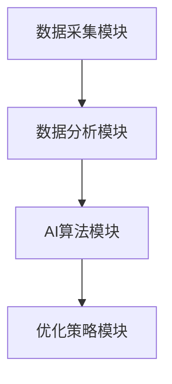

---

## 5.2 系统架构设计

### 5.2.1 系统架构图
智能ERP系统的架构包括数据层、应用层、展示层。

**系统架构图（Mermaid）**：
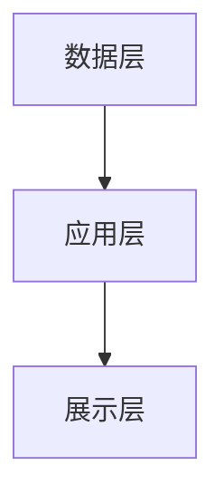

### 5.2.2 系统优化与实时更新
系统需要支持实时数据更新和模型动态优化，确保系统始终基于最新的数据进行决策。

---

## 5.3 系统接口设计

### 5.3.1 系统接口描述
系统接口包括数据接口和API接口，用于不同模块之间的数据传递和调用。

### 5.3.2 接口设计的原则
接口设计需要遵循松耦合原则，确保模块之间的独立性和可扩展性。

---

## 5.4 系统交互设计

### 5.4.1 系统交互流程
系统交互流程包括用户登录、数据输入、模型运行、结果展示。

**系统交互流程图（Mermaid）**：
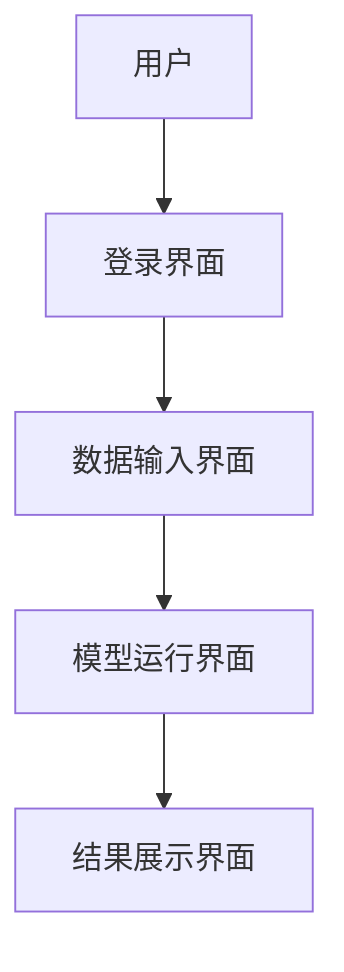

---

# 第6章：智能ERP系统的项目实战

## 6.1 环境安装与配置

### 6.1.1 系统环境要求
- 操作系统：Windows、Linux、macOS
- Python版本：3.6+
- 开发工具：PyCharm、VS Code
- 其他依赖：TensorFlow、Keras、Scikit-learn、Pandas、Matplotlib

### 6.1.2 安装步骤
1. 安装Python和pip。
2. 安装所需的第三方库：
   ```bash
   pip install numpy pandas scikit-learn tensorflow matplotlib
   ```

---

## 6.2 系统核心代码实现

### 6.2.1 数据采集与预处理代码
```python
import pandas as pd

# 数据采集
data = pd.read_csv('data.csv')

# 数据清洗
data.drop_duplicates(inplace=True)
data.dropna(inplace=True)

# 特征提取
features = data[['sales', 'inventory', 'cost']]
```

### 6.2.2 数据分析与建模代码
```python
from sklearn.model import LinearRegression

# 训练线性回归模型
model = LinearRegression()
model.fit(features, target)

# 模型预测
predictions = model.predict(new_features)
```

### 6.2.3 AI算法集成代码
```python
import tensorflow as tf
from tensorflow.keras import layers

# 定义神经网络模型
model = tf.keras.Sequential([
    layers.Dense(64, activation='relu'),
    layers.Dense(1, activation='sigmoid')
])

# 编译模型
model.compile(optimizer='adam', loss='binary_crossentropy', metrics=['accuracy'])

# 训练模型
model.fit(x_train, y_train, epochs=10, batch_size=32)
```

---

## 6.3 系统优化与实时更新代码
```python
# 定义实时更新函数
def update_model(new_data):
    model.fit(new_data, labels, epochs=1, batch_size=32)

# 设置定时任务
import schedule

schedule.every(1).hour.do(update_model, new_data)
```

---

# 第7章：智能ERP系统的总结与展望

## 7.1 系统总结

### 7.1.1 核心技术总结
智能ERP系统通过集成AI技术，实现了对企业资源的智能规划和实时优化。主要技术包括数据采集与处理、机器学习、深度学习和强化学习。

### 7.1.2 系统优势总结
智能ERP系统的优势包括：
- 提高决策效率
- 降低成本
- 提高企业竞争力

---

## 7.2 系统优化与未来展望

### 7.2.1 当前系统优化方向
- 提升算法的实时性和准确性
- 优化系统的可扩展性和可维护性
- 提高系统的用户体验

### 7.2.2 未来研究方向
- 研究更先进的AI算法，如大语言模型（LLM）在ERP中的应用
- 探索多模态数据的处理方法
- 研究智能ERP系统的安全性与隐私保护

---

# 作者：AI天才研究院/AI Genius Institute & 禅与计算机程序设计艺术 /Zen And The Art of Computer Programming

---

以上是《构建智能企业资源规划(ERP)系统：AI深度集成与实时优化》的技术博客文章的完整大纲和内容。

