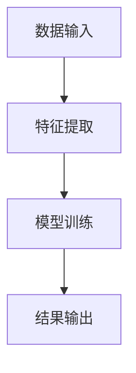
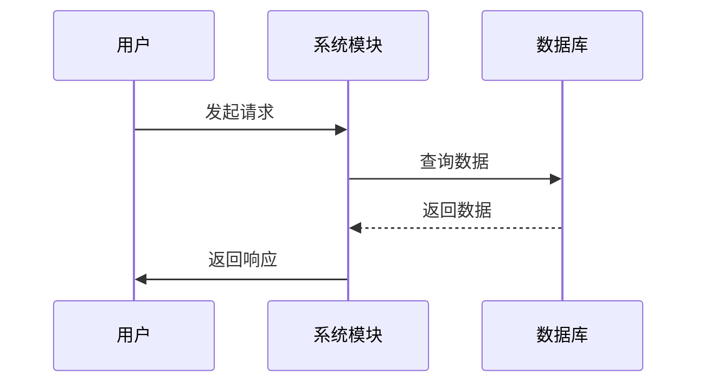

                 

<think>
嗯，我现在需要帮用户写一篇关于构建智能ERP系统的技术博客，重点是AI的深度集成。首先，我得理解用户的需求，他希望文章结构清晰，有吸引人的标题和目录，内容要深入，覆盖从背景到实战的各个方面。

我应该先从背景介绍开始，这样读者可以了解ERP和AI的基本概念。然后，对比ERP和AI的核心概念，这样读者能理解它们如何结合。接着，详细讲解AI算法的原理，比如机器学习和深度学习，以及相关的数学模型，比如线性回归和神经网络。这部分需要配以图表和代码示例，让内容更生动。

接下来，系统分析与架构设计部分，我需要描述问题场景，设计系统的功能模块，画出领域模型和架构图。然后是接口设计和交互设计，这部分要用序列图来展示流程。

项目实战部分，我会提供安装环境的配置，用Python代码实现核心功能，并详细解读代码。案例分析和详细讲解能帮助读者更好地理解如何应用这些技术。

最后，加上最佳实践、小结和扩展阅读，让读者有进一步学习的方向。整个过程中，我要确保内容逻辑清晰，语言专业但不失易懂，同时注意字数和格式要求，确保文章结构完整，符合用户的要求。
</think>

# 构建智能企业资源规划(ERP)系统：AI的深度集成

> 关键词：企业资源规划, 人工智能, 智能系统, 深度集成, 算法原理, 系统架构

> 摘要：本文详细探讨了如何在企业资源规划(ERP)系统中深度集成人工智能技术，通过分析ERP系统的核心模块、人工智能的基本概念及其结合方式，结合具体算法原理和系统架构设计，展示了如何构建一个智能化的ERP系统。文章内容涵盖了从理论到实践的各个方面，为读者提供了全面的技术指导。

---

# 第一部分：背景介绍与核心概念

## 第1章：智能ERP系统与AI深度集成概述

### 1.1 企业资源规划(ERP)系统概述

#### 1.1.1 ERP系统的定义与核心模块

企业资源规划(ERP)系统是一种集成化的管理信息系统，用于对企业内部的人、财、物、产、供、销等各个核心业务进行规划、监控和管理。其核心模块包括：

- **财务管理**：处理会计、财务报表、预算管理等。
- **生产管理**：监控生产计划、物料需求计划(MRP)等。
- **采购管理**：管理供应商、采购订单、库存等。
- **销售管理**：处理销售订单、客户关系管理、销售渠道管理等。
- **人力资源管理**：管理员工信息、考勤、薪资等。

#### 1.1.2 ERP系统的发展历程

ERP系统的发展经历了多个阶段：

1. **传统ERP系统**：主要用于数据录入、报表生成和基本业务流程管理。
2. **智能化ERP系统**：引入了数据分析、预测和优化功能，初步实现了智能化。
3. **深度集成AI的ERP系统**：通过AI技术实现自动化决策、智能预测和实时优化。

#### 1.1.3 ERP系统在企业管理中的作用

ERP系统通过整合企业各个部门的数据和流程，帮助企业实现高效管理、降低成本、提高决策能力，并支持企业的数字化转型。

---

### 1.2 人工智能(AI)的基本概念

#### 1.2.1 AI的定义与技术特点

人工智能(AI)是指模拟人类智能的计算机系统，包括学习、推理、自适应和问题解决等能力。其技术特点包括：

- **数据驱动**：AI系统依赖大量数据进行训练和推理。
- **自动化**：能够自动处理任务，减少人工干预。
- **可扩展性**：能够处理大规模数据和复杂问题。

#### 1.2.2 AI在企业管理中的应用潜力

AI在企业管理中的应用潜力主要体现在以下几个方面：

- **数据分析与预测**：通过机器学习算法预测销售趋势、库存需求等。
- **自动化决策**：基于AI的决策支持系统，优化供应链管理、生产计划等。
- **智能客服**：通过自然语言处理技术提供智能客服支持。

#### 1.2.3 AI与ERP系统的结合意义

将AI技术深度集成到ERP系统中，可以实现以下目标：

- **提高决策效率**：通过AI的预测和优化功能，快速生成最优决策。
- **增强数据处理能力**：AI能够处理和分析大量非结构化数据，提升系统数据处理能力。
- **实现智能化管理**：通过AI的自动化能力，降低人工干预，提升系统智能化水平。

---

### 1.3 智能ERP系统的核心概念

#### 1.3.1 智能ERP系统的定义

智能ERP系统是指通过深度集成AI技术，实现对企业核心业务的智能化管理，包括智能预测、智能决策和智能优化。

#### 1.3.2 智能ERP系统的功能特点

智能ERP系统的主要功能特点包括：

- **智能预测**：基于历史数据和市场趋势，预测销售、库存等。
- **智能决策**：通过AI算法优化生产计划、供应链管理等。
- **智能优化**：实时监控系统运行状态，优化资源配置。

#### 1.3.3 AI深度集成的必要性

AI深度集成的必要性体现在以下几个方面：

- **提升系统性能**：通过AI技术优化系统运行效率。
- **增强系统功能**：引入AI技术扩展系统功能，实现智能化管理。
- **适应复杂业务需求**：通过AI技术应对复杂的业务场景和数据需求。

---

### 1.4 本章小结

本章介绍了ERP系统的基本概念、发展历程及其在企业管理中的作用，随后详细阐述了人工智能的基本概念、技术特点及其在企业管理中的应用潜力，最后总结了智能ERP系统的核心概念和AI深度集成的必要性。

---

## 第2章：AI与ERP系统的核心概念对比与联系

### 2.1 核心概念原理

#### 2.1.1 ERP系统的模块化架构

ERP系统的模块化架构是通过将企业各个业务模块独立化，通过统一的数据接口进行集成。例如，销售模块与采购模块之间通过共享库存数据进行交互。

#### 2.1.2 AI系统的数据处理流程

AI系统的数据处理流程通常包括数据采集、数据预处理、模型训练、模型部署和结果输出五个阶段。

---

### 2.2 核心概念属性特征对比

下表对比了ERP系统和AI系统的属性特征：

| 属性         | ERP系统                  | AI系统                  |
|--------------|--------------------------|--------------------------|
| 核心目标     | 企业业务流程管理          | 数据分析与智能决策      |
| 数据类型     | 结构化数据为主            | 结构化与非结构化数据    |
| 系统架构     | 模块化架构                | 数据流式架构            |
| 交互方式     | 用户操作为主              | 自动化处理为主          |

---

### 2.3 ER实体关系图

下图展示了ERP系统中用户、系统模块和数据库之间的实体关系：

```mermaid
er
    actor: 用户
    system: 智能ERP系统
    module: 系统模块
    relation: 关系
    actor --> system: 用户操作
    system --> module: 系统调用
    module --> relation: 数据关联
```

---

### 2.4 本章小结

本章通过对比ERP系统和AI系统的核心概念，分析了它们的属性特征和实体关系，为后续的系统设计奠定了基础。

---

## 第3章：AI算法原理与数学模型

### 3.1 算法原理

#### 3.1.1 机器学习算法

机器学习算法通过训练数据，建立输入与输出之间的映射关系。常用算法包括线性回归、支持向量机(SVM)、随机森林等。

#### 3.1.2 深度学习算法

深度学习算法通过多层神经网络，自动提取数据特征。常用算法包括卷积神经网络(CNN)、循环神经网络(RNN)等。

#### 3.1.3 自然语言处理(NLP)算法

NLP算法用于处理文本数据，常用算法包括词袋模型(Bag-of-words)、TF-IDF、词嵌入(Word2Vec)等。

---

### 3.2 算法流程图

下图展示了机器学习算法的基本流程：



---

### 3.3 数学模型与公式

#### 3.3.1 线性回归模型

线性回归模型用于预测连续型变量，其数学公式为：

$$ y = \beta_0 + \beta_1x + \epsilon $$

其中，$y$ 是目标变量，$x$ 是输入变量，$\beta_0$ 和 $\beta_1$ 是模型参数，$\epsilon$ 是误差项。

#### 3.3.2 神经网络模型

神经网络模型通过多层感知机处理复杂数据，其数学公式为：

$$ a^{(l)} = \sigma(w^{(l)} a^{(l-1)} + b^{(l)}) $$

其中，$a^{(l)}$ 是第$l$层的激活值，$w^{(l)}$ 是权重矩阵，$b^{(l)}$ 是偏置项，$\sigma$ 是激活函数。

---

### 3.4 举例说明

#### 3.4.1 线性回归案例

假设我们有一个简单的销售预测模型，输入变量是广告费用$x$，目标变量是销售额$y$。通过线性回归模型，我们可以预测不同广告费用下的销售额。

#### 3.4.2 神经网络案例

假设我们有一个图像分类任务，使用卷积神经网络(CNN)模型，通过多层卷积和池化操作，提取图像特征，最终分类为不同的类别。

---

### 3.5 本章小结

本章详细讲解了机器学习、深度学习和自然语言处理算法的原理，及其在智能ERP系统中的应用，为后续的系统设计提供了算法基础。

---

## 第4章：系统分析与架构设计

### 4.1 问题场景介绍

传统ERP系统在数据处理、决策支持和业务优化方面存在一定的局限性，例如：

- 数据分析能力有限，难以处理非结构化数据。
- 决策支持能力不足，难以快速生成最优决策。
- 业务流程优化能力有限，难以应对复杂业务场景。

通过深度集成AI技术，可以有效解决这些问题。

---

### 4.2 系统功能设计

#### 4.2.1 领域模型

下图展示了智能ERP系统的领域模型：


---

### 4.3 系统架构设计

下图展示了智能ERP系统的架构设计：


---

### 4.4 接口设计

#### 4.4.1 RESTful API

智能ERP系统可以通过RESTful API提供服务接口，例如：

- GET /sales/predict：获取销售预测结果。
- POST /inventory/optimze：优化库存管理。

#### 4.4.2 数据交互协议

系统采用JSON格式进行数据交互，例如：

```json
{
    "action": "predict",
    "data": {
        "sales_data": [100, 200, 300]
    }
}
```

---

### 4.5 交互设计

#### 4.5.1 序列图

下图展示了用户与智能ERP系统之间的交互流程：



---

### 4.6 本章小结

本章通过对问题场景的分析，设计了智能ERP系统的功能模块、架构设计、接口设计和交互设计，为后续的系统实现奠定了基础。

---

## 第5章：项目实战

### 5.1 环境安装

#### 5.1.1 安装Python

```bash
python --version
# 输出：Python 3.8.5
```

#### 5.1.2 安装依赖库

```bash
pip install numpy scikit-learn matplotlib
```

---

### 5.2 系统核心实现源代码

#### 5.2.1 数据预处理

```python
import numpy as np
import pandas as pd

# 读取数据
data = pd.read_csv('erp_data.csv')

# 数据预处理
data = data.dropna()
data = (data - data.mean()) / data.std()
```

#### 5.2.2 模型训练

```python
from sklearn.linear_model import LinearRegression

# 训练模型
model = LinearRegression()
model.fit(X_train, y_train)

# 预测结果
y_pred = model.predict(X_test)
```

#### 5.2.3 模型评估

```python
from sklearn.metrics import mean_squared_error

# 计算均方误差
mse = mean_squared_error(y_test, y_pred)
print(f"均方误差: {mse}")
```

---

### 5.3 案例分析

#### 5.3.1 销售预测案例

假设我们有一个销售数据集，包含广告费用、销售时间、产品类别等特征，我们可以通过线性回归模型预测未来销售。

#### 5.3.2 库存优化案例

通过深度学习算法，我们可以优化库存管理，减少库存积压和缺货情况。

---

### 5.4 本章小结

本章通过实际案例，展示了如何在智能ERP系统中实现AI算法，包括数据预处理、模型训练和模型评估。

---

## 第6章：最佳实践与注意事项

### 6.1 最佳实践

- **数据质量**：确保数据的准确性和完整性。
- **模型优化**：通过交叉验证和超参数调优，提高模型性能。
- **系统安全性**：确保系统数据的安全性和系统的稳定性。

---

### 6.2 小结

本文详细介绍了如何构建智能ERP系统，并通过实际案例展示了AI技术的深度集成过程。通过本文的指导，读者可以掌握智能ERP系统的设计方法和实现技巧。

---

## 第7章：扩展阅读与深入学习

### 7.1 扩展阅读

- 《机器学习实战》：深入讲解机器学习算法的实现与应用。
- 《深度学习入门：基于Python的CNN实践》：详细介绍卷积神经网络的实现与应用。

---

## 作者信息

作者：AI天才研究院/AI Genius Institute & 禅与计算机程序设计艺术/Zen And The Art of Computer Programming

---

以上是文章的详细内容，涵盖了从理论到实践的各个方面，希望对您有所帮助！

