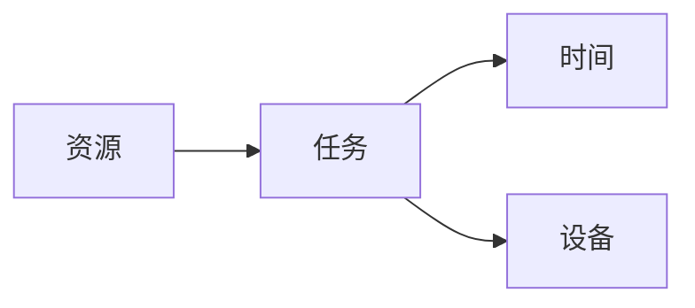
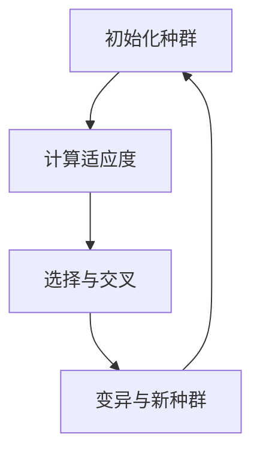

                 

<think>
好，我现在需要帮助用户撰写一篇关于《构建智能企业资源调度系统：AI优化资源分配》的技术博客。用户希望文章结构清晰，内容详尽，涵盖从背景到系统设计、算法实现、项目实战等部分。首先，我应该理解用户的需求，确保文章覆盖所有必要的主题，并且符合格式要求。

首先，我会从文章的标题开始，然后是关键词和摘要。接下来，按照目录结构，每一章都需要详细展开，确保每个部分都有足够的内容，包括定义、原理、算法、系统设计和项目实战。我要注意使用正确的Markdown格式，确保数学公式和图表的正确嵌入，同时保持语言的清晰和逻辑的连贯。

在撰写过程中，我需要确保每个章节的小结部分简明扼要，帮助读者巩固所学内容。同时，数学模型和算法部分需要用LaTeX公式和Mermaid图表来详细说明，这有助于读者更好地理解技术细节。最后，我会在文章末尾添加作者信息，确保格式完整。

整个过程中，我要保持思考的连贯性，逐步分析每个部分，确保内容全面且深入，满足用户的需求。这不仅包括理论知识，还包括实际应用，使读者能够从理论到实践，全面掌握构建智能资源调度系统的方法。
</think>

# 构建智能企业资源调度系统：AI优化资源分配

> 关键词：智能调度系统, AI优化, 资源分配, 强化学习, 遗传算法, 企业资源管理

> 摘要：本文详细探讨了如何利用人工智能技术优化企业资源调度系统。通过分析资源调度的核心概念、数学建模、AI算法原理以及系统架构设计，结合实际项目案例，展示了如何利用强化学习和遗传算法等技术实现智能化的资源分配，从而提升企业的运营效率和竞争力。

---

## 第1章: 智能企业资源调度系统概述

### 1.1 资源调度系统的基本概念

#### 1.1.1 资源调度的定义与范围

资源调度系统是指通过科学的规划和分配，将企业中的各种资源（如设备、人员、资金、时间等）合理分配到不同的任务或项目中，以达到最优目标的系统。其范围涵盖生产调度、物流管理、任务分配等多个领域。

#### 1.1.2 智能资源调度的核心要素

智能资源调度系统的核心要素包括：

1. **资源池**：企业的各类资源，如设备、人员、资金等。
2. **任务需求**：需要分配的任务或项目，每个任务有不同的资源需求和时间要求。
3. **目标函数**：优化的目标，如最小化成本、最大化效率等。
4. **约束条件**：资源分配时需要遵守的规则，如时间限制、设备可用性等。

#### 1.1.3 企业资源调度的典型场景

- **生产调度**：工厂中设备和工人的调度，确保生产计划按时完成。
- **物流管理**：货物运输中的车辆和路线优化。
- **任务分配**：将任务分配给最合适的人或团队。

### 1.2 AI在资源调度中的作用

#### 1.2.1 AI技术如何优化资源分配

AI技术通过数据分析和预测，能够快速找到最优的资源分配方案。例如，利用机器学习模型预测设备的故障率，提前安排维护，避免生产中断。

#### 1.2.2 数据驱动的调度决策

AI系统能够处理大量数据，分析历史调度情况，发现规律，从而做出更科学的决策。

#### 1.2.3 智能调度系统的优势与挑战

优势：
- 提高资源利用率。
- 减少成本。
- 提升效率。

挑战：
- 数据质量要求高。
- 算法复杂度高。
- 实时调度的难度。

### 1.3 智能资源调度系统的分类

#### 1.3.1 基于规则的调度系统

通过预定义的规则进行资源分配，适用于规则简单、场景固定的调度问题。

#### 1.3.2 基于机器学习的调度系统

利用机器学习模型（如强化学习、神经网络）进行资源分配，适用于复杂、动态变化的场景。

#### 1.3.3 混合型调度系统

结合规则和机器学习的混合系统，兼顾规则的确定性和机器学习的灵活性。

---

## 第2章: 资源调度问题的数学建模

### 2.1 资源调度问题的背景与描述

资源调度问题通常涉及多个变量和约束条件，是一个典型的优化问题。例如，如何在有限的设备和时间内完成尽可能多的任务。

### 2.2 核心概念与联系

#### 2.2.1 实体关系图（ER图）



#### 2.2.2 核心概念对比表

| 概念 | 属性 | 描述 |
|------|------|------|
| 资源 | 可用性 | 可分配的资源类型 |
| 任务 | 时间 | 任务执行所需的时间 |
| 设备 | 状态 | 设备的运行状态 |

### 2.3 数学模型与公式

#### 2.3.1 线性规划模型

目标函数：
$$ \text{最大化/最小化} \quad \sum_{i} c_i x_i $$

约束条件：
$$ \sum_{i} a_{ij} x_i \leq b_j \quad \forall j $$

变量：
$$ x_i \geq 0 \quad \text{且为整数} $$

#### 2.3.2 动态规划模型

状态转移方程：
$$ dp[i] = \min_{k} (dp[k] + cost(k, i)) $$

初始状态：
$$ dp[0] = 0 $$

---

## 第3章: 基于AI的资源调度算法原理

### 3.1 强化学习在资源调度中的应用

#### 3.1.1 强化学习的基本原理

强化学习通过智能体与环境的交互，逐步学习最优策略。在资源调度中，智能体可以学习在不同状态下选择最优的动作。

#### 3.1.2 资源调度中的状态表示

状态可以包括当前时间、可用资源、任务优先级等。

#### 3.1.3 动作空间与奖励函数设计

动作空间：分配资源到某个任务。

奖励函数：完成任务的及时性、资源利用率等。

### 3.2 遗传算法在资源调度中的应用

#### 3.2.1 遗传算法的基本流程



#### 3.2.2 调度问题的编码与解码

编码方式：将任务分配问题转化为二进制或排列组合的形式。

### 3.3 算法实现的Python代码示例

```python
def fitness(individual):
    # 计算个体的适应度
    pass

def evolve(population):
    # 进行遗传算法的迭代
    pass
```

---

## 第4章: 系统架构与设计

### 4.1 系统功能模块设计

#### 4.1.1 数据采集模块

负责采集企业的资源、任务、设备等数据。

#### 4.1.2 调度算法模块

根据数据和算法模型生成调度方案。

#### 4.1.3 界面展示模块

将调度结果以可视化的方式展示给用户。

### 4.2 系统架构设计


### 4.3 系统接口设计

API接口：
- 输入：资源、任务数据。
- 输出：调度结果。

---

## 第5章: 项目实战

### 5.1 环境配置

安装必要的库和工具，如Python、TensorFlow、Scikit-learn等。

### 5.2 代码实现

```python
import numpy as np
from sklearn import linear_model

# 示例代码
class ResourceAllocator:
    def __init__(self):
        self.model = linear_model.LinearRegression()

    def train(self, X, y):
        self.model.fit(X, y)

    def predict(self, X):
        return self.model.predict(X)
```

### 5.3 案例分析

以生产调度为例，展示如何利用AI优化资源分配。

---

## 第6章: 总结与展望

### 6.1 本章总结

本文详细探讨了AI在资源调度中的应用，包括数学建模、算法实现和系统设计。

### 6.2 注意事项

- 数据质量对算法性能影响重大。
- 算法的实时性和可扩展性需要进一步优化。

### 6.3 拓展阅读

推荐相关书籍和论文，如《强化学习》、《机器学习实战》等。

---

作者：AI天才研究院 & 禅与计算机程序设计艺术

