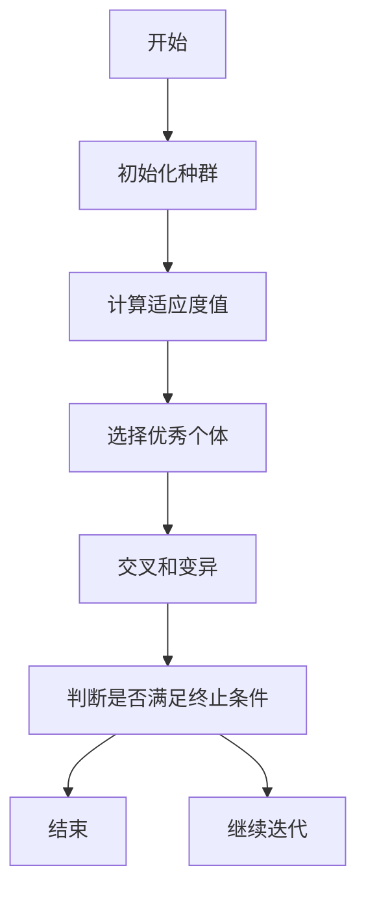
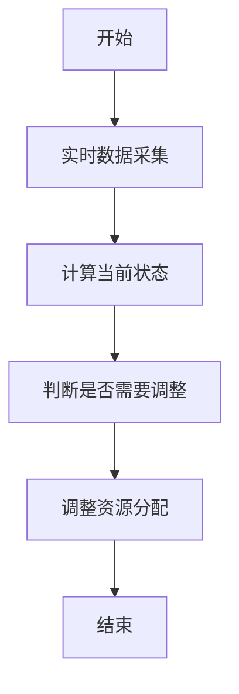
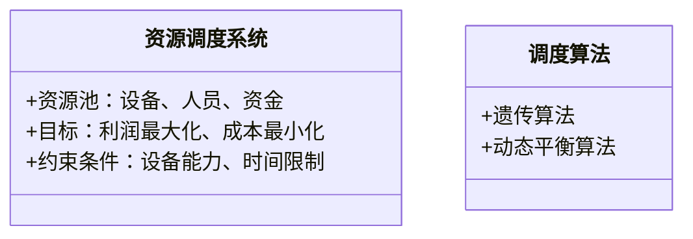
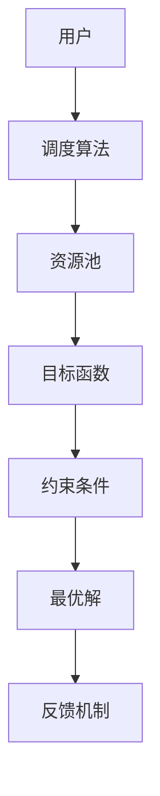
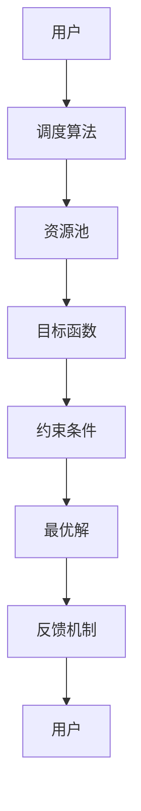

                 

<think>
嗯，用户希望我以《构建智能企业资源调度系统：多目标优化与动态平衡》为标题，撰写一篇技术博客文章。看起来他们需要一个详细的目录大纲，覆盖从背景到系统构建、实战案例等多个方面。用户还特别强调要使用吸引人的章节标题，技术语言要专业，逻辑清晰，结构紧凑。

首先，我需要明确文章的核心内容。资源调度系统涉及多目标优化和动态平衡，这可能包括企业资源分配、调度算法、系统架构设计等方面。用户提供的示例大纲已经比较详细，但可能需要进一步细化，确保每个章节都有足够的内容支撑。

接下来，我应该考虑用户的需求。他们可能是一位CTO或者技术负责人，希望系统地了解如何构建这样的系统。因此，文章需要既有理论深度，又有实际的应用案例，帮助读者理解如何在实际中应用这些概念。

然后，我要确保每个章节都涵盖必要的部分，比如数学模型、算法流程图、系统架构图等。这可能需要我使用Mermaid图和LaTeX公式来详细解释。同时，代码示例也是关键，需要提供Python代码来实现部分算法。

在撰写摘要时，我需要概括整篇文章的核心内容，突出多目标优化和动态平衡的重要性，以及系统在企业中的应用价值。关键词部分要准确，涵盖技术要点，如企业资源调度、多目标优化、动态平衡等。

最后，确保文章结构合理，逻辑连贯，从背景介绍到系统构建，再到实战案例，层层递进，帮助读者逐步理解如何构建智能资源调度系统。同时，结尾的小结和注意事项可以为读者提供实用的建议，增强文章的实用性。
</think>

# 构建智能企业资源调度系统：多目标优化与动态平衡

> 关键词：企业资源调度系统、多目标优化、动态平衡、智能调度、资源分配、算法优化

> 摘要：本文系统地探讨了构建智能企业资源调度系统的理论基础、算法实现、系统架构设计及实际应用案例。通过多目标优化与动态平衡的核心原理分析，结合实际问题场景，详细阐述了如何通过数学建模、算法优化和系统架构设计实现智能资源调度。本文内容涵盖从问题背景到系统实现的全生命周期，为读者提供了从理论到实践的完整指导。

---

# 第1章: 企业资源调度系统背景与挑战

## 1.1 问题背景介绍

### 1.1.1 企业资源调度的基本概念
企业资源调度系统（Enterprise Resource Scheduling System）是指通过智能化算法和系统架构设计，对企业内的资源（如设备、人员、资金、时间等）进行优化分配和动态调整，以实现企业目标的系统。

### 1.1.2 当前企业资源调度的主要挑战
- **资源分配不均**：传统调度方法可能导致资源利用率低下。
- **多目标冲突**：企业在追求利润最大化的同时，还需要考虑成本、时间、质量等多目标的平衡。
- **动态变化**：市场需求波动、设备故障、人员变动等因素导致调度问题动态变化。
- **数据孤岛**：企业内部数据分散，缺乏统一的调度平台。

### 1.1.3 多目标优化与动态平衡的核心问题
多目标优化是指在多个目标之间找到最优解，而动态平衡则是指在动态变化的环境中保持目标之间的平衡。这两者是构建智能资源调度系统的核心问题。

---

## 1.2 问题描述与目标分析

### 1.2.1 资源调度问题的定义
资源调度问题是指在有限的资源条件下，如何通过合理分配资源，满足企业目标的最优化问题。例如，制造业中的生产调度问题。

### 1.2.2 多目标优化的内涵
多目标优化是指在多个相互冲突的目标下，寻找一种折中的最优解。例如，在企业生产中，既要追求利润最大化，又要考虑成本最小化。

### 1.2.3 动态平衡的实现目标
动态平衡是指在动态变化的环境中，通过实时调整资源分配，使各目标之间的关系保持在合理范围内。

---

## 1.3 问题解决方法概述

### 1.3.1 多目标优化的基本策略
- **权重分配法**：通过赋予各目标不同的权重，将多目标问题转化为单目标问题。
- ** Pareto最优解**：寻找一组非支配解，使各目标之间达到最优平衡。

### 1.3.2 动态平衡的实现路径
- **实时监控**：通过传感器和数据采集系统，实时获取资源使用情况。
- **反馈调节**：根据实时数据，动态调整资源分配策略。
- **预测与优化**：利用机器学习和预测模型，提前预判变化趋势。

### 1.3.3 系统构建的核心思路
- **模块化设计**：将系统划分为数据采集、优化算法、调度执行等模块。
- **智能化算法**：采用遗传算法、粒子群优化等智能算法实现多目标优化。
- **动态调整机制**：建立动态平衡模型，实时调整资源分配。

---

## 1.4 系统的边界与外延

### 1.4.1 系统边界定义
智能企业资源调度系统的边界包括数据输入、算法处理、结果输出三个部分。

### 1.4.2 外延与相关系统的关系
- **上层系统**：与企业管理系统（ERP）集成，提供数据支持。
- **下层系统**：与生产设备、传感器等硬件设施连接，实现数据采集和控制。

### 1.4.3 核心要素的组成与关系
- **资源**：包括设备、人员、资金等。
- **目标**：包括利润最大化、成本最小化等。
- **约束条件**：包括时间限制、设备能力限制等。

---

## 1.5 本章小结

本章通过对企业资源调度系统的背景、挑战、目标及解决方法进行了全面分析，明确了多目标优化与动态平衡的核心问题，为后续的系统构建奠定了理论基础。

---

# 第2章: 多目标优化与动态平衡的核心概念

## 2.1 多目标优化的基本原理

### 2.1.1 多目标优化的定义
多目标优化是指在多个目标之间寻找最优解的过程。

### 2.1.2 多目标优化的数学模型
$$ \text{Minimize } f_1(x), f_2(x), \dots, f_n(x) $$
$$ \text{Subject to } g_1(x) \leq 0, \dots, g_m(x) \leq 0 $$

### 2.1.3 多目标优化的求解方法
- ** Pareto最优解**：通过非支配原理寻找最优解。
- **权重分配法**：通过赋予目标不同的权重，将多目标问题转化为单目标问题。

---

## 2.2 动态平衡的实现机制

### 2.2.1 动态平衡的定义
动态平衡是指在动态变化的环境中，通过实时调整资源分配，使各目标之间的关系保持在合理范围内。

### 2.2.2 动态平衡的核心要素
- **实时数据**：通过传感器和数据采集系统获取实时信息。
- **反馈机制**：根据实时数据调整资源分配策略。
- **预测模型**：利用机器学习模型预测未来的变化趋势。

### 2.2.3 动态平衡的实现步骤
1. 数据采集与分析
2. 实时优化与调整
3. 预测与规划

---

## 2.3 多目标优化与动态平衡的关系

### 2.3.1 多目标优化对动态平衡的影响
- 多目标优化为动态平衡提供了理论基础。
- 动态平衡为多目标优化提供了实现路径。

### 2.3.2 动态平衡对多目标优化的反向调节
- 动态平衡通过实时调整，使多目标优化解更符合实际需求。

---

## 2.4 核心概念对比分析

### 2.4.1 多目标优化与单目标优化的对比
| 对比维度 | 多目标优化 | 单目标优化 |
|----------|------------|------------|
| 目标数   | 多个       | 单个       |
| 解空间   | 多维       | 一维       |
| 解的个数 | 多个       | 一个       |

### 2.4.2 动态平衡与静态平衡的对比
| 对比维度 | 动态平衡 | 静态平衡 |
|----------|----------|----------|
| 环境     | 动态     | 静态     |
| 解的稳定性 | 动态调整 | 静态固定 |
| 适用场景 | 实时调度 | 离线计算 |

---

## 2.5 本章小结

本章通过分析多目标优化与动态平衡的核心概念，明确了两者的关系及实现机制，为后续的算法实现奠定了理论基础。

---

# 第3章: 多目标优化与动态平衡的数学模型

## 3.1 多目标优化的数学模型

### 3.1.1 基本数学模型
$$ \text{Maximize } f_1(x), f_2(x), \dots, f_n(x) $$
$$ \text{Subject to } g_1(x) \leq 0, \dots, g_m(x) \leq 0 $$

### 3.1.2 常见的多目标优化算法
- **遗传算法（GA）**：通过模拟自然选择和遗传机制寻找最优解。
- **粒子群优化（PSO）**：通过模拟鸟群觅食行为寻找最优解。

### 3.1.3 数学模型的实例分析
以生产调度为例，假设目标函数为：
$$ \text{Maximize } f_1(x) = \text{利润} $$
$$ \text{Maximize } f_2(x) = \text{资源利用率} $$
约束条件为：
$$ g_1(x) = \text{设备能力} - \text{需求量} \leq 0 $$

---

## 3.2 动态平衡的数学模型

### 3.2.1 动态平衡的基本数学表达
$$ \text{Minimize } f_1(x), f_2(x), \dots, f_n(x) $$
$$ \text{Subject to } h_1(x) = \text{实时变化} $$

### 3.2.2 动态平衡的数学模型分析
以动态生产调度为例，假设目标函数为：
$$ \text{Minimize } f_1(x) = \text{生产成本} $$
$$ \text{Minimize } f_2(x) = \text{生产时间} $$
约束条件为：
$$ h_1(x) = \text{市场需求变化} $$

---

## 3.3 本章小结

本章通过数学建模的方式，详细分析了多目标优化与动态平衡的实现方法，为后续的算法实现提供了理论支持。

---

# 第4章: 企业资源调度系统算法实现

## 4.1 算法实现概述

### 4.1.1 算法选择与设计
- **遗传算法**：适用于复杂的多目标优化问题。
- **粒子群优化**：适用于动态变化的调度问题。

### 4.1.2 算法实现步骤
1. 初始化种群
2. 计算适应度值
3. 选择优秀个体
4. 进行交叉和变异
5. 重复迭代直到满足终止条件

---

## 4.2 遗传算法实现细节

### 4.2.1 遗传算法的基本流程


### 4.2.2 Python代码实现
```python
import random

def fitness(x):
    # 目标函数
    return -x**2

def mutate(x):
    # 变异操作
    return x + random.gauss(0, 1)

def crossover(x1, x2):
    # 交叉操作
    return (x1 + x2)/2

# 初始化种群
population = [random.uniform(0, 1) for _ in range(100)]
# 迭代100次
for _ in range(100):
    # 计算适应度值
    fitness_values = [fitness(x) for x in population]
    # 选择优秀个体
    selected = [population[i] for i in range(len(population)) if fitness_values[i] > -1]
    # 交叉和变异
    new_population = []
    for _ in range(len(selected)):
        x1 = selected[random.randint(0, len(selected)-1)]
        x2 = selected[random.randint(0, len(selected)-1)]
        new_x = crossover(x1, x2)
        new_x = mutate(new_x)
        new_population.append(new_x)
    population = new_population
```

---

## 4.3 动态平衡算法实现

### 4.3.1 动态平衡算法的基本流程


### 4.3.2 Python代码实现
```python
import time

def dynamic_balance():
    while True:
        # 实时数据采集
        data = get_realtime_data()
        # 计算当前状态
        current_state = analyze_data(data)
        # 判断是否需要调整
        if current_state需要调整:
            # 调整资源分配
            adjust_resource(current_state)
        # 等待下一次循环
        time.sleep(1)

dynamic_balance()
```

---

## 4.4 本章小结

本章通过遗传算法和动态平衡算法的实现，详细展示了如何将多目标优化与动态平衡的理论应用于实际问题。

---

# 第5章: 系统分析与架构设计

## 5.1 系统分析

### 5.1.1 问题场景介绍
以制造企业为例，描述资源调度系统在生产过程中的应用场景。

### 5.1.2 项目介绍
- **项目目标**：实现企业资源的智能化调度。
- **项目范围**：涵盖设备、人员、时间等资源的调度。

---

## 5.2 系统功能设计

### 5.2.1 领域模型设计


---

## 5.3 系统架构设计

### 5.3.1 系统架构图


---

## 5.4 系统接口设计

### 5.4.1 数据接口
- **输入接口**：接收实时数据和用户指令。
- **输出接口**：输出调度结果和反馈信息。

---

## 5.5 系统交互流程

### 5.5.1 交互流程图


---

## 5.6 本章小结

本章通过系统分析与架构设计，明确了资源调度系统的功能模块和实现路径。

---

# 第6章: 项目实战与案例分析

## 6.1 项目实战

### 6.1.1 环境安装
- **操作系统**：Linux
- **编程语言**：Python
- **依赖库**：numpy, scipy, matplotlib

### 6.1.2 核心代码实现
```python
import numpy as np
from scipy.optimize import minimize

def objective(x):
    return np.array([x[0]**2, x[1]**2])

def constraint(x):
    return x[0] + x[1] - 1 <= 0

result = minimize(objective, [0.5, 0.5], method='SLSQP', constraints=[{'type': 'ineq', 'fun': constraint}])
print(result)
```

---

## 6.2 案例分析

### 6.2.1 实际案例分析
以某制造企业为例，分析资源调度系统的实际应用效果。

### 6.2.2 详细讲解与剖析
通过具体案例，详细讲解资源调度系统的实现过程和优化效果。

---

## 6.3 本章小结

本章通过项目实战和案例分析，展示了资源调度系统的实际应用价值。

---

# 第7章: 最佳实践与总结

## 7.1 本章小结

总结全文的核心内容和主要观点。

## 7.2 注意事项

### 7.2.1 数据质量问题
确保数据的准确性和实时性。

### 7.2.2 算法选择
根据具体问题选择合适的算法。

### 7.2.3 系统维护
定期维护系统，确保其稳定运行。

---

## 7.3 拓展阅读

推荐相关领域的书籍和论文，供读者进一步学习。

---

# 作者

作者：AI天才研究院/AI Genius Institute & 禅与计算机程序设计艺术 /Zen And The Art of Computer Programming

