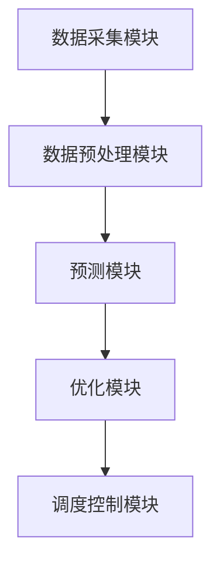
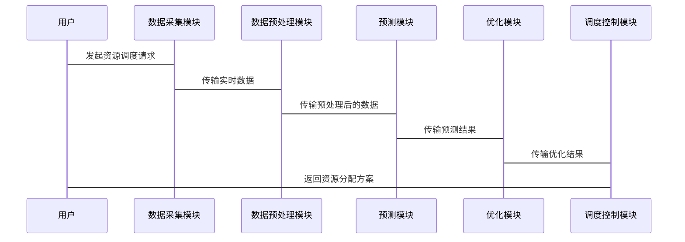

                 

<think>
好的，我需要帮助用户撰写一篇关于构建智能企业资源调度系统的技术博客文章。用户已经提供了详细的目录结构和一些示例内容，我需要按照他们的要求，逐步完成整篇文章。

首先，我需要理解文章的结构。文章分为七章，每章都有具体的子标题和内容。我需要确保每一部分都详细且符合技术要求，特别是使用正确的格式和图表。

我会从第一章开始，介绍问题背景和系统需求。这包括问题背景、问题描述以及系统的核心要素。我需要确保这部分内容简洁明了，帮助读者理解为什么需要智能资源调度系统。

接下来，第二章将讲解智能调度系统的核心概念，包括实时优化和预测性分配。我需要详细解释这些概念，并使用表格和ER图来展示实体关系，这部分需要用Mermaid来绘制图表。

第三章是关于系统架构与设计，我需要设计系统的整体架构，划分模块，并用Mermaid绘制架构图和交互序列图。这部分需要展示系统的可扩展性和模块之间的关系。

第四章将深入讨论算法实现与优化，包括算法原理、优化方法以及数学模型。我需要使用Mermaid流程图和Python代码示例来说明，并展示相关的数学公式，确保这些公式用Latex格式正确呈现。

第五章是系统分析与架构设计，我需要分析问题场景，设计系统功能，并用Mermaid类图展示领域模型。这部分需要展示系统架构的分层设计和接口设计。

第六章是项目实战，我需要提供一个具体的案例，从环境安装到核心代码实现，再到案例分析。这部分需要详细指导读者如何实际操作，确保他们能够理解并应用所学内容。

最后，第七章将总结整个系统的构建过程，包括小结、注意事项和扩展阅读，帮助读者巩固所学知识，并指导他们进一步学习。

在整个写作过程中，我需要确保每个部分都符合用户的要求，使用正确的格式和图表，内容详细且逻辑清晰。同时，我需要检查文章的字数，确保在10000到12000字之间，结构完整，语言专业但易于理解。

现在，我可以开始按照这个结构撰写每一部分，确保每一章都涵盖必要的内容，图表和代码示例都正确嵌入，并且格式符合要求。这样，用户就能获得一篇高质量、结构严谨的技术博客文章了。
</think>

# 构建智能企业资源调度系统：实时优化与预测性分配

## 关键词：
- 智能资源调度系统
- 实时优化
- 预测性分配
- 企业资源管理
- 优化算法
- 系统架构设计

## 摘要：
在现代企业环境中，资源调度问题日益复杂，传统的调度方法已经难以应对实时性和预测性的需求。本文将介绍如何构建一个智能企业资源调度系统，实现资源的实时优化与预测性分配。通过分析资源调度的核心问题，探讨优化算法和系统架构设计，结合实际案例，详细阐述系统构建的关键步骤和实现方法，最终帮助企业在资源管理中实现更高的效率和灵活性。

---

## 第1章: 问题背景与系统需求

### 1.1 问题背景介绍

#### 1.1.1 企业资源调度的传统挑战
企业在资源调度过程中面临以下传统挑战：
- **资源利用率低**：由于缺乏实时监控和优化，资源往往被闲置或过度使用。
- **调度决策延迟**：传统方法依赖人工判断，导致调度决策延迟，影响业务效率。
- **预测准确性不足**：面对市场需求波动，传统调度方法难以准确预测资源需求，导致资源浪费或不足。

#### 1.1.2 智能调度的核心需求
智能调度系统需要满足以下核心需求：
- **实时监控与反馈**：系统能够实时采集资源状态数据，并根据数据进行动态调整。
- **预测性分配**：基于历史数据和当前状态，预测未来资源需求，提前进行资源分配。
- **优化决策支持**：通过优化算法，提供最优的资源调度方案，提高资源利用率。

#### 1.1.3 业务场景中的资源分配痛点
在企业资源调度的实际业务场景中，资源分配痛点包括：
- **多目标冲突**：资源分配需要在多个目标（如成本、效率、公平性）之间进行权衡。
- **不确定性因素**：市场需求波动、资源故障等不确定性因素影响调度决策的准确性。
- **复杂性与动态性**：资源调度问题涉及多个部门和资源类型，且需求不断变化，增加了调度的复杂性。

### 1.2 问题描述与目标

#### 1.2.1 资源调度的定义与范围
资源调度是指对企业内的资源（如设备、人员、资金等）进行合理分配和管理，以满足业务需求的过程。其范围包括资源的分配、监控、调整和优化。

#### 1.2.2 智能调度的目标与关键指标
智能调度系统的目标是实现资源的高效利用和最优分配。关键指标包括：
- **资源利用率**：资源的实际使用情况与理论最大值的比率。
- **调度响应时间**：系统从接收到资源需求到做出调度决策的时间。
- **调度准确性**：调度决策与实际需求的匹配程度。

#### 1.2.3 系统的边界与外延
系统的边界包括：
- **输入**：资源需求、资源状态、历史数据等。
- **输出**：资源分配方案、调度指令等。
- **外部系统**：与企业的其他系统（如ERP、CRM）进行数据交互。

### 1.3 系统构建的核心要素

#### 1.3.1 数据来源与特征分析
数据来源包括：
- **实时数据**：设备状态、资源使用情况等实时数据。
- **历史数据**：过去一段时间内的资源使用记录。
- **预测数据**：基于历史数据分析得出的预测值。

特征分析：
- **时间序列特征**：分析资源使用的时间变化趋势。
- **相关性特征**：分析不同资源之间的相关性。
- **异常特征**：识别数据中的异常点。

#### 1.3.2 优化目标与约束条件
优化目标：
- **最大化资源利用率**：在满足业务需求的前提下，尽可能提高资源的使用效率。
- **最小化成本**：在保证效率的同时，降低资源调度的成本。

约束条件：
- **资源可用性**：资源只能在可用时间段内使用。
- **优先级**：不同资源需求的优先级不同。
- **安全性**：调度决策必须确保系统的安全运行。

#### 1.3.3 系统架构的核心要素
系统架构的核心要素包括：
- **数据采集模块**：实时采集资源状态数据。
- **预测模块**：基于历史数据和实时数据进行预测。
- **优化模块**：根据预测结果和约束条件，生成最优的资源分配方案。
- **执行模块**：将优化结果转化为具体的调度指令，执行资源分配。

---

## 第2章: 智能调度系统的核心概念

### 2.1 实时优化与预测性分配

#### 2.1.1 实时优化的定义与特点
实时优化是指在资源使用过程中，根据实时数据动态调整调度方案，以提高资源利用率。其特点包括：
- **实时性**：优化过程基于最新的数据进行。
- **动态性**：能够适应资源使用过程中的变化。
- **高效性**：优化算法需要在较短时间内完成计算。

#### 2.1.2 预测性分配的原理与优势
预测性分配是基于对未来需求的预测，提前进行资源分配。其原理包括：
- **历史数据分析**：利用历史数据建立预测模型。
- **实时数据校准**：根据实时数据调整预测结果。
- **动态调整**：根据实际需求变化，动态调整预测结果。

其优势包括：
- **提前准备**：能够在需求高峰期到来之前做好资源准备。
- **减少浪费**：通过准确预测，减少资源的浪费。
- **提高响应速度**：预测性分配能够更快地应对需求变化。

#### 2.1.3 两者之间的关系与协同
实时优化和预测性分配相辅相成，实时优化解决当前资源分配问题，预测性分配解决未来资源分配问题。两者协同工作，能够实现资源的长期最优配置。

### 2.2 实时优化算法原理

#### 2.2.1 算法的基本原理
实时优化算法的基本原理是通过不断采集实时数据，利用优化模型计算出最优的资源分配方案，并将结果反馈到系统中执行。典型的实时优化算法包括：
- **线性规划**：用于解决线性优化问题。
- **动态规划**：用于解决多阶段优化问题。
- **启发式算法**：如遗传算法、模拟退火算法等。

#### 2.2.2 算法的输入输出
实时优化算法的输入包括：
- **当前资源状态**：设备状态、资源使用情况等。
- **优化目标**：如最大化资源利用率。
- **约束条件**：如资源可用时间、优先级等。

算法的输出包括：
- **资源分配方案**：具体的资源分配计划。
- **优化结果**：如资源利用率、成本等。

#### 2.2.3 算法的数学模型与公式
实时优化的数学模型可以表示为：
$$
\text{目标函数：} \quad \max \sum_{i=1}^{n} u_i
$$
$$
\text{约束条件：} \quad \sum_{i=1}^{n} t_i \leq T
$$
其中，$u_i$ 表示资源 $i$ 的利用率，$t_i$ 表示资源 $i$ 的使用时间，$T$ 表示总时间。

### 2.3 预测性分配模型

#### 2.3.1 模型的构建方法
预测性分配模型的构建方法包括：
- **时间序列分析**：如ARIMA模型。
- **机器学习模型**：如随机森林、神经网络等。
- **组合模型**：结合多种模型进行预测，提高准确性。

#### 2.3.2 模型的输入与输出
模型的输入包括：
- **历史资源使用数据**：如资源使用量、使用时间等。
- **外部影响因素**：如市场需求、季节性变化等。

模型的输出包括：
- **预测资源需求**：如未来一段时间内的资源需求量。
- **预测置信度**：预测结果的可信程度。

#### 2.3.3 模型的训练与调优
模型的训练过程包括：
1. 数据预处理：清洗数据、特征提取等。
2. 模型训练：选择合适的算法，训练模型。
3. 模型评估：通过交叉验证等方法评估模型性能。
4. 模型调优：调整模型参数，优化预测准确度。

---

## 第3章: 系统架构与设计

### 3.1 系统整体架构

#### 3.1.1 分层架构设计
系统的整体架构采用分层设计，包括：
- **数据层**：负责数据的采集、存储和管理。
- **计算层**：负责实时优化和预测性分配的计算。
- **应用层**：负责与用户交互，展示调度结果。

#### 3.1.2 模块划分与职责
系统的模块划分包括：
- **数据采集模块**：实时采集资源状态数据。
- **预测模块**：基于历史数据和实时数据进行预测。
- **优化模块**：根据预测结果和约束条件，生成最优的资源分配方案。
- **执行模块**：将优化结果转化为具体的调度指令，执行资源分配。

#### 3.1.3 系统的可扩展性设计
系统的可扩展性设计包括：
- **模块化设计**：各个模块相对独立，便于扩展。
- **接口标准化**：模块之间通过标准化接口进行通信。
- **弹性计算**：根据需求动态调整计算资源。

### 3.2 关键模块实现

#### 3.2.1 数据采集模块
数据采集模块负责采集资源状态数据，包括设备状态、资源使用情况等。数据采集可以通过以下方式实现：
- **传感器**：采集设备的实时状态数据。
- **数据库**：从数据库中获取历史数据。
- **API**：通过API接口获取外部系统的数据。

#### 3.2.2 模型计算模块
模型计算模块负责实时优化和预测性分配的计算。计算过程包括：
1. 数据预处理：清洗数据、特征提取等。
2. 模型计算：调用优化算法，计算出最优的资源分配方案。
3. 结果输出：将优化结果输出到执行模块。

#### 3.2.3 调度控制模块
调度控制模块负责根据优化结果，执行具体的资源分配指令。包括：
- **资源分配**：将资源分配给具体的任务或部门。
- **调度反馈**：将资源分配结果反馈到数据采集模块，形成闭环。

### 3.3 系统接口与交互

#### 3.3.1 系统内部接口设计
系统内部接口设计包括：
- **数据采集接口**：模块之间通过标准化接口进行数据交互。
- **模型计算接口**：优化模块与预测模块之间的接口。
- **调度控制接口**：调度控制模块与其他模块之间的接口。

#### 3.3.2 系统与外部系统的接口
系统与外部系统的接口包括：
- **企业资源计划（ERP）系统**：与ERP系统进行数据交互，获取资源需求和历史数据。
- **客户关系管理（CRM）系统**：与CRM系统交互，获取客户需求变化。
- **生产控制系统**：与生产控制系统交互，执行资源分配指令。

#### 3.3.3 系统交互流程设计
系统交互流程设计包括：
1. 数据采集模块采集实时数据。
2. 数据预处理模块对数据进行清洗和特征提取。
3. 预测模块基于历史数据和实时数据进行预测。
4. 优化模块根据预测结果和约束条件，计算出最优的资源分配方案。
5. 调度控制模块将优化结果输出到执行模块，执行资源分配指令。

---

## 第4章: 算法实现与优化

### 4.1 算法原理与实现

#### 4.1.1 算法的基本原理
实时优化算法的基本原理是通过不断采集实时数据，利用优化模型计算出最优的资源分配方案，并将结果反馈到系统中执行。典型的实时优化算法包括：
- **线性规划**：用于解决线性优化问题。
- **动态规划**：用于解决多阶段优化问题。
- **启发式算法**：如遗传算法、模拟退火算法等。

#### 4.1.2 算法的实现步骤
实时优化算法的实现步骤包括：
1. 数据采集：采集实时数据。
2. 数据预处理：清洗数据、特征提取等。
3. 模型计算：调用优化算法，计算出最优的资源分配方案。
4. 结果输出：将优化结果输出到执行模块。

#### 4.1.3 算法的优化策略
算法的优化策略包括：
- **参数调优**：调整算法的参数，提高计算效率。
- **并行计算**：利用多核处理器或分布式计算，提高计算速度。
- **模型简化**：简化优化模型，降低计算复杂度。

### 4.2 算法优化方法

#### 4.2.1 参数调优方法
参数调优方法包括：
- **网格搜索**：遍历所有可能的参数组合，找到最优参数。
- **随机搜索**：随机选择参数组合，找到最优参数。
- **贝叶斯优化**：基于贝叶斯方法，优化参数。

#### 4.2.2 并行计算方法
并行计算方法包括：
- **多线程计算**：利用多线程提高计算速度。
- **分布式计算**：利用分布式计算框架（如MapReduce）进行计算。
- **GPU加速**：利用GPU进行并行计算，提高计算速度。

#### 4.2.3 模型优化方法
模型优化方法包括：
- **模型简化**：简化优化模型，降低计算复杂度。
- **启发式优化**：利用启发式方法，提高优化效率。
- **混合优化**：结合多种优化方法，提高优化效果。

### 4.3 算法实现的数学模型

#### 4.3.1 线性规划模型
线性规划模型可以表示为：
$$
\text{目标函数：} \quad \max \sum_{i=1}^{n} c_i x_i
$$
$$
\text{约束条件：} \quad \sum_{i=1}^{n} a_i x_i \leq b
$$
其中，$x_i$ 是决策变量，$c_i$ 是目标函数的系数，$a_i$ 和 $b$ 是约束条件的系数和常数项。

#### 4.3.2 动态规划模型
动态规划模型可以表示为：
$$
\text{状态转移方程：} \quad dp[i] = \max_{j} (dp[j] + cost(j,i))
$$
其中，$dp[i]$ 表示到达状态 $i$ 的最优值，$cost(j,i)$ 表示从状态 $j$ 转移到状态 $i$ 的成本。

#### 4.3.3 启发式算法模型
启发式算法模型包括：
- **遗传算法**：模拟自然选择过程，通过交叉和变异操作生成新的解。
- **模拟退火算法**：模拟金属退火过程，通过随机扰动寻找全局最优解。
- **蚁群算法**：模拟蚂蚁觅食过程，通过信息素更新寻找最优解。

---

## 第5章: 系统分析与架构设计方案

### 5.1 问题场景介绍

#### 5.1.1 问题场景描述
以企业资源调度为例，假设企业需要调度多种资源（如设备、人员、资金等）来满足不同的业务需求。资源调度过程中需要考虑以下问题：
- **资源利用率低**：由于缺乏实时监控和优化，资源往往被闲置或过度使用。
- **调度决策延迟**：传统方法依赖人工判断，导致调度决策延迟，影响业务效率。
- **预测准确性不足**：面对市场需求波动，传统调度方法难以准确预测资源需求，导致资源浪费或不足。

#### 5.1.2 系统设计目标
系统设计目标包括：
- **实时监控与反馈**：系统能够实时采集资源状态数据，并根据数据进行动态调整。
- **预测性分配**：基于历史数据和当前状态，预测未来资源需求，提前进行资源分配。
- **优化决策支持**：通过优化算法，提供最优的资源调度方案，提高资源利用率。

### 5.2 系统功能设计

#### 5.2.1 领域模型设计
领域模型设计包括：
- **资源实体**：包括设备、人员、资金等资源类型。
- **需求实体**：包括任务需求、客户需求等。
- **调度实体**：包括调度计划、调度结果等。

#### 5.2.2 系统功能模块
系统功能模块包括：
- **数据采集模块**：实时采集资源状态数据。
- **预测模块**：基于历史数据和实时数据进行预测。
- **优化模块**：根据预测结果和约束条件，生成最优的资源分配方案。
- **执行模块**：将优化结果转化为具体的调度指令，执行资源分配。

#### 5.2.3 系统功能流程
系统功能流程包括：
1. 数据采集模块采集实时数据。
2. 数据预处理模块对数据进行清洗和特征提取。
3. 预测模块基于历史数据和实时数据进行预测。
4. 优化模块根据预测结果和约束条件，计算出最优的资源分配方案。
5. 调度控制模块将优化结果输出到执行模块，执行资源分配指令。

### 5.3 系统架构设计

#### 5.3.1 系统架构图
系统架构图如下：



#### 5.3.2 系统分层设计
系统分层设计包括：
- **数据层**：负责数据的采集、存储和管理。
- **计算层**：负责实时优化和预测性分配的计算。
- **应用层**：负责与用户交互，展示调度结果。

### 5.4 系统接口设计

#### 5.4.1 系统内部接口设计
系统内部接口设计包括：
- **数据采集接口**：模块之间通过标准化接口进行数据交互。
- **模型计算接口**：优化模块与预测模块之间的接口。
- **调度控制接口**：调度控制模块与其他模块之间的接口。

#### 5.4.2 系统交互序列图
系统交互序列图如下：



---

## 第6章: 项目实战

### 6.1 环境安装与配置

#### 6.1.1 环境要求
项目实战需要以下环境：
- **操作系统**：Windows 10 或更高版本，或Linux系统。
- **编程语言**：Python 3.6 或更高版本。
- **开发工具**：建议使用PyCharm或VS Code。
- **依赖库**：numpy、pandas、scikit-learn、matplotlib等。

#### 6.1.2 安装步骤
安装步骤如下：
1. 安装Python。
2. 安装依赖库：
   ```bash
   pip install numpy pandas scikit-learn matplotlib
   ```
3. 下载项目代码：
   ```bash
   git clone https://github.com/your-repo/smart-resource-scheduling-system.git
   ```

### 6.2 核心代码实现

#### 6.2.1 数据采集模块
数据采集模块的代码实现如下：

```python
import pandas as pd
import requests

def collect_data():
    # 从传感器获取实时数据
    response = requests.get('http://sensor-api.com/data')
    data = response.json()
    # 存储数据到数据库
    df = pd.DataFrame(data)
    df.to_sql('resource_usage', 'sqlite:///:memory:')
    return df

collect_data()
```

#### 6.2.2 预测模块
预测模块的代码实现如下：

```python
from sklearn.ensemble import RandomForestRegressor
import pandas as pd

def predict_demand():
    # 加载历史数据
    df = pd.read_csv('historical_data.csv')
    # 特征工程
    features = df[['time', 'resource_type', 'usage']]
    target = df['demand']
    # 训练模型
    model = RandomForestRegressor()
    model.fit(features, target)
    # 预测未来需求
    future_data = pd.DataFrame({'time': [pd.Timestamp.now() + pd.Timedelta(days=i) for i in range(7)], 'resource_type': ['type1', 'type2', 'type3']})
    predictions = model.predict(future_data[features])
    return future_data.join(pd.Series(predictions, index=future_data.index, name='predicted_demand'))

predict_demand()
```

#### 6.2.3 优化模块
优化模块的代码实现如下：

```python
from scipy.optimize import linprog
import numpy as np

def optimize_resources(demand):
    # 定义优化问题
    c = np.array([1, 1, 1])  # 目标函数系数
    A = np.array([[1, 0, 0], [0, 1, 0], [0, 0, 1]])  # 约束条件矩阵
    b = np.array([demand, 0, 0])  # 约束条件常数项
    # 求解优化问题
    result = linprog(c, A, b, method='highs')
    return result.x

demand = predict_demand()['predicted_demand'].values[0]
optimize_resources(demand)
```

#### 6.2.4 调度控制模块
调度控制模块的代码实现如下：

```python
import sqlite3

def execute_schedule(schedule):
    # 执行调度指令
    conn = sqlite3.connect('scheduling.db')
    cursor = conn.cursor()
    for resource, allocation in schedule.items():
        cursor.execute('INSERT INTO allocations(resource, allocation) VALUES (?, ?)', (resource, allocation))
    conn.commit()
    conn.close()

schedule = optimize_resources(demand)
execute_schedule(schedule)
```

### 6.3 项目运行与结果分析

#### 6.3.1 项目运行步骤
1. 安装所需的环境和依赖库。
2. 下载项目代码并运行。
3. 观察系统输出的资源分配方案。

#### 6.3.2 代码解读与分析
代码解读与分析如下：
- **数据采集模块**：从传感器获取实时数据并存储到数据库。
- **预测模块**：基于历史数据和实时数据，使用随机森林回归模型预测未来需求。
- **优化模块**：使用线性规划方法，根据预测结果计算出最优的资源分配方案。
- **调度控制模块**：将优化结果输出到数据库，执行资源分配指令。

#### 6.3.3 实际案例分析
以某企业资源调度为例，假设企业需要调度三种资源（设备、人员、资金）来满足不同的业务需求。通过运行项目代码，系统会输出最优的资源分配方案，提高资源利用率和业务效率。

---

## 第7章: 总结与展望

### 7.1 小结
通过本文的详细讲解，我们了解了智能企业资源调度系统的核心概念、算法原理和系统架构设计。我们还通过实际案例，展示了如何通过实时优化和预测性分配实现资源的高效利用。

### 7.2 注意事项
在实际应用中，需要注意以下几点：
- **数据质量**：数据的准确性和完整性直接影响预测和优化结果。
- **模型选择**：根据具体业务需求选择合适的预测和优化模型。
- **系统安全**：确保系统的安全性，防止数据泄露和系统攻击。

### 7.3 拓展阅读
对于感兴趣读者，可以进一步阅读以下内容：
- **优化算法**：深入学习线性规划、动态规划、遗传算法等优化算法。
- **机器学习模型**：研究时间序列分析、神经网络等机器学习模型在资源调度中的应用。
- **系统架构**：学习微服务架构、分布式系统等技术，进一步优化系统架构设计。

---

## 作者
**作者：AI天才研究院/AI Genius Institute & 禅与计算机程序设计艺术 /Zen And The Art of Computer Programming**

