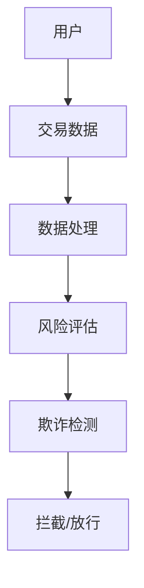
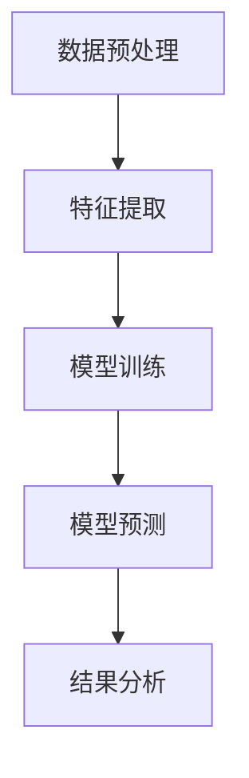
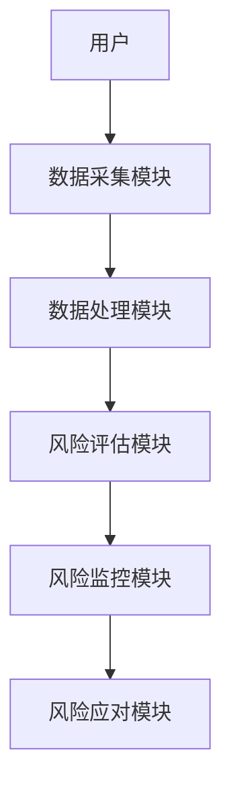
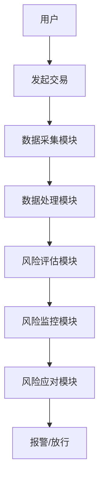

                 

<think>
嗯，我需要帮助用户撰写一篇关于构建智能企业风控系统的技术博客文章。首先，我得仔细阅读用户的要求，确保我完全理解他们的需求。用户希望文章标题是《构建智能企业风控系统：实时交易监控与欺诈检测》，并提供了一个详细的目录大纲。看起来，用户希望文章结构清晰，逻辑严密，内容涵盖从背景介绍到系统架构设计，再到项目实战和最佳实践。

首先，我需要确定文章的核心关键词，比如智能企业风控系统、实时交易监控、欺诈检测、机器学习、系统架构设计等。这些关键词将帮助读者快速了解文章的主题。

接下来是摘要部分，我需要简明扼要地概括文章的核心内容。摘要应包含文章的主要主题，即构建智能企业风控系统的方法和实现过程，涵盖实时交易监控和欺诈检测的关键技术，包括数据采集、算法选择、系统设计等。

在正文部分，我需要按照用户提供的目录大纲逐步展开。第一部分是企业风控系统背景与概念，我需要介绍企业风控系统的重要性，实时交易监控和欺诈检测的必要性，以及系统的整体架构。这部分要让读者了解为什么需要智能风控系统，以及它的基本组成部分。

第二部分是核心概念与联系，我需要详细讲解风控系统中的实体关系，比如用户、交易、风险指标等，可能需要用Mermaid图来展示ER关系和架构。这部分需要确保读者能够理解系统中的各个要素是如何相互关联的。

第三部分是欺诈检测算法原理与实现，我需要选择一种常见的算法，比如基于机器学习的模型，详细讲解其数学模型和流程图，甚至提供Python代码示例。这部分要让读者了解如何实际应用这些算法来检测欺诈行为。

第四部分是系统分析与架构设计，我需要介绍系统功能、架构设计、接口设计和交互流程。这部分可能需要用Mermaid图来展示类图、架构图和序列图，帮助读者更好地理解系统的结构和工作流程。

第五部分是项目实战，我需要提供一个具体的案例，包括环境安装、核心代码实现、案例分析和项目小结。这部分让读者能够实际操作，加深理解。

最后是最佳实践部分，我需要总结前面的内容，给出一些建议和注意事项，帮助读者巩固知识，扩展视野。

在撰写过程中，我需要确保每个部分都有足够的深度，同时保持语言简洁易懂。可能需要多次修改和调整，以确保文章结构紧凑，逻辑清晰。

另外，用户还提到要在文章末尾加上作者信息，所以我需要记得在最后添加“作者：AI天才研究院/AI Genius Institute & 禅与计算机程序设计艺术 /Zen And The Art of Computer Programming”。

总的来说，我需要按照用户的要求，系统地构建一个结构完整、内容详实的技术博客文章，涵盖从理论到实践的各个方面，确保读者能够系统地学习构建智能企业风控系统的方法和技巧。
</think>

# 构建智能企业风控系统：实时交易监控与欺诈检测

> 关键词：智能企业风控系统，实时交易监控，欺诈检测，机器学习，系统架构设计，数据安全

> 摘要：本文详细探讨了构建智能企业风控系统的核心方法，重点介绍了实时交易监控与欺诈检测的关键技术。文章从系统背景、核心概念、算法原理、系统架构设计到项目实战，全面解析了如何利用人工智能和大数据技术构建高效、可靠的风控系统。通过实际案例分析和代码实现，帮助读者深入理解系统的实现细节和应用场景。

---

# 第一部分: 企业风控系统背景与概念

## 第1章: 企业风控系统概述

### 1.1 企业风控系统的核心概念

#### 1.1.1 什么是企业风控系统

企业风控系统（Enterprise Risk Management System）是指通过收集、分析和处理企业内外部数据，识别潜在风险，并采取相应措施以降低风险影响的系统。它涵盖了从风险识别、评估、监控到应对的整个生命周期。

#### 1.1.2 企业风控系统的功能与作用

企业风控系统的主要功能包括：
1. **风险识别**：通过数据分析，识别潜在的财务、运营、法律等风险。
2. **风险评估**：对识别出的风险进行量化评估，确定其影响程度。
3. **风险监控**：实时监控企业运营中的各项指标，及时发现异常情况。
4. **风险应对**：根据风险评估结果，制定相应的应对策略，如风险规避、转移或接受。

企业风控系统的作用在于帮助企业提前发现潜在风险，减少损失，提高企业的稳健性和可持续性。

#### 1.1.3 企业风控系统的边界与外延

企业风控系统的边界是指其覆盖的范围和限制。通常，企业风控系统的外延包括：
1. **内部数据**：如财务数据、业务数据、员工数据等。
2. **外部数据**：如市场数据、行业数据、法律法规等。
3. **系统集成**：与企业的其他系统（如ERP、CRM等）进行集成，实现数据的互联互通。

---

### 1.2 实时交易监控与欺诈检测的重要性

#### 1.2.1 企业风控中的交易监控

交易监控是企业风控系统中的重要组成部分，主要用于实时监控企业的交易活动，识别异常交易行为。常见的交易监控场景包括：
1. **金融交易监控**：如银行、证券公司等金融机构的交易监控，防止洗钱、欺诈等违法行为。
2. **电子商务监控**：如电商平台的交易监控，防止虚假交易、恶意刷单等行为。
3. **企业内部交易监控**：如公司内部的采购、销售等交易监控，防止内部舞弊行为。

#### 1.2.2 欺诈检测的必要性

欺诈检测是企业风控系统中的核心功能之一。随着企业规模的扩大和交易量的增加，欺诈行为日益复杂化和隐蔽化。通过实时交易监控和欺诈检测，企业可以有效识别和阻止欺诈行为，保护企业的财务安全和声誉。

#### 1.2.3 企业风控系统的整体架构

企业风控系统的整体架构通常包括以下几个部分：
1. **数据采集**：从企业内部和外部数据源采集相关数据。
2. **数据处理**：对采集的数据进行清洗、转换和 enrichment（丰富数据）。
3. **风险评估**：利用数据分析技术，评估潜在风险。
4. **风险监控**：实时监控企业运营中的各项指标，识别异常情况。
5. **风险应对**：根据风险评估结果，制定和执行相应的应对策略。

---

## 1.3 本章小结

本章主要介绍了企业风控系统的核心概念、功能与作用，以及实时交易监控与欺诈检测的重要性。通过对企业风控系统的整体架构的分析，读者可以对系统的组成和运行机制有一个清晰的认识。

---

# 第二部分: 智能企业风控系统的核心概念与联系

## 第2章: 核心概念与联系

### 2.1 实时交易监控与欺诈检测的核心要素

#### 2.1.1 数据采集与处理

数据采集是企业风控系统的第一步，主要包括以下几种数据源：
1. **交易数据**：如交易时间、交易金额、交易地点等。
2. **用户数据**：如用户身份信息、行为数据等。
3. **外部数据**：如市场数据、行业数据、法律法规等。

数据处理包括数据清洗、转换和 enrichment（丰富数据）。例如，将文本数据转换为结构化数据，或者通过外部数据源补充缺失的信息。

#### 2.1.2 风险评估与分析

风险评估是企业风控系统的核心功能之一。通过对交易数据的分析，识别潜在的欺诈行为。常用的欺诈检测方法包括基于规则的检测、基于统计的检测和基于机器学习的检测。

#### 2.1.3 欺诈行为识别与拦截

欺诈行为识别是通过分析交易数据，识别异常交易行为。一旦发现欺诈行为，系统将立即采取拦截措施，如冻结账户、阻止交易等。

---

### 2.2 实时交易监控与欺诈检测的ER实体关系图

以下是实时交易监控与欺诈检测的ER实体关系图：

```mermaid
er
actor: 用户
transaction: 交易
risk_indicator: 风险指标
fraud_detection: 欺诈检测系统
```

---

### 2.3 智能企业风控系统的架构图

以下是智能企业风控系统的架构图：



---

## 2.4 本章小结

本章详细介绍了实时交易监控与欺诈检测的核心要素，并通过ER实体关系图和架构图，展示了系统的整体结构和各部分之间的关系。

---

# 第三部分: 欺诈检测算法原理与实现

## 第3章: 欺诈检测算法原理

### 3.1 常见的欺诈检测算法

#### 3.1.1 基于规则的检测

基于规则的检测是一种简单但有效的欺诈检测方法。通过制定一系列规则，如“单笔交易金额超过一定金额则需要进一步审核”，系统可以快速识别异常交易行为。

#### 3.1.2 基于统计的检测

基于统计的检测方法通过分析交易数据的统计特征，识别异常交易行为。常见的统计方法包括异常检测、聚类分析等。

#### 3.1.3 基于机器学习的检测

基于机器学习的检测方法利用机器学习算法，如逻辑回归、支持向量机（SVM）、随机森林等，对交易数据进行建模和预测，识别欺诈行为。

---

### 3.2 基于机器学习的欺诈检测流程图

以下是基于机器学习的欺诈检测流程图：



---

### 3.3 欺诈检测的数学模型与公式

#### 3.3.1 概率论基础

欺诈检测的数学模型通常基于概率论。例如，计算某笔交易是欺诈的概率：

$$P(fraud) = P(特征1 \land 特征2 \land ... \land 特征n)$$

#### 3.3.2 逻辑回归模型

逻辑回归是一种常用的欺诈检测模型。其数学公式如下：

$$P(fraud) = \frac{1}{1 + e^{-\beta X}}$$

其中，$X$ 是输入特征，$\beta$ 是模型参数。

---

### 3.4 算法实现与代码示例

以下是基于逻辑回归的欺诈检测算法的Python代码示例：

```python
import numpy as np
from sklearn.linear_model import LogisticRegression
from sklearn.model_selection import train_test_split
from sklearn.metrics import accuracy_score

# 数据预处理
X = dataset[['特征1', '特征2', ...]]  # 特征数据
y = dataset['标签']  # 标签（0：正常，1：欺诈）

# 划分训练集和测试集
X_train, X_test, y_train, y_test = train_test_split(X, y, test_size=0.2, random_state=42)

# 模型训练
model = LogisticRegression()
model.fit(X_train, y_train)

# 模型预测
y_pred = model.predict(X_test)

# 模型评估
print("Accuracy:", accuracy_score(y_test, y_pred))
```

---

## 3.5 本章小结

本章详细介绍了常见的欺诈检测算法，包括基于规则的检测、基于统计的检测和基于机器学习的检测，并通过流程图和代码示例，展示了基于逻辑回归的欺诈检测算法的实现过程。

---

# 第四部分: 系统分析与架构设计

## 第4章: 系统分析与架构设计

### 4.1 系统功能设计

企业风控系统的功能模块包括：
1. **数据采集模块**：从企业内部和外部数据源采集数据。
2. **数据处理模块**：对采集的数据进行清洗、转换和 enrichment。
3. **风险评估模块**：利用数据分析技术，评估潜在风险。
4. **风险监控模块**：实时监控企业运营中的各项指标，识别异常情况。
5. **风险应对模块**：根据风险评估结果，制定和执行相应的应对策略。

---

### 4.2 系统架构设计

以下是企业风控系统的架构图：



---

### 4.3 系统接口设计

企业风控系统的接口设计包括：
1. **数据接口**：与企业内部系统（如ERP、CRM）进行数据交互。
2. **用户接口**：提供给用户查询和管理风险信息的界面。
3. **报警接口**：当发现异常情况时，向相关部门发送报警信息。

---

### 4.4 系统交互流程图

以下是系统交互流程图：



---

## 4.5 本章小结

本章详细介绍了企业风控系统的功能设计、架构设计、接口设计和交互流程，为系统的实现提供了理论基础。

---

# 第五部分: 项目实战

## 第5章: 项目实战

### 5.1 环境安装

要实现企业风控系统，首先需要安装以下工具和库：
1. **Python**：推荐使用Python 3.6或更高版本。
2. **Jupyter Notebook**：用于数据可视化和算法实现。
3. **Pandas**：用于数据处理。
4. **NumPy**：用于数值计算。
5. **Scikit-learn**：用于机器学习算法实现。

---

### 5.2 核心代码实现

以下是欺诈检测算法的核心代码实现：

```python
import pandas as pd
import numpy as np
from sklearn.linear_model import LogisticRegression
from sklearn.model_selection import train_test_split
from sklearn.metrics import accuracy_score

# 数据加载
data = pd.read_csv('transactions.csv')

# 数据预处理
X = data[['amount', 'time', 'location']]  # 特征数据
y = data['label']  # 标签（0：正常，1：欺诈）

# 划分训练集和测试集
X_train, X_test, y_train, y_test = train_test_split(X, y, test_size=0.2, random_state=42)

# 模型训练
model = LogisticRegression()
model.fit(X_train, y_train)

# 模型预测
y_pred = model.predict(X_test)

# 模型评估
print("Accuracy:", accuracy_score(y_test, y_pred))
```

---

### 5.3 案例分析

通过上述代码实现，我们可以看到欺诈检测算法在实际中的应用。例如，在电商平台上，系统可以实时监控每笔交易，识别异常行为，并采取相应的拦截措施。

---

## 5.4 项目小结

本章通过实际案例分析，展示了如何利用Python和机器学习算法实现欺诈检测。读者可以通过代码实现，理解系统的实际运行过程。

---

# 第六部分: 最佳实践

## 第6章: 最佳实践

### 6.1 小结

构建智能企业风控系统是一个复杂的系统工程，需要结合企业实际需求，选择合适的算法和工具。

### 6.2 注意事项

1. **数据隐私**：在数据采集和处理过程中，需注意数据隐私保护，遵守相关法律法规。
2. **模型优化**：根据实际运行效果，不断优化模型，提高检测准确率。
3. **系统维护**：定期更新系统，修复漏洞，确保系统的安全性和稳定性。

### 6.3 拓展阅读

1. 《机器学习实战》：深入理解机器学习算法的实现和应用。
2. 《数据挖掘导论》：学习数据挖掘技术在企业风控中的应用。

---

# 作者

作者：AI天才研究院/AI Genius Institute & 禅与计算机程序设计艺术 /Zen And The Art of Computer Programming

---

以上是文章的详细目录大纲和内容框架，具体内容需要根据实际需求进一步扩展和完善。

