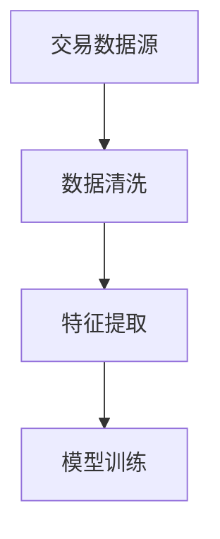
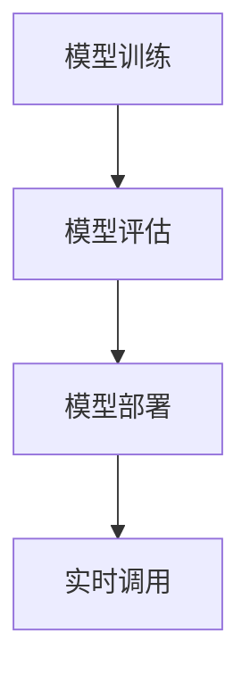
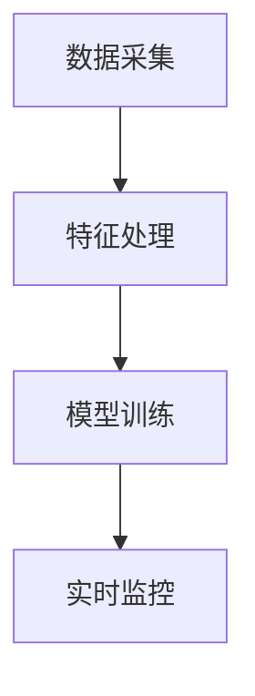
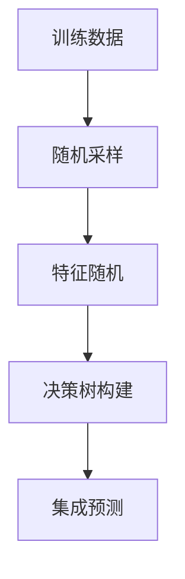
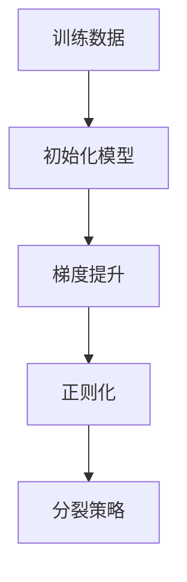
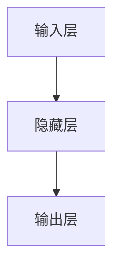

                 


# 构建智能企业风控系统：实时交易监控与欺诈模式识别

## 关键词：实时交易监控，欺诈模式识别，机器学习，风控系统，数据处理

## 摘要：
随着企业在线交易的快速增长，防范欺诈行为变得至关重要。构建智能企业风控系统，结合实时交易监控和欺诈模式识别技术，能够有效识别和阻止欺诈交易，保护企业利益。本文将详细探讨构建智能企业风控系统的核心概念、算法原理、系统架构设计以及项目实战，帮助读者深入了解如何利用机器学习技术实现高效的企业风险管理。

---

# 第一部分: 企业风控系统概述

## 第1章: 企业风控系统背景与挑战

### 1.1 企业风控系统的重要性
企业风控系统是保障企业在线交易安全的核心工具。它通过实时监控交易数据，识别潜在的欺诈行为，从而降低企业的财务损失和声誉风险。

#### 1.1.1 企业风控的核心概念
- **实时监控**：对交易数据进行实时分析，快速识别异常行为。
- **欺诈检测**：利用机器学习算法识别潜在的欺诈模式。
- **风险管理**：通过数据分析和模型预测，制定有效的风险管理策略。

#### 1.1.2 企业风控的主要挑战
- 数据量大：企业每天处理的交易数据量庞大，对实时处理能力要求高。
- 欺诈手段多样：欺诈行为不断演变，传统规则难以覆盖所有情况。
- 数据隐私：交易数据包含敏感信息，如何保护数据隐私是关键挑战。

#### 1.1.3 企业风控的边界与外延
企业风控系统不仅关注交易过程中的异常行为，还包括事前风险预警、事后数据分析和反馈优化。

### 1.2 实时交易监控的必要性
实时交易监控能够快速发现并阻止潜在的欺诈行为，减少企业的经济损失。

#### 1.2.1 交易监控的基本原理
- 数据采集：实时采集交易数据，包括交易时间、金额、用户行为等。
- 数据处理：对采集的数据进行清洗和特征提取。
- 异常检测：利用算法分析数据，识别异常交易模式。

#### 1.2.2 实时监控的关键技术
- 高效数据处理技术：如流数据处理框架（Apache Kafka、Apache Pulsar）。
- 实时计算引擎：如 Apache Flink、Apache Spark Streaming。
- 异常检测算法：如基于时间序列分析的异常检测。

#### 1.2.3 交易监控的业务场景
- 零售行业：防止信用卡欺诈。
- 金融行业：监控股票交易中的异常行为。
- 电子商务：防止虚假订单和退货欺诈。

### 1.3 欺诈模式识别的复杂性
欺诈行为多样化，传统的基于规则的检测方法难以应对复杂场景。

#### 1.3.1 欺诈行为的多样性
- 单点欺诈：单一账户的异常交易。
- 联合欺诈：多个账户协同进行的欺诈行为。
- 复杂模式：欺诈行为涉及多步操作，难以通过简单规则检测。

#### 1.3.2 欺诈模式识别的难点
- 数据稀疏性：欺诈行为占比较小，导致模型训练数据不足。
- 模型泛化能力：需要模型能够适应不同的欺诈模式。
- 模型解释性：需要模型能够解释检测结果，便于业务人员理解。

#### 1.3.3 欺诈检测的业务价值
- 降低企业损失：通过提前识别欺诈行为，减少经济损失。
- 提高用户体验：通过快速处理异常交易，提升用户信任度。
- 增强合规性：符合金融监管要求，避免法律风险。

### 1.4 本章小结
本章介绍了企业风控系统的重要性，分析了实时交易监控和欺诈模式识别的必要性，并探讨了欺诈检测的复杂性和业务价值。

---

# 第二部分: 智能风控系统的核心概念与联系

## 第2章: 风控系统的核心概念原理

### 2.1 数据采集与处理
数据采集是风控系统的第一步，需要高效地获取交易数据。

#### 2.1.1 数据源的多样性
- 结构化数据：如交易金额、时间、用户ID。
- 非结构化数据：如用户评论、交易日志。

#### 2.1.2 数据清洗与预处理
- 数据清洗：去除重复数据、处理缺失值。
- 数据标准化：将数据转换为统一格式，便于后续分析。

#### 2.1.3 数据特征提取
- 时间特征：如交易时间、交易频率。
- 用户特征：如用户行为模式、设备信息。
- 交易特征：如交易金额、交易类型。

#### 2.1.4 数据处理流程图


### 2.2 模型训练与部署
模型训练是风控系统的核心，决定了检测的准确性和效率。

#### 2.2.1 监督学习与无监督学习
- 监督学习：基于标注数据训练模型，如随机森林、XGBoost。
- 无监督学习：基于无标注数据发现异常模式，如聚类分析、主题模型。

#### 2.2.2 模型训练的流程
1. 数据准备：选择特征和训练数据。
2. 模型训练：使用训练数据训练模型。
3. 模型评估：通过测试数据评估模型性能。
4. 模型优化：调整模型参数，提高检测准确率。

#### 2.2.3 模型部署的实现
- 模型服务化：将训练好的模型部署为API服务，供实时监控调用。
- 模型更新：定期重新训练模型，保持检测能力。

#### 2.2.4 模型部署流程图


### 2.3 系统架构设计
系统架构决定了风控系统的扩展性和稳定性。

#### 2.3.1 分层架构设计
- 数据层：存储原始交易数据和特征数据。
- 服务层：提供数据处理、模型训练等服务。
- 应用层：实现实时监控和欺诈检测功能。

#### 2.3.2 微服务架构设计
- 数据采集服务：负责实时采集交易数据。
- 特征处理服务：负责数据清洗和特征提取。
- 模型服务：负责模型训练和预测。
- 监控服务：负责实时监控和告警。

#### 2.3.3 可扩展性设计
- 模块化设计：每个功能模块独立，便于扩展和维护。
- 弹性扩展：根据负载自动调整资源分配。

#### 2.3.4 系统架构图


### 2.4 本章小结
本章详细介绍了风控系统的核心概念，包括数据采集与处理、模型训练与部署以及系统架构设计，为后续的欺诈模式识别奠定了基础。

---

# 第三部分: 欺诈模式识别的算法原理

## 第3章: 常见欺诈检测算法

### 3.1 随机森林算法
随机森林是一种基于决策树的集成学习算法，适合处理高维数据。

#### 3.1.1 算法原理
- 随机采样：从训练数据中随机抽取样本。
- 特征随机：在每个节点分裂时随机选择特征。
- 决策树构建：基于选择的特征构建决策树。
- 集成预测：通过投票或加权方式得到最终预测结果。

#### 3.1.2 算法流程图


#### 3.1.3 代码实现示例
```python
from sklearn.ensemble import RandomForestClassifier

# 数据准备
X_train, y_train = prepare_data()

# 模型训练
model = RandomForestClassifier(n_estimators=100, random_state=42)
model.fit(X_train, y_train)
```

### 3.2 XGBoost算法
XGBoost是一种基于梯度提升的算法，适合处理分类和回归问题。

#### 3.2.1 算法原理
- 梯度提升：通过多次迭代，逐步优化模型。
- 正则化：通过L1和L2正则化防止过拟合。
- 分裂策略：选择最优特征分裂。

#### 3.2.2 算法流程图


#### 3.2.3 代码实现示例
```python
import xgboost as xgb

# 数据准备
X_train, y_train = prepare_data()

# 模型训练
model = xgb.XGBClassifier(n_estimators=100, learning_rate=0.1, max_depth=3)
model.fit(X_train, y_train)
```

### 3.3 神经网络算法
神经网络是一种深度学习算法，适合处理复杂的非线性关系。

#### 3.3.1 算法原理
- 层次结构：包括输入层、隐藏层和输出层。
- 激活函数：如ReLU、Sigmoid等。
- 损失函数：如交叉熵损失。
- 优化算法：如随机梯度下降。

#### 3.3.2 算法流程图


#### 3.3.3 代码实现示例
```python
import keras
from keras.models import Sequential
from keras.layers import Dense

# 数据准备
X_train, y_train = prepare_data()

# 模型构建
model = Sequential()
model.add(Dense(64, activation='relu', input_dim=X_train.shape[1]))
model.add(Dense(1, activation='sigmoid'))
model.compile(optimizer='adam', loss='binary_crossentropy', metrics=['accuracy'])

# 模型训练
model.fit(X_train, y_train, epochs=10, batch_size=32)
```

### 3.4 本章小结
本章介绍了三种常用的欺诈检测算法：随机森林、XGBoost和神经网络，分析了它们的算法原理和实现方法，为后续的系统设计提供了参考。

---

# 第四部分: 系统分析与架构设计方案

## 第4章: 系统功能设计

### 4.1 问题场景介绍
企业风控系统需要解决实时交易监控和欺诈模式识别两大问题。

#### 4.1.1 交易监控的场景
- 实时监控交易数据，识别异常交易。
- 提供历史交易数据分析，发现潜在风险。

#### 4.1.2 欺诈检测的场景
- 基于机器学习模型，识别潜在欺诈行为。
- 提供欺诈行为的详细报告，便于后续处理。

#### 4.1.3 系统功能需求
- 实时监控：对交易数据进行实时分析。
- 欺诈检测：基于机器学习模型识别欺诈行为。
- 可视化：提供直观的数据可视化界面。
- 报告生成：生成欺诈行为的详细报告。

### 4.2 系统功能设计
系统功能设计需要涵盖数据采集、特征处理、模型训练和实时监控等模块。

#### 4.2.1 数据采集模块
- 数据源：交易日志、数据库、API接口。
- 数据格式：结构化数据和非结构化数据。
- 数据采集频率：实时采集交易数据。

#### 4.2.2 特征处理模块
- 数据清洗：去除重复数据、处理缺失值。
- 特征提取：提取交易金额、时间、用户行为等特征。
- 特征标准化：将特征转换为统一格式。

#### 4.2.3 模型训练模块
- 模型选择：基于业务需求选择合适的算法。
- 模型训练：使用训练数据训练模型。
- 模型评估：通过测试数据评估模型性能。

#### 4.2.4 监控模块
- 实时监控：对实时交易数据进行分析，识别异常行为。
- 告警系统：当检测到欺诈行为时，触发告警。
- 可视化：提供实时监控界面，便于监控人员观察。

#### 4.2.5 结果展示模块
- 数据可视化：通过图表展示交易数据和欺诈行为。
- 报告生成：生成欺诈行为的详细报告。

### 4.3 系统架构设计
系统架构设计需要考虑系统的扩展性和稳定性。

#### 4.3.1 分层架构设计
- 数据层：存储原始数据和特征数据。
- 服务层：提供数据处理、模型训练等服务。
- 应用层：实现实时监控和欺诈检测功能。

#### 4.3.2 微服务架构设计
- 数据采集服务：负责实时采集交易数据。
- 特征处理服务：负责数据清洗和特征提取。
- 模型服务：负责模型训练和预测。
- 监控服务：负责实时监控和告警。

#### 4.3.3 系统架构图


### 4.4 本章小结
本章详细介绍了企业风控系统的功能设计和架构设计，为后续的系统实现提供了指导。

---

# 第五部分: 项目实战

## 第5章: 项目实施与优化

### 5.1 环境搭建
- 安装必要的开发工具：Python、Jupyter Notebook。
- 安装相关库：pandas、numpy、scikit-learn、xgboost、keras。

### 5.2 数据预处理
- 数据清洗：去除重复数据、处理缺失值。
- 特征提取：提取交易金额、时间、用户行为等特征。
- 数据标准化：将特征转换为统一格式。

### 5.3 模型训练
- 模型选择：基于业务需求选择合适的算法。
- 模型训练：使用训练数据训练模型。
- 模型评估：通过测试数据评估模型性能。

### 5.4 系统部署
- 模型服务化：将训练好的模型部署为API服务。
- 系统集成：将各模块集成到统一的系统中。
- 系统测试：通过测试用例验证系统功能。

### 5.5 系统监控与优化
- 实时监控：对系统运行状态进行监控。
- 模型优化：根据监控结果优化模型性能。
- 系统维护：定期更新模型和优化系统架构。

### 5.6 项目小结
通过项目实战，读者可以掌握企业风控系统从环境搭建到系统部署的整个流程，为后续的实际应用打下坚实基础。

---

# 第六部分: 总结与展望

## 第6章: 总结与展望

### 6.1 总结
本文详细介绍了构建智能企业风控系统的核心概念、算法原理、系统架构设计以及项目实战。通过实时交易监控和欺诈模式识别，企业可以有效降低欺诈风险，保障交易安全。

### 6.2 未来展望
随着人工智能技术的不断发展，企业风控系统将更加智能化和自动化。未来的研究方向包括：
- 更加高效的算法：如深度学习、强化学习。
- 更加智能的系统架构：如边缘计算、分布式系统。
- 更加多样化的应用场景：如跨境支付、供应链金融。

### 6.3 最佳实践 Tips
- 数据是关键：确保数据质量和完整性。
- 模型优化：定期更新模型，保持检测能力。
- 系统维护：定期检查系统运行状态，及时修复问题。

### 6.4 作者简介
作者：AI天才研究院/AI Genius Institute & 禅与计算机程序设计艺术 /Zen And The Art of Computer Programming

---

**注**：以上是《构建智能企业风控系统：实时交易监控与欺诈模式识别》一书的完整目录大纲和部分章节内容。实际撰写时，需要根据具体需求进一步补充和完善各章节内容，确保文章逻辑清晰、内容详实。

