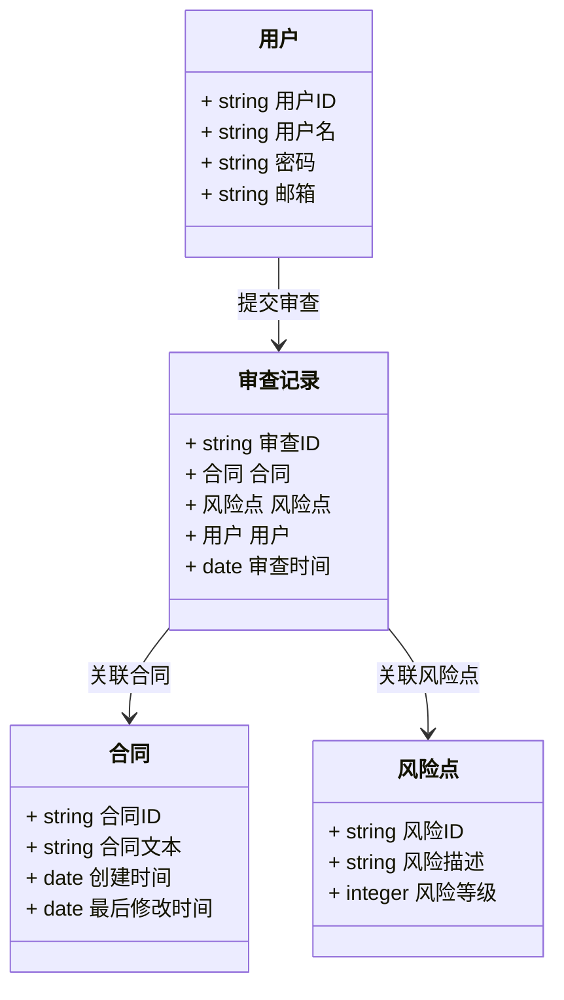
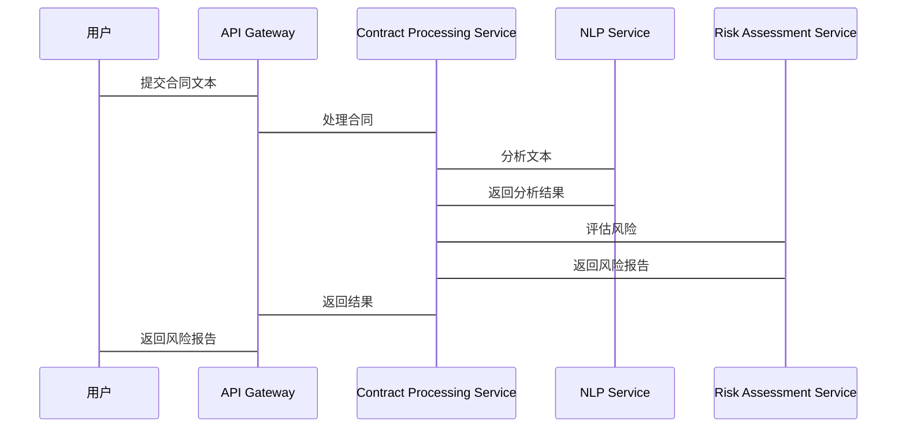

                 


# 构建智能合同分析系统：AI辅助法律风险管理

> 关键词：智能合同分析系统，AI，法律风险管理，自然语言处理，法律文本挖掘，合同审查

> 摘要：本文详细探讨了如何利用人工智能技术构建智能合同分析系统，用于法律风险管理。通过分析合同文本，识别潜在风险，优化法律事务处理流程。文章从背景、算法、系统架构到项目实战全面解析，提供丰富的技术细节和实现方案。

---

# 第一部分：智能合同分析系统的背景与核心概念

## 第1章：智能合同分析系统概述

### 1.1 智能合同分析系统的背景

#### 1.1.1 合同管理的传统挑战
在传统的法律事务处理中，合同审查是一项耗时且容易出错的任务。律师和法务人员需要手动阅读大量合同，识别关键条款、潜在风险和合规问题。这种方式效率低下，且容易因疏忽导致遗漏重要信息。

#### 1.1.2 AI技术在法律领域的应用潜力
随着自然语言处理（NLP）和机器学习技术的快速发展，AI在法律领域的应用越来越广泛。智能合同分析系统利用这些技术，能够自动识别合同中的关键信息，评估潜在风险，优化法律事务处理流程。

#### 1.1.3 智能合同分析系统的定义与目标
智能合同分析系统是一种基于AI技术的法律辅助工具，旨在通过自动化处理合同文本，识别关键条款、潜在风险和合规问题，帮助法律专业人士提高效率和准确性。

### 1.2 问题背景与分析

#### 1.2.1 合同审查的痛点
- **耗时耗力**：传统合同审查需要大量人工劳动，效率低。
- **容易出错**：人为疏忽可能导致关键条款被遗漏。
- **一致性差**：不同律师对合同的理解可能不同，导致结果不一致。

#### 1.2.2 AI辅助合同审查的优势
- **自动化处理**：AI能够快速处理大量合同，显著提高效率。
- **准确性高**：通过训练良好的模型，AI能够准确识别合同中的关键信息。
- **一致性好**：AI系统在处理合同时保持一致，减少人为错误。

#### 1.2.3 系统的边界与外延
智能合同分析系统专注于合同文本的分析，不直接处理合同的生成或修改。其外延包括合同管理、合规检查和风险评估等环节。

### 1.3 核心概念与联系

#### 1.3.1 智能合同分析系统的构成要素
- **合同文本**：输入的合同文档。
- **自然语言处理技术**：用于理解和分析合同文本。
- **风险评估模型**：用于识别合同中的潜在风险。
- **用户界面**：供用户交互和查看分析结果。

#### 1.3.2 相关概念对比表格
以下是对传统合同审查与AI辅助审查的对比：

| **方面**       | **传统合同审查**              | **AI辅助审查**                 |
|----------------|-----------------------------|-------------------------------|
| 效率           | 低，需要大量人工劳动         | 高，自动化处理                 |
| 准确性         | 易出错，依赖个人经验         | 准确率高，减少人为错误         |
| 一致性         | 差，不同人可能结果不同       | 好，系统保持一致               |
| 处理时间       | 长，尤其在处理大量合同时      | 短，快速生成分析结果           |

#### 1.3.3 ER实体关系图架构
以下是系统的ER实体关系图：

```mermaid
erDiagram
    actor 用户 {
        role 合同审查人员
    }
    contract 合同 {
        key id 合同ID
        string 合同文本
        date 创建时间
        date 最后修改时间
        status 审查状态
    }
    risk 风险点 {
        key id 风险ID
        string 风险描述
        integer 风险等级
        date 发现时间
    }
    review 审查记录 {
        key id 审查ID
        合同 合同 "1:多"
        风险 风险 "多:多"
        user 用户 "1:多"
        date 审查完成时间
    }
```

---

# 第二部分：算法原理与数学模型

## 第2章：自然语言处理与合同分析

### 2.1 自然语言处理基础

#### 2.1.1 词嵌入与文本表示
词嵌入技术（如Word2Vec、GloVe）用于将单词转换为低维向量表示，以便计算机理解和处理。

#### 2.1.2 常见的NLP模型介绍
- **BERT**：一种预训练的多任务模型，能够理解上下文。
- **GPT**：生成式预训练模型，用于文本生成和理解。

### 2.2 合同分类与实体识别

#### 2.2.1 基于深度学习的合同分类
使用卷积神经网络（CNN）或循环神经网络（RNN）对合同进行分类，如合同类型（买卖合同、服务合同等）。

#### 2.2.2 实体识别的算法流程
使用CRF（条件随机场）或BERT模型进行实体识别，识别合同中的关键实体（如公司名称、金额、日期等）。

### 2.3 风险评估模型

#### 2.3.1 风险评估的数学模型
使用支持向量机（SVM）或随机森林（Random Forest）进行风险分类，模型输入为合同文本的特征向量。

---

## 第3章：算法原理与数学模型

### 3.1 文本相似度计算

#### 3.1.1 余弦相似度
余弦相似度用于衡量两个向量之间的相似程度，公式如下：
$$ \cos{\theta} = \frac{\vec{A} \cdot \vec{B}}{\|\vec{A}\| \|\vec{B}\|} $$

### 3.2 分类模型的损失函数

#### 3.2.1 交叉熵损失函数
交叉熵损失函数用于分类任务，公式如下：
$$ \text{Loss} = -\sum_{i=1}^{n} y_i \log(p_i) + (1-y_i)\log(1-p_i) $$

---

# 第三部分：系统分析与架构设计方案

## 第3章：系统分析与架构设计

### 3.1 项目背景介绍

#### 3.1.1 项目目标
构建一个能够自动分析合同文本，识别潜在风险的智能系统。

#### 3.1.2 项目范围
系统支持多种合同类型，提供风险评估报告，优化法律事务处理流程。

### 3.2 系统功能设计

#### 3.2.1 领域模型
以下是系统功能的领域模型：



### 3.3 系统架构设计

#### 3.3.1 系统架构图
以下是系统的架构图：


---

## 第4章：系统接口设计

### 4.1 系统交互流程图

#### 4.1.1 用户提交合同
以下是用户提交合同的交互流程：



---

# 第四部分：项目实战

## 第5章：环境搭建与核心代码实现

### 5.1 环境搭建

#### 5.1.1 安装Python
安装Python 3.8及以上版本。

#### 5.1.2 安装依赖库
安装以下Python库：
- `transformers`：用于NLP模型。
- `pytorch`：用于深度学习。
- `scikit-learn`：用于机器学习。

### 5.2 核心代码实现

#### 5.2.1 数据预处理代码
```python
from transformers import BertTokenizer, BertModel
import torch

tokenizer = BertTokenizer.from_pretrained('bert-base-uncased')
model = BertModel.from_pretrained('bert-base-uncased')
```

#### 5.2.2 风险评估代码
```python
from sklearn.ensemble import RandomForestClassifier
from sklearn.metrics import accuracy_score

# 假设X为特征向量，y为标签
clf = RandomForestClassifier()
clf.fit(X, y)
y_pred = clf.predict(X_test)
print("Accuracy:", accuracy_score(y_test, y_pred))
```

---

## 第6章：实际案例分析与项目小结

### 6.1 实际案例分析
以一份买卖合同为例，展示系统如何识别关键条款和潜在风险。

### 6.2 项目小结
通过本项目，我们成功构建了一个智能合同分析系统，能够自动化处理合同文本，识别潜在风险，显著提高了法律事务的处理效率和准确性。

---

# 第五部分：最佳实践与总结

## 第7章：最佳实践

### 7.1 小结
智能合同分析系统通过AI技术显著提高了合同审查的效率和准确性。

### 7.2 注意事项
- 数据隐私保护至关重要。
- 模型需要不断优化和更新。

### 7.3 拓展阅读
建议读者进一步学习NLP和机器学习的相关知识，探索更高级的模型和技术。

---

作者：AI天才研究院/AI Genius Institute & 禅与计算机程序设计艺术 /Zen And The Art of Computer Programming

