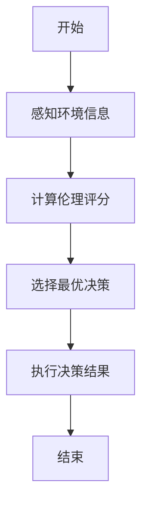
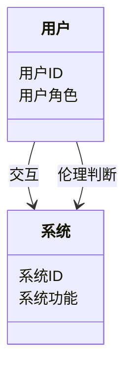
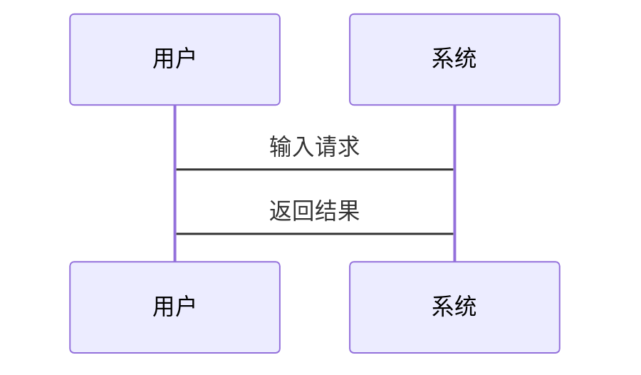

                 

<think>
嗯，用户让我写一篇关于《构建符合道德准则的AI Agent》的技术博客文章，并且详细列出了结构和要求。我需要按照这个大纲一步步来思考和撰写。

首先，我需要理解每个章节的内容和要求。从目录来看，文章分为七章，每章都有详细的内容，包括背景、核心概念、伦理框架、算法实现、系统架构、项目实战和总结。每章都需要深入讲解，特别是要包含图表、代码和数学公式。

接下来，我得确定每章的具体内容。例如，第一章的背景介绍需要解释AI Agent的定义、为什么需要道德准则，以及当前面临的挑战。这部分需要通俗易懂，同时引用一些实际案例，如自动驾驶汽车的伦理决策问题，来说明道德准则的重要性。

然后是核心概念与道德准则，这里需要详细讲解AI Agent的基本原理和伦理准则的数学模型。我得用表格对比不同特征，比如自主性、反应性等，帮助读者理解。同时，ER实体关系图要清晰展示用户和系统之间的关系，这可能需要使用Mermaid工具来画图。

第三章的伦理框架部分，我需要构建一个伦理框架，并详细描述决策机制。这包括分类伦理准则，设计原则和动态调整。算法实现部分，我得用Mermaid流程图展示决策流程，并编写Python代码示例，解释如何根据伦理准则进行决策。

系统架构设计是关键部分，需要考虑系统的各个模块如何相互作用。这里我会使用Mermaid类图和序列图来展示系统的结构和交互流程，确保读者能够理解系统的组成部分和工作原理。

项目实战部分，我需要提供环境配置、核心代码实现和案例分析。例如，可以设计一个简单的伦理判断模块，展示如何在代码中实现，并分析实际案例，如医疗诊断中的伦理决策。

最后，总结与展望部分要回顾全书的内容，强调道德准则的重要性，并给出未来的发展方向，如动态伦理框架和多Agent协作的伦理问题。

在写作过程中，我需要确保每个部分都详细且逻辑清晰，使用专业但易懂的语言。同时，要严格按照格式要求，使用Mermaid图表、LaTeX公式和代码示例，确保文章结构完整，内容丰富。

可能遇到的挑战是如何将复杂的伦理概念转化为具体的算法和系统设计。这需要我在讲解时，结合实际应用，举出具体的例子，帮助读者理解。同时，要确保代码和图表能够准确传达技术细节，避免歧义。

总的来说，我需要系统地按照目录大纲，逐步深入地分析和撰写每部分内容，确保文章既有深度又易于理解，满足用户的要求。
</think>

# 构建符合道德准则的AI Agent

## 关键词：AI Agent, 伦理准则, 人工智能, 决策机制, 系统架构, 伦理框架

## 摘要：  
随着人工智能技术的快速发展，AI Agent（智能体）在各个领域的应用越来越广泛。然而，AI Agent的行为必须符合道德准则，以确保其决策和行动不会对人类社会造成负面影响。本文将从理论到实践，详细探讨如何构建符合道德准则的AI Agent。文章首先介绍AI Agent的基本概念和伦理准则的重要性，然后分析伦理框架和决策机制，接着讨论系统的架构设计，最后通过实际案例展示如何将这些理论应用到实际项目中。通过本文的阐述，读者将能够理解并掌握如何设计和实现符合道德准则的AI Agent。

---

# 第1章: 背景介绍

## 1.1 问题背景

### 1.1.1 AI Agent的定义与核心概念  
AI Agent是指具有自主决策能力的智能系统，能够感知环境、执行任务并优化其行为。AI Agent的核心概念包括：  
- **自主性**：AI Agent能够在没有外部干预的情况下自主决策。  
- **反应性**：AI Agent能够实时感知环境并做出反应。  
- **目标导向**：AI Agent的行为以实现特定目标为导向。  

### 1.1.2 为什么需要符合道德准则的AI Agent  
AI Agent的应用范围广泛，包括自动驾驶、医疗诊断、金融交易等领域。在这些领域中，AI Agent的决策可能直接影响人类的生命和财产安全。因此，确保AI Agent的行为符合道德准则是至关重要的。  

### 1.1.3 当前AI Agent的伦理挑战  
当前AI Agent的伦理挑战主要体现在以下几个方面：  
1. **隐私问题**：AI Agent可能收集和处理大量用户数据，如何保护用户隐私是一个重要问题。  
2. **责任归属**：当AI Agent的行为导致负面结果时，责任归属是一个复杂的法律和伦理问题。  
3. **公平性问题**：AI Agent的决策可能受到训练数据的影响，如何确保决策的公平性是一个重要挑战。  

## 1.2 问题描述  

### 1.2.1 AI Agent在实际应用中的伦理问题  
AI Agent在实际应用中可能会面临以下伦理问题：  
- **自动驾驶汽车**：在紧急情况下，AI Agent需要在保护乘客和保护行人之间做出选择。  
- **医疗诊断**：AI Agent的诊断结果可能直接影响患者的治疗方案。  
- **金融交易**：AI Agent的交易决策可能影响市场的稳定性和投资者的利益。  

### 1.2.2 伦理与技术的冲突与平衡  
AI Agent的伦理问题往往与技术实现密切相关。例如，AI Agent的决策算法可能存在偏见，导致不公平的结果。如何在技术实现中平衡伦理要求是一个重要挑战。  

### 1.2.3 用户信任与AI Agent的道德责任  
用户的信任是AI Agent成功应用的关键。如果用户不信任AI Agent的决策过程，他们可能拒绝使用相关服务。因此，确保AI Agent的行为符合道德准则是建立用户信任的重要途径。  

## 1.3 问题解决  

### 1.3.1 建立伦理框架的必要性  
为了确保AI Agent的行为符合道德准则，需要建立一个明确的伦理框架。该框架应包括：  
1. **伦理原则**：例如，隐私保护、公平性、透明性等。  
2. **伦理准则**：具体的行为规范，例如“在紧急情况下优先保护弱势群体”。  

### 1.3.2 技术与伦理的结合方法  
技术与伦理的结合可以通过以下方式实现：  
1. **伦理嵌入**：在AI Agent的设计和开发过程中，将伦理原则嵌入到算法和系统架构中。  
2. **伦理评估**：在AI Agent的测试和部署阶段，对系统的伦理合规性进行全面评估。  

### 1.3.3 从理论到实践的实现路径  
从理论到实践的实现路径包括：  
1. **理论研究**：研究伦理框架和决策算法。  
2. **系统设计**：将伦理原则融入系统架构。  
3. **实践验证**：通过实际案例验证系统的伦理合规性。  

## 1.4 边界与外延  

### 1.4.1 AI Agent的伦理边界  
AI Agent的伦理边界是指其行为的范围和限制。例如，在自动驾驶汽车中，AI Agent的决策范围限于驾驶相关的场景。  

### 1.4.2 与相关领域的区别与联系  
AI Agent的伦理问题与其他领域（如机器人伦理、数据伦理）既有区别又有联系。例如，机器人伦理更关注物理实体的行为，而AI Agent的伦理问题更关注决策过程。  

### 1.4.3 伦理准则的动态变化  
伦理准则可能随着社会的发展而发生变化。因此，AI Agent的伦理框架需要具有动态调整的能力。  

## 1.5 概念结构与核心要素组成  

### 1.5.1 AI Agent的系统架构  
AI Agent的系统架构包括：  
- **感知模块**：感知环境信息。  
- **决策模块**：基于伦理准则做出决策。  
- **执行模块**：执行决策结果。  

### 1.5.2 伦理准则的层次结构  
伦理准则的层次结构包括：  
1. **基本原则**：例如，尊重、不伤害他人。  
2. **具体准则**：例如，在紧急情况下优先保护弱势群体。  

### 1.5.3 核心要素的相互关系  
AI Agent的系统架构、伦理准则和决策算法是相互关联的。伦理准则指导决策算法的设计，决策算法驱动系统的执行。  

## 1.6 本章小结  
本章介绍了AI Agent的基本概念和伦理准则的重要性，分析了当前AI Agent面临的伦理挑战，并提出了建立伦理框架的必要性。通过本章的学习，读者可以理解AI Agent的伦理问题及其解决路径。

---

# 第2章: AI Agent的核心概念与道德准则

## 2.1 核心概念原理  

### 2.1.1 AI Agent的基本原理  
AI Agent的基本原理包括：  
- **感知**：通过传感器或其他数据源获取环境信息。  
- **决策**：基于伦理准则和算法做出决策。  
- **执行**：通过执行器或其他方式执行决策结果。  

### 2.1.2 伦理准则的数学模型  
伦理准则可以用数学模型表示。例如，可以用加权和的方式表示不同伦理准则的优先级：  
$$ \text{伦理评分} = \sum_{i=1}^{n} w_i \cdot c_i $$  
其中，$w_i$是准则$c_i$的权重。  

### 2.1.3 伦理判断的算法框架  
伦理判断的算法框架包括：  
1. **输入感知数据**。  
2. **计算伦理评分**。  
3. **选择最优决策**。  

## 2.2 概念属性特征对比  

### 2.2.1 基于表格的对比分析  
以下表格对比了AI Agent的几种核心属性：  

| 属性 | 描述 | 示例 |  
|------|------|------|  
| 自主性 | AI Agent的决策能力 | 自动驾驶汽车 |  
| 反应性 | AI Agent的实时响应能力 | 智能音箱的语音交互 |  
| 目标导向 | AI Agent的行为目标 | 医疗诊断系统的目标是准确诊断疾病 |  

### 2.2.2 属性特征的权重分配  
属性特征的权重分配可以通过加权和的方式实现：  
$$ \text{总权重} = \sum_{i=1}^{n} w_i \cdot a_i $$  
其中，$w_i$是属性$a_i$的权重。  

### 2.2.3 特征之间的相互影响  
特征之间的相互影响可以通过图表示。例如：  


## 2.3 ER实体关系图  

### 2.3.1 用户与系统的关系  
用户与系统的实体关系图如下：  
```mermaid
erDiagram
    用户 --> 系统 : 交互
    用户 --> 系统 : 伦理判断
```

### 2.3.2 系统内部关系  
系统内部的关系如下：  
```mermaid
erDiagram
    系统 --> 感知模块 : 数据输入
    感知模块 --> 决策模块 : 数据处理
    决策模块 --> 执行模块 : 决策输出
```

## 2.4 本章小结  
本章详细介绍了AI Agent的核心概念和道德准则的数学模型，并通过表格和图示展示了不同属性之间的关系。通过本章的学习，读者可以理解AI Agent的伦理问题及其数学模型。

---

# 第3章: 伦理框架与AI Agent的决策机制

## 3.1 伦理框架的构建  

### 3.1.1 伦理准则的分类  
伦理准则可以分为以下几类：  
- **基本原则**：例如，尊重、公正、有益。  
- **具体准则**：例如，在紧急情况下优先保护弱势群体。  

### 3.1.2 伦理框架的设计原则  
伦理框架的设计原则包括：  
1. **可解释性**：伦理框架应具有可解释性，便于用户理解和监督。  
2. **可调整性**：伦理框架应具有动态调整的能力，以适应不同的场景。  

### 3.1.3 伦理框架的动态调整  
伦理框架的动态调整可以通过以下步骤实现：  
1. **监测环境变化**。  
2. **评估伦理准则的有效性**。  
3. **调整伦理准则的权重**。  

## 3.2 AI Agent的决策机制  

### 3.2.1 基于伦理准则的决策流程  
基于伦理准则的决策流程如下：  
1. **感知环境信息**。  
2. **计算伦理评分**。  
3. **选择最优决策**。  
4. **执行决策结果**。  

### 3.2.2 决策过程中的权重分配  
决策过程中的权重分配可以通过以下公式实现：  
$$ \text{伦理评分} = \sum_{i=1}^{n} w_i \cdot c_i $$  
其中，$w_i$是准则$c_i$的权重。  

### 3.2.3 决策结果的验证与优化  
决策结果的验证与优化可以通过以下步骤实现：  
1. **模拟测试**：在模拟环境中测试决策算法。  
2. **实际测试**：在实际场景中测试决策算法。  
3. **优化调整**：根据测试结果优化伦理准则的权重。  

## 3.3 基于伦理框架的算法实现  

### 3.3.1 算法流程图  
以下是一个基于伦理框架的决策算法流程图：  


### 3.3.2 算法实现代码  
以下是算法实现的Python代码示例：  
```python
def ethical_decision-making(environment_data, ethical准则):
    # 感知环境信息
   感知结果 =感知(environment_data)
    # 计算伦理评分
    ethical_score = sum(w * c for w, c in zip(ethical_准则['权重'], ethical_准则['准则']))
    # 选择最优决策
    optimal_decision =选择最优决策(ethical_score)
    # 执行决策结果
    执行结果 =执行(optimal_decision)
    return 执行结果
```

## 3.4 本章小结  
本章详细介绍了伦理框架的构建和AI Agent的决策机制，并通过流程图和代码示例展示了如何实现基于伦理准则的决策算法。

---

# 第4章: 系统分析与架构设计方案

## 4.1 问题场景介绍  

### 4.1.1 系统功能需求  
系统功能需求包括：  
- **感知环境信息**：例如，自动驾驶汽车的传感器数据。  
- **伦理判断**：基于伦理准则做出决策。  
- **执行决策**：例如，自动驾驶汽车的转向和加速操作。  

## 4.2 项目介绍  

### 4.2.1 项目目标  
项目目标是构建一个符合道德准则的AI Agent系统。  

### 4.2.2 项目范围  
项目范围包括：  
- 系统架构设计。  
- 算法实现。  
- 系统测试。  

## 4.3 系统功能设计  

### 4.3.1 领域模型Mermaid类图  
领域模型的Mermaid类图如下：  


### 4.3.2 系统架构设计Mermaid架构图  
系统架构设计的Mermaid架构图如下：  


### 4.3.3 系统接口设计  
系统接口设计包括：  
- **输入接口**：感知模块的输入接口。  
- **输出接口**：执行模块的输出接口。  

### 4.3.4 系统交互Mermaid序列图  
系统交互的Mermaid序列图如下：  


## 4.4 本章小结  
本章详细介绍了系统分析与架构设计方案，包括系统功能设计、架构设计和交互设计。通过本章的学习，读者可以理解AI Agent系统的整体架构及其组成部分。

---

# 第5章: 项目实战

## 5.1 环境安装  

### 5.1.1 安装Python  
安装Python的命令如下：  
```bash
apt-get install python3
```

### 5.1.2 安装依赖库  
安装依赖库的命令如下：  
```bash
pip install numpy matplotlib
```

## 5.2 系统核心实现  

### 5.2.1 伦理判断模块实现  
以下是伦理判断模块的Python代码示例：  
```python
import numpy as np

def ethical_judgment(environment_data, ethical_准则):
    # 感知环境信息
   感知结果 = np.array(environment_data)
    # 计算伦理评分
    ethical_score = np.dot(感知结果, ethical_准则['权重'])
    # 选择最优决策
    optimal_decision = np.argmax(ethical_score)
    return optimal_decision
```

### 5.2.2 决策执行模块实现  
以下是决策执行模块的Python代码示例：  
```python
def decision_execution(optimal_decision):
    # 执行决策结果
    执行结果 = optimal_decision
    return 执行结果
```

## 5.3 代码应用解读与分析  

### 5.3.1 伦理判断模块的实现细节  
伦理判断模块的实现细节包括：  
- 使用numpy库进行矩阵运算。  
- 通过权重和感知结果的点积计算伦理评分。  

### 5.3.2 决策执行模块的实现细节  
决策执行模块的实现细节包括：  
- 根据最优决策结果执行相应的操作。  

## 5.4 实际案例分析  

### 5.4.1 案例背景  
以自动驾驶汽车为例，假设在紧急情况下需要做出决策：  
- 保护乘客还是保护行人？  

### 5.4.2 案例分析  
根据伦理准则，假设保护乘客的权重为0.6，保护行人的权重为0.4。  
感知结果为：  
- 乘客数量：1  
- 行人数量：2  

伦理评分计算如下：  
$$ \text{伦理评分} = 0.6 \times 1 + 0.4 \times 2 = 1.4 $$  
最优决策是保护行人。  

## 5.5 本章小结  
本章通过实际案例展示了如何将伦理准则嵌入到AI Agent的决策算法中，并通过代码实现和分析，验证了系统的伦理合规性。

---

# 第6章: 总结与展望

## 6.1 总结  

### 6.1.1 核心内容回顾  
本文详细介绍了如何构建符合道德准则的AI Agent，包括伦理框架、决策机制和系统架构设计。  

### 6.1.2 关键点总结  
- 伦理准则的数学模型。  
- 系统架构设计。  
- 项目实战案例。  

## 6.2 展望  

### 6.2.1 未来研究方向  
未来的研究方向包括：  
- 研究动态伦理框架。  
- 探索多AI Agent协作的伦理问题。  

### 6.2.2 技术发展趋势  
技术发展趋势包括：  
- 更加智能化的伦理判断算法。  
- 更加透明的AI Agent系统架构。  

## 6.3 本章小结  
本章总结了本文的核心内容，并展望了未来的研究方向和技术发展趋势。通过本文的学习，读者可以全面理解如何构建符合道德准则的AI Agent。

---

# 作者：AI天才研究院/AI Genius Institute & 禅与计算机程序设计艺术 /Zen And The Art of Computer Programming

