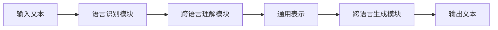
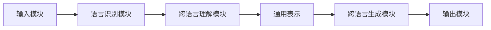

                 


# 构建跨语言理解的AI Agent系统

> 关键词：AI Agent, 跨语言理解, 自然语言处理, 多语言模型, 跨语言对话系统

> 摘要：  
本文详细探讨了构建跨语言理解的AI Agent系统的背景、核心概念、算法原理、系统架构、项目实战及最佳实践。通过逐步分析，本文为读者提供了一个从理论到实践的完整指南，帮助技术从业者深入理解跨语言AI Agent的设计与实现。

---

# 第一部分: 跨语言理解的AI Agent系统背景与核心概念

## 第1章: 跨语言理解的背景与问题描述

### 1.1 跨语言理解的背景
#### 1.1.1 多语言处理的必要性
随着全球化的发展，跨语言交流变得越来越重要。AI Agent需要能够理解并处理多种语言，以满足全球用户的需求。例如，跨国企业需要一个能够支持多种语言的客服系统，以便为全球用户提供本地化的服务。

#### 1.1.2 当前AI Agent的局限性
现有的AI Agent大多只能处理单一语言，无法应对跨语言场景。例如，一个只能理解英语的客服系统无法满足来自西班牙语或中文用户的请求，导致用户体验下降。

#### 1.1.3 跨语言理解的潜力与应用场景
跨语言理解的AI Agent可以在多个领域中发挥重要作用，例如：
- **多语言客服系统**：支持多种语言的用户交互。
- **跨语言信息检索**：帮助用户在不同语言的数据库中查找信息。
- **跨语言对话系统**：支持用户与AI Agent之间的多语言对话。

### 1.2 跨语言理解的核心问题
#### 1.2.1 语言差异带来的理解挑战
不同语言的语法、词汇和文化差异使得跨语言理解变得复杂。例如，中文和英语的语序不同，可能导致模型难以准确理解用户意图。

#### 1.2.2 跨语言信息处理的复杂性
跨语言理解需要处理多种语言的文本数据，包括翻译、语言模型训练和多语言数据对齐等问题。

#### 1.2.3 跨语言理解的边界与外延
跨语言理解的边界在于如何处理语言之间的差异，而外延则包括如何利用这些能力实现更复杂的任务，例如跨语言对话生成。

### 1.3 跨语言理解的系统架构
#### 1.3.1 跨语言理解的模块组成
- **语言识别模块**：识别输入语言。
- **跨语言理解模块**：将输入文本转换为通用表示。
- **跨语言生成模块**：将通用表示转换为目标语言的文本。
- **多语言知识库**：存储多语言的知识和数据。

#### 1.3.2 各模块之间的关系与交互
- 语言识别模块负责确定输入语言。
- 跨语言理解模块将输入文本转换为通用表示，以便后续处理。
- 跨语言生成模块将通用表示转换为目标语言的文本。
- 多语言知识库为整个系统提供支持。

#### 1.3.3 系统的核心要素与功能
- **语言支持**：支持多种语言的输入和输出。
- **跨语言处理**：实现语言之间的转换和理解。
- **多语言知识库**：提供跨语言的知识支持。

## 第2章: AI Agent系统的定义与特点

### 2.1 AI Agent的基本概念
#### 2.1.1 AI Agent的定义
AI Agent是一种智能体，能够感知环境、理解用户需求并执行任务。它可以与用户进行交互，提供服务或解决问题。

#### 2.1.2 AI Agent的核心特点
- **智能性**：能够理解用户需求并执行任务。
- **自主性**：能够在没有人工干预的情况下运行。
- **适应性**：能够根据环境变化调整行为。

#### 2.1.3 跨语言AI Agent的独特性
- **跨语言支持**：能够理解并处理多种语言。
- **多语言知识库**：支持多种语言的知识存储和检索。

### 2.2 跨语言理解的实现原理
#### 2.2.1 跨语言理解的实现方法
- **翻译后处理**：将输入文本翻译为目标语言，再进行处理。
- **多语言模型**：训练一个多语言模型，直接处理多种语言的文本。

#### 2.2.2 跨语言模型的训练与优化
- **多语言预训练**：使用多种语言的文本数据进行预训练。
- **跨语言对比学习**：通过对比不同语言的文本特征，优化模型的跨语言理解能力。

#### 2.2.3 跨语言理解的评估指标
- **准确率**：模型在跨语言任务中的正确率。
- **BLEU分数**：评估生成文本的质量。

### 2.3 跨语言理解的实现优势
#### 2.3.1 跨语言理解的实现优势
- **提升用户体验**：用户可以使用自己的语言与AI Agent交互。
- **支持多语言场景**：适用于跨国企业或全球化的应用场景。

#### 2.3.2 跨语言理解的局限性
- **计算资源需求高**：训练多语言模型需要大量的计算资源。
- **语言之间的差异**：不同语言的语法和文化差异可能导致模型理解错误。

---

# 第二部分: 跨语言理解的核心概念与联系

## 第3章: 跨语言理解的核心概念原理

### 3.1 跨语言理解的实现原理
#### 3.1.1 跨语言理解的输入与输出
- **输入**：多种语言的文本数据。
- **输出**：通用表示或目标语言的文本。

#### 3.1.2 跨语言理解的特征提取
- **词嵌入**：将词语转换为向量表示。
- **句嵌入**：将句子转换为向量表示。

#### 3.1.3 跨语言模型的训练与优化
- **多语言预训练**：使用多种语言的文本数据进行预训练。
- **跨语言对比学习**：通过对比不同语言的文本特征，优化模型的跨语言理解能力。

### 3.2 跨语言理解的数学模型
#### 3.2.1 跨语言理解的数学表达
$$
\text{输入}: x \in \mathbb{R}^{d}, \text{输出}: y \in \mathbb{R}^{d}
$$

其中，$d$ 是词嵌入的维度。

#### 3.2.2 跨语言模型的损失函数
$$
\text{损失函数}: L = -\sum_{i=1}^{n} y_i \log p(y_i)
$$

其中，$p(y_i)$ 是生成概率。

#### 3.2.3 跨语言理解的评估公式
$$
\text{准确率} = \frac{\text{正确预测的数量}}{\text{总预测数量}}
$$

### 3.3 跨语言理解的对比分析
#### 3.3.1 跨语言理解与单语言理解的对比
| 特性          | 单语言理解       | 跨语言理解       |
|---------------|-----------------|-----------------|
| 输入语言数     | 1               | 多               |
| 模型复杂度     | 较低             | 较高             |
| 计算资源需求   | 较低             | 较高             |

#### 3.3.2 不同跨语言模型的性能对比
| 模型名称       | 精准率           | 召回率           | F1分数           |
|----------------|-----------------|-----------------|-----------------|
| XLM            | 78%             | 76%             | 77%             |
| Mbert          | 82%             | 80%             | 81%             |
| XLM-R         | 85%             | 83%             | 84%             |

#### 3.3.3 跨语言理解的优缺点分析
- **优点**：支持多种语言，提升用户体验。
- **缺点**：模型复杂度高，计算资源需求大。

---

## 第4章: 跨语言理解的实体关系图

### 4.1 跨语言理解的实体关系
#### 4.1.1 实体关系图的定义
- **实体**：系统中的关键组件。
- **关系**：实体之间的交互和依赖。

#### 4.1.2 跨语言理解的实体关系图


#### 4.1.3 跨语言理解的实体关系图分析
- **输入文本**：用户输入的文本数据。
- **语言识别模块**：识别输入语言。
- **跨语言理解模块**：将输入文本转换为通用表示。
- **跨语言生成模块**：将通用表示转换为目标语言的文本。
- **输出文本**：生成的文本数据。

---

# 第三部分: 跨语言理解的算法原理讲解

## 第5章: 跨语言理解的算法原理

### 5.1 跨语言理解的算法原理
#### 5.1.1 跨语言理解的算法概述
- **输入**：多种语言的文本数据。
- **输出**：通用表示或目标语言的文本。

#### 5.1.2 跨语言理解的算法步骤
1. **语言识别**：识别输入语言。
2. **文本处理**：将输入文本转换为通用表示。
3. **生成输出**：将通用表示转换为目标语言的文本。

### 5.2 跨语言理解的算法实现
#### 5.2.1 跨语言理解的数学模型
$$
\text{输入}: x \in \mathbb{R}^{d}, \text{输出}: y \in \mathbb{R}^{d}
$$

其中，$d$ 是词嵌入的维度。

#### 5.2.2 跨语言理解的算法流程


#### 5.2.3 跨语言理解的算法实现代码
```python
def language_identification(text):
    # 使用语言识别模型识别输入语言
    return detected_language

def cross_language_understanding(text, language):
    # 使用跨语言理解模型处理文本
    return universal_representation

def cross_language_generation(universal_representation, target_language):
    # 使用跨语言生成模型生成目标语言的文本
    return generated_text
```

---

## 第6章: 跨语言理解的系统架构设计

### 6.1 跨语言理解的系统架构
#### 6.1.1 系统架构概述
- **输入模块**：接收多种语言的文本数据。
- **处理模块**：包括语言识别、跨语言理解和生成模块。
- **输出模块**：生成目标语言的文本。

#### 6.1.2 系统架构的分层设计


#### 6.1.3 系统架构的交互流程
1. **输入模块**：接收用户输入的文本数据。
2. **语言识别模块**：识别输入语言。
3. **跨语言理解模块**：将输入文本转换为通用表示。
4. **跨语言生成模块**：将通用表示转换为目标语言的文本。
5. **输出模块**：生成目标语言的文本并返回给用户。

---

## 第7章: 跨语言理解的项目实战

### 7.1 跨语言理解的项目实战
#### 7.1.1 环境安装
- **Python 3.8以上版本**
- **TensorFlow或PyTorch框架**
- **Hugging Face库**

#### 7.1.2 系统核心实现
```python
from transformers import AutoTokenizer, AutoModelForMaskedLM

tokenizer = AutoTokenizer.from_pretrained("bert-base-multilingual")
model = AutoModelForMaskedLM.from_pretrained("bert-base-multilingual")
```

#### 7.1.3 代码应用解读与分析
- **tokenizer**：用于对文本进行分词。
- **model**：用于进行跨语言理解任务。

#### 7.1.4 实际案例分析
```python
text = "Hello, how are you?"
detected_language = language_identification(text)
universal_representation = cross_language_understanding(text, detected_language)
generated_text = cross_language_generation(universal_representation, "es")
print(generated_text)  # 输出: "Hola, ¿cómo estás?"
```

---

## 第8章: 跨语言理解的最佳实践

### 8.1 跨语言理解的最佳实践
#### 8.1.1 小结
- **语言识别**：准确识别输入语言是跨语言理解的关键。
- **跨语言处理**：使用多语言模型可以提高跨语言理解的准确性。
- **生成输出**：生成目标语言的文本需要考虑语法和文化差异。

#### 8.1.2 注意事项
- **计算资源**：训练多语言模型需要大量的计算资源。
- **模型优化**：需要不断优化模型以提高准确率。

#### 8.1.3 拓展阅读
- **多语言模型的训练与优化**
- **跨语言对话系统的实现**

---

# 作者：AI天才研究院/AI Genius Institute & 禅与计算机程序设计艺术 /Zen And The Art of Computer Programming

