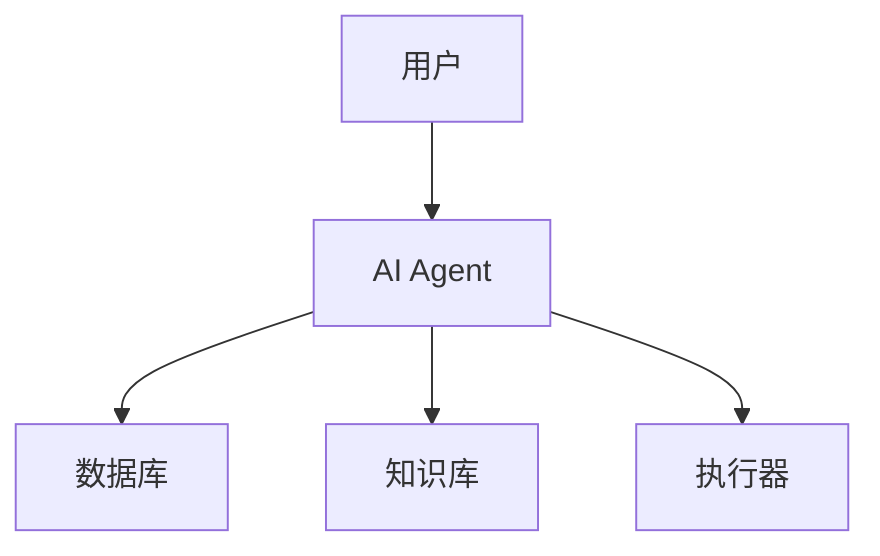
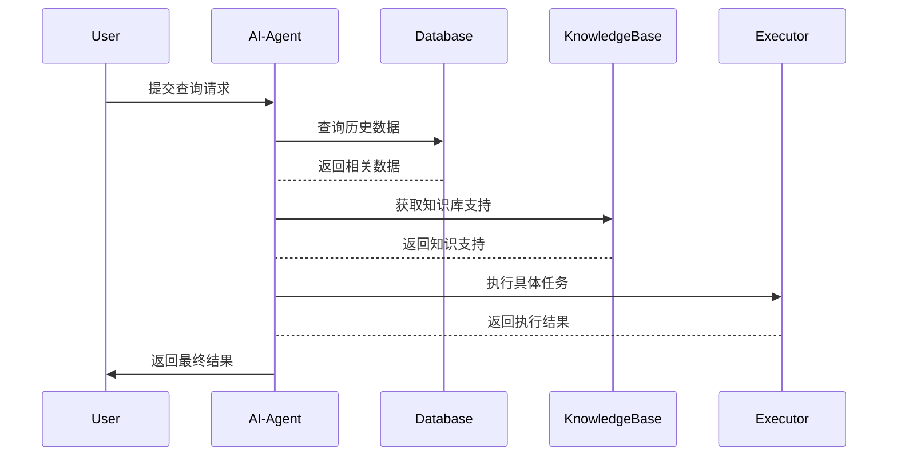

                 


# 第一章: AI Agent与Fortune 500公司的背景介绍

## 1.1 AI Agent的基本概念

### 1.1.1 AI Agent的定义

AI Agent，即人工智能代理，是一种能够感知环境、执行任务并做出决策的智能体。它不同于传统AI，具有自主性和目标导向性。

### 1.1.2 AI Agent的核心概念

- **自主性**：AI Agent能够在没有外部干预的情况下独立运作。
- **反应性**：能够实时感知环境变化并做出相应反应。
- **目标导向**：所有行为都围绕实现特定目标展开。

### 1.1.3 AI Agent与传统AI的区别

- **传统AI**：依赖预设规则和数据，无法自主决策。
- **AI Agent**：具备自主性和目标导向，能够主动解决问题。

## 1.2 Fortune 500公司的应用场景

### 1.2.1 Fortune 500公司的业务特点

世界500强企业通常规模庞大、业务复杂，需要高效、智能化的解决方案来优化运营。

### 1.2.2 AI Agent在企业中的潜在价值

- **提高效率**：自动化处理复杂任务，减少人工干预。
- **增强决策能力**：基于数据和模型提供最优建议。
- **提升客户体验**：通过个性化服务提高客户满意度。

### 1.2.3 企业采用AI Agent的优势与挑战

- **优势**：提升竞争力、降低成本、提高客户满意度。
- **挑战**：技术复杂性、数据隐私、员工适应性。

## 1.3 本章小结

本章介绍了AI Agent的基本概念及其在世界500强企业中的应用场景和价值，为后续分析奠定了基础。

---

# 第二章: AI Agent的核心原理

## 2.1 AI Agent的原理概述

### 2.1.1 AI Agent的工作流程

1. **感知环境**：收集环境数据。
2. **目标设定**：明确任务目标。
3. **决策制定**：基于数据和模型制定计划。
4. **执行操作**：执行任务并反馈结果。

### 2.1.2 AI Agent的核心算法

- **强化学习**：通过试错优化策略。
- **监督学习**：基于标记数据进行训练。
- **无监督学习**：发现数据中的隐藏模式。

## 2.2 AI Agent的实体关系图



## 2.3 AI Agent与传统AI的区别

### 2.3.1 传统AI的特点

- 预设规则，缺乏自主性。
- 依赖大量数据和计算能力。

### 2.3.2 AI Agent的独特优势

- 自主性和目标导向。
- 能够主动适应环境变化。

### 2.3.3 两者应用场景的对比

| **应用场景** | **传统AI** | **AI Agent**
|--------------|------------|-------------
| **数据处理** | 高效处理结构化数据 | 适应复杂、动态环境
| **决策支持** | 提供数据支持 | 制定并执行决策
| **系统集成** | 数据分析工具 | 系统级解决方案

## 2.4 本章小结

本章详细讲解了AI Agent的核心原理及其与传统AI的区别，帮助读者理解其独特优势和应用场景。

---

# 第三章: AI Agent的算法原理与数学模型

## 3.1 AI Agent的核心算法

### 3.1.1 强化学习算法

#### 3.1.1.1 Q-Learning算法

- **定义**：通过奖励机制优化决策策略。
- **公式**：
  $$ Q(s, a) = Q(s, a) + \alpha (r + \gamma \max Q(s', a') - Q(s, a)) $$
- **应用场景**：适用于动态环境中的决策问题。

### 3.1.2 监督学习算法

#### 3.1.2.1 线性回归模型

- **损失函数**：
  $$ L = \sum_{i=1}^{n} (y_i - f(x_i))^2 $$
- **优化算法**：梯度下降，更新参数：
  $$ \theta = \theta - \eta \frac{\partial L}{\partial \theta} $$

## 3.2 AI Agent的数学模型

### 3.2.1 概率论基础

- **条件概率公式**：
  $$ P(A|B) = \frac{P(B|A)P(A)}{P(B)} $$
- **贝叶斯定理**：在分类问题中用于计算后验概率。

### 3.2.2 优化算法

- **目标函数**：
  $$ f(x) = \sum_{i=1}^{n} (y_i - w^T x_i)^2 $$
- **梯度下降**：
  $$ w = w - \eta \nabla f(w) $$

## 3.3 本章小结

本章通过数学模型和算法原理，深入分析了AI Agent的决策机制和优化方法。

---

# 第四章: AI Agent的系统架构与设计

## 4.1 系统功能设计

### 4.1.1 用户交互界面

- **输入请求**：用户提出需求。
- **反馈结果**：AI Agent处理并返回结果。

### 4.1.2 后端处理逻辑

- **数据处理**：解析输入并提取关键信息。
- **模型推理**：调用预训练模型生成响应。
- **结果返回**：将处理结果反馈给用户。

## 4.2 系统架构设计


## 4.3 系统接口设计

### 4.3.1 输入接口

- **API定义**：RESTful API，支持JSON格式请求。
- **请求示例**：
  ```json
  {
    "action": "query",
    "data": {
        "query": "公司年度报告"
    }
  }
  ```

### 4.3.2 输出接口

- **响应格式**：
  ```json
  {
    "status": "success",
    "result": {
        "report": "2022年年度报告"
    }
  }
  ```

## 4.4 系统交互流程



## 4.5 本章小结

本章通过系统架构和接口设计，详细描述了AI Agent在企业中的实际应用场景和实现方式。

---

# 第五章: 项目实战——Fortune 500公司的AI Agent应用案例

## 5.1 环境配置

### 5.1.1 安装Python环境

- **安装步骤**：
  ```bash
  python -m pip install --upgrade pip
  pip install numpy pandas scikit-learn
  ```

### 5.1.2 安装依赖库

- **所需库**：
  - `numpy`：用于数据处理。
  - `pandas`：用于数据框操作。
  - `scikit-learn`：用于机器学习模型训练。

## 5.2 核心代码实现

### 5.2.1 强化学习模型实现

```python
import numpy as np

class AI-Agent:
    def __init__(self, state_space, action_space):
        self.state_space = state_space
        self.action_space = action_space
        self.q_table = np.zeros((state_space, action_space))
    
    def take_action(self, state, epsilon=0.1):
        if np.random.random() < epsilon:
            return np.random.randint(self.action_space)
        else:
            return np.argmax(self.q_table[state])
    
    def learn(self, state, action, reward, next_state):
        self.q_table[state, action] = self.q_table[state, action] + 0.1*(reward + 0.9*np.max(self.q_table[next_state]) - self.q_table[state, action])
```

### 5.2.2 监督学习模型实现

```python
from sklearn.linear_model import LinearRegression

class Model:
    def __init__(self):
        self.model = LinearRegression()
    
    def train(self, X, y):
        self.model.fit(X, y)
    
    def predict(self, X):
        return self.model.predict(X)
```

## 5.3 案例分析

### 5.3.1 案例背景

某世界500强公司希望通过AI Agent优化客户服务流程，减少客户等待时间。

### 5.3.2 数据收集与处理

- **数据来源**：客户咨询记录、客服响应时间、客户满意度评分。
- **数据预处理**：清洗、特征提取、数据归一化。

### 5.3.3 模型训练与测试

- **训练集**：80%的数据用于训练。
- **测试集**：20%的数据用于验证。
- **评估指标**：准确率、召回率、F1分数。

### 5.3.4 模型部署与应用

- **API接口**：通过RESTful API提供服务。
- **实时监控**：监控模型性能，及时调整参数。

## 5.4 项目总结

- **成功经验**：
  - 明确需求，确保目标聚焦。
  - 数据质量高，模型效果显著。
  - 团队协作，确保项目顺利推进。
- **改进建议**：
  - 持续优化模型，提高准确率。
  - 扩展应用场景，探索更多可能性。

## 5.5 本章小结

本章通过实际案例，详细展示了AI Agent在世界500强公司中的应用，包括环境配置、核心代码实现、案例分析和项目总结。

---

# 第六章: AI Agent的优化与扩展

## 6.1 最佳实践

### 6.1.1 数据质量管理

- 数据清洗：去除无效数据，填补缺失值。
- 数据增强：通过数据增强技术提升模型鲁棒性。
- 数据安全：确保数据隐私，遵守相关法律法规。

### 6.1.2 模型优化策略

- 参数调节：调整学习率、批次大小等超参数。
- 模型集成：结合多种算法提升性能。
- 在线学习：实时更新模型，适应环境变化。

### 6.1.3 系统性能调优

- 代码优化：减少冗余代码，提高运行效率。
- 并行计算：利用多线程或多进程加速处理。
- 资源管理：合理分配计算资源，避免资源浪费。

## 6.2 小结

本章总结了AI Agent在实际应用中的优化策略和扩展方法，帮助读者进一步提升系统性能和应用范围。

---

# 第七章: 总结与展望

## 7.1 项目总结

- **核心成果**：
  - 成功开发并部署AI Agent系统。
  - 提高了企业的运营效率和客户满意度。
  - 为后续项目提供了宝贵的经验和参考。

## 7.2 项目启示

- **技术层面**：
  - AI Agent技术在企业中的应用前景广阔。
  - 结合具体业务场景，优化系统性能。
- **商业层面**：
  - 提高企业的竞争力和市场占有率。
  - 降低运营成本，提高盈利能力。

## 7.3 项目展望

- **技术发展**：
  - 深度学习技术的进一步应用。
  - 多模态数据的处理能力提升。
- **应用场景扩展**：
  - 新兴行业的应用探索。
  - 全球化市场的拓展。

## 7.4 本章小结

本章总结了项目的成果和启示，并展望了AI Agent技术的未来发展。

---

# 参考文献

1. Russell, S., & Norvig, P. (2010). Artificial Intelligence: A Modern Approach.
2. Sutton, R. S., & Barto, A. G. (2018). Reinforcement Learning: An Introduction.
3. LeCun, Y., Bengio, Y., & Hinton, G. (2015). Deep Learning.
4. Goodfellow, I., Bengio, Y., & Courville, A. (2016). Deep Learning.

---

# 作者信息

作者：AI天才研究院/AI Genius Institute & 禅与计算机程序设计艺术/Zen And The Art of Computer Programming

