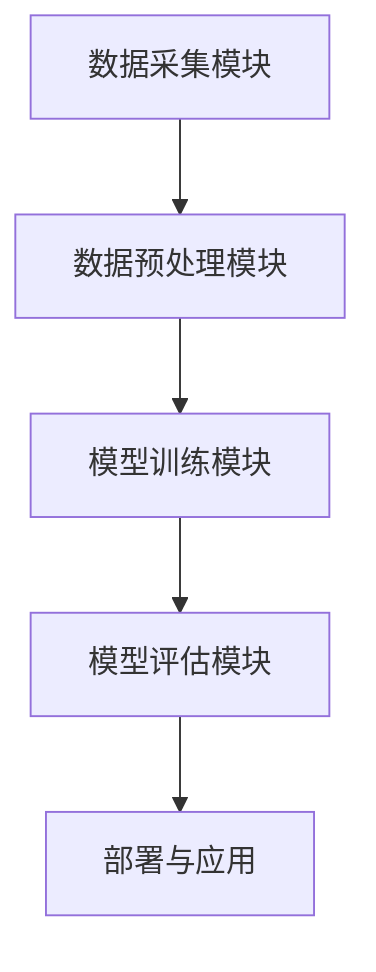

                 

<think>
嗯，我现在需要帮用户写一篇关于模仿学习的详细技术博客文章。首先，我得理清模仿学习的基本概念，确保理解透彻。模仿学习是一种机器学习方法，AI通过观察人类的示范行为来学习。这与监督学习不同，因为它不仅仅依赖于标注数据，而是通过模仿示范动作来获取知识。

接下来，我需要确定文章的结构。用户已经给出了一个大纲，我得按照这个大纲来展开。首先是背景介绍，然后是核心算法，系统架构，项目实战，最后是最佳实践。每个部分都需要详细阐述，确保内容充实且逻辑清晰。

在背景介绍部分，我应该先定义模仿学习，然后对比它与监督学习和强化学习的区别，帮助读者理解其独特性。接着，我需要介绍模仿学习的数学模型，包括概率分布和条件概率，最大似然估计，以及贝尔曼方程。这部分可能需要一些公式，用Latex来表示，确保清晰。

算法原理部分，我需要详细解释最大似然估计和贝尔曼方程在模仿学习中的应用。用mermaid画出算法流程图，展示数据预处理、模型训练、评估测试的步骤，并提供Python代码示例，这样读者可以实际操作，理解整个过程。

接下来是系统架构设计，我需要描述AI Agent的系统结构，包括功能模块和接口设计。这部分可以用UML图来展示，比如领域模型的类图和系统架构图，以及交互流程图。这有助于读者理解系统是如何构建和运作的。

项目实战部分，选择一个简单的游戏AI作为案例，详细指导读者如何安装环境，编写代码，测试和优化。这部分需要实际的代码示例，帮助读者动手实践，巩固所学知识。

最后，总结最佳实践，包括数据质量的重要性、系统设计的关键点和项目管理的建议。同时，给出一些注意事项，如数据偏差、模型泛化能力等，帮助读者避免常见的陷阱。

整体来看，文章需要逻辑清晰，从基础到高级逐步深入，结合理论与实践，确保读者能够全面理解模仿学习的原理和应用。同时，语言要专业但易懂，适合技术读者阅读。

现在，我需要将这些思考整合成结构化的文章，确保每个部分都详细展开，满足用户的字数要求，并且格式正确，符合markdown规范。特别是数学公式和图表的使用，要准确无误，以增强文章的可读性和专业性。

总之，这篇文章需要全面、系统地介绍模仿学习，从概念到算法，再到实际应用，帮助读者掌握这一技术的核心和应用方法。
</think>

# 模仿学习：从人类示范中学习的AI Agent

> 关键词：模仿学习，AI Agent，机器学习，监督学习，强化学习，贝尔曼方程

> 摘要：模仿学习是一种通过观察和模仿人类示范行为来学习的机器学习方法。本文将详细探讨模仿学习的核心概念、算法原理、系统架构以及项目实战，帮助读者全面理解并掌握这种强大的AI学习方式。

---

# 第1章: 模仿学习概述

## 1.1 什么是模仿学习

### 1.1.1 模仿学习的定义
模仿学习（Imitation Learning）是一种机器学习方法，通过观察和模仿人类或其他智能体的行为，使AI系统能够学习完成特定任务。与监督学习不同，模仿学习的核心在于从示范行为中提取隐含的策略或模式。

### 1.1.2 模仿学习的核心概念
- **示范行为（Demonstration）**：人类或其他智能体完成任务的具体操作或决策过程。
- **策略提取（Policy Extraction）**：从示范行为中学习到一个策略，使得AI能够在类似的情境下做出相似的决策。
- **泛化能力（Generalization）**：AI在新情境下应用所学策略的能力。

### 1.1.3 模仿学习的应用场景
- **机器人控制**：教机器人完成特定动作，如搬运、装配等。
- **游戏AI**：通过模仿人类玩家的行为，训练AI在游戏中的决策能力。
- **对话系统**：模仿人类对话模式，提升对话系统的自然性和流畅性。

## 1.2 模仿学习与监督学习的区别

### 1.2.1 监督学习的定义与特点
- **定义**：监督学习通过标记的数据集进行训练，模型学习输入到输出的映射关系。
- **特点**：依赖大量标注数据，适合分类和回归任务。
- **局限性**：难以处理动态环境和复杂决策问题。

### 1.2.2 模仿学习与监督学习的对比
| 对比维度          | 监督学习                          | 模仿学习                          |
|-------------------|-----------------------------------|------------------------------------|
| 数据来源          | 标注数据集                        | 示范行为                            |
| 学习目标          | 输入到输出的映射                  | 模仿示范行为                        |
| 适用场景          | 分类、回归                        | 动作控制、决策任务                  |

### 1.2.3 模仿学习的独特优势
- **无需大量标注数据**：模仿学习通过示范行为间接获取知识，减少了数据标注的工作量。
- **适用于复杂任务**：在动态和不确定环境中，模仿学习能够更好地应对复杂决策问题。

## 1.3 模仿学习的数学模型

### 1.3.1 概率分布与条件概率
- **概率分布**：描述AI在不同状态下的行为概率。
- **条件概率**：表示在给定状态下的行为选择概率。

### 1.3.2 最大似然估计
- **定义**：通过最大化似然函数，找到使数据出现最可能的模型参数。
- **公式**：$$ L(\theta) = \prod_{i=1}^{n} p(x_i | \theta) $$，其中$\theta$为模型参数，$x_i$为训练样本。

### 1.3.3 贝尔曼方程
- **定义**：描述动态规划中的状态值函数，用于计算最优策略的收益。
- **公式**：$$ V(s) = r + \gamma \max_{a} V(s') $$，其中$s$为当前状态，$r$为奖励，$\gamma$为折扣因子，$s'$为下一状态。

## 1.4 模仿学习的算法流程

### 1.4.1 数据收集与预处理
- **数据收集**：通过人类示范收集行为数据，包括状态、动作和奖励。
- **数据预处理**：清洗数据，提取特征，建立训练数据集。

### 1.4.2 模型训练与优化
- **训练目标**：通过最大似然估计或强化学习方法，优化模型参数，使其模仿示范行为。
- **优化算法**：常用梯度下降、Q-learning等方法。

### 1.4.3 模型评估与测试
- **评估指标**：准确率、召回率、F1值等。
- **测试环境**：在新环境中测试模型的泛化能力。

---

# 第2章: 最大似然估计与贝尔曼方程

## 2.1 最大似然估计的原理

### 2.1.1 似然函数的定义
- **定义**：给定模型参数$\theta$，数据$x$出现的概率，即$p(x|\theta)$。

### 2.1.2 最大似然估计的推导
- **目标**：找到使似然函数最大的$\theta$，即$$ \theta_{\text{MLE}} = \arg\max_{\theta} \prod_{i=1}^{n} p(x_i|\theta) $$。

### 2.1.3 似然比的计算
- **公式**：$$ \frac{p(x|\theta_1)}{p(x|\theta_2)} $$，用于比较不同参数下的似然值。

## 2.2 贝尔曼方程的原理

### 2.2.1 动态规划的基本概念
- **状态值函数**：描述从当前状态开始到目标的期望奖励。
- **转移概率**：描述从当前状态转移到下一状态的概率。

### 2.2.2 贝尔曼方程的数学表达
- **公式**：$$ V(s) = r + \gamma \sum_{s'} p(s'|s,a) V(s') $$，其中$a$为动作，$p(s'|s,a)$为转移概率。

### 2.2.3 贝尔曼方程的求解方法
- **迭代法**：通过动态规划或值迭代方法求解最优值函数。
- **策略迭代**：交替进行策略评估和策略改进，逐步逼近最优策略。

## 2.3 模仿学习中的数学公式

### 2.3.1 概率分布公式
- **动作选择概率**：$$ p(a|s) = \frac{e^{\theta \cdot f(s,a)}}{\sum_{a'} e^{\theta \cdot f(s,a')}} $$，其中$f(s,a)$为特征函数。

### 2.3.2 最大似然估计公式
- **损失函数**：$$ \mathcal{L}(\theta) = -\sum_{i=1}^{n} \ln p(x_i|\theta) $$。

### 2.3.3 贝尔曼方程的数学推导
- **目标函数**：$$ J(\theta) = \mathbb{E}[r + \gamma V(s')] $$，通过梯度下降优化$\theta$。

---

# 第3章: 模仿学习系统的构成

## 3.1 系统功能模块

### 3.1.1 数据采集模块
- **功能**：收集人类示范行为的数据，包括状态、动作和奖励。
- **实现**：通过传感器或模拟器采集数据。

### 3.1.2 模型训练模块
- **功能**：训练模仿学习模型，提取策略。
- **实现**：使用深度学习框架（如TensorFlow、PyTorch）训练模型。

### 3.1.3 模型评估模块
- **功能**：评估模型的性能和泛化能力。
- **实现**：通过测试数据集验证模型效果。

## 3.2 系统架构设计

### 3.2.1 分层架构
- **表示**：将系统分为感知层、决策层和执行层。
- **优势**：层次分明，便于模块化开发。

### 3.2.2 微服务架构
- **表示**：将系统功能拆分为多个微服务，如数据采集服务、模型训练服务等。
- **优势**：高扩展性和可维护性。

### 3.2.3 组件间交互设计
- **交互流程**：数据采集 -> 数据预处理 -> 模型训练 -> 模型评估 -> 部署应用。

## 3.3 系统接口设计

### 3.3.1 数据接口
- **输入**：状态、动作、奖励。
- **输出**：训练数据。

### 3.3.2 模型接口
- **输入**：当前状态。
- **输出**：推荐动作。

### 3.3.3 交互接口
- **输入**：用户指令。
- **输出**：系统反馈。

---

# 第4章: 模仿学习项目实战

## 4.1 项目背景与目标

### 4.1.1 项目背景
- **目标**：训练一个简单的游戏AI，使其能够模仿人类玩家的行为。

### 4.1.2 项目目标
- **实现**：通过模仿学习训练AI在特定游戏中的决策能力。

## 4.2 项目环境搭建

### 4.2.1 系统环境要求
- **操作系统**：Windows 10或更高版本，或Linux系统。
- **硬件要求**：建议使用CPU或GPU，具体取决于模型规模。

### 4.2.2 开发工具安装
- **安装**：安装Python、TensorFlow、Keras等开发工具。

### 4.2.3 数据集准备
- **数据来源**：收集人类玩家在游戏中的行为数据。

## 4.3 项目核心实现

### 4.3.1 数据预处理代码
```python
import numpy as np

# 假设data是一个包含状态和动作的列表
def preprocess(data):
    states = []
    actions = []
    for entry in data:
        states.append(entry['state'])
        actions.append(entry['action'])
    return np.array(states), np.array(actions)
```

### 4.3.2 模型训练代码
```python
import tensorflow as tf
from tensorflow.keras import layers

def build_model(input_shape, output_shape):
    model = tf.keras.Sequential()
    model.add(layers.Dense(64, activation='relu', input_shape=input_shape))
    model.add(layers.Dense(output_shape, activation='softmax'))
    return model

# 初始化模型
model = build_model((state_dim,), action_dim)
model.compile(optimizer='adam', loss='sparse_categorical_crossentropy')
```

### 4.3.3 模型评估代码
```python
def evaluate_model(model, test_data):
    total_reward = 0
    for state, action in test_data:
        predicted_action = model.predict(state[np.newaxis, :])[0]
        total_reward += (1 if predicted_action == action else 0)
    return total_reward / len(test_data)
```

## 4.4 项目测试与优化

### 4.4.1 测试用例设计
- **测试场景**：设计多个测试场景，验证模型在不同情况下的表现。
- **测试指标**：准确率、召回率、F1值。

### 4.4.2 模型性能优化
- **优化方法**：调整模型参数、优化算法、增加数据量。

### 4.4.3 问题分析与解决
- **问题**：模型在某些情况下表现不佳。
- **解决方案**：增加训练数据、调整模型结构、优化算法参数。

## 4.5 项目总结与经验分享

### 4.5.1 项目成果
- **成果**：成功训练了一个能够模仿人类玩家行为的游戏AI。

### 4.5.2 经验总结
- **经验**：数据质量对模型性能影响重大，系统架构设计要合理。

### 4.5.3 拓展思考
- **思考**：未来可以尝试结合强化学习进一步优化模型。

---

# 第5章: 模仿学习的最佳实践

## 5.1 数据质量的重要性

### 5.1.1 数据多样性
- **建议**：收集多样化的示范行为，避免数据偏差。

### 5.1.2 数据标注
- **建议**：确保数据标注的准确性和一致性。

## 5.2 系统设计的关键点

### 5.2.1 模块化设计
- **建议**：将系统划分为功能模块，便于维护和扩展。

### 5.2.2 系统架构
- **建议**：选择合适的架构（如微服务架构），确保系统的可扩展性和可维护性。

## 5.3 项目管理的建议

### 5.3.1 项目计划
- **建议**：制定详细的项目计划，合理分配时间和资源。

### 5.3.2 项目监控
- **建议**：定期监控项目进度，及时发现和解决问题。

## 5.4 注意事项

### 5.4.1 数据偏差
- **风险**：示范行为可能存在偏差，导致模型表现不佳。

### 5.4.2 模型泛化能力
- **风险**：模型在新环境中的表现可能不如预期。

## 5.5 拓展阅读

### 5.5.1 推荐书籍
- 《深度学习》——Ian Goodfellow
- 《强化学习》——Richard S. Sutton

### 5.5.2 推荐论文
- "Imitation Learning: A Review of Algorithms and Applications"
- "Deep Imitation Learning: A Survey"

---

# 附录

## 附录A: 模仿学习算法的Python代码

```python
import tensorflow as tf
from tensorflow.keras import layers

def build_model(input_shape, output_shape):
    model = tf.keras.Sequential()
    model.add(layers.Dense(64, activation='relu', input_shape=input_shape))
    model.add(layers.Dense(output_shape, activation='softmax'))
    return model

# 初始化模型
model = build_model((state_dim,), action_dim)
model.compile(optimizer='adam', loss='sparse_categorical_crossentropy')
```

## 附录B: 系统架构图



---

# 作者

作者：AI天才研究院/AI Genius Institute & 禅与计算机程序设计艺术 /Zen And The Art of Computer Programming

