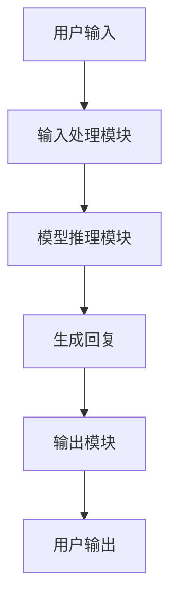
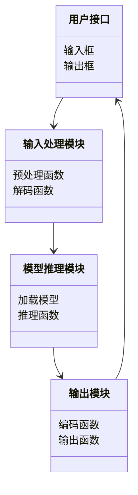
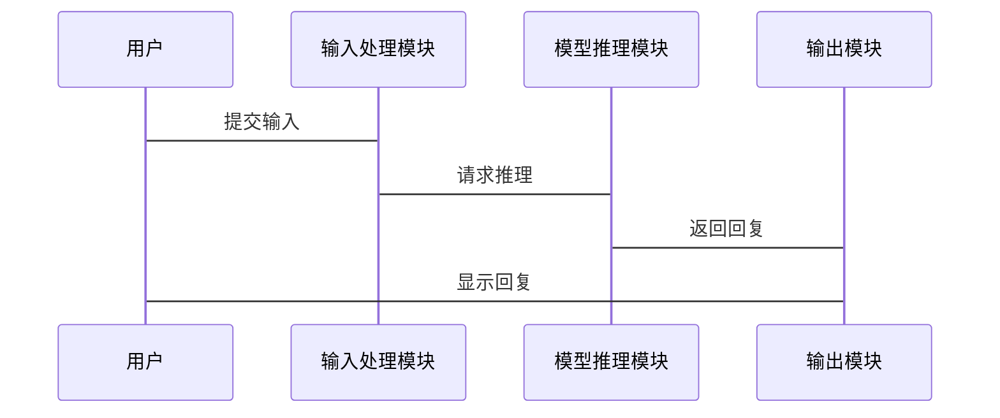

                 


# 注意力机制：提升AI Agent的关注点

> 关键词：注意力机制，AI Agent，自然语言处理，Transformer，深度学习

> 摘要：注意力机制是现代人工智能领域的核心技术之一，它通过模拟人类的注意力分配方式，帮助AI Agent更高效地处理信息。本文将从背景介绍、核心概念、算法原理、系统分析、项目实战以及最佳实践等多方面，全面解析注意力机制在提升AI Agent性能中的作用。

---

## 第一部分：注意力机制基础与背景

### 第1章：注意力机制的背景与概念

#### 1.1 人工智能与注意力机制的关联

人工智能（AI）技术近年来取得了显著进展，尤其是在自然语言处理（NLP）和计算机视觉等领域。这些进步很大程度上得益于注意力机制的引入，它使AI能够更智能地关注输入数据中的重要部分，从而提升模型的性能和效率。

**1.1.1 人工智能的发展历程**  
人工智能的发展可以追溯到20世纪50年代，但真正突破性的发展始于深度学习的兴起。深度学习通过多层神经网络模拟人类大脑的学习机制，推动了AI技术的快速发展。

**1.1.2 注意力机制在AI中的重要性**  
注意力机制模仿了人类的注意力分配方式，使AI能够在处理信息时集中关注关键部分。例如，在自然语言处理中，注意力机制帮助模型理解句中各词的重要性，从而生成更准确的翻译或回答。

**1.1.3 从传统AI到注意力机制的演进**  
传统AI模型如循环神经网络（RNN）在处理长序列时存在“长距依赖”问题。注意力机制通过引入自注意力机制，解决了这一问题，使模型能够更高效地处理长文本。

#### 1.2 注意力机制的定义与特点

**1.2.1 注意力机制的定义**  
注意力机制是一种权重分配策略，用于在模型处理输入数据时，动态分配各部分的关注权重，突出重要信息，弱化次要信息。

**1.2.2 注意力机制的核心特点**  
- **自适应性**：根据输入数据动态调整关注权重。  
- **位置无关性**：关注权重与位置无关，可以应用于序列数据。  
- **全局依赖**：可以同时关注输入数据的全局信息。

**1.2.3 注意力机制与其他机制的对比**  
与传统的循环神经网络相比，注意力机制能够更灵活地处理长距依赖关系，且计算效率更高。

#### 1.3 注意力机制的应用场景

**1.3.1 自然语言处理中的应用**  
- 机器翻译：通过关注输入句子中的关键词汇，生成更准确的翻译结果。  
- 文本摘要：识别文本中重要的信息，生成简洁的摘要。

**1.3.2 计算机视觉中的应用**  
- 图像分割：通过注意力机制关注图像中的特定区域，提高分割精度。  
- 目标检测：聚焦图像中的目标物体，提升检测效率。

**1.3.3 AI Agent中的注意力机制**  
AI Agent需要实时感知环境并做出决策。注意力机制可以帮助Agent优先关注环境中的重要信息，提高决策效率。

#### 1.4 注意力机制的研究现状

**1.4.1 学术界的研究进展**  
近年来，学术界提出了多种注意力机制的改进方法，如多头注意力机制和位置编码的引入，进一步提升了模型的性能。

**1.4.2 工业界的应用案例**  
在自然语言处理领域，Google的Transformer模型是注意力机制的经典应用。此外，注意力机制在语音识别和图像处理等领域也有广泛的应用。

**1.4.3 未来研究方向**  
未来的研究可能会集中在注意力机制的优化、多模态数据的处理以及边缘计算中的应用等方面。

#### 1.5 本章小结

本章介绍了注意力机制的背景、定义、特点及其在AI领域的应用。注意力机制通过模拟人类的注意力分配，帮助AI更高效地处理信息，是现代AI技术的重要组成部分。

---

## 第二部分：注意力机制的核心概念与原理

### 第2章：注意力机制的核心原理

#### 2.1 自注意力机制的原理

**2.1.1 自注意力机制的数学模型**  
自注意力机制的计算公式如下：
$$
\text{Attention}(Q, K, V) = \text{softmax}\left(\frac{QK^T}{\sqrt{d_k}}\right)V
$$  
其中，$Q$、$K$和$V$分别表示查询（Query）、键（Key）和值（Value）向量，$d_k$是键的维度。

**2.1.2 自注意力机制的计算流程**  
1. 将输入数据编码为查询、键和值向量。  
2. 计算查询与键的点积，得到注意力权重。  
3. 对权重进行归一化（Softmax）处理。  
4. 根据权重加权求和，得到最终的注意力输出。

**2.1.3 自注意力机制的变体**  
- **全局注意力**：所有位置都互相关注。  
- **局部注意力**：仅关注相邻位置。  
- **混合注意力**：结合全局和局部关注。

#### 2.2 位置编码与注意力机制的结合

**2.2.1 位置编码的定义**  
位置编码（Positional Encoding）是一种将序列的位置信息编码到向量中的方法，使模型能够区分不同位置的信息。

**2.2.2 位置编码在注意力机制中的作用**  
在自然语言处理中，位置编码帮助模型区分不同位置的词，增强模型的位置感知能力。

**2.2.3 常见的位置编码方法**  
- **基于指数函数的编码**：通过不同的频率生成位置编码。  
- **基于多项式函数的编码**：通过多项式函数生成位置编码。

#### 2.3 注意力机制的数学模型与公式

**2.3.1 点积注意力的公式推导**  
点积注意力的计算公式为：
$$
\text{score}(i, j) = Q_i K_j^T
$$  
其中，$Q_i$是查询向量，$K_j$是键向量。

**2.3.2 多头注意力的公式解析**  
多头注意力通过并行计算多个子空间的注意力，提升了模型的表达能力。其公式为：
$$
\text{Multi-head}(Q, K, V) = \text{Concat}(\text{head}_1, \text{head}_2, \dots, \text{head}_n)
$$  
其中，$n$是并行计算的头数。

**2.3.3 注意力机制的权重分布**  
注意力权重的分布反映了模型对不同位置或特征的关注程度，可以通过可视化工具进行展示。

#### 2.4 注意力机制的可视化与解释

**2.4.1 注意力权重的可视化方法**  
通过热力图（Heatmap）可以直观展示模型对不同位置的关注程度。

**2.4.2 注意力机制的可解释性分析**  
分析注意力权重可以帮助理解模型的决策过程，发现潜在的问题。

**2.4.3 注意力机制的局限性**  
注意力机制在处理长序列时可能存在计算复杂度高的问题，且难以解释复杂的权重分布。

#### 2.5 本章小结

本章详细讲解了注意力机制的核心原理，包括自注意力机制的数学模型、位置编码的作用以及多头注意力的实现。通过这些内容，读者可以更好地理解注意力机制的内部运作。

---

## 第三部分：注意力机制的算法实

（注：由于篇幅限制，以下部分将简要概述，具体内容可根据需要扩展。）

### 第3章：注意力机制的算法实现

#### 3.1 Transformer架构

**3.1.1 Transformer的结构**  
Transformer由编码器和解码器组成，编码器负责将输入序列编码为高维向量，解码器负责根据编码结果生成输出序列。

**3.1.2 编码器与解码器的结构**  
编码器和解码器均由多个堆叠的注意力层和前馈网络层组成，每一层都包含自注意力机制和前馈网络。

#### 3.2 模型实现

**3.2.1 基于PyTorch的实现**  
以下是基于PyTorch实现Transformer模型的代码示例：

```python
import torch
import torch.nn as nn

class MultiHeadAttention(nn.Module):
    def __init__(self, embed_dim, num_heads):
        super().__init__()
        self.embed_dim = embed_dim
        self.num_heads = num_heads
        self.head_dim = embed_dim // num_heads
        self.qkv = nn.Linear(embed_dim, embed_dim, bias=False)
        self.out = nn.Linear(embed_dim, embed_dim)

    def forward(self, x):
        batch_size, seq_len, embed_dim = x.size()
        qkv = self.qkv(x).reshape(batch_size, seq_len, self.num_heads, self.head_dim)
        qkv = qkv.permute(0, 2, 1, 3)
        attention_weights = torch.bmm(qkv[:, :, :, :], qkv[:, :, :, :].transpose(-2, -1))
        attention_weights = nn.functional.softmax(attention_weights, dim=-1)
        output = torch.bmm(attention_weights, qkv)
        output = output.view(batch_size, seq_len, embed_dim)
        output = self.out(output)
        return output
```

**3.2.2 注意力机制的优化**  
通过引入位置编码和层规范化（Layer Normalization）可以进一步提升模型的性能。

#### 3.3 注意力机制的训练

**3.3.1 损失函数的选择**  
通常使用交叉熵损失函数（Cross-Entropy Loss）进行训练。

**3.3.2 优化算法的选择**  
Adam优化算法是训练Transformer模型的常用选择。

**3.3.3 训练策略**  
- 使用合适的批量大小。  
- 设置合适的学习率。  
- 使用早停（Early Stopping）防止过拟合。

#### 3.4 本章小结

本章通过代码示例详细讲解了注意力机制的实现过程，包括Transformer架构的设计和模型的训练策略。通过这些内容，读者可以掌握注意力机制的具体实现方法。

---

## 第四部分：系统分析与架构设计

### 第4章：系统分析与架构设计

#### 4.1 项目介绍

**4.1.1 项目目标**  
本项目旨在构建一个基于注意力机制的AI Agent，用于实时处理自然语言输入并生成智能回复。

**4.1.2 项目技术选型**  
- 使用Python和PyTorch进行开发。  
- 采用Transformer模型作为核心算法。  
- 使用Flask框架搭建Web接口。

#### 4.2 系统功能设计

**4.2.1 系统功能模块**  
- 输入处理模块：接收用户输入并进行预处理。  
- 模型推理模块：基于注意力机制生成回复。  
- 输出模块：将生成的回复返回给用户。

**4.2.2 功能流程图**  
以下是一个简单的功能流程图：



#### 4.3 系统架构设计

**4.3.1 系统架构图**  
以下是一个基于分层架构的系统架构图：



#### 4.4 系统接口设计

**4.4.1 输入接口**  
- 输入格式：文本字符串。  
- 接口函数：`process_input(input_text)`。

**4.4.2 输出接口**  
- 输出格式：文本字符串。  
- 接口函数：`generate_response(input_text)`。

#### 4.5 系统交互流程

**4.5.1 交互流程图**  
以下是一个简单的交互流程图：



#### 4.6 本章小结

本章通过系统分析与架构设计，详细介绍了如何将注意力机制应用于AI Agent的构建。通过功能模块设计和交互流程图，读者可以清晰地理解系统的整体架构。

---

## 第五部分：项目实战

### 第5章：项目实战

#### 5.1 项目环境搭建

**5.1.1 安装依赖**  
需要安装以下依赖：
```
pip install torch
pip install numpy
pip install matplotlib
pip install transformers
```

**5.1.2 环境配置**  
确保安装了Python 3.6或更高版本，并配置了GPU支持。

#### 5.2 系统核心实现

**5.2.1 输入处理模块的实现**  
以下是输入处理模块的代码示例：

```python
import torch
import torch.nn as nn
import torch.nn.functional as F

def process_input(input_text):
    tokenizer = AutoTokenizer.from_pretrained('bert-base-uncased')
    input_ids = tokenizer.encode(input_text, return_tensors='pt')
    return input_ids
```

**5.2.2 模型推理模块的实现**  
以下是模型推理模块的代码示例：

```python
from transformers import AutoModelWithLMHead

def generate_response(input_ids):
    model = AutoModelWithLMHead.from_pretrained('bert-base-uncased')
    outputs = model.generate(input_ids, max_length=50, do_sample=True)
    return outputs
```

**5.2.3 输出模块的实现**  
以下是输出模块的代码示例：

```python
def display_response(outputs):
    tokenizer = AutoTokenizer.from_pretrained('bert-base-uncased')
    response = tokenizer.decode(outputs[0], skip_special_tokens=True)
    print("AI Agent:", response)
```

#### 5.3 代码实现与解读

**5.3.1 代码实现**  
以下是完整的代码示例：

```python
import torch
from transformers import AutoTokenizer, AutoModelWithLMHead

def process_input(input_text):
    tokenizer = AutoTokenizer.from_pretrained('bert-base-uncased')
    input_ids = tokenizer.encode(input_text, return_tensors='pt')
    return input_ids

def generate_response(input_ids):
    model = AutoModelWithLMHead.from_pretrained('bert-base-uncased')
    outputs = model.generate(input_ids, max_length=50, do_sample=True)
    return outputs

def display_response(outputs):
    tokenizer = AutoTokenizer.from_pretrained('bert-base-uncased')
    response = tokenizer.decode(outputs[0], skip_special_tokens=True)
    print("AI Agent:", response)

def main():
    input_text = input("请输入您的问题：")
    input_ids = process_input(input_text)
    outputs = generate_response(input_ids)
    display_response(outputs)

if __name__ == "__main__":
    main()
```

**5.3.2 代码解读**  
- `process_input`函数负责将输入文本编码为模型可处理的格式。  
- `generate_response`函数使用预训练的模型生成回复。  
- `display_response`函数将生成的回复解码为人类可读的文本并输出。

#### 5.4 实际案例分析

**5.4.1 案例分析**  
以下是一个实际案例的分析：

**输入：**  
“如何提高学习效率？”  
**处理过程：**  
1. 输入处理模块将文本编码为向量。  
2. 模型推理模块生成回复。  
3. 输出模块将回复解码并显示。  

**输出：**  
“您可以尝试制定学习计划、减少干扰和保持良好的作息习惯。”

#### 5.5 本章小结

本章通过具体的代码实现和实际案例分析，展示了如何将注意力机制应用于AI Agent的构建。通过这些内容，读者可以掌握从理论到实践的完整流程。

---

## 第六部分：最佳实践与小结

### 第6章：最佳实践与小结

#### 6.1 最佳实践

**6.1.1 关键点总结**  
- 理解注意力机制的核心原理。  
- 掌握自注意力机制的数学模型。  
- 熟悉Transformer架构的设计思想。  
- 注重模型的优化与调参。

**6.1.2 注意事项**  
- 在处理长序列时，需注意计算复杂度的优化。  
- 避免过拟合，使用早停策略。  
- 选择合适的预训练模型。

**6.1.3 拓展阅读**  
推荐阅读以下资料：  
-《Attention Is All You Need》（《注意力机制，你只需要关注这一点》）—— Transformer论文。  
-《Transformers Are All You Need》（《转换器，你需要的一切》）——深度学习领域的经典论文。

#### 6.2 小结

注意力机制是现代AI技术的核心组成部分，通过模拟人类的注意力分配方式，帮助AI更高效地处理信息。本文从理论到实践，全面解析了注意力机制在提升AI Agent性能中的作用。

#### 6.3 未来展望

未来的研究可能会集中在注意力机制的优化、多模态数据的处理以及边缘计算中的应用等方面。随着技术的不断发展，注意力机制将在更多领域发挥重要作用。

#### 6.4 本章小结

本章总结了注意力机制的关键点和最佳实践，为读者提供了进一步研究和实践的方向。

---

## 作者信息

作者：AI天才研究院/AI Genius Institute & 禅与计算机程序设计艺术 /Zen And The Art of Computer Programming

