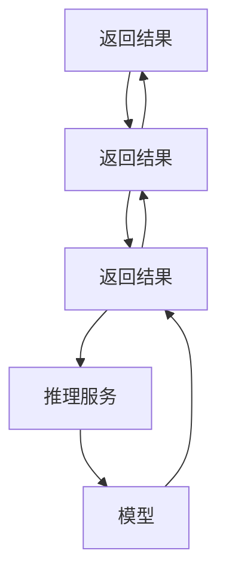

                 

<think>
好，我现在需要帮用户撰写一篇关于《深入理解LLM大模型：从GPT到企业级应用》的技术博客文章。用户提供了详细的目录大纲，并要求按照特定的格式和内容来撰写。我得先理清思路，确保每个部分都符合要求。

首先，用户希望文章以《深入理解LLM大模型：从GPT到企业级应用》为标题，关键词包括大语言模型、LLM、GPT、AI、企业级应用和深度学习。摘要需要简明扼要地概括文章的核心内容。

接下来，目录大纲分为五个主要部分：大语言模型（LLM）基础、算法原理、系统分析与架构设计、项目实战以及最佳实践与扩展阅读。每个部分都有详细的章节和小节，需要逐步展开，确保内容丰富且详细。

在撰写每个章节时，我需要确保使用专业但易懂的语言，结合具体的例子和图表，比如使用Mermaid流程图和数学公式。例如，在算法原理部分，我需要详细解释Transformer模型的结构，包括编码器和解码器，并提供相应的数学公式和代码示例。

系统架构部分需要涵盖问题场景分析、系统功能设计、架构图、接口设计和交互流程图。这可能涉及绘制类图和序列图，以展示系统的各个模块及其交互方式。

项目实战部分需要提供具体的安装步骤和代码实现，包括预训练和微调的步骤，以及如何部署API服务。同时，还需要进行性能测试和优化，确保系统的高效运行。

最后，在最佳实践部分，我需要总结经验，提醒读者注意数据隐私和模型性能之间的平衡，同时建议进一步的研究方向，如多模态模型和在线学习算法。

我需要确保文章结构清晰，逻辑连贯，每个部分都有足够的细节和支持，同时保持整体字数在10000到12000字之间。此外，文章末尾需要添加作者信息，符合格式要求。

现在，我可以按照目录大纲逐步撰写每个部分，确保每个章节都涵盖所有必要的内容，并正确使用markdown格式，包括数学公式和图表。同时，注意保持语言的专业性和可读性，帮助读者深入理解LLM大模型及其在企业中的应用。
</think>

# 深入理解LLM大模型：从GPT到企业级应用

> 关键词：大语言模型，LLM，GPT，AI，企业级应用，深度学习

> 摘要：本文深入探讨大语言模型（LLM）的核心原理、系统架构、实际应用及最佳实践，从GPT的基本概念到企业级应用的实现，全面解析LLM的技术精髓。

---

## 第一部分：大语言模型（LLM）基础

### 第1章：大语言模型（LLM）概述

#### 1.1 大语言模型的背景与概念

##### 1.1.1 从传统NLP到大语言模型的演进
自然语言处理（NLP）经历了从基于规则的系统到统计模型，再到深度学习的转变。大语言模型（LLM）的出现标志着NLP的新纪元，通过海量数据的预训练，模型能够理解并生成人类语言。

##### 1.1.2 大语言模型的核心概念与特点
- **预训练**：通过大量未标注数据的自我监督学习，模型学会语言的通用表示。
- **自注意力机制**：模型能够关注输入中的重要部分，实现长距离依赖的捕捉。
- **多任务能力**：单个模型可以适应多种NLP任务，如文本生成、问答系统、机器翻译等。

##### 1.1.3 大语言模型的边界与外延
- **边界**：LLM擅长生成性任务，但在需要精确推理或实时数据的任务上表现有限。
- **外延**：通过微调（Fine-tuning）或提示工程（Prompt Engineering），可以扩展模型的应用场景。

#### 1.2 大语言模型的主流架构

##### 1.2.1 Transformer模型的提出与发展
- **提出背景**：为了解决RNN处理长序列的效率问题，注意力机制应运而生。
- **架构特点**：编码器-解码器结构，自注意力机制，位置编码。

##### 1.2.2 大语言模型的编码与解码机制
- **编码器**：将输入文本转换为上下文表示。
- **解码器**：基于编码器的输出生成目标文本。

##### 1.2.3 大语言模型与传统AI的区别
- **数据驱动**：传统AI依赖规则，LLM通过数据学习。
- **通用性**：LLM具备处理多种任务的能力，传统AI通常针对特定任务优化。

#### 1.3 大语言模型的训练与推理

##### 1.3.1 预训练与微调的概念
- **预训练**：在大规模通用数据上进行无监督学习。
- **微调**：在特定任务或领域数据上进行有监督学习。

##### 1.3.2 大语言模型的训练流程
1. 数据准备：清洗、格式化。
2. 模型初始化：随机初始化参数。
3. 预训练：使用大规模数据进行自监督学习。
4. 微调：针对特定任务进行优化。

##### 1.3.3 推理过程与应用场景
- **生成式推理**：基于输入生成输出。
- **判别式推理**：分类或判断任务。

---

### 第2章：大语言模型的核心原理

#### 2.1 大语言模型的编码机制

##### 2.1.1 词嵌入的原理与实现
- **词嵌入**：将单词或短语映射为高维向量。
- **实现方法**：如Word2Vec、GloVe、BERT。

##### 2.1.2 自注意力机制的数学模型
- **注意力机制公式**：
  $$
  \text{Attention}(Q, K, V) = \text{softmax}\left(\frac{QK^T}{\sqrt{d_k}}\right)V
  $$
  其中，$Q$是查询向量，$K$是键向量，$V$是值向量。

##### 2.1.3 编码器的结构与功能
- **编码器**：将输入序列转换为上下文表示，通过多层Transformer结构进行特征提取。

#### 2.2 大语言模型的解码机制

##### 2.2.1 解码器的结构与功能
- **解码器**：基于编码器输出生成目标序列，通常采用自注意力机制。

##### 2.2.2 自注意力机制的应用
- **位置编码**：通过相对位置编码捕捉序列顺序信息。

##### 2.2.3 解码器的训练与优化
- **教师强制策略**：在训练时，使用真实标签来辅助生成。

#### 2.3 大语言模型的注意力机制

##### 2.3.1 注意力机制的数学公式
$$
\alpha_{i,j} = \text{softmax}(Q_j K_i^T / \sqrt{d_k})
$$

##### 2.3.2 多头注意力的实现原理
- **多头机制**：通过并行计算多个注意力头，提升模型的表达能力。

##### 2.3.3 注意力机制的优化与改进
- **相对位置编码**：改进位置信息捕捉。

---

### 第3章：大语言模型的数学模型与公式

#### 3.1 Transformer模型的数学公式

##### 3.1.1 编码器的数学模型
- **编码器层**：
  $$
  \text{EncoderLayer}(x) = \text{SelfAttention}(x) + \text{FFN}(x)
  $$
  其中，FFN表示前馈神经网络。

##### 3.1.2 解码器的数学模型
- **解码器层**：
  $$
  \text{DecoderLayer}(x, y) = \text{SelfAttention}(x) + \text{CrossAttention}(x, y) + \text{FFN}(x)
  $$

##### 3.1.3 自注意力机制的公式推导
$$
\text{SelfAttention}(x) = \text{softmax}\left(\frac{x x^T}{\sqrt{d_k}}\right)x
$$

#### 3.2 大语言模型的训练与优化

##### 3.2.1 损失函数的定义与优化
- **交叉熵损失**：
  $$
  \mathcal{L} = -\sum_{i=1}^{n} \sum_{j=1}^{m} y_{i,j} \log p(y_{i,j}|x_i)
  $$

##### 3.2.2 梯度下降与Adam优化器
- **Adam优化器**：
  参数更新公式：
  $$
  \theta_{t+1} = \theta_t - \eta \frac{\beta_1}{1 - \beta_1^t} g_t - \frac{\beta_2}{1 - \beta_2^t} g_t^2
  $$

##### 3.2.3 模型的正则化与防止过拟合
- **Dropout**：随机丢弃神经元，防止过拟合。

#### 3.3 大语言模型的推理过程

##### 3.3.1 解码过程的数学模型
$$
p(y_1, y_2, ..., y_n | x) = \prod_{i=1}^{n} p(y_i | y_1, ..., y_{i-1}, x)
$$

##### 3.3.2 生成策略的数学公式
- **贪心算法**：
  $$
  y_{i} = \arg\max p(y_i | y_1, ..., y_{i-1}, x)
  $$

##### 3.3.3 推理过程的优化与加速
- **长度惩罚**：避免生成过长的文本。

---

## 第4章：大语言模型的系统架构与设计

### 第4章：大语言模型的系统架构与设计

#### 4.1 系统架构概述

##### 4.1.1 大语言模型的系统组成
- **预训练模块**：负责大规模数据的预训练。
- **微调模块**：针对具体任务进行优化。
- **推理服务**：提供API接口，接收输入并返回生成结果。

##### 4.1.2 系统架构的分层设计
- **数据层**：数据存储与预处理。
- **模型层**：模型训练与部署。
- **服务层**：API接口与任务调度。

##### 4.1.3 系统架构的优化与扩展
- **分布式训练**：通过多GPU并行加速训练。
- **模型压缩**：减少模型大小，降低资源消耗。

#### 4.2 系统功能设计

##### 4.2.1 预训练模块的功能设计
- **数据清洗**：去除噪音数据。
- **模型训练**：使用大规模数据进行预训练。

##### 4.2.2 微调模块的功能设计
- **任务特定数据准备**：收集并处理特定领域的数据。
- **模型微调**：在特定任务上进行有监督训练。

##### 4.2.3 推理服务的功能设计
- **接收请求**：通过API接口接收输入。
- **生成输出**：基于输入生成相应输出。

#### 4.3 系统接口设计

##### 4.3.1 API接口的设计与实现
- **RESTful API**：提供标准的HTTP接口。
- **输入格式**：如JSON格式。
- **输出格式**：如JSON、文本等。

##### 4.3.2 接口的调用流程与规范
1. 客户端发送请求。
2. 服务端接收并处理请求。
3. 返回生成结果。

##### 4.3.3 接口的性能优化与测试
- **负载测试**：确保系统在高并发情况下的稳定性。
- **延迟优化**：减少响应时间。

#### 4.4 系统交互流程图



---

## 第5章：项目实战

### 第5章：项目实战

#### 5.1 项目背景与目标

##### 5.1.1 项目背景
- **目标**：实现一个基于LLM的智能客服系统。

##### 5.1.2 项目目标
- **问题解决**：提供智能问答、自动回复功能。
- **技术实现**：基于预训练模型进行微调。

#### 5.2 项目环境与工具安装

##### 5.2.1 环境要求
- **操作系统**：Linux/Windows/MacOS。
- **Python版本**：3.8以上。
- **依赖库**：TensorFlow、Keras、Hugging Face Transformers。

##### 5.2.2 安装步骤
```bash
pip install tensorflow==2.10.0
pip install transformers
pip install torch==1.10.0
```

#### 5.3 系统核心实现源代码

##### 5.3.1 预训练模块
```python
import torch
from transformers import AutoTokenizer, AutoModelForPreTraining

model_name = "facebook/mdeberta-v3-large"
tokenizer = AutoTokenizer.from_pretrained(model_name)
model = AutoModelForPreTraining.from_pretrained(model_name)
```

##### 5.3.2 微调模块
```python
from transformers import AutoModelWithLMHead, AutoTokenizer

model = AutoModelWithLMHead.from_pretrained("facebook/mdeberta-v3-large")
tokenizer = AutoTokenizer.from_pretrained("facebook/mdeberta-v3-large")

# 微调模型
model.train()
```

##### 5.3.3 推理服务
```python
from flask import Flask, request, jsonify
import torch
from transformers import AutoTokenizer, AutoModelForPreTraining

app = Flask(__name__)

model_name = "facebook/mdeberta-v3-large"
tokenizer = AutoTokenizer.from_pretrained(model_name)
model = AutoModelForPreTraining.from_pretrained(model_name)

@app.route('/generate', methods=['POST'])
def generate():
    data = request.json
    input_text = data['input']
    inputs = tokenizer(input_text, return_tensors='pt')
    outputs = model.generate(**inputs, max_length=100)
    return jsonify({'response': tokenizer.decode(outputs[0])})
```

#### 5.4 项目小结

##### 5.4.1 项目总结
- **成功实现**：完成了智能客服系统的搭建。
- **遇到的问题**：模型生成结果有时不够准确，需要进一步优化。

##### 5.4.2 经验与教训
- **数据质量**：数据清洗和预处理至关重要。
- **模型调优**：需要多次实验和调整超参数。

---

## 第6章：最佳实践与扩展阅读

### 第6章：最佳实践与扩展阅读

#### 6.1 最佳实践

##### 6.1.1 模型选择与优化
- **选择合适的模型**：根据任务需求选择模型。
- **优化训练参数**：调整学习率、批量大小等。

##### 6.1.2 数据处理与安全
- **数据隐私**：确保数据处理符合隐私保护法规。
- **数据清洗**：去除敏感信息和噪音数据。

##### 6.1.3 系统性能优化
- **并行计算**：利用多GPU加速训练。
- **模型压缩**：使用模型蒸馏等技术减少模型大小。

#### 6.2 小结

##### 6.2.1 核心知识点回顾
- **LLM的核心原理**：编码器、解码器、注意力机制。
- **系统架构设计**：预训练、微调、推理服务。

##### 6.2.2 重点与难点
- **难点**：模型调优和实际应用中的效果评估。
- **重点**：理解LLM的内部机制和实际应用中的优化技巧。

#### 6.3 注意事项

##### 6.3.1 数据隐私与安全
- 避免泄露用户数据，确保数据处理的合法性。

##### 6.3.2 模型性能与资源消耗
- 优化模型大小和计算效率，平衡性能与资源消耗。

##### 6.3.3 持续学习与进化
- 定期更新模型，适应新的数据和任务需求。

#### 6.4 拓展阅读

##### 6.4.1 相关论文与书籍
- **《Attention Is All You Need》**：Transformer论文。
- **《Deep Learning》**：Goodfellow等人的深度学习书籍。

##### 6.4.2 技术博客与社区
- **Hugging Face**：提供丰富的模型和教程。
- **Keras Blog**：深度学习技术分享。

---

## 作者信息

作者：AI天才研究院/AI Genius Institute & 禅与计算机程序设计艺术 /Zen And The Art of Computer Programming

---

通过以上目录大纲和文章内容，读者可以系统地理解大语言模型（LLM）的核心原理、系统架构、实际应用及最佳实践。

