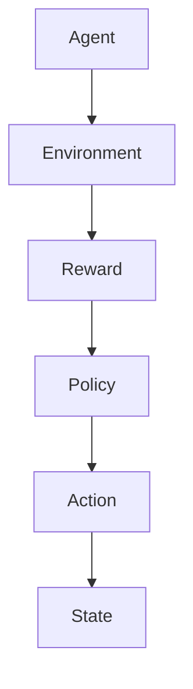
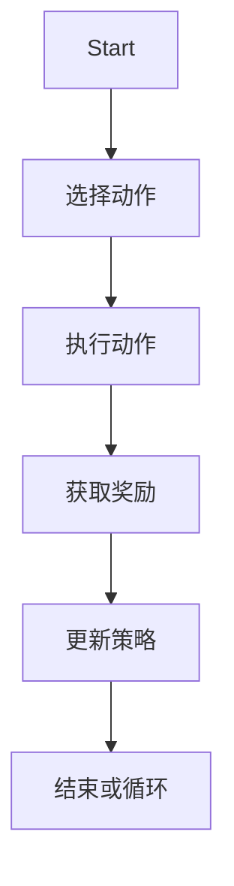

                 


# 深度强化学习在AI Agent控制中的应用

> 关键词：深度强化学习，AI Agent，强化学习，算法原理，系统架构，项目实战

> 摘要：深度强化学习（Deep Reinforcement Learning）作为人工智能领域的重要技术，近年来在AI Agent控制中得到了广泛应用。本文将从AI Agent的基本概念出发，深入探讨深度强化学习的核心原理、算法实现、系统设计及实际应用。通过详细的理论分析与实践案例，帮助读者全面理解深度强化学习在AI Agent控制中的应用价值及实现方法。

---

## 第一部分: 深度强化学习与AI Agent控制基础

### 第1章: AI Agent与深度强化学习概述

#### 1.1 AI Agent的基本概念
- **AI Agent的定义**  
  AI Agent是指具有感知环境、自主决策和执行任务能力的智能体。它能够通过与环境交互，学习并优化自身的行为策略，以实现特定目标。
  
- **AI Agent的分类**  
  AI Agent可以分为简单反射型、基于模型的规划型、基于价值函数的决策型和基于强化学习的自适应型等类别。

- **AI Agent的核心特征**  
  包括自主性、反应性、目标导向性和学习能力。AI Agent能够根据环境反馈调整策略，从而在动态环境中实现最优行为。

- **AI Agent的应用场景**  
  常见的应用场景包括自动驾驶、智能推荐系统、机器人控制、游戏AI和工业自动化等。

#### 1.2 深度强化学习的定义与特点
- **深度强化学习的定义**  
  深度强化学习是一种结合了深度学习和强化学习的技术，利用深度神经网络作为函数逼近器，学习从状态到动作的映射关系。

- **深度强化学习的优势**  
  深度强化学习能够处理高维复杂环境，自动提取特征，适应动态变化，并通过经验累积提升决策能力。

- **深度强化学习与传统强化学习的区别**  
  传统强化学习依赖于手动设计特征提取方法，而深度强化学习利用深度神经网络自动提取复杂特征，适用于高维和非线性问题。

- **深度强化学习的应用前景**  
  在游戏AI、机器人控制、自动驾驶等领域具有广阔的应用潜力，能够显著提升系统的自主决策能力和适应性。

### 第2章: 深度强化学习的核心概念与联系

#### 2.1 深度强化学习的核心原理
- **状态空间与动作空间**  
  状态空间是环境可能的所有状态的集合，动作空间是智能体在每个状态下可执行的所有动作的集合。

- **奖励函数的设计**  
  奖励函数是强化学习的核心，用于定义智能体行为的好坏。设计合理的奖励函数能够引导智能体学习期望的行为模式。

- **策略与价值函数的关系**  
  策略函数定义了智能体在每个状态下选择动作的概率分布，价值函数则评估某个状态下采取某种动作后的预期收益。

#### 2.2 深度强化学习的核心概念对比
- **与监督学习的对比**  
  监督学习依赖于标记的训练数据，而深度强化学习通过与环境交互获得经验，适用于无监督的动态环境。

- **与无监督学习的对比**  
  无监督学习目标是发现数据中的内在结构，深度强化学习则专注于通过最大化累积奖励来优化行为策略。

- **与半监督学习的对比**  
  半监督学习结合了有监督和无监督学习，深度强化学习则强调通过经验累积和策略优化来提升性能。

#### 2.3 深度强化学习的ER实体关系图


### 第3章: 深度强化学习算法原理讲解

#### 3.1 深度强化学习算法的流程


#### 3.2 深度强化学习的数学模型
- **状态值函数的数学表达**  
  $$ V(s) = \max_a Q(s,a) $$
  
- **动作值函数的数学表达**  
  $$ Q(s,a) = r + \gamma \max_{a'} Q(s',a') $$

#### 3.3 深度强化学习算法的Python实现
```python
import numpy as np

class Agent:
    def __init__(self, state_space, action_space):
        self.state_space = state_space
        self.action_space = action_space
        self.model = self.build_model()
    
    def build_model(self):
        # 网络结构定义
        pass
```

---

## 第二部分: 系统分析与架构设计

### 第4章: 深度强化学习的系统架构设计

#### 4.1 应用场景介绍
- 智能体需要在复杂动态环境中进行实时决策，如自动驾驶、机器人导航和游戏AI等领域。

#### 4.2 系统功能设计
- **状态感知**：通过传感器或数据输入感知环境状态。
- **策略选择**：根据当前状态选择最优动作。
- **奖励评估**：计算智能体行为的奖励值。
- **策略优化**：通过强化学习算法优化策略，提升行为收益。

#### 4.3 系统架构设计


#### 4.4 系统接口设计
- **输入接口**：接收环境状态信息。
- **输出接口**：输出执行动作指令。
- **奖励接口**：计算并传递奖励信号。

#### 4.5 系统交互流程


---

## 第三部分: 项目实战

### 第5章: 深度强化学习的实际应用案例

#### 5.1 环境安装
- 安装必要的深度学习框架和强化学习库，如TensorFlow、Keras和OpenAI Gym。

#### 5.2 核心代码实现
```python
import gym
from gym import spaces
from gym.utils import seeding
import numpy as np

class Agent:
    def __init__(self, env):
        self.env = env
        self.observation_space = env.observation_space
        self.action_space = env.action_space
        self.model = self.build_model()
    
    def build_model(self):
        # 网络结构定义
        pass
```

#### 5.3 代码应用解读与分析
- 展示如何通过训练深度强化学习模型，使智能体在环境中实现最优策略。

#### 5.4 实际案例分析
- 以具体案例为例，展示深度强化学习在AI Agent控制中的实际应用效果和优化过程。

#### 5.5 项目小结
- 总结项目实现的关键点和经验教训，强调深度强化学习在实际应用中的优势和挑战。

---

## 第四部分: 最佳实践与注意事项

### 第6章: 深度强化学习的最佳实践

#### 6.1 设计奖励函数的注意事项
- 确保奖励函数能够有效引导智能体学习期望的行为模式，避免模糊或冲突的奖励设计。

#### 6.2 网络结构设计的技巧
- 根据具体任务需求设计网络结构，合理选择神经网络的层数和节点数，优化模型的表达能力。

#### 6.3 训练策略的优化
- 使用合适的学习率和优化算法，采用经验回放和策略迭代等技术，提升训练效率和模型性能。

#### 6.4 系统鲁棒性的提升
- 引入噪声机制和对抗训练，增强系统的鲁棒性，使其在复杂环境下仍能稳定运行。

#### 6.5 模型的可解释性
- 通过可视化和调试工具，分析模型的决策过程，确保模型的透明性和可解释性。

### 第7章: 总结与展望

#### 7.1 文章总结
- 回顾文章的主要内容，强调深度强化学习在AI Agent控制中的重要性及其应用潜力。

#### 7.2 未来展望
- 探讨深度强化学习的发展趋势，展望其在更多领域的应用前景，鼓励读者关注技术创新和实践探索。

---

## 作者信息

作者：AI天才研究院/AI Genius Institute & 禅与计算机程序设计艺术 /Zen And The Art of Computer Programming

---

通过以上结构，文章详细探讨了深度强化学习在AI Agent控制中的应用，从理论基础到实际应用，层层深入，帮助读者全面理解并掌握相关知识。

