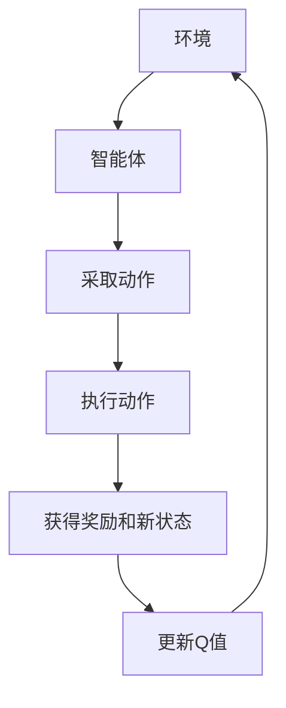
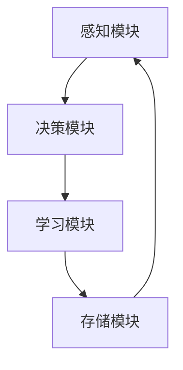
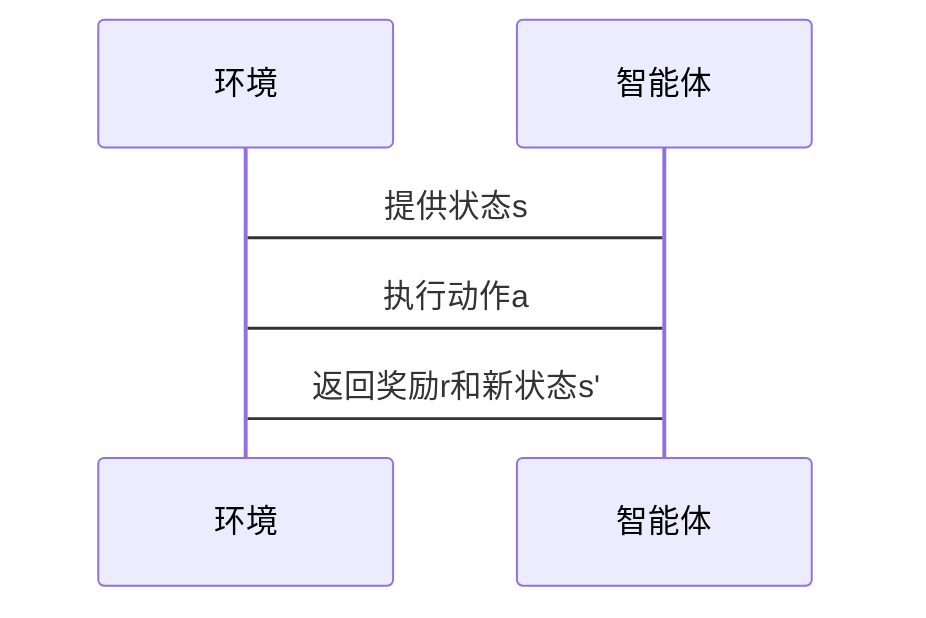

                 


# 深度强化学习在AI Agent策略优化中的应用

> 关键词：深度强化学习，AI Agent，策略优化，算法原理，系统架构，项目实战

> 摘要：深度强化学习（Deep Reinforcement Learning，DRL）作为人工智能领域的重要技术，近年来在AI Agent的策略优化中得到了广泛应用。本文系统地探讨了DRL的核心概念、算法原理、系统架构及实际应用，结合具体案例，分析了DRL在优化AI Agent策略中的优势与挑战，并展望了未来的研究方向。

---

# 第一部分: 深度强化学习与AI Agent背景介绍

## 第1章: 深度强化学习概述

### 1.1 强化学习的基本概念

#### 1.1.1 强化学习的定义与特点
强化学习（Reinforcement Learning, RL）是一种机器学习范式，其中智能体通过与环境交互，学习如何采取行动以最大化累积奖励。其特点包括：
- **试错性**：智能体通过不断尝试和错误来学习最优策略。
- **延迟奖励**：奖励可能在多个动作后才给出，需要智能体具备长期规划能力。
- **探索与利用**：智能体需要在探索新动作和利用已知动作之间找到平衡。

#### 1.1.2 深度强化学习的演进历程
强化学习最初依赖于线性模型或浅层神经网络，随着深度学习的发展，DRL结合了深度神经网络的强大表示能力，极大地扩展了RL的应用范围。DRL的关键进展包括：
- 2015年：DQN算法的提出，首次将深度神经网络应用于强化学习。
- 2016年：策略梯度方法（如PG、PPO）的崛起，推动了连续控制任务的发展。
- 近年来：基于Transformer的RL算法（如PPO-Transformer）在复杂任务中的应用。

#### 1.1.3 深度强化学习的核心要素
DRL的核心要素包括：
- **状态空间（State Space）**：智能体所处的环境状态。
- **动作空间（Action Space）**：智能体可以执行的动作集合。
- **奖励函数（Reward Function）**：定义智能体行为的好坏。
- **策略（Policy）**：决定智能体在给定状态下采取的动作。
- **值函数（Value Function）**：预测从当前状态出发的未来累积奖励。

---

## 第2章: AI Agent的基本概念与应用

### 2.1 AI Agent的定义与分类
#### 2.1.1 AI Agent的定义
AI Agent是一个能够感知环境、自主决策并采取行动以实现目标的实体。它可以是一个软件程序、机器人或其他智能系统。

#### 2.1.2 AI Agent的分类与特点
AI Agent可以根据智能水平分为：
- **反应式Agent**：基于当前感知做出反应，适用于简单任务。
- **认知式Agent**：具备复杂推理和规划能力，适用于复杂任务。
- **协作式Agent**：能够与其他Agent协作完成任务。
- **学习式Agent**：能够通过经验改进性能。

#### 2.1.3 AI Agent在不同领域的应用
- **游戏AI**：如AlphaGo、游戏中的NPC行为控制。
- **机器人控制**：如工业机器人、服务机器人。
- **自动驾驶**：如自动驾驶汽车的路径规划和决策。
- **推荐系统**：如个性化内容推荐。

---

## 第3章: 深度强化学习在AI Agent中的应用背景

### 3.1 AI Agent策略优化的挑战
#### 3.1.1 动态环境中的决策问题
AI Agent需要在动态变化的环境中做出实时决策，这对算法的实时性和适应性提出了高要求。

#### 3.1.2 复杂状态空间的处理难点
在复杂或高维的状态空间中，传统的强化学习方法可能难以有效建模，而深度神经网络可以有效地捕捉复杂状态之间的关系。

#### 3.1.3 多目标优化的平衡问题
AI Agent可能需要在多个目标之间进行权衡，如路径规划中的效率与安全。

---

## 第4章: 深度强化学习的核心概念与联系

### 4.1 深度强化学习的原理
#### 4.1.1 Q-learning算法的原理
Q-learning是一种经典的强化学习算法，通过更新Q值表来学习最优策略。其更新公式为：
$$ Q(s,a) = Q(s,a) + \alpha [r + \max_{a'} Q(s',a') - Q(s,a)] $$
其中，$\alpha$是学习率，$r$是奖励，$s'$是下一个状态。

#### 4.1.2 策略梯度方法的原理
策略梯度方法直接优化策略参数，其目标函数为：
$$ J(\theta) = \mathbb{E}_{s,a} [\log \pi_\theta(s,a) Q(s,a)] $$
其中，$\pi_\theta$是策略函数，$Q(s,a)$是值函数。

#### 4.1.3 深度神经网络在强化学习中的作用
深度神经网络（DNN）用于近似策略或值函数，其优势在于能够处理高维、非结构化的数据，并提取高层次特征。

---

## 第5章: AI Agent策略优化中的数学模型

### 5.1 强化学习的数学模型
#### 5.1.1 状态、动作与奖励的定义
- **状态（State）**：描述环境的当前情况，如在迷宫中的位置。
- **动作（Action）**：智能体可以执行的操作，如“向左”或“向右”。
- **奖励（Reward）**：智能体行为的反馈，如完成任务获得+1奖励。

#### 5.1.2 动作价值函数的数学表达
动作价值函数$Q(s,a)$表示在状态$s$下执行动作$a$的预期累积奖励：
$$ Q(s,a) = \mathbb{E}[R_{t+1} + \gamma R_{t+2} + \gamma^2 R_{t+3} + \dots] $$
其中，$\gamma$是折扣因子。

#### 5.1.3 策略函数的数学表达
策略函数$\pi_\theta(s)$表示在状态$s$下选择动作$a$的概率：
$$ \pi_\theta(s) = P(a | s) $$

---

# 第二部分: 深度强化学习算法原理

## 第6章: DRL核心算法解析

### 6.1 DQN算法
DQN（Deep Q-Network）是首个将深度神经网络应用于强化学习的算法，其流程如下：



代码实现：
```python
import numpy as np
import tensorflow as tf

class DQN:
    def __init__(self, state_space, action_space):
        self.state_space = state_space
        self.action_space = action_space
        self.model = self.build_model()
    
    def build_model(self):
        model = tf.keras.Sequential([
            tf.keras.layers.Dense(64, activation='relu', input_dim=self.state_space),
            tf.keras.layers.Dense(64, activation='relu'),
            tf.keras.layers.Dense(self.action_space, activation='linear')
        ])
        return model
```

---

## 第7章: 策略梯度方法

### 7.1 PPO算法
PPO（Proximal Policy Optimization）是一种策略梯度方法，适用于连续动作空间。其优化目标为：
$$ \max_{\theta} \mathbb{E}[r + \gamma r_{t+1} - \text{KL}( \pi_\theta(\cdot) || \pi_{\theta_old}(\cdot) ) ] $$

代码实现：
```python
import tensorflow as tf

class PPO:
    def __init__(self, state_space, action_space, learning_rate=0.001):
        self.actor = self.build_actor(state_space, action_space)
        self.critic = self.build_critic(state_space)
        self.optimizer = tf.keras.optimizers.Adam(learning_rate)
    
    def build_actor(self, state_space, action_space):
        model = tf.keras.Sequential([
            tf.keras.layers.Dense(64, activation='relu', input_dim=state_space),
            tf.keras.layers.Dense(action_space, activation='tanh')
        ])
        return model
```

---

# 第三部分: 系统架构设计与实现

## 第8章: 系统架构设计

### 8.1 系统功能设计
AI Agent的系统功能模块包括：
- **感知模块**：接收环境输入。
- **决策模块**：执行策略选择。
- **学习模块**：更新策略参数。

### 8.2 系统架构图


---

## 第9章: 系统接口设计

### 9.1 接口交互流程


---

# 第四部分: 项目实战

## 第10章: 项目实战与分析

### 10.1 环境配置
使用OpenAI Gym环境进行实验：
```python
import gym
env = gym.make('CartPole-v1')
```

### 10.2 代码实现
实现DRL算法并训练模型：
```python
class DQNTrainer:
    def train(self, env, model, episodes=1000):
        for episode in range(episodes):
            state = env.reset()
            total_reward = 0
            while True:
                action = model.predict(state)
                next_state, reward, done, _ = env.step(action)
                model.update(state, action, reward, next_state, done)
                total_reward += reward
                if done:
                    break
            print(f'Episode {episode}, Reward: {total_reward}')
```

### 10.3 实验结果与分析
通过实验验证算法性能，并分析其收敛速度、稳定性和鲁棒性。

---

## 第11章: 扩展与展望

### 11.1 最佳实践
- **算法选择**：根据任务类型选择合适的DRL算法。
- **超参数调优**：优化学习率、折扣因子等参数。
- **经验回放**：通过经验回放减少样本偏差。

### 11.2 小结
本文系统地介绍了深度强化学习在AI Agent策略优化中的应用，从理论到实践，结合具体案例，展示了DRL的强大能力。

### 11.3 注意事项
- **环境复杂度**：复杂环境可能需要更复杂的网络结构。
- **计算资源**：深度强化学习需要大量计算资源。
- **收敛问题**：部分算法可能存在收敛困难。

### 11.4 拓展阅读
推荐学习相关书籍和论文，深入理解DRL的数学原理和最新进展。

---

# 作者
作者：AI天才研究院 & 禅与计算机程序设计艺术

---

通过以上目录大纲和内容，读者可以系统地学习深度强化学习在AI Agent策略优化中的应用，从基础概念到实际项目，逐步掌握相关知识。

